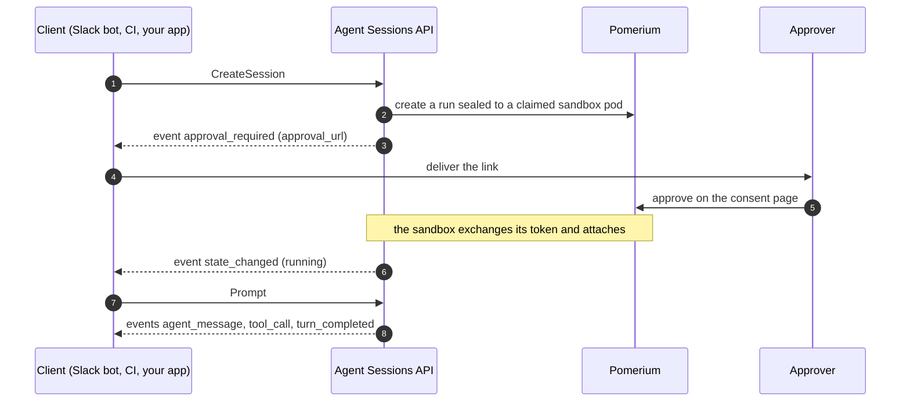

---
# cSpell:ignore runid Codex OpenCode kubelet serviceaccount autonumber Kata

title: 'AI Agent Runtime'
sidebar_label: 'AI Agent Runtime'
lang: en-US
description: 'Run Claude Code, Codex, or your own agent in a Kubernetes sandbox that holds no credentials. Pomerium ties each request to an approved run and injects secrets at the gateway.'
keywords:
  [
    AI agents,
    agent sandbox,
    agentic runtime,
    agent sessions API,
    run identity,
    workload identity,
    secret injection,
    egress control,
    prompt injection,
    MCP,
    LLM security,
    Claude Code,
  ]
---

# AI Agent Runtime

The agentic runtime runs AI agents in Kubernetes sandboxes that hold no credentials. The agent harness (Claude Code, Codex, Gemini CLI, OpenCode, or a program of your own) runs in a pod next to a sidecar. The sidecar forwards the agent's traffic to Pomerium, which checks each request against a run that a person approved, evaluates the route's policy, and adds the credential the upstream needs. This covers LLM APIs, MCP servers, databases, and Git remotes. The Agent Sessions API creates and manages the sandboxes from your own product code; a Slack bot ships with it as a reference client.

:::info Availability

The agentic runtime is available for early access. [Contact us](https://www.pomerium.com/contact-sales) to get started, or see [MCP support](/docs/capabilities/mcp) for the generally available features it builds on.

:::

## Architecture

<span className="themedDiagram themedDiagram--light">


</span><span className="themedDiagram themedDiagram--dark">


</span>

Pomerium is the gateway. It authenticates every request against your identity provider, evaluates a [Pomerium Policy Language](/docs/internals/ppl) rule, injects credentials into the upstream request, and writes an audit log entry. Policy evaluation is deterministic: the same request gets the same answer regardless of what is in the agent's context window. In the reference configuration, every credentialed request a sandbox makes goes through Pomerium.

The sandbox pod holds the agent container and a sidecar. The agent container has no credentials. The sidecar holds the pod's credentials and proxies the agent's traffic to Pomerium.

The Agent Sessions API claims sandbox pods, starts agents in them, streams their output as a durable event log, and suspends and revives them.

Clients are the applications your users already work in: a Slack bot, a Teams bot, a web app, or a CI job. Each one talks to the Agent Sessions API with its own workload identity.

A person approves each run on a consent page served by Pomerium, behind ordinary SSO. The agent's credentials stop renewing when that person's identity provider session can no longer be refreshed.

## How a run works

Pomerium has two kinds of principal for ordinary traffic. A user session carries a person's authority and is created by browser SSO. A service account is a long-lived machine credential with authority of its own. An agent fits neither: it acts on a person's behalf, but it has no browser, and no person approved any particular use of a service account.

A run is a record that binds the two. The approver is identified by their IdP subject. The executor is one Kubernetes pod, identified by four claims that the cluster's API server attests: namespace, service account name, pod name, and pod UID. The Agent Sessions API reads these values from the API server, not from the pod, and stores them on the run as its seal before anyone is asked to approve.

### Token exchange

The sidecar obtains a run token by calling Pomerium with the pod's projected service account token, a short-lived JWT the kubelet writes into the pod and Pomerium verifies against the cluster's OIDC issuer. The request carries no run ID. Pomerium looks up the run whose seal matches the verified claims byte for byte, and returns a token only if that run has been approved. A pod cannot obtain another pod's run, because it cannot present another pod's identity.

The run token (`pom_art_…`) is opaque and valid for one hour. The sidecar renews it about every ten minutes for as long as the run is alive. Each renewal checks that the approver's identity provider session is still alive and can be refreshed. If the person signs out at the identity provider, renewals fail once their cached IdP token lapses, typically within the hour, and the sandbox winds down. Pomerium reads the run record on every request without caching, so a run past its end stops the next request.

### Policy

A request bearing a run token carries the approver's identity as ordinary claims and the sealed pod identity as `act.*` claims, in the sense of the actor claim in OAuth token exchange ([RFC 8693](https://datatracker.ietf.org/doc/html/rfc8693)). A policy can therefore name both the person and the pod:

```yaml
policy:
  allow:
    and:
      - claim/email: alice@example.com # who approved
      - claim/act.kubernetes.io.serviceaccount.name: sandbox-agent # which pod acts
```

Routes accept run tokens only when they opt in with `bearer_token_format: agentic_run_token`. Approving a run grants the agent nothing on its own; each route decides with its own policy which runs it admits. The `act.*` claims exist only when a person approved the run, so a policy can tell an agent acting for a person apart from a workload acting for itself.

### Approval

The consent page shows the run's prompt, the sealed pod identity, and the MCP servers the agent expects to use, with a Connect button for any that need the person's own OAuth consent. A run can name the one person allowed to approve it. When a suspended session is revived on a new pod, a new run is created and approval is requested again from the same person.


Each hop uses a different credential: the Agent Sessions API's workload token, the person's SSO session, the pod's projected token, and the run token.

## The sandbox pod

<span className="themedDiagram themedDiagram--light">


</span><span className="themedDiagram themedDiagram--dark">


</span>

The agent container runs the harness, which can be any program that speaks the [Agent Client Protocol](https://agentclientprotocol.com/) on stdio. Its Kubernetes service account token is not mounted. Its LLM configuration points the provider's base URL at loopback (`http://127.0.0.1:9999`), and its API key variable holds a placeholder, because most harnesses refuse to start without one.

The sidecar container holds the projected token and the run token it exchanges that for. It listens on one loopback port per permitted upstream, and each port forwards to one Pomerium route fixed by the operator. It replaces the placeholder with the run token and refuses to forward a request when it has no token. The agent cannot add a destination, and the sidecar has no admin port the agent can reach.

The upstream's real credential lives on the Pomerium route and is resolved from your secret store as the request passes through:

```yaml
routes:
  - from: https://llm.example.com
    to: https://api.provider.example
    timeout: 0s # streaming responses
    bearer_token_format: agentic_run_token
    set_request_headers:
      Authorization: 'Bearer ${secret.upstream-api-token}'
    policy:
      allow:
        and:
          - domain: example.com
          - claim/act.kubernetes.io.serviceaccount.name: sandbox-agent
```

A sandbox template can instead keep a provider key on the sidecar container for upstreams you choose not to route through the gateway. In both cases the agent container has no credential.

Other upstreams follow the same pattern. MCP servers that require the person's own account, such as GitHub or Google, receive the approver's OAuth token per request through [MCP upstream OAuth](/docs/capabilities/mcp/mcp-upstream-oauth); the person connects them once on the consent page. Databases and internal APIs sit behind routes with their own policies. Git credentials are used by an init container that clones the workspace and exits before the agent starts.

The sidecar limits the agent's credentialed traffic to the configured ports. To limit its network traffic as well, add a NetworkPolicy that denies the sandbox all egress except Pomerium and cluster DNS.

Sandboxes are [Kubernetes agent-sandbox](https://github.com/kubernetes-sigs/agent-sandbox) resources, so they run on any conforming cluster, managed or on-premises, with warm pools of pre-started pods and persistent workspace volumes that survive suspension. Isolation below the pod is set by the runtime class; agent-sandbox works with gVisor and Kata Containers.

## Agent Sessions API

One Connect RPC service, served over gRPC or HTTP+JSON on a single Pomerium route, owns the pod lifecycle and the approval flow and stores the conversation. A client never handles seals or consent pages directly. The API works with three objects:

- A session is one conversation: one client, one approver, one sandbox at a time, one workspace.
- Each prompt, together with the work that follows it, is a turn.
- Events record what happened in a session on a durable, ordered log, such as `approval_required`, `agent_message`, `tool_call`, `permission_request`, `turn_completed`, or `session_ended`. Clients subscribe and can replay from any sequence number. Delivery is at least once and sequence numbers never reset.

`CreateSession` claims a pod from the warm pool, reads its identity from the API server, creates the run sealed to it, and emits the approval link as an event. The client delivers that link to the approver in whatever form fits: a Slack DM, a pull request comment, a page in the app. After approval, `Prompt` starts turns. A `permission_request` event can be rendered as buttons in the client UI, and `RespondPermission` returns the answer. Idle sessions suspend and keep their workspace volume. A `Prompt` on a suspended session revives it on a new pod with a new run, and the same approver is asked again.



Clients authenticate as workloads, with a projected token in a cluster or an OIDC token in CI. There is no long-lived client secret; the platform issues and rotates the token. A per-client registration on the server names the agent templates the client may launch and caps its live sessions, pending approvals, and session creation rate.

## Clients

| Tier | You write | Suited to |
| --- | --- | --- |
| SDK (Go, TypeScript, Python) | typed calls; the SDK handles reconnects | long-lived services |
| Companion sidecar | plain HTTP against a local socket | shell scripts, languages without an SDK |
| Polling | HTTP and a loop | CI jobs with short-lived tokens |

The SDKs are thin wrappers over the API:

```typescript
const session = await client.createSession({
  template: 'runid',
  conversationRef: `build-4711`,
  approvalPrompt: 'Deploy build 4711 to staging?',
});

const feed = await client.subscribe({sessionId: session.id});
await client.prompt({sessionId: session.id}, 'Deploy it.');

for await (const event of feed) {
  // approval_required → deliver the link; agent_message → render; permission_request → ask
}
```

Client code holds only its own workload token. The approver's identity enters the system when the person signs in on the consent page, so a client cannot assert it, and a client cannot read another client's sessions or obtain a run token.

The bundled Slack bot is written this way. It has no Kubernetes access and uses only the public API.

## Security model

| Component | Credentials it holds | What it can reach |
| --- | --- | --- |
| Agent container | None | The sidecar's loopback ports |
| Sidecar | The pod's projected token and its run token; optionally a provider key kept on the sidecar by template | The Pomerium routes configured for its ports, subject to each route's policy |
| Agent Sessions API | Its own workload token | Pomerium's run endpoints and the Kubernetes API for pods. It cannot approve a run or obtain a run token. |
| Client | Its platform-issued workload token | The Agent Sessions API, within its registration and quotas. It cannot assert a person's identity, obtain a run token, or reach an upstream. |
| Approver | Their SSO session | The consent page |

A stolen projected token is useful only for runs sealed to that exact pod and approved by a specific person, and only while that person's identity provider session is alive. A run token that leaks is bound to the same run and approver, expires within the hour, and works only at routes whose policies admit that run. An agent under prompt injection can repeat whatever it was allowed to read; route and tool policies, including [per-tool MCP policy](/docs/capabilities/mcp/limit-mcp-tools), bound what that is.
