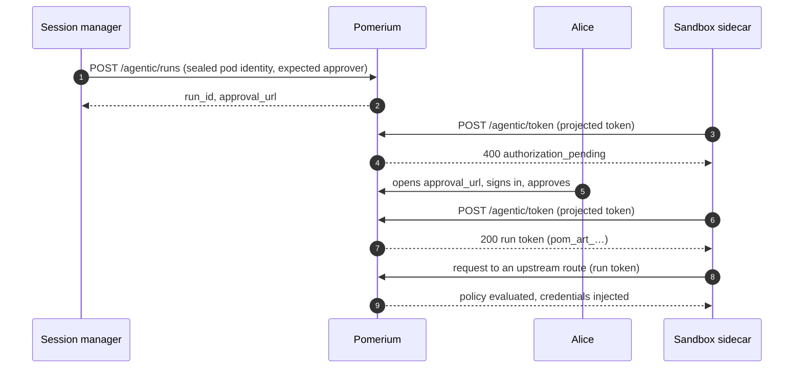
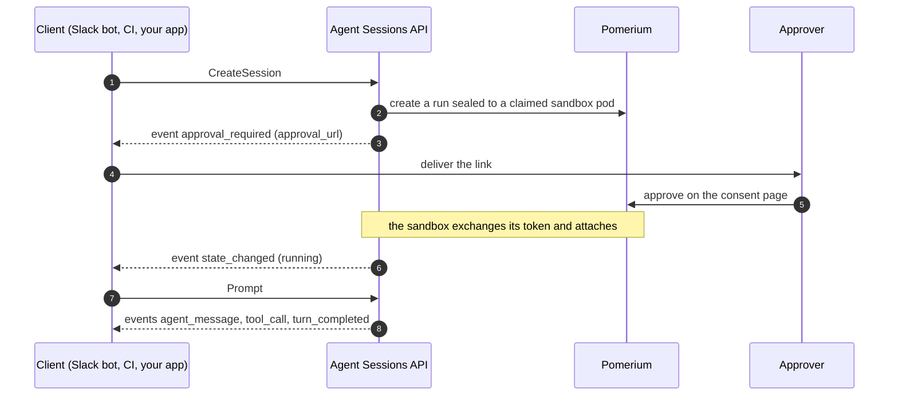

---
# cSpell:ignore runid Codex OpenCode kubelet serviceaccount autonumber refreshable Kata uncredentialed misroute

title: 'Run AI Agents in Isolated Sandboxes'
sidebar_label: 'AI Agent Runtime'
lang: en-US
description: 'Run any agent harness in a sandbox that holds no secrets, with Pomerium binding every request to a human approval and an attested pod.'
keywords:
  [
    AI agents,
    agent sandbox,
    agentic runtime,
    agent sessions API,
    run identity,
    workload identity,
    secret injection,
    egress control,
    prompt injection,
    MCP,
    LLM security,
    Claude Code,
  ]
---

# Run AI Agents in Isolated Sandboxes

You want an agent to do real work: read tickets, query a database, call an internal API, open a pull request. Real work needs credentials. But an agent is a program that takes instructions from untrusted text. Give it an API key, and you have given the key to anyone who can influence its input — a hostile issue comment, a poisoned dependency README, a malicious tool description.

The usual mitigations try to make the agent careful. Careful is not a security boundary. The alternative is an architecture in which the agent has nothing to leak: it runs in a sandbox with no secrets, and everything it is allowed to reach sits behind a gateway that decides, per request and deterministically, whether this agent, acting for this person, may reach this resource.

Pomerium — an open-source identity-aware proxy — provides that architecture as one stack. You choose the harness (Claude Code, Codex, Gemini CLI, OpenCode, or your own program) and the model; Pomerium provides the sandbox lifecycle, run identity, policy enforcement, and egress control. A Slack bot ships with it as a reference client, built on the same public API as anything you build.

:::info Availability

The agentic runtime is in active development and available for early access. [Contact us](https://www.pomerium.com/contact-sales) to get started, or see [MCP support](/docs/capabilities/mcp) for the generally available building blocks it is built on.

:::

## Architecture


The layers, from enforcement up to product:

- **Pomerium** is the gateway. It authenticates every request against your identity provider, evaluates a deterministic policy, injects the credentials the upstream needs, and logs the result. In the reference configuration, every credentialed request a sandbox makes leaves through it.
- **The sandbox pod** runs your agent next to a sidecar. The agent container holds no credentials of any kind. The sidecar holds the pod's credentials and proxies the agent's traffic to Pomerium.
- **The Agent Sessions API** manages sessions: it claims sandbox pods, launches agents in them, streams their output as durable events, and suspends and revives them.
- **Your clients** are whatever your users already work in — a Slack bot, a Teams bot, a web app, a CI job. The bundled Slack bot is one such client, with no special access.

A **person** gates all of this from outside the data path: no agent acts until a specific person approves a specific run on a consent page, and the agent's credentials stop renewing once that person's identity provider session can no longer be refreshed.

## What Pomerium Provides

This capability builds on four properties of the proxy itself.

**Bring your identity provider.** Pomerium [authenticates](/docs/capabilities/authentication) users against any OIDC or SAML identity provider and carries its data (subject, email, groups, custom claims) into every decision. There is no separate user store to manage.

**Deterministic authorization.** Every request passes through [Pomerium Policy Language](/docs/internals/ppl) — declarative rules over identity, and for MCP servers down to the [individual tool call](/docs/capabilities/mcp/limit-mcp-tools). Policy evaluation is deterministic: the same request gets the same answer, no matter what is in the agent's context window.

**Secrets stay at the gateway.** Routes inject credentials into upstream requests as they pass through: API keys referenced from your secret store with `set_request_headers` (`${secret.…}`), per-user OAuth tokens through [MCP upstream OAuth](/docs/capabilities/mcp/mcp-upstream-oauth). The client behind the route never holds them.

**One layer for people and machines.** The same routes and the same policy language govern a person in a browser, a service account, and — with this capability — an agent acting for a person. One audit log covers all three.

## Run Identity

Pomerium historically had two kinds of principal, and an agent is neither. A **user session** carries a person's authority, but it is created by browser SSO, and an agent has no browser. A **service account** is a long-lived machine credential with authority of its own — no person approved any particular use of it.

An agent needs a policy that can say:

> Allow this request if Alice approved this run, and if it comes from that one specific pod.

A **run** makes that sentence expressible. A run is a record that binds two principals: a person, identified by their IdP subject, who approved it; and an executor — one specific Kubernetes pod, identified by claims the cluster's API server attests (namespace, service account, pod name, pod UID). The pod never reports its own identity: those four values are read from the API server and stored on the run as its **seal** (the exact claim set a pod must later present) before anyone is asked to approve anything.

Pomerium exchanges an approved run for an opaque **run token** (`pom_art_…`). Each token lives one hour; the sandbox renews it for as long as the run is alive, so a long run never means a long-lived credential. A request bearing it carries the approver's identity as ordinary claims and the sealed pod identity as `act.*` claims — actor claims, in the sense of OAuth token exchange ([RFC 8693](https://datatracker.ietf.org/doc/html/rfc8693)) — so the policy above is written in plain PPL:

```yaml
policy:
  allow:
    and:
      - claim/email: alice@example.com # who approved
      - claim/act.kubernetes.io.serviceaccount.name: sandbox-agent # which pod acts
```

Three properties of runs:

**A run is not a grant.** Approving one gives the agent exactly what your routes say it may have: each route opts into run tokens (`bearer_token_format: agentic_run_token`) and filters runs with its own policy.

**The pod cannot claim a run.** The token exchange takes no run ID as input. The sandbox presents only its own projected service-account token — a short-lived JWT the kubelet writes into the pod, verified against the cluster's own OIDC issuer. Pomerium finds the run whose seal matches the verified claims, byte for byte. A pod cannot ask for another pod's run, because it cannot present another pod's identity.

**The person stays in control.** Approval happens on a Pomerium-served consent page, behind ordinary SSO, showing the run's prompt, the sealed pod identity, and the MCP servers the agent expects to use — with a Connect button for any that need the person's own OAuth consent. A run can name the one person allowed to approve it, and a revived session always pins approval to the person who approved it first. A run also cannot outlive the approver's identity: each token renewal, roughly every ten minutes, checks that the approver's IdP session is still alive and refreshable. End the person's session at the identity provider, and renewals start failing once the approver's cached IdP token lapses, typically within the hour, and the sandbox winds down.

The flow, end to end:



Each hop carries a different credential: the manager's workload token, the person's SSO session, the pod's projected token, the run token. None of them can stand in for another.

Expiry is enforced on every request: Pomerium reads the run record on each one, without a cache, so a run past its end stops the very next request. The same uncached read checks a revocation flag; an operator API for revoking a run early is on the roadmap.

## The Sandbox

A sandbox is a two-container pod, and the security boundary runs between the two containers.


The **agent container** runs your harness, any program that speaks the [Agent Client Protocol](https://agentclientprotocol.com/) on stdio. It holds no credentials. Its Kubernetes service-account token is not mounted. Its LLM configuration points the provider's base URL at loopback (`http://127.0.0.1:9999`), and its API-key variable holds a placeholder that exists only because the harness refuses to start without one.

The **sidecar container** holds the pod's credentials — the projected token the kubelet writes, and the run token it exchanges that for — and runs Envoy with one loopback listener per permitted upstream. Envoy overwrites the placeholder with the run token and refuses to forward any request when no token is present. Each listener forwards to one fixed Pomerium route, configured by the operator. The agent cannot add a destination, and there is no proxy admin port for it to read secrets from.

In this configuration the real API key never enters the pod at all. It lives on the Pomerium route, resolved from your secret store as the request passes through:

```yaml
routes:
  - from: https://llm.example.com
    to: https://api.provider.example
    timeout: 0s # streaming responses
    bearer_token_format: agentic_run_token
    set_request_headers:
      Authorization: 'Bearer ${secret.upstream-api-token}'
    policy:
      allow:
        and:
          - domain: example.com
          - claim/act.kubernetes.io.serviceaccount.name: sandbox-agent
```

A sandbox template can instead keep a provider key on the sidecar container, for upstreams you choose not to route through the gateway. Either way, no credential ever exists in the agent container.

The same pattern covers every kind of upstream. MCP servers that require the person's own account — GitHub, Google, an internal tool — get the approver's OAuth token injected per request through [MCP upstream OAuth](/docs/capabilities/mcp/mcp-upstream-oauth); the person connects them once, on the consent page. Databases and internal APIs sit behind routes with their own policies. Git credentials are consumed by an init container that clones the workspace and exits before the agent starts.

The agent's entire credentialed surface is a list you can read: the loopback ports its operator configured. Each one ends at a Pomerium route with its own policy, and every request is logged. Everything else, including the run token itself, lives on the other side of the container boundary. To make Pomerium the only network path as well, and not just the only credentialed one, add a NetworkPolicy that denies the sandbox all egress except Pomerium and cluster DNS.

Sandboxes are [Kubernetes agent-sandbox](https://github.com/kubernetes-sigs/agent-sandbox) resources (the Kubernetes SIG project announced at KubeCon NA 2025), so they run on any conforming cluster, managed cloud or on-premises, with warm pools for fast starts and persistent workspace volumes that survive suspension. Kernel-level isolation below the pod is the runtime's choice: agent-sandbox works with runtime classes such as gVisor and Kata Containers. Support for additional sandbox technologies is planned.

## The Agent Sessions API

The **Agent Sessions API** makes run identity and sandboxes usable from product code. It is a session manager: it owns the pod lifecycle and the approval flow, and it holds the conversation, so a client team never handles seals or consent pages.

The API is one Connect RPC service — fourteen verbs over gRPC or plain HTTP+JSON on a single Pomerium route — built around three nouns:

- A **session** is one conversation: one client, one approver, one sandbox at a time, one workspace.
- A **turn** is one prompt and the work that follows it.
- An **event** is one fact about a session, on a durable ordered log: `approval_required`, `agent_message`, `tool_call`, `permission_request`, `turn_completed`, `session_ended`, and the rest. Clients subscribe and replay from any sequence number; delivery is at-least-once and order never resets.

`CreateSession` claims a pod from the warm pool, reads its attested identity from the API server, creates the run sealed to it, and emits the approval link as an event. Your client delivers that link to the person it belongs to — a Slack DM, a PR comment, a page in your app. After approval, `Prompt` drives turns; a `permission_request` event becomes buttons in your UI and `RespondPermission` carries the answer back. Idle sessions suspend, keeping the workspace volume; a `Prompt` on a suspended session revives it on a new pod with a new run; the approval is requested again and pinned to the same approver.

Client identity works the same way agent identity does: a client is a workload, authenticated by its platform's token — a projected token in a cluster, an OIDC token in CI. There is no long-lived client secret to steal, because the platform issues and rotates the token. On the server side, a per-client registration names which agent templates a client may launch and caps its live sessions, pending approvals, and creation rate.



## Building a Client

Clients talk to one API, in whatever way fits their runtime:

| Tier | You Write | Good For |
| --- | --- | --- |
| SDK (Go, TypeScript, Python) | typed calls; reconnects handled in the SDK | long-lived services |
| Companion sidecar | plain HTTP against a local socket | shell scripts, languages without an SDK |
| Polling | HTTP and a loop | CI jobs with short-lived tokens |

The SDKs are thin wrappers; most of the behavior lives in the API:

```typescript
const session = await client.createSession({
  template: 'runid',
  conversationRef: `build-4711`,
  approvalPrompt: 'Deploy build 4711 to staging?',
});

const feed = await client.subscribe({sessionId: session.id});
await client.prompt({sessionId: session.id}, 'Deploy it.');

for await (const event of feed) {
  // approval_required → deliver the link; agent_message → render; permission_request → ask
}
```

The client code contains no API keys and no OAuth flows. A client cannot claim to be a person — the approver's identity enters the system only when the person signs in on the consent page — and it cannot read another client's sessions or mint a run token. The security-relevant decisions live in Pomerium, behind routes the client's identity cannot pass, so a client team cannot compromise them by accident.

The Slack bot that ships with the platform is built this way, as a reference client: it has no Kubernetes access and nothing the public API does not offer. If a UX cannot be built from the public event stream alone, that is treated as a missing API, not a reason to grant the bot a back door.

## What Each Party Cannot Do

Assume each component is compromised and ask what it can still do:

1. **A compromised agent** holds no secrets. Its credentialed reach is the loopback ports its operator configured, each terminating at a Pomerium route, subject to policy — down to the individual MCP tool — and logged. It can still repeat whatever it was allowed to read, so bound what it reads with route and tool policies, and deny it uncredentialed egress with a NetworkPolicy.
2. **A compromised client** can create sessions within its registration and quotas, and solicit approvals from people the consent page fully informs. It cannot assert a person's identity or mint a run token, and it reaches no upstream.
3. **A compromised pod identity is not enough.** A stolen projected token binds only to runs sealed to that exact pod, approved by a specific person, while that person's IdP session lives.
4. **A compromised sidecar** holds the projected token and the run token of one pod — both short-lived, both bound to one run and one approver, and useful only at routes whose policies admit that run — plus any provider key an operator chose to keep on the sidecar rather than at the gateway. The blast radius is one session.
5. **A compromised harness** can misroute conversations, and it can bind the wrong — but genuine — sandbox pod to a run; verifying the seal against the Kubernetes API at the authorization server is planned hardening. It holds no static credentials to disclose, and it cannot approve a run or mint a run token; what a run token reaches is decided by route policies it cannot touch.
6. **The approval step cannot be skipped.** `act.*` claims exist if and only if a person approved the run. A workload acting for itself authenticates as itself, and policies tell the two apart.

## Why One Stack

Every piece of this exists somewhere on its own. A sandbox runtime isolates the process but leaves credential handling to you. An LLM gateway centralizes model keys; it has no idea which person approved which run, and it never sees your database or your Git remotes. Identity vendors will issue an agent an identity, but none of them sits on the data path to enforce it. The hard part is wiring these together so they agree: the policy has to match on the sandbox's attested identity, the token has to encode the approval, and the gateway has to be the only credentialed path out.

Pomerium's agentic runtime is that wiring, and it adds no new trust anchor: every check traces back to your IdP, your cluster's API server, or a route policy you wrote. You still pick the IdP, the cluster, the harness, and the model. The agent does real work without ever holding a credential.
