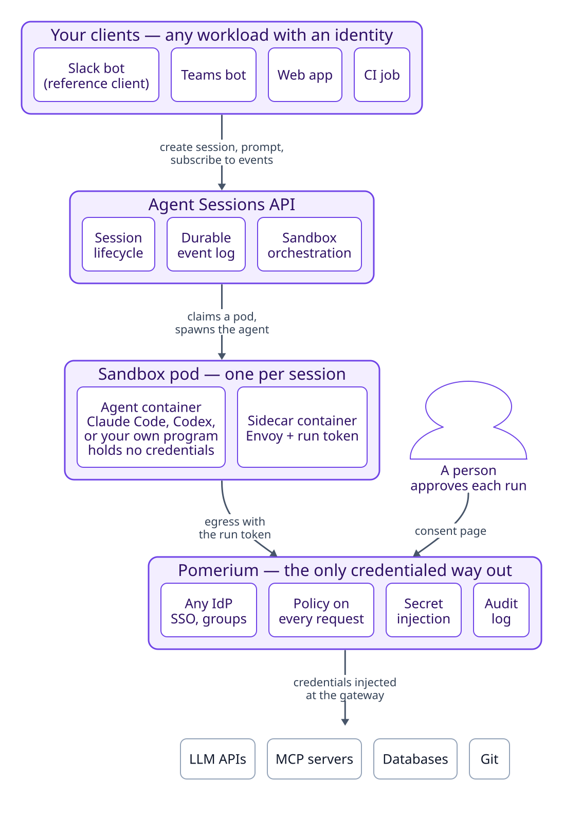
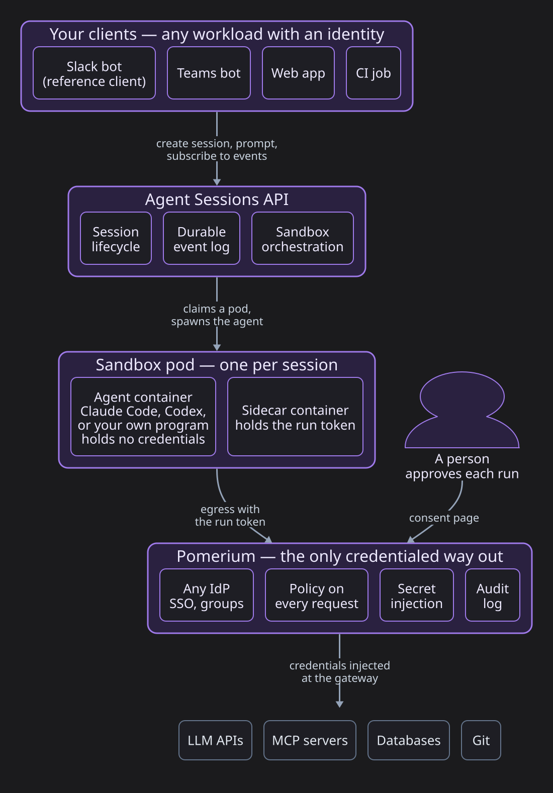
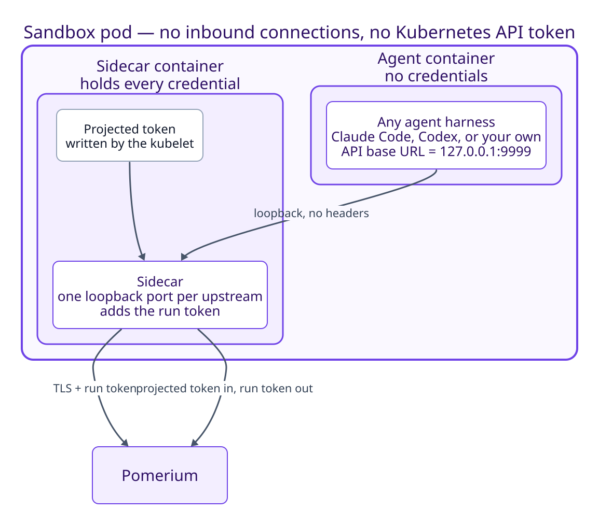
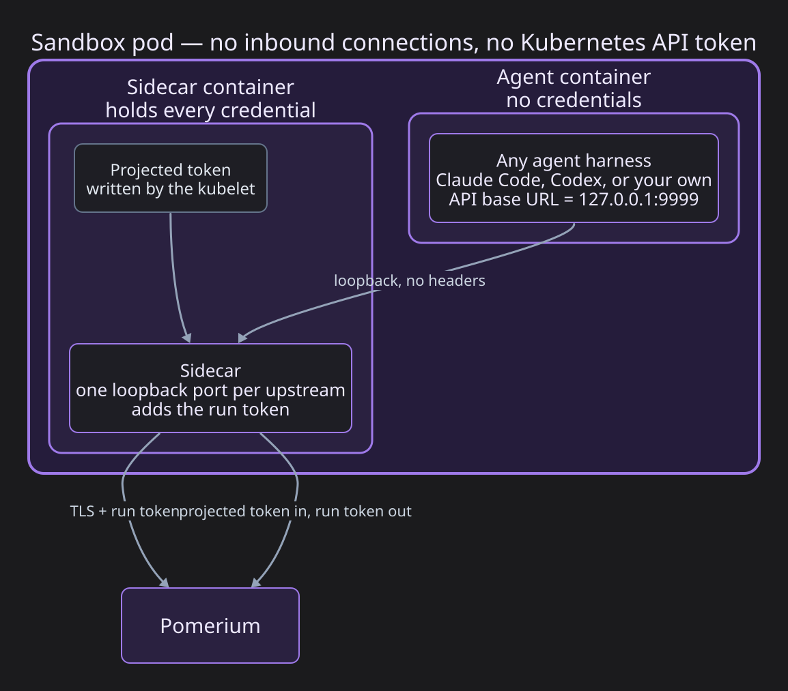
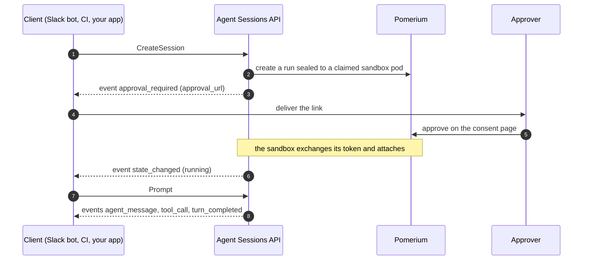

---
# cSpell:ignore runid Codex OpenCode kubelet serviceaccount autonumber Kata

title: 'AI Agent Runtime'
sidebar_label: 'AI Agent Runtime'
lang: en-US
description: 'Run Claude Code, Codex, or your own agent in a Kubernetes sandbox that holds no credentials. Pomerium ties each request to an approved run and injects secrets at the gateway.'
keywords:
  [
    AI agents,
    agent sandbox,
    agentic runtime,
    agent sessions API,
    run identity,
    workload identity,
    secret injection,
    egress control,
    prompt injection,
    MCP,
    LLM security,
    Claude Code,
  ]
---

# AI Agent Runtime

The agentic runtime runs AI agents in Kubernetes sandboxes that hold no credentials. The agent harness (Claude Code, Codex, Gemini CLI, OpenCode, or a program of your own) runs in a pod next to a sidecar. The sidecar forwards the agent's traffic to Pomerium, which checks each request against a run that a person approved, evaluates the route's policy, and adds the credential the upstream needs. This covers LLM APIs, MCP servers, databases, and Git remotes. The Agent Sessions API creates and manages the sandboxes from your own product code; a Slack bot ships with it as a reference client.

:::info Availability

The agentic runtime is available for early access. [Contact us](https://www.pomerium.com/contact-sales) to get started, or see [MCP support](/docs/capabilities/mcp) for the generally available features it builds on.

:::

## Architecture

<span className="themedDiagram themedDiagram--light">



</span><span className="themedDiagram themedDiagram--dark">



</span>

Pomerium is the single egress point. It authenticates every request against your identity provider, evaluates a [Pomerium Policy Language](/docs/internals/ppl) rule, injects credentials into the upstream request, and writes an audit log entry. 

The sandbox pod holds the agent container and a sidecar. The agent container has no credentials. The sidecar holds the pod's credentials and proxies the agent's traffic to Pomerium.

The Agent Sessions API claims sandbox pods, starts agents in them, streams their output as a durable event log, and suspends and revives them.

Clients are the applications your users already work in: a Slack bot, a Teams bot, a web app, or a CI job. Each one talks to the Agent Sessions API with its own workload identity.

A person approves each run on a consent page served by Pomerium, behind ordinary SSO. The agent's credentials stop renewing when that person's identity provider session can no longer be refreshed.

## Agentic Run

An agentic run is one execution of an agent. The work runs in a Kubernetes Sandbox Pod whose identity is the cluster’s attested claims. The user has to explicitly authorize each agentic run, which allows Pomerium to stamp that execution with the requesting user’s identity, so every request is both this pod and this person. 

The user explicitly approves each agentic run before it can be executed.

Once approved, the sandbox pod's sidecar is able to exchange its Kubernetes projected service account token for an agentic run session token to access upstreams behind Pomerium.

### Policy

A request originating from an agentic run workload carries the approver's identity as ordinary claims and the sealed pod identity as `act.*` claims, in the sense of the actor claim in OAuth token exchange ([RFC 8693](https://datatracker.ietf.org/doc/html/rfc8693)). A policy can therefore name both the person and the pod:

```yaml
policy:
  allow:
    and:
      - email: alice@example.com # who approved
      - claim/act.kubernetes.io.namespace: prod-troubleshooting                          # 
      - claim/act.kubernetes.io.serviceaccount.name: agent                               # pod's claims
      - claim/act.kubernetes.io.serviceaccount.uid: 3a34c5b3-1d18-45d1-a4e8-657034456c1a # 
```

Some routes (for example, MCP servers) may be excluded from being accessible from agentic run workloads.

### Approval

The consent page shows the run's prompt, the sealed pod identity, and the MCP servers the agent expects to use. A run can name the one person allowed to approve it. When a suspended session is revived on a new pod, a new run is created and approval is requested again from the same person.


Each hop uses a different credential: the Agent Sessions API's workload token, the person's SSO session, the pod's projected token, and the run token.

## Agents

Agents are defined via the Kubernetes CRD and define MCP servers that should be provided to the agent, the Kubernetes Sandbox pool and pod template. 

```yaml
apiVersion: agents.pomerium.com/v1alpha1
kind: AgentTemplate
metadata:
  name: claude
  namespace: agentops
spec:
  requiredMCPServers:
  - name: mcp-1
    url: https://mcp-1.localhost.pomerium.io
  - name: mcp-2
    url: https://mcp-2.localhost.pomerium.io
  systemPrompt: |
    You are a helpful agent.
  warmPoolRef:
    name: claude-code-runid
```

Sandboxes are [Kubernetes agent-sandbox](https://github.com/kubernetes-sigs/agent-sandbox) resources, so they run on any conforming cluster, managed or on-premises, with warm pools of pre-started pods and persistent workspace volumes that survive suspension. 

```yaml
apiVersion: extensions.agents.x-k8s.io/v1beta1
kind: SandboxWarmPool
metadata:
  name: claude-code
  namespace: agentops
spec:
  replicas: 5
  sandboxTemplateRef:
    name: claude-code
```

```yaml
apiVersion: extensions.agents.x-k8s.io/v1beta1
kind: SandboxTemplate
metadata:
  name: claude-code
  namespace: agentops
spec:
  envVarsInjectionPolicy: Allowed
  networkPolicyManagement: Managed
  podTemplate:
    metadata: {}
    spec:
      automountServiceAccountToken: false
      containers:
      - name: agent
        image: claude-code:dev
        volumeMounts:
        - mountPath: /workspace
          name: workspace
      - name: sidecar
        command:
        - /usr/local/bin/sidecar
        - serve
        image: agentops-sidecar:dev
        volumeMounts:
        - mountPath: /var/run/agentic
          name: agentic-token
          readOnly: true
      securityContext:
        fsGroup: 1000
        runAsGroup: 1000
        runAsNonRoot: true
        runAsUser: 1000
      serviceAccountName: sandbox-agent
      volumes:
      - name: agentic-token
        projected:
          sources:
          - serviceAccountToken:
              audience: pomerium-agentic-as
              expirationSeconds: 600
              path: token
  volumeClaimTemplates:
  - metadata:
      name: workspace
    spec:
      accessModes:
      - ReadWriteOnce
      resources:
        requests:
          storage: 1Gi
```

## The sandbox pod

<span className="themedDiagram themedDiagram--light">



</span><span className="themedDiagram themedDiagram--dark">



</span>

The agent container runs the harness, which can be any program that speaks the [Agent Client Protocol](https://agentclientprotocol.com/) on stdio. Most popular harnesses (Claude, Codex, etc.) have ACP support. Its Kubernetes service account token is not mounted. Its LLM configuration points the provider's base URL at loopback (`http://127.0.0.1:9999`), and its API key variable holds a placeholder, because most harnesses refuse to start without one. The MCP servers are dynamically injected via the ACP protocol and similarly point to specific loopback addresses, served by the sidecar.

The sidecar container holds the Kubernetes service account projected token that it exchanges for an agentic run Bearer token. It listens on one loopback port per permitted upstream, and each port forwards to one Pomerium route fixed by the operator. It replaces the placeholder with the run token and refuses to forward a request when it has no token. The agent cannot add a destination, and the sidecar has no admin port the agent can reach.

The upstream's real credential lives on the Pomerium route and is resolved from your secret store as the request passes through:

```yaml
routes:
  - from: https://llm.example.com
    to: https://api.provider.example
    timeout: 0s # streaming responses
    bearer_token_format: agentic_run_token
    set_request_headers:
      Authorization: 'Bearer ${secret.upstream-api-token}'
    policy:
      allow:
        and:
          - domain: example.com
          - claim/act.kubernetes.io.serviceaccount.name: sandbox-agent
```

Other upstreams follow the same pattern. MCP servers that require the person's own account, such as GitHub or Google, receive the approver's OAuth token per request through [MCP upstream OAuth](/docs/capabilities/mcp/mcp-upstream-oauth); the person connects them once on the consent page. Databases and internal APIs sit behind routes with their own policies. Git credentials are used by an init container that clones the workspace and exits before the agent starts.

The sidecar limits the agent's credentialed traffic to the configured ports. To limit its network traffic as well, add a NetworkPolicy that denies the sandbox all egress except Pomerium and cluster DNS.

## Agent Sessions API

API that your applications use to initiate the agentic sessions and stream events back to the UI (for example, Slack or web). The API interacts internally with Kubernetes Sandbox and Pomerium to abstract your application so that your application only handles very high-level user-facing events.

Served over gRPC or HTTP+JSON, it owns the pod lifecycle and the approval flow and stores the conversation. A client never handles identity seals or consent pages directly. The API works with three objects:

- A session that represents one agentic multi-turn conversation. 
- Each prompt in a session, together with the work that follows it, is a turn.
- Events record what happened in a session on a durable, ordered log, such as `approval_required`, `agent_message`, `tool_call`, `permission_request`, `turn_completed`, or `session_ended`. Clients subscribe and can replay from any sequence number. 

Under the hood, `CreateSession` claims a pod from the warm pool, reads its identity from the API server, creates the agentic run with Pomerium, and emits the approval link as an event. The UI client delivers that link to the human approver in whatever form fits: a Slack DM, a pull request comment, a page in the app. After approval, `Prompt` starts turns. A `permission_request` event can be rendered as buttons in the client UI, and `RespondPermission` returns the answer. Idle sessions suspend and keep their workspace volume. A `Prompt` on a suspended session revives it on a new pod with a new run, and the same approver is asked again.



Clients authenticate as workloads, with a Kubernetes projected token in a cluster or an OIDC token in CI. 

## Clients

| Tier | You write | Suited to |
| --- | --- | --- |
| SDK (Go, TypeScript, Python) | typed calls; the SDK handles reconnects | long-lived services |
| Companion sidecar | plain HTTP against a local socket | shell scripts, languages without an SDK |
| Polling | HTTP and a loop | CI jobs with short-lived tokens |

The SDKs are thin wrappers over the API:

```typescript
const session = await client.createSession({
  template: 'runid',
  conversationRef: `build-4711`,
  approvalPrompt: 'Deploy build 4711 to staging?',
});

const feed = await client.subscribe({sessionId: session.id});
await client.prompt({sessionId: session.id}, 'Deploy it.');

for await (const event of feed) {
  // approval_required → deliver the link; agent_message → render; permission_request → ask
}
```

Client code holds only its own workload token. The approver's identity enters the system when the person signs in on the consent page, so a client cannot assert it, and a client cannot read another client's sessions or obtain a run token to interact as the workload itself. 

The bundled Slack bot is written this way. It has no Kubernetes access and uses only the public API.

## Security model

| Component | Credentials it holds | What it can reach |
| --- | --- | --- |
| Agent container | None | The sidecar's loopback ports |
| Sidecar | The pod's projected token and its run token; optionally a provider key kept on the sidecar by template | The Pomerium routes configured for its ports, subject to each route's policy |
| Agent Sessions API | Its own workload token | Pomerium's run endpoints and the Kubernetes API for pods. It cannot approve a run or obtain a run token. |
| Client | Its platform-issued workload token | The Agent Sessions API, within its registration and quotas. It cannot assert a person's identity, obtain a run token, or reach an upstream. |
| Approver | Their SSO session | The consent page |

