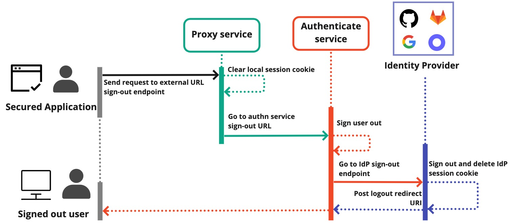

# Authentication and Single Sign-On (SSO)

Pomerium provides authentication and single sign-on (SSO) by authenticating against your identity provider (IdP).

While Pomerium itself is not an IdP, it supports conventional IdP solutions and can be configured to work with any IdP that uses the [OpenID Connect](https://openid.net/connect/) (OIDC) protocol.

:::tip

See [identity providers](/docs/integrations/user-identity/identity-providers) for step-by-step guides on how to integrate supported IdPs with Pomerium.

:::

## Authentication with Pomerium

Pomerium speaks to your IdP to verify user identities and authenticate users to upstream applications.

After Pomerium has verified and authenticated the user, the Authentication service creates a local session with relevant session data, including OAuth and ID tokens, which Pomerium uses to authenticate and authorize users and manage Pomerium sessions.

### JWT verification and upstream applications

After Pomerium's Authentication service obtains OAuth and ID tokens and OIDC claims from your IdP, it stores that session data in the Databroker service, never leaking it to the client or the upstream application. This provides an extra layer of security, as it prevents the application from using OAuth tokens provided by the IdP.

Pomerium mints a new Pomerium JWT based on the claims and scopes in the OAuth and ID tokens and signs the JWT with a private key so the upstream application can verify the incoming request came from Pomerium.

Although [JWT verification](/docs/capabilities/getting-users-identity.mdx) is optional, Pomerium provides a way for you to [verify a user's identity](/docs/capabilities/getting-users-identity) on the application level by forwarding [JWT claim headers](/docs/reference/jwt-claim-headers) with proxied requests to upstream applications.

Pomerium offers frontend and backend SDKs to simplify JWT verification for application developers:

- [JavaScript SDK](https://github.com/pomerium/js-sdk)
- [Node and Express SDK](https://github.com/pomerium/js-sdk/tree/main/examples/express)
- [Go SDK](https://github.com/pomerium/sdk-go)

## SSO support for legacy applications

Legacy apps that may not directly support SSO are still compatible with Pomerium. As a reverse proxy, Pomerium is designed to sit in front of your applications.

By configuring your applications to route requests to Pomerium's Proxy service, Pomerium can manage the authentication flow and secure your legacy app with minimal to no work on your end.

## Direct IdP Token Authentication

Pomerium also supports authenticating users using an Identity Provider’s access token directly, without a full OAuth browser redirect flow. If a user or service has already obtained a valid access token from Microsoft Entra ID, they can present it to Pomerium to gain access, rather than going through the usual login redirect. Pomerium will validate the token with the IdP and create a session for the associated user.

### Benefits

**Streamlined CLI and Service Auth:** This feature is great for command-line tools and automated workflows. For example, a developer who has run `az login` (Azure CLI) and has an access token can use that token to authenticate with Pomerium via an `Authorization: Bearer <token>` header or through the Pomerium CLI. This avoids needing a browser during CLI use, making automation smoother.

**Use Existing Tokens:** In scenarios where another system has already obtained a user token (for instance, an external authenticator or a device that can’t easily do interactive logins), Pomerium can now accept that token directly. This opens up integration possibilities where Pomerium acts as a resource server in an OAuth flow.

**Secure Validation:** Pomerium verifies the token’s signature and claims with the IdP (ensuring it’s not expired, issued for the correct client, etc.) before trusting it. Only tokens from configured, trusted IdPs are accepted.

### Limitations

Microsoft Entra ID is supported, but future Pomerium updates may expand direct token support to other providers.

Direct IdP token authentication is an opt-in capability that can be enabled through [Pomerium configuration](/docs/reference/bearer-token-format). This enhancement makes Pomerium even more flexible in hybrid environments where not all clients are web browsers.

## External data sources (Enterprise)

:::enterprise

[Enterprise customers](https://www.pomerium.com/enterprise-sales/) can enforce context-aware access with Pomerium's [external data sources](/docs/capabilities/integrations) feature (directory sync).

:::

From the Enterprise Console, you can import external data from sources other than your IdP. User identity context such as users, groups, roles, language, time zones, location, and more can be included into your authorization policy so you can make granular access control decisions.

## Hosted Authenticate Service

Pomerium's **Hosted Authenticate Service** provides a hosted alternative to the self-hosted authenticate service.

Introduced in Pomerium v0.22, the hosted authenticate service is available for open-source Pomerium, Pomerium Zero, and Pomerium Enterprise.

## How the hosted authenticate service works

Pomerium's hosted authenticate service includes a **Hosted Authenticate Service URL** and a **Hosted Identity Provider** that handle authentication and authorization using OAuth 2.0 and OIDC protocols.

Pomerium Zero, Core, and Enterprise configurations that do not include the self-hosted authenticate service URL or identity provider settings default to the hosted authenticate service settings. See [Configure the hosted authenticate service](#configure-the-hosted-authenticate-service) section for more information.

## Why use the hosted authenticate service

The hosted authenticate service offers a quicker way for users to deploy and test Pomerium.

### No configuration

The hosted authenticate service doesn't require an authenticate service URL or identity provider settings to use.

### Less time to deploy

Pomerium's hosted authenticate service removes the tedium of configuring your own identity provider (IdP) and authenticate service URL so you can deploy Pomerium in less time.

### Faster proof of concept

If you're testing Pomerium for the first time, run [Pomerium with Docker](/docs/get-started/fundamentals/core/get-started) using our hosted authenticate service – you can run Pomerium Core in **under 5 minutes** with minimal setup.

:::enterprise

Pomerium users who are interested in [Pomerium Enterprise](https://www.pomerium.com/enterprise-sales/) can test out the [Docker Enterprise quickstart](/docs/deploy/enterprise/quickstart) using our hosted authenticate service as well.

:::

## Configure the hosted authenticate service

The hosted authenticate service requires no configuration to use.

Add the following route and policy to your configuration file:

```yaml title="pomerium-config.yaml"
routes:
  - from: https://verify.localhost.pomerium.io
    to: http://verify:8000
    policy:
      - allow:
          or:
            - email:
                is: user@example.com
    pass_identity_headers: true
```

This minimal configuration is all you need to connect to an upstream service with Pomerium's hosted services.

If you want, you can still include the hosted URL in your configuration:

```yaml title="pomerium-config.yaml"
authenticate_service_url: https://authenticate.pomerium.app

routes:
  - from: https://verify.localhost.pomerium.io
    to: http://verify:8000
    policy:
      - allow:
          or:
            - email:
                is: user@example.com
    pass_identity_headers: true
```

If you use the hosted URL and include your own IdP settings, Pomerium will override your IdP configuration and use the hosted IdP instead:

```yaml title="pomerium-config.yaml"
authenticate_service_url: https://authenticate.pomerium.app

idp_provider: google
idp_client_id: my_client_id
idp_client_secret: my_client_secret

routes:
  - from: https://verify.localhost.pomerium.io
    to: http://verify:8000
    policy:
      - allow:
          or:
            - email:
                is: user@example.com
    pass_identity_headers: true
```

## Limitations

**Limited sign-in options**

Currently, you can only authenticate with Google single-sign on or with email and password credentials.

**Session management**

The hosted authenticate service is separate from your Pomerium installation. This means you can't refresh session tokens, so users must re-authenticate after roughly one hour.

**Uptime commitment**

We make no commitments to uptime for our free hosted authenticate service.

## Privacy considerations

Users that take advantage of our hosted authenticate service should review the [Terms of Service agreement](https://www.pomerium.com/pomerium-zero-user-agreement/).

Specifically, you should be aware that by using our hosted services, you agree to Pomerium collecting the following data:

- IP address
- OS version
- Internal domain name
- Session details (email, name, and domain)

We collect this information to better understand how our users interact with and use Pomerium's services.

## Self-Hosted Authenticate Service

Pomerium's **Self-Hosted Authenticate Service** allows you to configure Pomerium with the identity provider of your choice.

The self-hosted authenticate service is available for open-source Pomerium, Pomerium Zero, and Pomerium Enterprise.

:::info

The _authenticate service_ is one of the [four logical services](/docs/internals/architecture#component-level) that make up Pomerium. The authenticate service is unique in that Pomerium can either run this service itself, or instead use the [Hosted Authenticate Service](/docs/capabilities/authentication).

:::

## How the self-hosted authenticate service works

To configure the self-hosted authenticate service, you will need to set up:

- a URL for the authenticate service
- an identity provider (IdP)

### Authenticate service URL

The authenticate service URL is a public-facing URL that should resolve to your Pomerium instance. (If running in split service mode, this URL should resolve to the authenticate service.) Whenever a user is required to log in to access a route, Pomerium will redirect the user to the authenticate service using this URL.

This URL should not contain a path or query parameters. For example, `https://authenticate.corp.example.com`.

This URL must be different from any of the route URLs you use with Pomerium.

See the [Authenticate Service URL](/docs/reference/service-urls#authenticate-service-url) reference page for details on how to configure this setting.

:::info Why does Pomerium use a separate authenticate service URL?

In a typical OIDC authentication flow, all redirect URLs must be pre-registered with the IdP. Pomerium uses a single authenticate service URL so that you need to register only one redirect URL with your IdP. This way, Pomerium can protect multiple upstream services without requiring you to update your IdP client whenever you add a new service.

:::

### Identity provider

Pomerium relies on an IdP to authenticate users. Pomerium can use any IdP that implements the OpenID Connect (OIDC) protocol.

The steps to configure your IdP will vary depending on the specific provider. See [**Identity Providers**](/docs/integrations/user-identity/identity-providers) for a list of guides to configure commonly-used IdPs.

You will generally need to configure your IdP client to allow an OAuth redirect URL based on your chosen authenticate service URL, with the path `/oauth2/callback` appended to it.

For example, if your authenticate service URL is `https://authenticate.corp.example.com`, you should configure your identity provider to allow the redirect URI `https://authenticate.corp.example.com/oauth2/callback`.

:::tip

If you require a different callback path than `/oauth2/callback`, you can use the [Authenticate Callback Path](/docs/reference/authenticate-callback-path) setting to change the callback path.

:::

Once you have set up an IdP client, you will need to configure Pomerium with the IdP name, client ID and client secret, and possibly a URL assigned to your individual IdP client.

See the [Identity Provider Settings](/docs/reference/identity-provider-settings#identity-provider-client-id) reference page for details on how to configure these settings.

## Single sign-out (SSO)

signs a user out of a secured application and clears both the remote application session generated by the identity provider and the local Pomerium session.

## OIDC Front-Channel Logout

Pomerium supports Front-Channel Logout as described in [OpenID Connect Front-Channel Logout 1.0](https://openid.net/specs/openid-connect-frontchannel-1_0.html).

### Identity provider support

See if your identity provider (IdP) supports Front-Channel Logout by checking your IdP's `/.well-known/openid-configuration` endpoint. If your IdP supports it, you may see something similar to the JSON data below:

```json
{
  "frontchannel_logout_session_supported": true
}
```

### Configure single sign-out

To correctly implement SSO, you must register a `frontchannel_logout_uri` for your application that includes the path `/.pomerium/sign_out`.

The `frontchannel_logout_uri` must match the external route in your policy. For example, `app.corp.example.com/.pomerium/sign_out`.

If configured correctly, the following actions occur:

1. The proxy service receives the sign-out request and clears the local Pomerium session
2. The proxy service redirects the request to the authenticate service URL's `/.pomerium/sign_out` endpoint
3. The authentication service clears the remote application session



:::caution

While it is possible to implement SSO using the **authenticate service URL** and the `/.pomerium/sign_out` endpoint, this method is not recommended.

Signing out with the authenticate service URL won't delete the session cookie on the route itself. To terminate the remote application and Pomerium sessions, you must point sign-out requests to the external route.

:::

<details>
  <summary>Well-known Pomerium endpoint</summary>
  <div>

See Pomerium's `/.well-known/pomerium` endpoint to view OAuth, OIDC, and JWKS data.

For example:

```json
{
  "authentication_callback_endpoint": "https://authenticate.localhost.pomerium.io/oauth2/callback",
  "jwks_uri": "https://authenticate.localhost.pomerium.io/.well-known/pomerium/jwks.json",
  "frontchannel_logout_uri": "https://authenticate.localhost.pomerium.io/.pomerium/sign_out"
}
```

Note, a CSRF token is required for the single sign out endpoint (despite supporting `GET` and `POST`) and can be retrieved from the `X-CSRF-Token` response header on the well known endpoint above or using the `_pomerium_csrf` session set.

  </div>
</details>

### Single sign-out example with Pomerium

The example below demonstrates how to correctly implement SSO using the [JavaScript SDK](/docs/capabilities/getting-users-identity.mdx):

```js
export const signOut = (redirectUrl) => {
  let location = window.location.origin + '/.pomerium/sign_out';
  if (redirectUrl) {
    location += '?pomerium_redirect_uri=' + encodeURIComponent(redirectUrl);
  }
  window.location.href = location;
};
```

In the example above, the `signOut` function appends the `/.pomerium/sign_out` endpoint to the external route URL, then redirects the user.

From here, the proxy service clears the external route session and redirects the user to the authenticate service URL to clear the Pomerium session.
