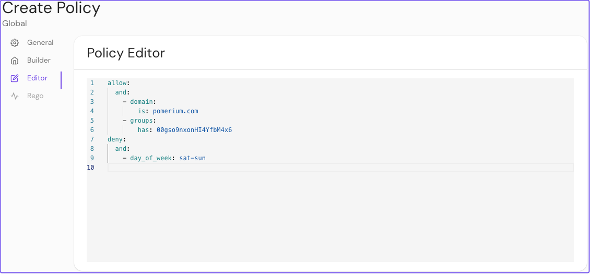
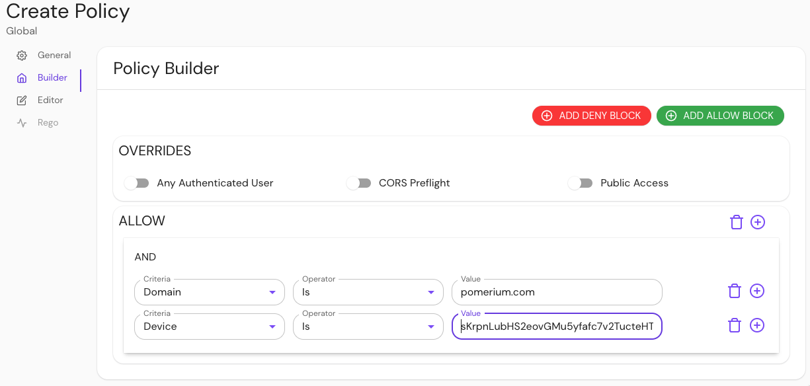
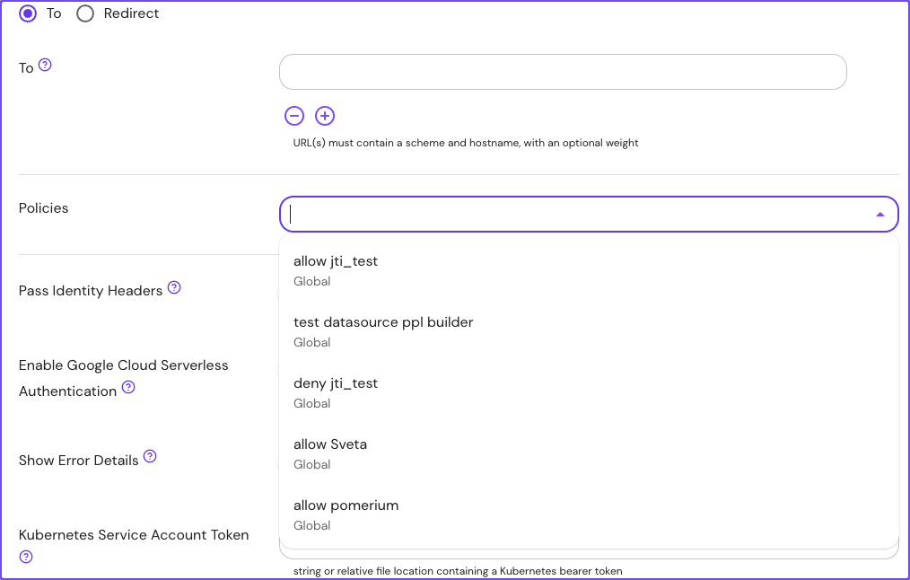
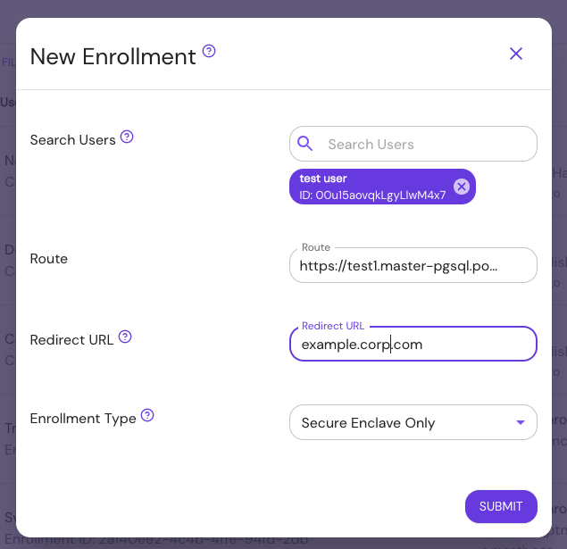
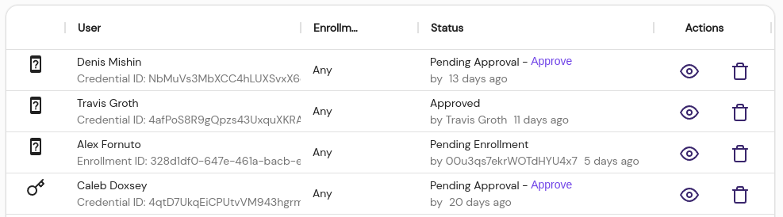

---
# cSpell:ignore abac, gset, nxon, unvalidated

title: Authorization & Policy
lang: en-US
sidebar_label: Authorization
description: Build authorization policy with Pomerium and apply them to routes and namespaces.
keywords:
  [
    pomerium,
    context-aware proxy,
    authorization proxy,
    access decision point,
    rbac,
    abac,
    dynamic access,
    ppl,
    namespaces,
  ]
---

import Tabs from '@theme/Tabs';
import TabItem from '@theme/TabItem';

# Authorization Policy

An authorization policy defines what resources a user or group can access within an organization. When applying an authorization policy, factors like access management to on-premises or cloud services, authentication flows, and device identity introduce complexity that only scales with organization size.

Pomerium meets you where you are by allowing you to configure granular policies that support or extend your existing policies on a per-route, per-request basis.

## Pomerium authorization policy

You can apply policies in Pomerium to [Namespaces](/docs/capabilities/namespacing) or [Routes](/docs/capabilities/routing).

### Namespaces

:::enterprise

Namespace support is available only for [Enterprise customers](https://www.pomerium.com/enterprise-sales/).

:::

Administrators can create a namespace, add users, groups, and routes to it, and configure a policy that applies to that specific namespace.

### Routes

You can build TLS-encrypted routes to upstream applications and configure policy that restricts access based on the policy criteria.

Pomerium Enterprise and Core customers can configure and apply policies to routes.

### Continuous verification

<iframe
  width="560"
  height="315"
  src="https://www.youtube.com/embed/3MJrNvQ7aIE"
  title="YouTube video player"
  frameborder="0"
  allow="accelerometer; autoplay; clipboard-write; encrypted-media; gyroscope; picture-in-picture; web-share"
  allowfullscreen></iframe>

Pomerium continuously evaluates policy on every request.

Policy applied to any route or namespace will enforce authorization checks throughout a session, ensuring that only the intended user with the right context can access a protected resource.

## Apply authorization policy

Pomerium offers three methods to configure and apply policies:

- [Pomerium Policy Language (PPL)](#pomerium-policy-language-ppl)
- [Enterprise Console GUI](#enterprise-console-gui)
- [Rego](#rego-support)

### Pomerium Policy Language (PPL)

[Pomerium Policy Language (PPL)](/docs/capabilities/ppl) is a declarative, YAML-based access control policy language you can use to configure authorization policies.

PPL is intuitive by design and defines policy with one or more rules composed of actions, logical operators, and criteria. Each criterion has a name and corresponding data.

<Tabs>
<TabItem value="Core" label="Core">

In Pomerium Core, you can build a policy with PPL and apply it to a route in your configuration file:

```yaml title=pomerium-config.yaml
policy:
  - allow:
      or:
        - email:
            is: user@example.com
```

In this example, only a user with the email `user@example.com` can access the target application.

</TabItem>
<TabItem value="Enterprise" label="Enterprise">

In the Enterprise Console, you can use the **EDITOR** to manually configure policy with PPL:



In this example, Pomerium will grant a user access if their email address ends in `example.com` and their `groups` ID matches `00gso9nxonHI4YfbM4x6`. Pomerium will deny the user access on Saturdays and Sundays.

</TabItem>
</Tabs>

### Enterprise Console GUI

:::enterprise

The Enterprise Console provides a policy builder GUI so you can build policies and reapply them to multiple routes and namespaces. See our [**Enterprise**](/docs/deploy/enterprise) page to learn more.

:::

Use the **BUILDER** tab to build your policy:



In this example, a user will have access if their email address ends in `example.com` and their device ID matches the ID in the **Value** field.

#### Reapply policies

Reapply policies as necessary to any route or namespace:



### Rego support

Pomerium supports policies expressed in [Rego](https://www.openpolicyagent.org/docs/latest/#rego) for organizations that prefer to use [OPA](https://www.openpolicyagent.org/).

See the [Outputs](#outputs), [Inputs](#inputs), and [Functions](#functions) reference sections below to learn how they apply to policy evaluation.

#### Outputs

Authorization policy written in Rego is expected to return results in `allow` and/or `deny` rules:

```rego
# a policy that always allows access
allow := true
```

```rego
# a policy that always denies access
deny := true
```

Pomerium grants access according to the same rules as [PPL](/docs/capabilities/ppl#actions):

> Only two actions are supported: allow and deny. deny takes precedence over allow. More precisely: a user will have access to a route if at least one allow rule matches and no deny rules match.

`allow` and `deny` rules support four forms:

1. A simple boolean:

```rego
allow := true
```

2. An array with a single boolean value:

```rego
deny := [true]
```

3. An array with two values: a boolean and a **reason**:

```rego
allow := [false, "user-unauthorized"]
```

4. An array with three values: a boolean, a reason, and additional data:

```rego
allow := [false, "user-unauthorized", { "key": "value" }]
```

The **reason** value is useful for debugging, since it appears in [authorization logs](/docs/reference/authorize-log-fields#find-authorize-logs). There are two special reasons that trigger functionality in Pomerium:

- `user-unauthenticated` indicates that the user needs to sign in, and results in a redirect to the Authenticate service
- `device-unauthenticated` indicates that the user needs to register a new device

#### Inputs

Rego scripts are evaluated with inputs available on the `input` object:

```rego
allow if input.http.method == "POST"
```

Rego defines the following inputs:

| **Input name** | **Type** | **Description** |
| :-- | :-- | :-- |
| `http` | Object | Represents the HTTP request |
| `http.method` | String | The method used in the HTTP request |
| `http.hostname` | String | The hostname in the HTTP request |
| `http.path` | String | The path in the HTTP request |
| `http.url` | String | The full URL in the HTTP request |
| `http.headers` | Object | The headers in the HTTP request |
| `http.client_certificate` | Object | The client certificate details |
| `http.client_certificate.presented` | Boolean | `true` if the client presented a certificate |
| `http.client_certificate.leaf` | String | The leaf certificated provided by the client (unvalidated) |
| `http.client_certificate.intermediates` | String | The remainder of the client certificate chain |
| `http.ip` | String | The user's IP address |
| `http.session` | Object | Represents the user's session |
| `http.session.id` | String | The session ID |
| `http.is_valid_client_certificate` | Boolean | `true` if the presented client certificate is valid |

#### Functions

The function below is available in Rego scripts:

- `get_databroker_record(record_type, record_id)`: Returns data from the Databroker service.

For example:

```rego
session := get_databroker_record("type.googleapis.com/session.Session", input.session.id)
```

<details>
<summary>Example Rego Policy</summary>
<div>

This example policy compares the `given_name` claim from a user's session against a list of popular first names, and only allows the 100 most popular first names.

```rego
package pomerium.policy
session = s {
  s = gset_databroker_record("type.googleapis.com/user.ServiceAccount", input.session.id)
  s != null
} else = s {
  s = get_databroker_record("type.googleapis.com/session.Session", input.session.id)
  s != null
} else = {} {
  true
}
user = u {
  u = get_databroker_record("type.googleapis.com/user.User", session.user_id)
} else = {} {
  true
}
allow = [true, {"custom-rego-authorized"}] {
  # grab all the claims from the user and session objects
  session_claims := object.get(session, "claims", {})
  user_claims := object.get(user, "claims", {})
  all_claims := object.union(session_claims, user_claims)
  # get the given_name claim. claim values are always an array of strings
  given_names := object.get(all_claims, "given_name", [])
  # query a JSON dump of the most popular baby names from 2020
  response := http.send({
    "method": "GET",
    "url": "https://raw.githubusercontent.com/aruljohn/popular-baby-names/master/2020/boy_names_2020.json",
    "force_json_decode": true,
  })
  # only include the top 100 names
  all_names := response.body.names
  popular_names := array.slice(all_names, 0, 99)
  # check that there's a given name in the popular names
  some i
  some j
  popular_names[i] == given_names[j]
} else = [false, {"custom-rego-unauthorized"}] {
  session.id != ""
} else = [false, {"user-unauthenticated"}] {
  true
}
```

This example pulls session data from the Databroker service using `type.googleapis.com/session.Session` for users and `type.googleapis.com/user.ServiceAccount` for service accounts.

</div>
</details>

::::enterprise

In the [**Enterprise Console**](/docs/deploy/enterprise), you can write policies in Rego with the PPL builder:


:::note

A policy can only support PPL or Rego. Once one is set, the other tab is disabled.

:::

::::

### Policy overrides

Pomerium Core and Enterprise offer the following options for overriding your authorization policy:

- **Any Authenticated User**: Allows access to a route with this policy attached to any user who can authenticate to your identity provider
- **CORS Preflight**: Allows unauthenticated HTTP OPTIONS requests as per the CORS spec
- **Public Access**: Allows complete, unrestricted access to an associated route (use this setting with caution)

:::note robots.txt behavior

By default, Pomerium serves a **robots.txt** response directly, instructing search engines _not_ to crawl the route domain:

```txt
User-agent: *
Disallow: /
```

For routes with policies that allow public, unauthenticated access, Pomerium _will not_ serve **robots.txt** directly. Instead, Pomerium will proxy requests for `/robots.txt` to the upstream service.

:::

## Manage devices

:::enterprise

[Device identity](/docs/capabilities/device-identity) is an Enterprise feature. Check out our [Enterprise](/docs/deploy/enterprise) page to learn more.

:::

The **Manage Devices** feature in the Enterprise Console allows you to enroll and manage user devices for policy-based authorization.



The **Devices List** displays enrolled devices for each user and the approval status. Administrators can inspect, approve, or delete registered devices from this table.


