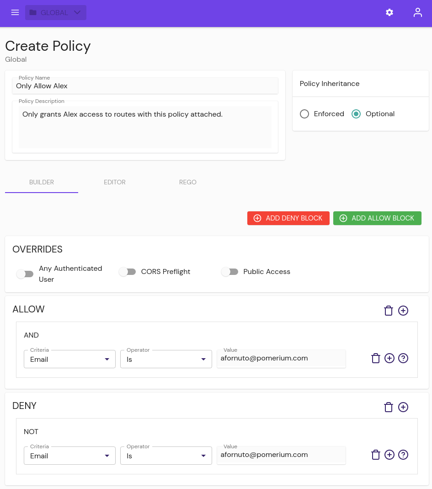
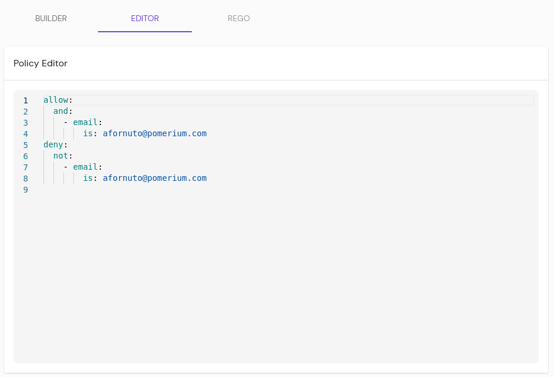

# Authorization

## Policy

A [Policy](/docs/capabilities/authorization.mdx) defines what permissions a set of users or groups has. Policies are applied to Namespaces or Routes to associate the set of permissions with a service or set of service, completing the authentication model.

Policies can be constructed three ways:

### Web UI

From the **BUILDER** tab, users can add allow or deny blocks to a policy, containing and/or/not/nor logic to allow or deny sets of users and groups.



Policies can be constructed three ways:

### Pomerium Policy Language

From the **EDITOR** tab users can write policies in Pomerium Policy Language (**PPL**), a YAML-based notation.



PPL documents contain one or more rules. Each rule has a corresponding action and one or more logical operators. Each logical operator contains criteria and each criterion has a name and corresponding data.

PPL documents are defined via YAML:

```yaml
- allow:
    or:
      - email:
          is: x@example.com
      - email:
          is: y@example.com
```

The available rule actions are:

- `allow`
- `deny`

The available logical operators are:

- `and`
- `or`
- `not`
- `nor`

The available criteria types are:

- `accept`
- `authenticated_user`
- `claim`
- `date`
- `day_of_week`
- `domain`
- `email`
- `groups`
- `http_method`
- `http_path`
- `record`
- `reject`
- `time_of_day`
- `user`

Some criteria also support a sub-path as part of the criterion name:

```yaml
- allow:
    or:
      - claim/family_name: Smith
```

See [Pomerium Policy Language](/docs/concepts/ppl) for more details.

### Rego

For those using [OPA](https://www.openpolicyagent.org/), the **REGO** tab will accept policies written in Rego.

:::tip

A policy can only support PPL or Rego. Once one is set, the other tab is disabled.

:::

<details>
<summary>Example Rego Policy</summary>
<div>

This example policy compares the `given_name` claim from a user's session against a list of popular first names, and only allows the 100 most popular first names.

```rego
package pomerium.policy
session = s {
  s = gset_databroker_record("type.googleapis.com/user.ServiceAccount", input.session.id)
  s != null
} else = s {
  s = get_databroker_record("type.googleapis.com/session.Session", input.session.id)
  s != null
} else = {} {
  true
}
user = u {
  u = get_databroker_record("type.googleapis.com/user.User", session.user_id)
} else = {} {
  true
}
allow = [true, {"custom-rego-authorized"}] {
  # grab all the claims from the user and session objects
  session_claims := object.get(session, "claims", {})
  user_claims := object.get(user, "claims", {})
  all_claims := object.union(session_claims, user_claims)
  # get the given_name claim. claim values are always an array of strings
  given_names := object.get(all_claims, "given_name", [])
  # query a JSON dump of the most popular baby names from 2020
  response := http.send({
    "method": "GET",
    "url": "https://raw.githubusercontent.com/aruljohn/popular-baby-names/master/2020/boy_names_2020.json",
    "force_json_decode": true,
  })
  # only include the top 100 names
  all_names := response.body.names
  popular_names := array.slice(all_names, 0, 99)
  # check that there's a given name in the popular names
  some i
  some j
  popular_names[i] == given_names[j]
} else = [false, {"custom-rego-unauthorized"}] {
  session.id != ""
} else = [false, {"user-unauthenticated"}] {
  true
}
```

This example pulls session data from the Databroker service using `type.googleapis.com/session.Session` for users and `type.googleapis.com/user.ServiceAccount` for service accounts.

</div>
</details>

### Overrides

- **Any Authenticated User**: This setting will allow access to a route with this policy attached to any user who can authenticate to your Identity Provider (**IdP**).
- **CORS Preflight**: Allow unauthenticated HTTP OPTIONS requests as per the CORS spec.
- **Public Access**: This setting allows complete, unrestricted access to an associated route. Use this setting with caution.

## Devices

Introduced in v0.16.0, the **Manage Devices** page lets administrators manage user devices for policy-based authorization.

### Manage Devices

<ManageDevices />

### Devices List

Displays the currently enrolled devices for each user, along with their current approval status. Administrators can inspect, approve, or delete registered devices from this table.


