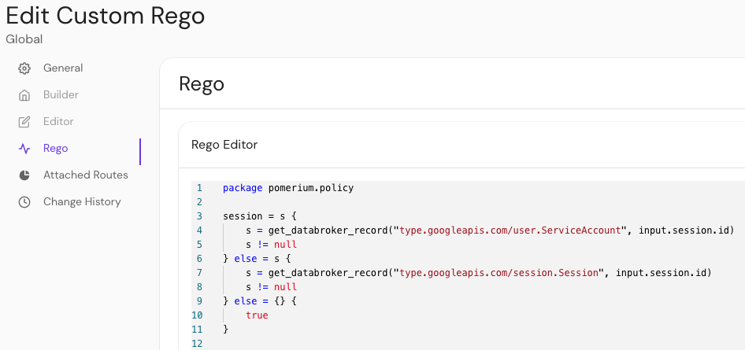

import Tabs from '@theme/Tabs';
import TabItem from '@theme/TabItem';
import SelfSignedCertWarning from '@site/content/docs/admonitions/_handle-self-signed-certificate-warning.mdx';

<iframe
  width="100%"
  height="600"
  src="https://www.youtube.com/embed/3MJrNvQ7aIE"
  title="Pomerium authorization video"
  frameborder="0"
  allow="accelerometer; autoplay; clipboard-write; encrypted-media; gyroscope; picture-in-picture; web-share"
  allowfullscreen></iframe>

Pomerium enforces dynamic, context-aware authorization on every request. This capability extends across deployments of any size or complexity, from single-route use cases to multi-namespace or multi-cluster enterprise environments.

Below, we cover how to write and apply policies with **Pomerium Policy Language (PPL)**, when to use **Rego**, and how **Namespaces** (Enterprise) and **Clusters** (Pomerium Zero) fit into the picture.

## Introduction: Authorization at Every Layer

Pomerium's approach to authorization is continuous and context-aware, integrating identity information from your IdP, device identity, or external data sources.

- **Route-based** control in all editions
- **Namespace-based** and **cluster-based** organization in Enterprise and Zero
- **Policy languages**: [PPL](#pomerium-policy-language-ppl) for most use cases, [Rego](#rego-policies) for advanced logic

## Where Policies Live

1. **Routes**

   Policies can be attached to each route, controlling who and what can access the upstream service.

2. **Namespaces**

   A namespace is an organizational unit. Policy can be applied once and inherited by child namespaces or routes. Admins can delegate control so teams manage their own routes without harming global security.

3. **Clusters**

   Zero-managed clusters pull their config (routes, policies, certificates) from a hosted control plane. Each cluster has its own environment. You can define policies in the Zero console, and they're synced to local Pomerium Core replicas.

## Policy Configuration Approaches

### Pomerium Policy Language (PPL)

[Pomerium Policy Language](/docs/internals/ppl) is YAML-based and covers the majority of use cases.

- **Actions**: `allow` or `deny`
- **Logical Operators**: `and`, `or`, `not`, `nor`
- **Criteria**: email, domain, groups, day of week, device, etc.

A minimal example:

```yaml
allow:
  and:
    - domain:
        is: example.com
deny:
  or:
    - email:
        is: spammer@example.com
    - email:
        is: malicious@example.com
```

**Deny** overrides **allow**. Requests must pass at least one `allow` rule and no `deny` rules.

#### PPL in Pomerium Enterprise

Enterprise adds a visual **Policy Builder** and extended criteria (like time-of-day or external data records). You can build policy via GUI or raw PPL:


Reapply policies across multiple routes or namespaces:


### Rego Policies

:::enterprise

**Rego** is available to Enterprise customers who need advanced, custom logic beyond what PPL offers.

:::

[Rego](https://www.openpolicyagent.org/docs/latest/#rego) is the language used by [Open Policy Agent (OPA)](https://www.openpolicyagent.org/). In Pomerium, you can write Rego modules that produce `allow` or `deny` outcomes. For example:

```rego
allow := true
```

or:

```rego
deny := [true, "unauthorized"]
```

You can inspect request data under `input.http` (method, headers, path), or session details under `input.http.session`. Learn more in the [Rego docs](/docs/internals/ppl#rego).



## Enterprise Features

### Namespaces

:::enterprise

Namespaces group resources and teams in a hierarchical structure. A parent namespace can enforce global rules while child namespaces add local restrictions. Enterprise also supports [**Clusters**](/docs/internals/clusters-for-enterprise).

:::

Key benefits:

- **Self-Service**: Team leads can manage their own routes and policies.
- **Hierarchical**: Global admins set top-level constraints (like requiring a `@yourcompany.com` email).
- **RBAC**: Access is granted via roles: **Guest**, **Viewer**, **Manager**, **Admin**.

## Pomerium Zero & Clusters

**Pomerium Zero** uses a _cluster_ model. Each cluster is a local deployment of Pomerium Core, connected to a hosted control plane. Clusters fetch routes, policies, and certificates from the Zero console:

- **Starter domain**: Each cluster gets a unique domain with automatic TLS.
- **Custom domains**: Switch from the starter domain to your own.
- **Scalability**: Add more replicas to handle more traffic.
- **Storage**: Use a persistent PostgreSQL database in production for reliability.

For more details, see the [**Clusters**](/docs/internals/clusters) documentation.

## Policy Overrides

Regardless of PPL or Rego, Pomerium provides quick overrides:

- **Any Authenticated User**: Bypasses all other policy logic and admits any logged-in user.
- **CORS Preflight**: Lets `OPTIONS` requests pass unauthenticated.
- **Public Access**: No authentication required. Use with caution.

:::note robots.txt behavior

If a route is fully public, `robots.txt` will be proxied from upstream (instead of returning a disallow-by-default).

:::

## Putting It All Together

1. **Plan Your Structure**

   - Small setups: attach a PPL policy directly to each route in Core.
   - Larger orgs: use **Namespaces** (Enterprise) to group resources.
   - Multi-deployment: use **Clusters** (Pomerium Zero) to unify config.

2. **Decide on Language**

   - **PPL**: YAML, easy to read, covers most use cases.
   - **Rego** (Enterprise): advanced logic, OPA-based.

3. **Continuously Verify**
   - Pomerium reevaluates the user's context (IdP claims, device posture, location) on every request.

## Learn More

- [**Routing**](/docs/capabilities/routing)
- [**Policy Language (PPL)**](/docs/internals/ppl)
- [**Rego**](/docs/internals/ppl)
- [**Namespaces**](/docs/internals/namespacing)
- [**Clusters**](/docs/internals/clusters)
- [**Device Identity**](/docs/integrations/device-context/device-identity)

Use Pomerium's robust, context-driven authorization to unify your security posture, whether you're looking to secure a few routes or an entire global infrastructure.
