# Custom Branding / White Labeling

:::tip

This article describes a use case available to [Pomerium Enterprise](/docs/enterprise/install/index.md) customers.

:::

Pomerium's user and administrative facing GUI and error messages can be customized to meet your organization's needs.

## Settings

Most of the Branding settings are located in the Branding Tab of the main Settings Page.

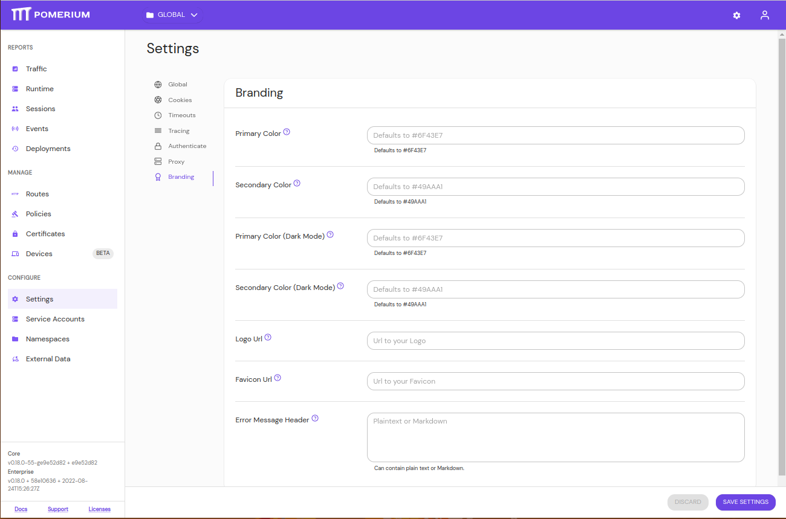

There is also a setting to enable Error Details on Edit Route's General Tab.

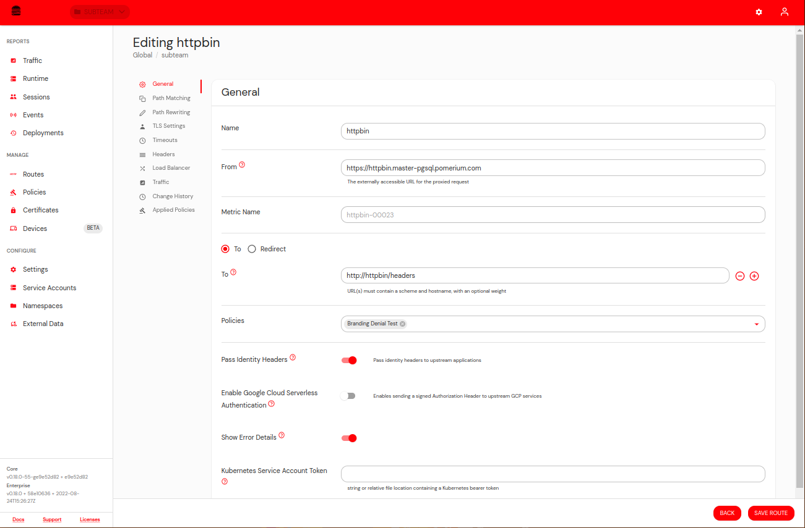

Policies have two new fields, explanation and remediation.

Explanation is an optional short description of why the user would have been denied. Likewise, remediation is an optional field to cover how the user can self-remediate their state. Oftentimes, this will be a link to your internal help desk support site or knowledge base repo.

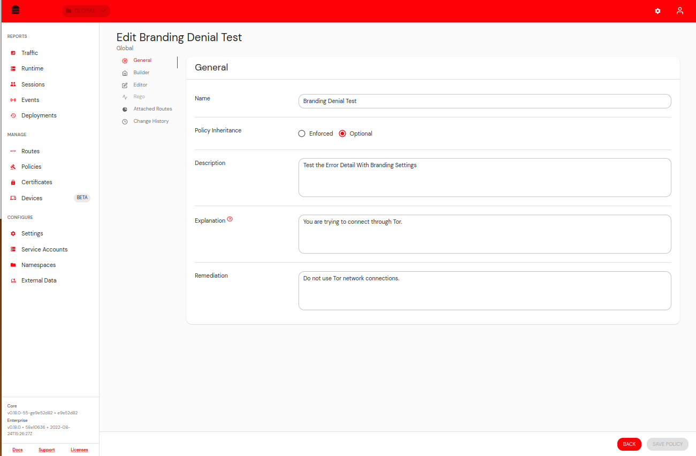

## Colors

Adding a [hex code](https://color.adobe.com/create/color-wheel) to the Primary Color setting will affect the majority of the theming on the console. For more details on how the types of colors will impact the look and feel of Pomerium, see Material Designs' [color documentation](https://material.io/resources/color/#!/?view.left=0&view.right=0)'s color documentation.

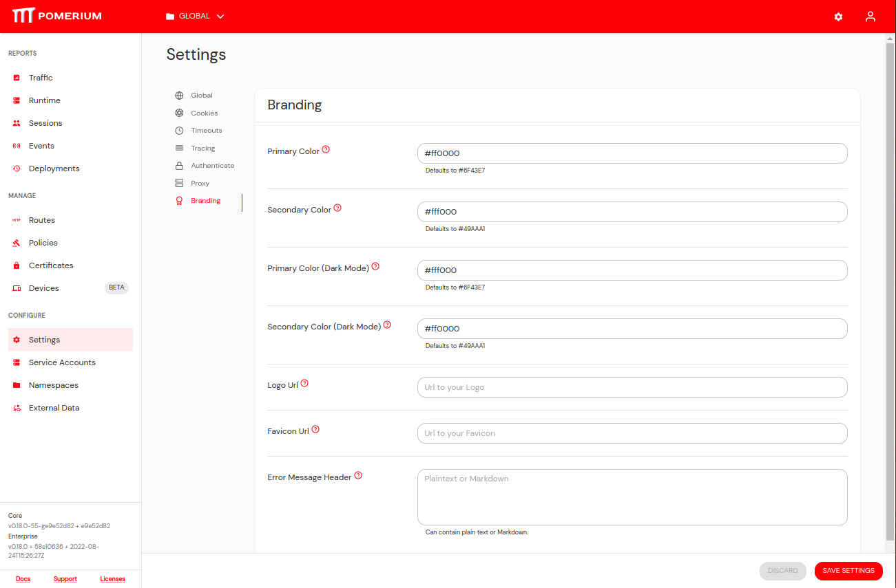

There is also a secondary color that is used for a few things such as certain button colors.

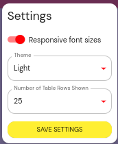

Choosing colors also affects the majority of webpages served by Pomerium Core.

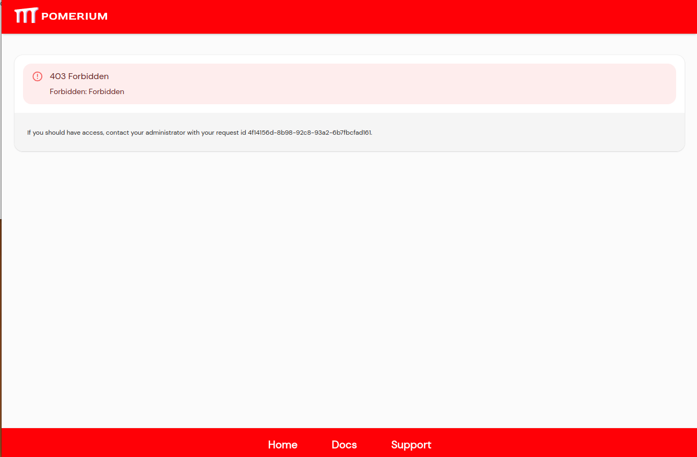

You can also set different colors for users using dark mode.

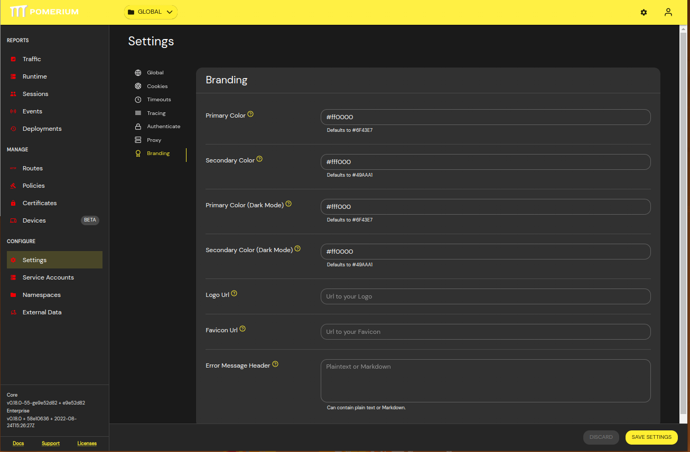

## Logo

You may add a URL to link to your logo and favicon which will replace the Pomerium defaults.

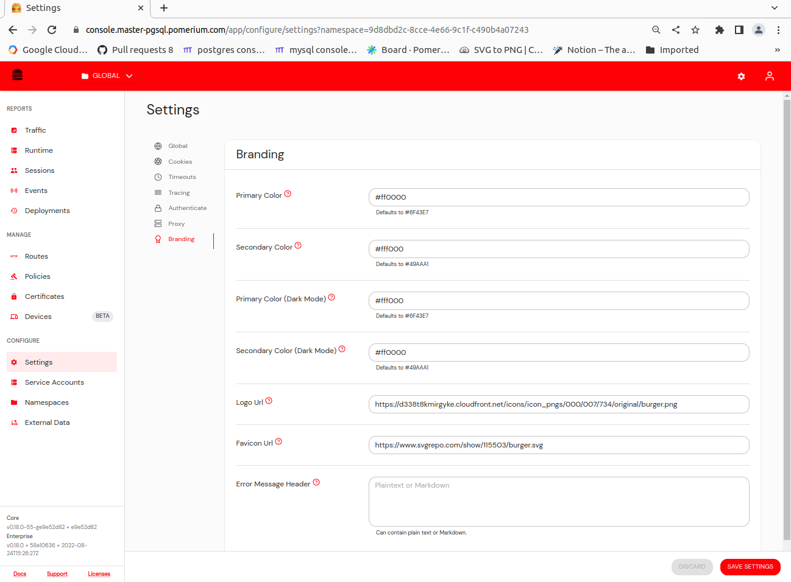

It will also appear for all the user-facing webpages too.

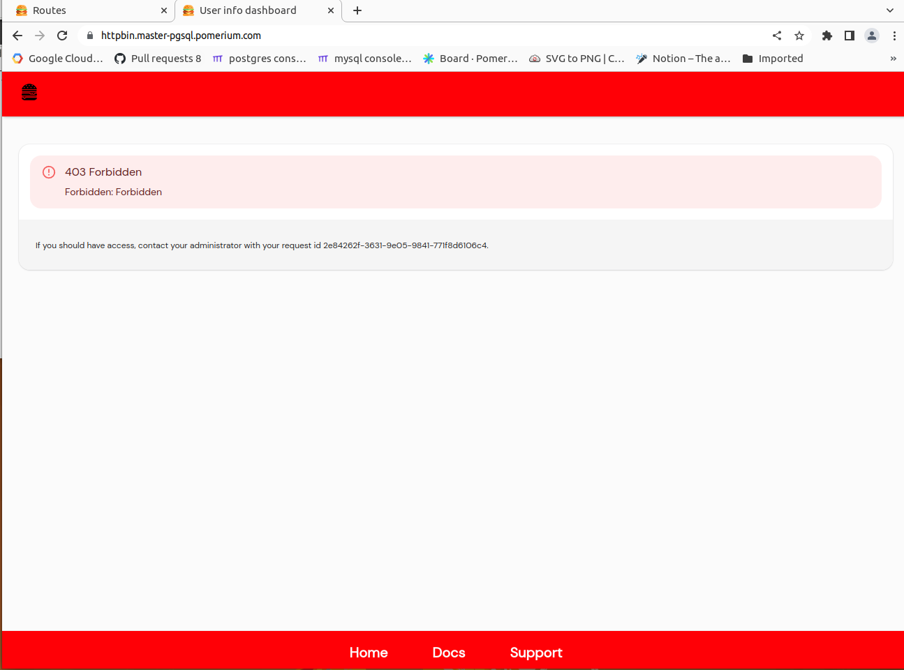

## Error Details

It is possible to customize the error messages displayed on 403 unauthorized pages.

This feature is enabled on a per Route basis by toggling the setting in the General Tab of the Route settings.

Error Message will appear similar to this example.

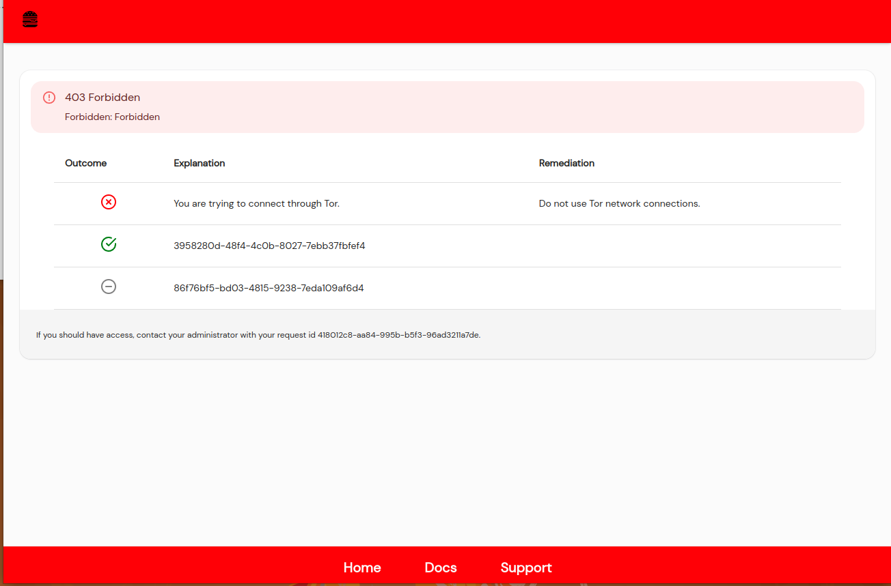

Policies without an explanation or remediation field will show the policy ID.

If the explanation or remediation fields are added to the policy they will show up in the error details.

You can additionally add a Header paragraph that supports markdown to all error pages in the General Settings (same place you add colors and logos).

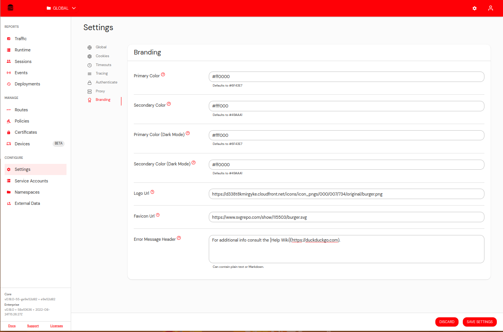

You can see the link added to the Error Page.

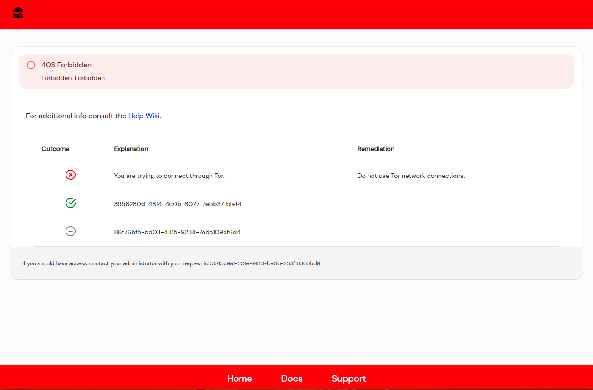
