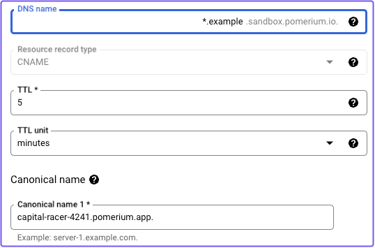
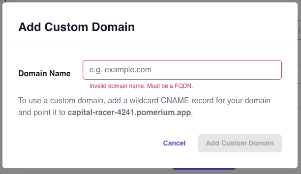
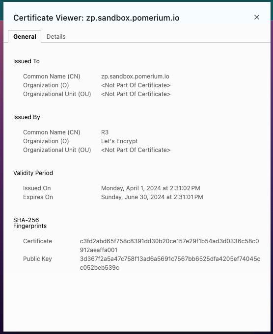
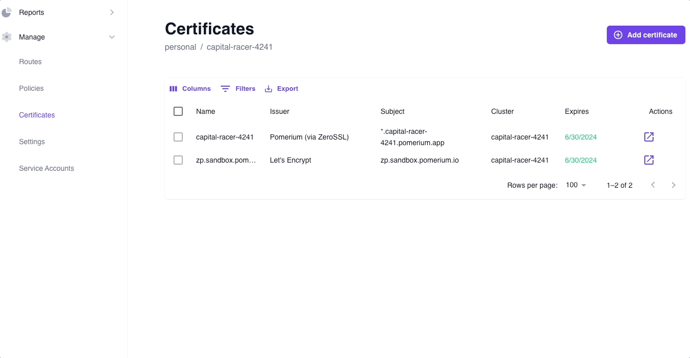

---
# cSpell:ignore mycorp
id: custom-domains
title: Custom Domains
sidebar_label: Custom Domains
description: The Custom Domains page teaches you how to add your own domain in Pomerium Zero and how to use it to build routes to your services.
---

# Custom Domains in Pomerium Zero

<iframe
  width="100%"
  height="500"
  src="https://fast.wistia.com/embed/iframe/twp82swgeo"
  title="YouTube video player"
  frameborder="0"
  allow="accelerometer; autoplay; clipboard-write; encrypted-media; gyroscope; picture-in-picture; web-share"
  referrerpolicy="strict-origin-when-cross-origin"
  allowfullscreen></iframe>

This document describes **Custom Domains** in Pomerium Zero.

## Overview

When you deploy a cluster in Pomerium Zero, we provision a randomly generated starter subdomain under `pomerium.app` that's assigned to that cluster (for example, `unique-jellyfish-3578.pomerium.app`).

Each starter subdomain comes with its own DNS records and TLS certificates, which makes it easier for new users to quickly build and test routes and policies in Pomerium Zero.

After testing Pomerium Zero with your starter domain, you'll likely want to start using your own domain name. To use your own domain name with Pomerium Zero, you'll need to:

- add a DNS record for that domain name, so that it resolves to the IP address of your Pomerium cluster
- upload a TLS certificate for that domain name (and periodically renew and re-upload this certificate)

The **Custom Domains** feature helps simplify these steps.

:::info

See the [**Clusters Concepts**](/docs/concepts/clusters) page for more information about clusters in Pomerium Zero.

:::

## Custom Domains

In Pomerium Zero, a **Custom Domain** is a wildcard subdomain you can use to build routes in Pomerium. After adding the appropriate record to your DNS provider, Pomerium will automatically provision and renew a TLS certificate for this subdomain.

For example, if you added a custom domain like `mycorp.example.com` to Pomerium Zero, you could build routes like:

- `verify.mycorp.example.com`
- `internal-tool.mycorp.example.com`
- `authenticate.mycorp.example.com`

## How to add a custom domain

Add a **wildcard CNAME record** that points to your starter domain. For example:

```bash
*.mycorp.example.com CNAME unique-jellyfish-3578.pomerium.app
```

If you're using a DNS provider like Google's Cloud DNS, you can add the wildcard CNAME record without code:



Add the custom domain in **Cluster Settings > Domains**:

1. Select **Settings**
1. In the **Editing Clusters Settings** dashboard, select **Domains**
1. In the **Custom Domains** field, select the **+** icon to add a domain name
1. Enter your custom domain



If added successfully, you will be able to build routes with your custom domain instead of the starter domain. Pomerium will automatically provision and renew TLS certificates for this custom domain, which you can verify by the Common Name found in the certificate:



You can also review the certificate in the **Certificates** dashboard:



### How custom domains work

In order for Pomerium to provision certificates on behalf of a custom domain, you must prove that you control the domain name specified in the certificate through DNS validation. Per the [ACME protocol](https://datatracker.ietf.org/doc/html/rfc8555#section-2), Pomerium uses its own ACME client to communicate with Let's Encrypt, a free Certificate Authority, to validate a domain's DNS records.

Let's Encrypt provides several [challenge types](https://letsencrypt.org/docs/challenge-types/) to validate a domain, including the [DNS-01 challenge](https://letsencrypt.org/docs/challenge-types/#dns-01-challenge). At a high level, this challenge requires that either:

- A `TXT` record must be placed at `_acme-challenge.<YOUR_DOMAIN>`
- Or, a `CNAME` record must be placed at `_acme-challenge.<YOUR_DOMAIN>` that points to another domain with the `TXT` record

Because Pomerium owns the `pomerium.app` subdomain, we can write the `TXT` record for you. All you need to do is point a wildcard CNAME record to your cluster's starter domain.
