import ManageDevices from '../reference/_manage-devices.md';
import NewEnrollment from '../reference/_new-enrollment.md';

:::tip

This article describes a use case available to [Pomerium Enterprise](/docs/releases/enterprise/install/index.md) customers.

:::

## Overview

One of the core components of the zero trust security model is **device identity**, which is the ability for a device to have a unique, unclonable identity string that can be authenticated and factored into access control decisions. This topic page covers the concept of device identity, and how it applies to the zero trust model.

<iframe
  width="100%"
  height="500"
  src="https://www.youtube.com/embed/aJzgnaXEpLo?rel=0"
  frameBorder="0"
  allow="accelerometer; clipboard-write; encrypted-media; gyroscope; picture-in-picture"
  allowFullScreen
/>

## Implement Device Identity with Pomerium

Pomerium supports policies that use device identity since version [0.16.0](/docs/releases/upgrading#policy-for-device-identity). We use the [Web Authentication][webauthn-api] (**WebAuthN**) API to bring authentication and authorization based on device identity into your security framework. Pomerium's device identity support enables users to register their devices, and administrators to enforce access to applications and services to a particular set of trusted devices.

To get started, review the following pages:

- [Pomerium Policy Language](/docs/capabilities/ppl) to learn how to build policies that use device ID.
- **End Users** should review [Enroll a Device](/docs/capabilities/device-identity) to learn how to enroll devices on Pomerium. In Enterprise environments, self-enrollments must be approved by an admin in the Enterprise Console.
- **Enterprise Administrators** can review the [Devices](/docs/capabilities/authorization#manage-devices) reference material to create pre-approved enrollment links for users.
- [pomerium/webauthn](https://github.com/pomerium/webauthn) on GitHub, our implementation of the WebAuthn specification.

### New Enrollment

<NewEnrollment />

#### Search Users

New Enrollment URLs are only valid for the specified user.

#### Redirect URL

**Optional**: The URL the user will be taken to after device enrollment is successful.

#### Enrollment Type

Specify if the user can enroll any device identity, or restrict it to a [secure enclave](/docs/concepts/device-identity#secure-enclaves).

## User Initiated Device Enrollment

If a Pomerium route is configured to [require device authentication](/docs/capabilities/ppl#device-matcher), then the user must register a [trusted execution environment](/docs/concepts/device-identity#authenticated-device-types) (**TEE**) device before accessing the route. Registration is easy, but different depending on the device being used to provide ID.

This guide covers enrollment of a device by a user. This is available for both open-source Pomerium and [Pomerium Enterprise](/docs/releases/enterprise/install/index.md) installations. However, Enterprise users may also receive registration links [generated by their administrators](/docs/capabilities/device-identity), which will mark the newly enrolled device as approved in the Pomerium Enterprise Console.

1.  Users are prompted to register a new device when accessing a route that requires device authentication:

    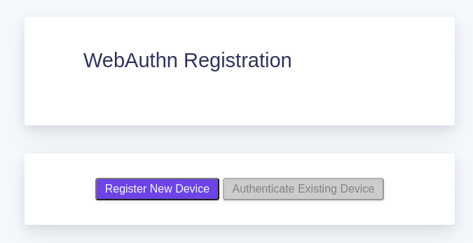

    Users can also get to the registration page from the special `.pomerium` endpoint available on any route, at the bottom of the page:

    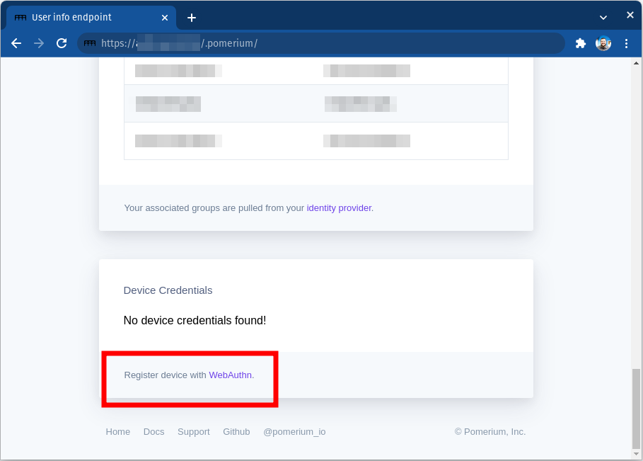

1.  Click on **Register New Device**. Your browser will prompt you to provide access to a device. This will look different depending on the browser, operating system, and device type:

    <Tabs>

    <TabItem value="Windows"  label="Windows">

    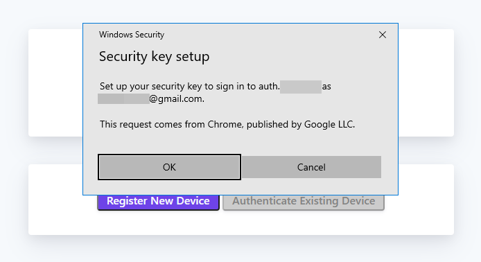

    </TabItem>

    <TabItem value="Chrome"  label="Chrome">

    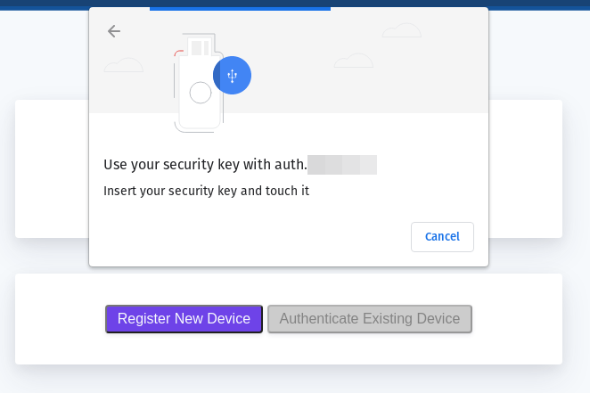

    </TabItem>

    <TabItem value="Firefox"  label="Firefox">

    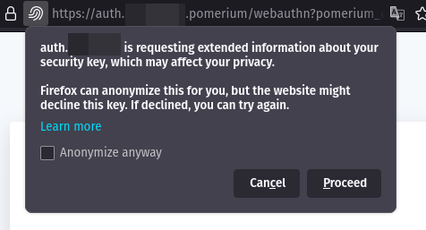

    </TabItem>

    <TabItem value="ChromeOS"  label="ChromeOS">

    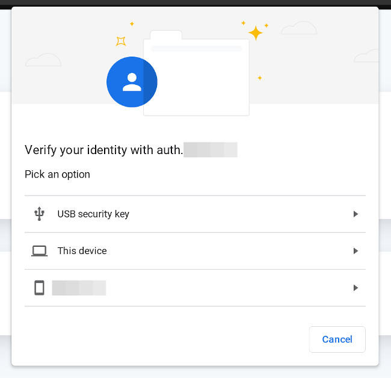

    </TabItem>

    </Tabs>

## Find Device ID

If a route's policy is configured to only allow specific device IDs you will see a 450 error even after registering:

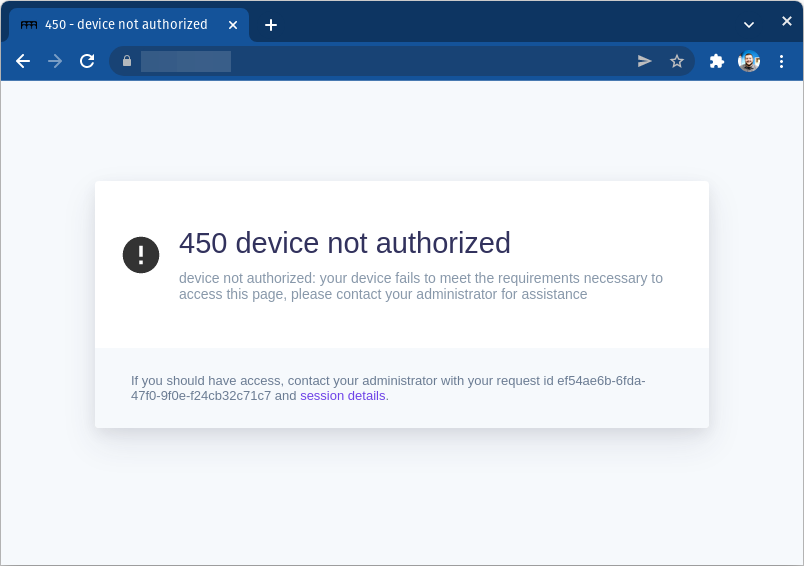

From the `.pomerium` endpoint you can copy your device ID to provide to your Pomerium administrator.

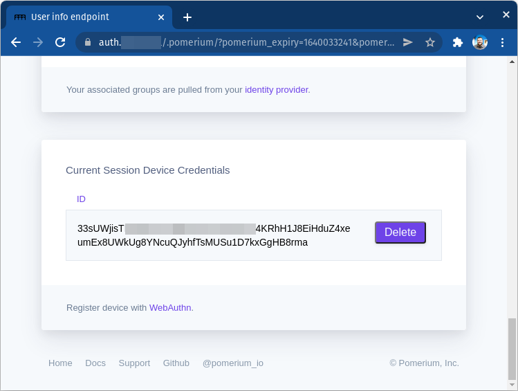

From here you can also delete the ID for devices that should no longer be associated with your account.

## Admin Initiated (Pre-Approved) Device Enrollment

If a Pomerium route is configured to [require device authentication](/docs/capabilities/ppl#device-matcher), then the user must register a [trusted execution environment](/docs/concepts/device-identity#authenticated-device-types) (**TEE**) device before accessing the route. In Enterprise environments, policies can require that devices be approved in the Pomerium Enterprise Console.

To make the management of approved devices easier, the Enterprise Console lets administrators create registration links that will allow users to register devices as pre-approved, following the [**TOFU**](https://en.wikipedia.org/wiki/Trust_on_first_use) authentication scheme.

This guide instructs Pomerium Enterprise admins on how to create user-specific enrollment links.

### Before You Begin

- This guide is written for [Pomerium Enterprise](/docs/releases/enterprise/install/index.md) environments,
- You must have the [Admin](/docs/concepts/namespacing#admin) role in the Enterprise Console to perform these steps.

### Create an Enrollment Link

1. From the Pomerium Enterprise Console, select **Devices** from the left-hand menu.

1. Click the **+ NEW ENROLLMENT** button at the top:

   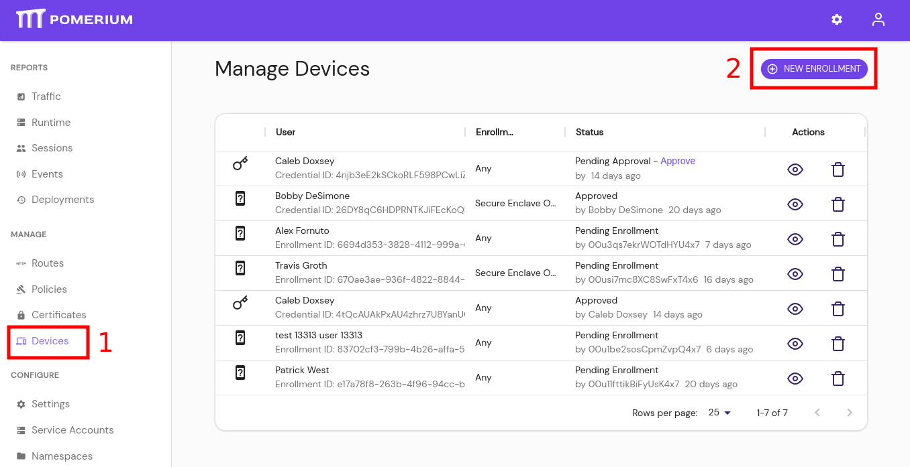

1. From the **New Enrollment** modal:

   - search for and select the user this URL will be valid for,
   - optionally provide a URL for the user to be redirected to after a successful enrollment,
   - define if the user can enroll any [trusted execution environment](/docs/internals/glossary#trusted-execution-environment), or restrict the user to [secure enclaves](/docs/internals/glossary#secure-enclave): 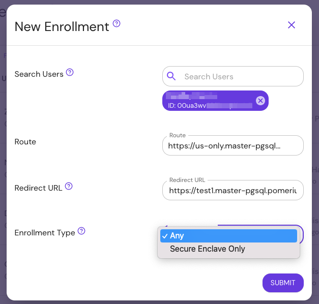

1. Click **Submit** to get the URL:

   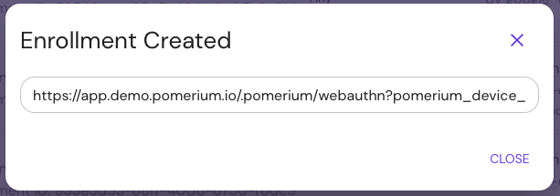

   Provide the URL to the user.

[route-concept]: /docs/concepts/routes
[route-reference]: /docs/concepts/routes
[namespace-concept]: /docs/concepts/namespacing
[namespace-reference]: /docs/concepts/namespacing
[service-accounts-concept]: /docs/concepts/service-accounts
[policy-reference]: /docs/concepts/policies
[route-concept]: /docs/concepts/routes
[route-reference]: /docs/concepts/routes
[namespace-concept]: /docs/concepts/namespacing
[namespace-reference]: /docs/concepts/namespacing
[service-accounts-concept]: /docs/concepts/service-accounts
[policy-reference]: /docs/concepts/policies
[android-keystore]: https://source.android.com/security/keystore
[apple-enclave]: https://support.apple.com/guide/security/secure-enclave-sec59b0b31ff/web
[apple-passkeys]: https://developer.apple.com/documentation/authenticationservices/public-private_key_authentication/supporting_passkeys
[fido-spec]: https://fidoalliance.org/specifications/
[secure enclaves and cross-platform security keys]: https://developers.yubico.com/WebAuthn/WebAuthn_Developer_Guide/Platform_vs_Cross-Platform.html
[the perimeter]: https://www.microsoft.com/security/blog/2019/10/23/perimeter-based-network-defense-transform-zero-trust-model/
[toms-hardware-tpm]: https://www.tomshardware.com/reviews/tpm-trusted-platform-module-header,5766.html
[verge-tpm]: https://www.theverge.com/2021/6/25/22550376/microsoft-windows-11-tpm-chips-requirement-security
[webauthn-api]: https://www.w3.org/TR/webauthn-2/#registration-extension
[yubikey-products]: https://www.yubico.com/products/
