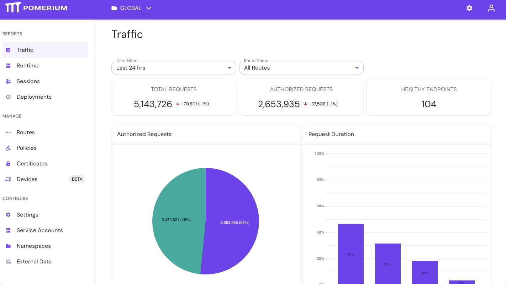
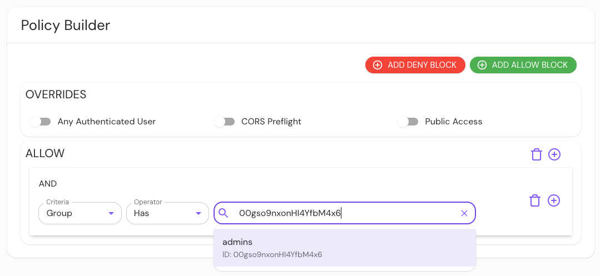

# Directory Sync

**Directory Sync** is the process of synchronizing external directory data from your identity provider into the Enterprise Console. This document discusses how directory sync works in Pomerium and its use cases.

:::enterprise

**Directory Sync** is a Pomerium Enterprise feature. [Contact us](https://www.pomerium.com/enterprise-sales/) to upgrade today.

:::

## Directory sync in the Enterprise Console

To start a directory sync in the Enterprise Console:

1. Go to the **Identity Providers** tab
1. Select your **Identity Provider**
1. Next to [**IDP Options**](#idp-options), fill out the required fields
1. In the [**Polling Min Delay**](#monitor-directory-sync) and [**Polling Max Delay**](#monitor-directory-sync) fields, enter the appropriate durations
1. Select **SAVE SETTINGS** 

Once you save your settings, it may take awhile for the sync to complete. Go to [**Monitor directory sync**](#monitor-directory-sync) for more information.

### Monitor directory sync

The Enterprise Console polls the identity provider data source based on the durations defined in the **Polling Min Delay** and **Polling Max Delay** fields.

See [**Identity Provider Min/Max Delay**](/docs/reference/identity-provider-settings#identity-provider-polling-minmax-delay) for more information on how to monitor directory sync.

### IDP Options

The requirements and instructions for directory sync vary depending on the identity provider. You can view the **IDP Options** for an identity provider in the Enterprise Console, or refer to the relevant identity provider guide for vendor-specific steps:

- [Auth0](/docs/identity-providers/auth0)
- [Cognito](/docs/identity-providers/cognito)
- [Microsoft Entra ID (Azure AD)](/docs/identity-providers/azure)
- [GitHub](/docs/identity-providers/github)
- [GitLab](/docs/identity-providers/gitlab)
- [Google](/docs/identity-providers/google)
- [Okta](/docs/identity-providers/okta)
- [OneLogin](/docs/identity-providers/one-login)
- [Ping](/docs/identity-providers/ping)

## How to use directory sync

After a successful sync, directory data sourced from your identity provider will be available in the Enterprise Console. You can use this data as context in your authorization policies to control which users and groups can access upstream applications and services:

