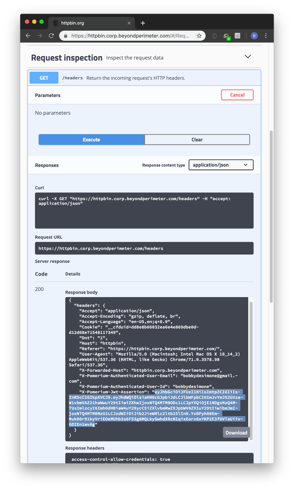

---
# cSpell:ignore ecparam genkey noout pubout secp256r1 QCN7adG2AmIK3UdHJvVJkldsUc6XeBRz83Z4rXX8Va4 ary66nrvA55TpaiWADq8b3O1CYIbvjqIHpXCY

title: Identity Verification
description: This article describes how to to get and cryptographically verify a user's identity with Pomerium.
sidebar_label: Identity Verification
---

import GoApp from '../../examples/go-sdk/go-app.md';
import ReactApp from '../../examples/js-sdk/react-app.md';

# Identity Verification (from your app)

This article describes how to retrieve a user's identity from a Pomerium-managed application. Pomerium uses JSON web tokens (**[JWT]**) to attest that a given request was handled by Pomerium's authorization service.

## Prerequisites

To secure your app with signed headers, you'll need the following:

- An application you want users to connect to.
- A [JWT library] with support for the `ES256` signing algorithm.

## JWT data

When the [Pass Identity Headers] route option is enabled, the user's associated identity information will be included in a signed attestation JWT. This JWT is added to each upstream request in the header `X-Pomerium-Jwt-Assertion`. The signed attestation JWT is also available at the special `/.pomerium/jwt` endpoint of any URL handled by Pomerium.

The JWT will contain at least the following claims:

| claim | description |
| :-: | --- |
| `exp` | Expiration time in seconds since the UNIX epoch. |
| `iat` | Issued-at time in seconds since the UNIX epoch. |
| `aud` | The domain for the upstream application (e.g. `httpbin.corp.example.com`). |
| `iss` | Same as the `aud` claim. |
| `sub` | The user's ID, as specified by the identity provider. |
| `email` | The user's email address. |
| `groups` | The user's group memberships (if supported for the identity provider). |

<details>
  <summary>Audience and issuer claims</summary>
  <div>

The audience (`aud`) claim defines what application the JWT is intended for. Pomerium sets the audience claim to be the domain of the target upstream application.

Since version 0.22, Pomerium sets the issuer (`iss`) claim also to the domain of the target upstream application. (In previous versions, this was instead set to the authentication service domain.)

Upstream services should verify that these claims match the expected domain in order to prevent token reuse between different upstream services.

  </div>
</details>

If your identity provider (IdP) provides other claims that you would like to pass to your application, you can use the [JWT Claims Headers](/docs/reference/jwt-claim-headers) option to include them in the JWT as well.

## JWT verification

Before trusting any user identity information in the JWT, your application should verify:

1. The JWT has a valid signature from a trusted source.
2. The JWT has not expired.
3. The JWT audience and issuer match your application's domain.

The attestation JWT's signature can be verified using the public key retrieved from Pomerium's `/.well-known/pomerium/jwks.json` endpoint (on any route domain). For example:

```bash
curl https://your-app.corp.example.com/.well-known/pomerium/jwks.json | jq
```

```json
{
  "keys": [
    {
      "use": "sig",
      "kty": "EC",
      "kid": "ccc5bc9d835ff3c8f7075ed4a7510159cf440fd7bf7b517b5caeb1fa419ee6a1",
      "crv": "P-256",
      "alg": "ES256",
      "x": "QCN7adG2AmIK3UdHJvVJkldsUc6XeBRz83Z4rXX8Va4",
      "y": "PI95b-ary66nrvA55TpaiWADq8b3O1CYIbvjqIHpXCY"
    }
  ]
}
```

(This endpoint can also be used to integrate with other systems, such as [Istio](https://istio.io/). For example, see the Istio guide on [Authentication Policy](https://istio.io/latest/docs/reference/config/security/jwt/#JWTRule-jwks_uri), and specifically the [`jwksUri`](https://istio.io/latest/docs/reference/config/security/jwt/#JWTRule-jwks_uri) key on the `jwtRules` mapping.)

:::caution

In order to use the `/.well-known/pomerium/jwks.json` endpoint you must set either the [Signing Key] or [Signing Key File] configuration option.

:::

After verifying the JWT signature, your application should verify that JWT has not expired, by comparing the current time with the timestamps in the `exp` and `iat` claims. We recommend allowing up to 1 minute leeway in this comparison, to account for clock skew between Pomerium and your application.

And finally, your application should verify that the `aud` and `iss` claim both match the domain used to serve your application.

### Verification in a Go application

For an application written in Go, you can use the [Go SDK] to perform the necessary verification steps. For example:

<GoApp />

### Verification in a Single-Page Application

A single-page javascript application can verify the JWT using the [JavaScript SDK]. For example:

<ReactApp />

See the [JavaScript SDK guide](/docs/guides/js-sdk) for more information.

### Manual verification

Though you will likely verify signed headers programmatically in your application's middleware with a third-party JWT library, if you are new to JWT it may be helpful to show what manual verification looks like.

1. Provide Pomerium with a base64-encoded Elliptic Curve ([NIST P-256] aka [secp256r1] aka prime256v1) Private Key. In production, you'd likely want to get these from your key management service (KMS).

   ```bash
   openssl ecparam -genkey -name prime256v1 -noout -out ec_private.pem
   openssl ec -in ec_private.pem -pubout -out ec_public.pem
   # careful! this will output your private key in terminal
   cat ec_private.pem | base64
   ```

   Copy the base64 encoded value of your private key to Pomerium's environmental configuration variable `SIGNING_KEY`.

   ```bash
   SIGNING_KEY=LS0tLS1CRUdJTiBQUklWQVRFIEtFWS0tLS0tCk1JR0hBZ0VBTUJNR0J5cUdTTTQ5QWdFR0NDcUdTTTQ5QXdFSEJHMHdhd0lCQVFRZzBQdk1VeVZGeWxTbGZ3eDgKSDBxMUVyOHZlOXBnY3ZzNkV6ZnR5OHlxNnFLaFJBTkNBQVM5ZC96TC9aSXd5ZGQ1RXZMb0xGMytHblVIUS9wdQpQaU45NDV1Y1RpTFRqMDhZalo3U0NJV2JHc2tiK0RIMzJ2aUc2KzRnb0FvWlFUM1R6b2kzRVl6OAotLS0tLUVORCBQUklWQVRFIEtFWS0tLS0tCg==
   ```

1. Reload Pomerium. Navigate to httpbin (by default, `https://httpbin.corp.${YOUR-DOMAIN}.com`), and log in as usual. Click **request inspection**. Select `/headers`. Click **try it out** and then **execute**. You should see something like the following.

   

1. `X-Pomerium-Jwt-Assertion` is the signature value. It's less scary than it looks and basically just a compressed, json blob as described above. Navigate to [jwt.io] which provides a helpful GUI to manually verify JWT values.

1. Paste the value of `X-Pomerium-Jwt-Assertion` header token into the `Encoded` form. You should notice that the decoded values look much more familiar.

   

1. Finally, we want to cryptographically verify the validity of the token. To do this, we will need the signer's public key. You can simply copy and past the output of `cat ec_public.pem`.

   

**Voila!** Hopefully walking through a manual verification has helped give you a better feel for how signed JWT tokens are used as a secondary validation mechanism in pomerium.

:::caution

In an actual client, you'll want to ensure that all the other claims values are valid (like expiration, issuer, audience and so on) in the context of your application. You'll also want to make sure you have a safe and reliable mechanism for distributing the public signing key to client apps (typically, a [key management service]).

:::

[go sdk]: https://github.com/pomerium/sdk-go
[jwt]: https://jwt.io/introduction/
[javascript sdk]: https://github.com/pomerium/js-sdk
[jwt library]: https://jwt.io/libraries
[jwt.io]: https://jwt.io/
[key management service]: https://en.wikipedia.org/wiki/Key_management
[nist p-256]: https://csrc.nist.gov/csrc/media/events/workshop-on-elliptic-curve-cryptography-standards/documents/papers/session6-adalier-mehmet.pdf
[pass identity headers]: /docs/reference/routes/pass-identity-headers
[secp256r1]: https://wiki.openssl.org/index.php/Command_Line_Elliptic_Curve_Operations
[signing key]: /docs/reference/signing-key
[signing key file]: /docs/reference/signing-key-file
