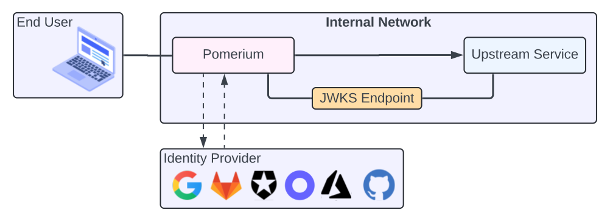

---
# cSpell:ignore ecparam genkey noout pubout secp256r1 QCN7adG2AmIK3UdHJvVJkldsUc6XeBRz83Z4rXX8Va4 ary66nrvA55TpaiWADq8b3O1CYIbvjqIHpXCY envoyproxy Jklds Tpai Ibvjq Lamda

title: Continuous Identity Verification at the Application Layer
description: Learn how Pomerium uses JWTs for identity and context verification, how it fits into a zero trust environment, and four ways to validate the JWT in your upstream service.
sidebar_label: Continuous Identity Verification
keywords:
  - jwt
  - jwt authentication
  - sso
  - single sign-on
  - identity verification
  - request verification
  - pomerium
  - zero trust
  - pass identity headers
  - jwks
  - envoy
  - go
  - node
  - sidecar
---

import Tabs from '@theme/Tabs';
import TabItem from '@theme/TabItem';
import GoApp from '/content/examples/go-sdk/go-app.md';
import ExpressApp from '/content/examples/js-sdk/express-server.md';

<iframe
  width="100%"
  height="600"
  src="https://www.youtube.com/embed/mc9USXDiCmk"
  title="YouTube video player"
  frameborder="0"
  allow="accelerometer; autoplay; clipboard-write; encrypted-media; gyroscope; picture-in-picture; web-share"
  allowfullscreen></iframe>

Pomerium uses JSON Web Tokens (JWTs) to help your upstream services verify a user's identity and additional context (like group membership) at the **application layer**. In a zero trust environment, verifying that **both** the client and server are who they say they are is crucial. Pomerium handles user authentication, then mints a **signed JWT** for every verified and authorized request.

By validating that JWT, your application or service confirms:

- The request came from Pomerium (a trusted policy enforcement point).
- The user's identity is legitimate and authorized, according to policy.
- The JWT is specifically intended for the service (not some other application).

This article explains **why** identity & context verification at the application layer is important, **how** JWT-based verification works, and **four different approaches** you can use to verify JWTs:

1. **Manually** (to understand the process)
2. **3rd-party app** with built-in JWT support (like Grafana)
3. **Custom application** (using an existing JWT library or Pomerium's SDK)
4. **Sidecar** (no code changes, e.g. Envoy proxy)

## JWT Authentication Flow



1. **User authenticates** Pomerium redirects the user to your OIDC-compliant identity provider (IdP).
2. **Pomerium issues a signed JWT** After the user is authenticated, Pomerium mints a **new** JWT.
3. **JWT assertion header** The JWT goes in the `X-Pomerium-Jwt-Assertion` header, following [RFC7519](https://datatracker.ietf.org/doc/html/rfc7519) encoding.
4. **Upstream service verifies** Your application (or a helper process) confirms the JWT's signature, audience, issuer, and timestamps.

If everything checks out, your service can trust the identity data in the token for additional authorization or logging.

## Why JWT-Based Verification?

- **Zero Trust**: Enforces that _every_ request is from a legitimate, authenticated user.
- **Application Layer**: Even if TLS terminates at Pomerium, the downstream service can verify the request is valid.
- **Single Sign-On**: A single IdP login flows downstream. Your app can read the user's email, groups, etc., from the JWT.
- **Local Validation**: JWTs are stateless. After an initial login, your service doesn't need to call the IdP again; it simply verifies the token signature.

## JWT Details

A Pomerium-issued JWT typically has standard fields plus additional claims:

- **`exp`** (expiration), **`iat`** (issued-at), **`sub`** (user ID), **`aud`**, **`iss`**
- **`email`** (from IdP), **`groups`** (if available), **`name`** (if provided)

The **original** ID token from your IdP is never forwarded. Instead, Pomerium reissues a fresh token under its own signing key.

## Verifying a JWT

Your upstream must ensure:

1. **Signature**: The JWT was signed by Pomerium's private key.
2. **Audience & Issuer**: `aud` and `iss` match your service domain.
3. **Expiration**: The token is still valid (`exp` > now).

### Fetch the Public Key (JWKS)

Your upstream can automatically fetch Pomerium's public key:

```bash
curl https://<YOUR-SERVICE-DOMAIN>/.well-known/pomerium/jwks.json \
  -H 'Accept: application/json'
```

Pick the key matching the `kid` claim in the JWT header to verify its signature.

## Four Approaches to JWT Validation

### 1. Manual Verification

Useful for learning or debugging:

1. **Provide Pomerium a private key**:
   ```bash
   openssl ecparam -genkey -name prime256v1 -noout -out ec_private.pem
   openssl ec -in ec_private.pem -pubout -out ec_public.pem
   cat ec_private.pem | base64  # copy to SIGNING_KEY in Pomerium config
   ```
2. **Inspect the header** (`X-Pomerium-Jwt-Assertion`) in a request after you've logged in.
3. **Decode** the token on a site like [jwt.io](https://jwt.io/) or a local JWT decoder library.
4. **Paste** your `ec_public.pem` into the decoder's “verify signature” field. If it's valid, the user claims are genuine.

:::info Example Screenshots

If you use `httpbin` to inspect headers, you might see:


Decoded, you'll see the claims:


After adding your public key, you should see a verified signature:


:::

### 2. 3rd-Party App with Built-In JWT Support

Many modern platforms (for example, **Grafana**) allow you to configure JWT-based SSO. Once you enable JWT authentication in Grafana (and point it to Pomerium's JWKS endpoint), all inbound requests with a valid `X-Pomerium-Jwt-Assertion` token are accepted for user identity. Grafana (or your chosen app) sees the user's email, groups, etc., and can apply its own RBAC logic.

For a real-world example, see our [Grafana](/docs/guides/grafana) guide.

### 3. Custom Application (JWT Libraries or Pomerium SDK)

If you're building a custom in-house app, you can parse and validate the JWT using a standard library or one of Pomerium's SDKs:

**Go Example**

<GoApp />

**Node/JS Example**

<ExpressApp />

Your application:

1. Extracts the token from the `X-Pomerium-Jwt-Assertion` header.
2. Uses a JWT library (or Pomerium's SDK) to verify the signature via the JWKS URL.
3. Confirms `aud`, `iss`, and `exp`.
4. Trusts the user claims (like `email`, `groups`, etc.) if valid.

**Tip:** In Pomerium's JS SDK, if you don't specify `issuer` and `audience`, it applies trust-on-first-use (TOFU) logic. We recommend explicitly setting these in production.

### 4. Sidecar (Envoy)

If you can't modify your app's code, run a [Envoy](https://www.envoyproxy.io/) sidecar to check JWTs before requests reach the app. Envoy's [JWT Authn filter](https://www.envoyproxy.io/docs/envoy/latest/configuration/http/http_filters/jwt_authn_filter) automatically retrieves Pomerium's JWKS and enforces valid tokens.

```yaml
http_filters:
  - name: envoy.filters.http.jwt_authn
    typed_config:
      '@type': type.googleapis.com/envoy.extensions.filters.http.jwt_authn.v3.JwtAuthentication
      providers:
        pomerium:
          issuer: myapp.localhost.pomerium.io
          audiences:
            - myapp.localhost.pomerium.io
          from_headers:
            - name: X-Pomerium-Jwt-Assertion
          remote_jwks:
            http_uri:
              uri: https://myapp.localhost.pomerium.io/.well-known/pomerium/jwks.json
              cluster: egress-authenticate
              timeout: 1s
      rules:
        - match:
            prefix: /
          requires:
            provider_name: pomerium
```

With a sidecar, your main application doesn't need to be JWT-aware. Envoy rejects bad tokens and only forwards valid requests.

## Conclusion

JWT-based identity & context verification lets your upstream service confirm each request is coming from a trusted policy enforcement point (Pomerium) and that the user's identity is valid. You can choose whichever approach fits best:

- **Manual** for debugging or demonstration.
- **3rd-Party app** if it already supports JWT.
- **Custom app** with libraries or Pomerium's SDK.
- **Sidecar** if you can't modify your code.

Regardless of approach, the result is the same: a zero trust environment where your application is confident every incoming request is from a legitimate user, with valid identity claims. Once verified, you can apply your own additional rules (RBAC, logging, or anything else that uses user context) without re-checking the IdP.
