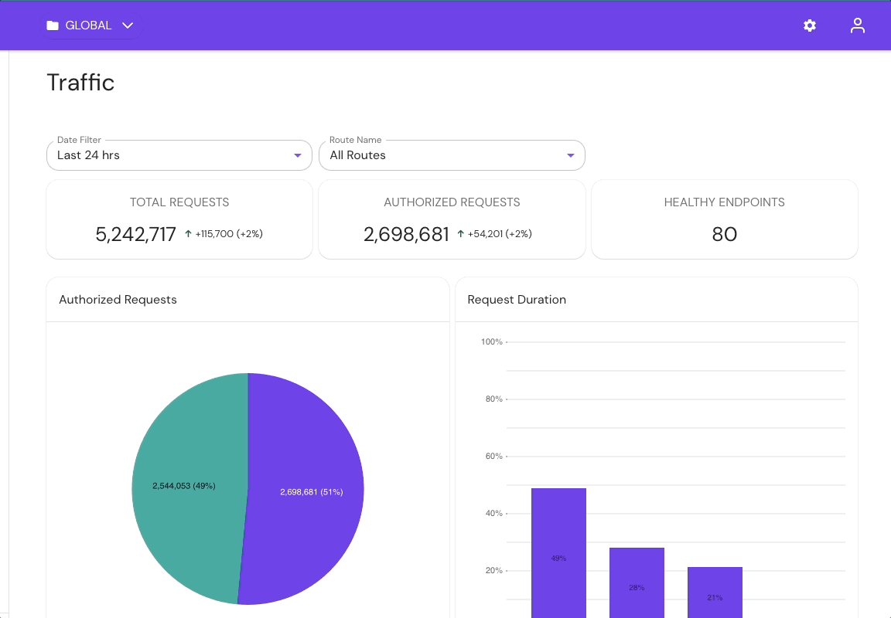
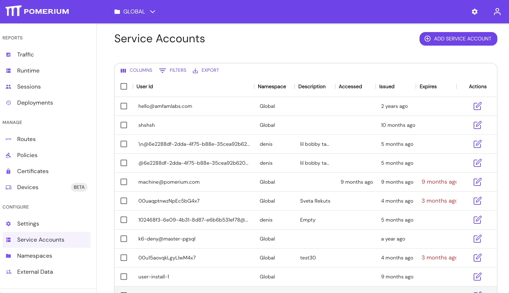
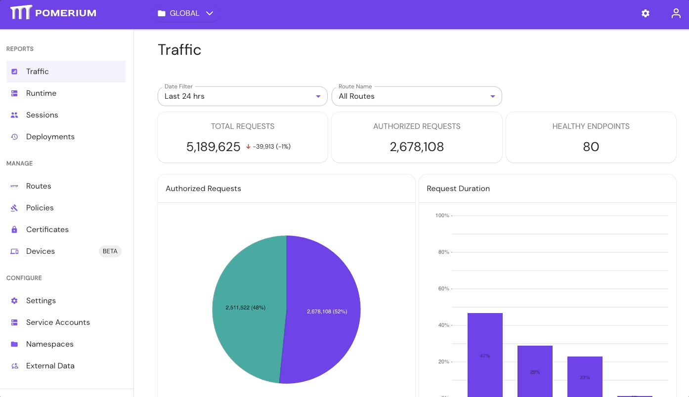

# User Impersonation

User impersonation allows administrators to temporarily sign in to Pomerium as another user or group within an organization. The impersonating user is subject to the access and authorization policies of the impersonated user.

## Why impersonate a user?

In certain circumstances, it's useful for an administrative user to impersonate another user, like:

- **Troubleshooting errors**. If you configured downstream authorization policies differently for certain users, it's possible that your UI will look different from the user subjected to that policy. Impersonating the other user allows you to see what they see so you can reproduce errors.
- **Making changes for an absent user**. For example, if a user is out of office, you could impersonate them to make changes for them while they're away.
- **Testing policies, routes, or other settings**. For example, as an admin, you can build authorization polices and test them out as another user to preview what other users will see depending on the permissions you grant them.

## How to impersonate a user

You can impersonate a user by using the Console GUI or creating a Service Account.

### Impersonate a user in the Console

1. In your Console, select the **Logout** icon
1. Select **Impersonate**
1. In the **Session** dropdown, select the user you want to impersonate
1. Select **Impersonate**

When you're finished impersonating the user, select **Unimpersonate**.

### Impersonate a user with a Service Account

**Create a service account**:

:::note

Before you begin, confirm you are in the correct **Namespace**. A service account can only be used in the **Namespace** it was created in, including its children Namespaces.

:::

1. Go to **Service Accounts**
1. Select **Add Service Account**
1. Select **User ID**, enter an optional **Description**, and set the expiration time
1. Save the Service Token JWT

**Add the Service Account to a policy**:

1. Go to **Policies** > **NEW POLICY**
1. In the **Builder** tab, select **ADD ALLOW BLOCK**
1. In the **Criteria** field, select **User**
1. In the **Search Users** field, select the Service Account

Now, you can apply the policy to a route and access it using any of the following header schemes:

- `Authorization: Bearer Pomerium-${pomerium_jwt}`
- `X-Pomerium-Authorization: ${pomerium_jwt}`
- `Authorization: Pomerium ${pomerium_jwt}`
