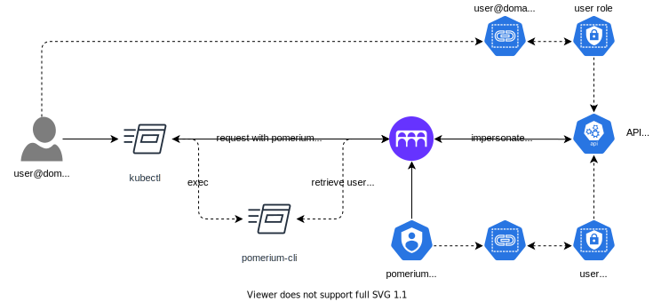

---
# cSpell:ignore kubeconfig mycluster

title: Kubernetes `kubectl` Integration
sidebar_label: Kubernetes Access
description: This article describes Pomerium's integration with the Kubernetes API Server
---

# Kubernetes Access

## Background

Kubernetes supports [a variety](https://kubernetes.io/docs/reference/access-authn-authz/authentication/#authentication-strategies) of ways to perform authentication against the API Server. While there is tremendous flexibility in the core product, operators can encounter various practical challenges:

- Cloud providers typically support only their native IAM implementation, which may not integrate with your IdP
- OIDC providers may not provide group claims, requiring manual mappings to RBAC roles
- Your IdP may not be reachable by the kubernetes control plane
- Access is managed per cluster without central control
- Dynamic privilege escalation during incidents are slow or cumbersome RBAC changes
- VPN based protection may not be possible or desirable

Similarly, Kubernetes supports native [audit logging](https://kubernetes.io/docs/tasks/debug-application-cluster/audit/) capabilities, but can also run into practical challenges:

- Cloud provider deployments may be ecosystem locked with limited tooling, if any
- Cross-cluster and cross-service audit trails must be stitched together by the operator

## Solution

Pomerium can be leveraged as a proxy for user requests to the API Server.

- Any supported IdP can be supported for authentication, in any environment
- Group membership is supported consistently
- Centralized, dynamic, course grained access policy
- Global, cross resource access and audit trail
- API server protection without the operational challenges of VPN
- Can be hosted inside your kubernetes cluster!

## How it works



Building on top of a standard Kubernetes and Pomerium deployment:

1. Pomerium is given access to a Kubernetes service account with [impersonation](https://kubernetes.io/docs/reference/access-authn-authz/authentication/#user-impersonation) permissions
2. A [route's policy](/docs/reference/routes/policy) is created for the API server and [configured](/docs/reference/routes/kubernetes-service-account-token) to use the service account token
3. Kubernetes RoleBindings operate against IdP Users and Group subjects
4. Users access the protected cluster through their standard tools, using [pomerium-cli](/docs/deploy/core/clients/pomerium-cli) as an auth provider in `~/.kube/config`
5. Pomerium authorizes requests and passes the user identity to the API server for fine grained RBAC

## Kubeconfig Setup

After installing the [pomerium-cli](/docs/deploy/core/clients/pomerium-cli), you must configure your `kubeconfig` for authentication.

Substitute `mycluster.pomerium.io` with your own API Server's `from` in Pomerium's policy:

```shell
# Add Cluster
kubectl config set-cluster via-pomerium --server=https://mycluster.pomerium.io
# Add Context
kubectl config set-context via-pomerium --user=via-pomerium --cluster=via-pomerium
# Add credentials command
kubectl config set-credentials via-pomerium --exec-command=pomerium-cli \
  --exec-arg=k8s,exec-credential,https://mycluster.pomerium.io
```
