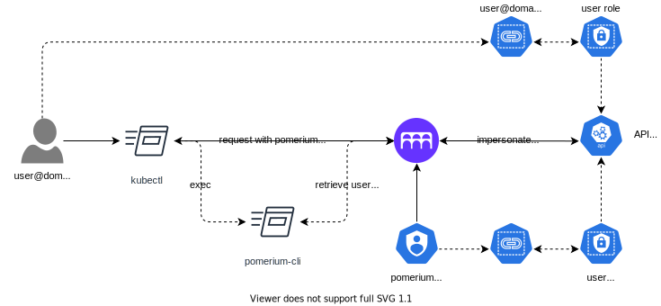
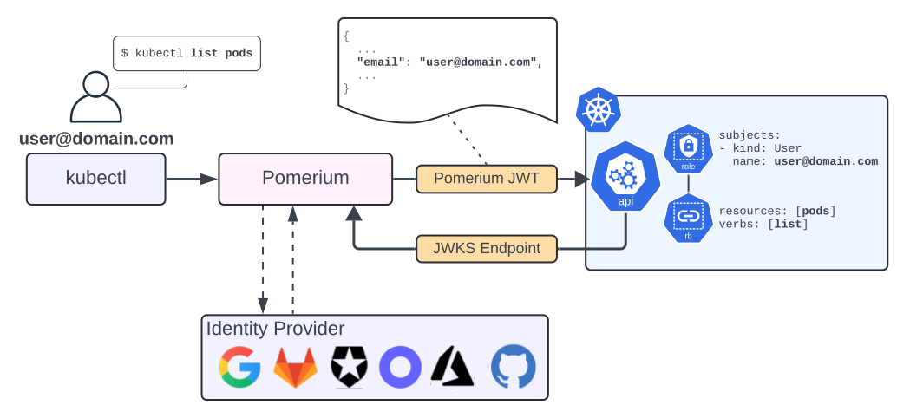

---
# cSpell:ignore kubeconfig mycluster

title: Kubernetes `kubectl` Integration
sidebar_label: Kubernetes Access Management
description: This article describes Pomerium's integration with the Kubernetes API Server
---

import Tabs from '@theme/Tabs';
import TabItem from '@theme/TabItem';
import CodeBlock from '@theme/CodeBlock';

# Kubernetes Access

## Background

Kubernetes supports [a variety](https://kubernetes.io/docs/reference/access-authn-authz/authentication/#authentication-strategies) of ways to perform authentication against the API Server. While there is tremendous flexibility in the core product, operators can encounter various practical challenges:

- Cloud providers typically support only their native IAM implementation, which may not integrate with your IdP
- OIDC providers may not provide group claims, requiring manual mappings to RBAC roles
- Your IdP may not be reachable by the kubernetes control plane
- Access is managed per cluster without central control
- Dynamic privilege escalation during incidents are slow or cumbersome RBAC changes
- VPN based protection may not be possible or desirable

Similarly, Kubernetes supports native [audit logging](https://kubernetes.io/docs/tasks/debug-application-cluster/audit/) capabilities, but can also run into practical challenges:

- Cloud provider deployments may be ecosystem locked with limited tooling, if any
- Cross-cluster and cross-service audit trails must be stitched together by the operator

## Solution

Pomerium can be leveraged as a proxy for user requests to the API Server.

- Any supported IdP can be supported for authentication, in any environment
- Group membership is supported consistently
- Centralized, dynamic, course grained access policy
- Global, cross resource access and audit trail
- API server protection without the operational challenges of VPN
- Can be hosted inside your kubernetes cluster!

## How it works

Pomerium supports two different methods of authenticating to the Kubernetes API server:

- **User Impersonation**
- **Pomerium JWT** (Kubernetes 1.30+)

See the comparison below for details on each method.

<Tabs groupId="auth-type">
<TabItem value="impersonation" label="User Impersonation">



Building on top of a standard Kubernetes and Pomerium deployment:

1. Pomerium is given access to a Kubernetes service account with [impersonation](https://kubernetes.io/docs/reference/access-authn-authz/authentication/#user-impersonation) permissions. The supported groups can be explicitly listed in the RBAC definition:

```yaml
apiVersion: rbac.authorization.k8s.io/v1
kind: ClusterRole
metadata:
  name: pomerium-impersonation
rules:
  - apiGroups:
      - ''
    resources:
      - users
    verbs:
      - impersonate
  - apiGroups:
      - ''
    resources:
      - groups
    verbs:
      - impersonate
    resourceNames:
      - group1
      - group2
      - group3
```

2. A [route's policy](/docs/reference/routes/policy) is created for the API server and [configured](/docs/reference/routes/kubernetes-service-account-token) to use the service account token
3. Kubernetes RoleBindings operate against IdP Users and Group subjects
4. Users access the protected cluster through their standard tools, using [pomerium-cli](/docs/clients/pomerium-cli) as an auth provider in `~/.kube/config`
5. Pomerium authorizes requests and passes the user identity to the API server for fine grained RBAC

</TabItem>

<TabItem value="jwt" label="Pomerium JWT">



With [Structured Authentication Configuration](https://kubernetes.io/docs/reference/access-authn-authz/authentication/#using-authentication-configuration), the Kubernetes API server can be configured to authenticate users using the [Pomerium JWT](/docs/capabilities/getting-users-identity) natively.

For self-hosted Kubernetes clusters, this is the recommended way to configure authentication. Cloud-hosted Kubernetes clusters may not allow configuring the API server.

### Route setup

1. In Pomerium, configure your route as follows, filling in your cluster's API server address and CA cert data (these fields can often be copied verbatim from an existing kubeconfig file).

```yaml title="config.yaml"
routes:
  - from: https://mycluster.localhost.pomerium.io
    to:
      - '' # API server address (e.g. https://x.x.x.x:6443)
    tls_custom_ca: '' # base64-encoded API server CA cert
    jwt_issuer_format: uri
    set_request_headers:
      Authorization: 'Bearer ${pomerium.jwt}'
```

2. Create a file with the following contents, then configure kube-apiserver to use this file with the flag <br/>`--authentication-config=/path/to/authentication_config.yaml`:

```yaml title="authentication_config.yaml"
apiVersion: apiserver.config.k8s.io/v1beta1
kind: AuthenticationConfiguration
jwt:
  - issuer:
      url: https://mycluster.localhost.pomerium.io/ # note: the trailing slash is required
      discoveryURL: https://mycluster.localhost.pomerium.io/.well-known/pomerium
      audiences:
        - mycluster.localhost.pomerium.io
    claimMappings:
      username:
        claim: email
        prefix: ''
```

Be sure to substitute `/path/to/authentication_config.yaml` with the actual path on the node where this config file is saved. The config file must be present on the host in each control-plane node.

### Tips:

- The [Structured Authentication Configuration](https://kubernetes.io/docs/reference/access-authn-authz/authentication/#using-authentication-configuration) has a lot of powerful built-in features that can be used to handle IDP-specific configuration.
- The `claimMappings` section can be used to customize the claims in the Pomerium JWT that Kubernetes will use to identify users. This can be helpful when using custom claims from your IDP.
- A non-empty `prefix` can be set (for example, `"pomerium:"`) to avoid potential user or group name collisions with built-in Kubernetes names.
- If you are using custom claims, configure [JWT Claims Headers](https://www.pomerium.com/docs/reference/jwt-claim-headers#summary) to add those claims to the Pomerium JWT.
- If configured correctly, you should see logs in Pomerium when the API server makes requests to the discovery URL and JWKS endpoints.
  ```json
  {
    "level": "info",
    "method": "GET",
    "path": "/.well-known/pomerium",
    "authority": "mycluster.localhost.pomerium.io",
    "response-code": 200,
    "message": "http-request",
    ...
  }
  ```

</TabItem>
</Tabs>

## Referencing Pomerium Users in Kubernetes RBAC

Once Pomerium is configured to authenticate users to your Kubernetes cluster, you can use standard RBAC roles and role bindings to assign permissions to those users.

By default, your user may not be able to perform any actions, and you might see errors like this:

```
$ kubectl get pods
Error from server (Forbidden): pods is forbidden: User "foo@example.com" cannot list resource "pods" in API group "" in the namespace "default"
```

`kubectl auth` can be used to see your user and group names as set by Pomerium, and check whether you have permissions for a specific action:

<CodeBlock>
$ kubectl auth whoami
ATTRIBUTE   VALUE
<span style={{fontWeight: 'bold'}}>Username    foo<></>@example.com</span>
Groups      [system:authenticated]

<span>$ kubectl auth can-i list pods</span><br/>
<span style={{fontWeight: 'bold'}}>no</span>
</CodeBlock>

Create a role and role binding targeting your username (here, `foo@example.com`) as follows:

```yaml
apiVersion: rbac.authorization.k8s.io/v1
kind: Role
metadata:
  name: example-role
rules:
  - apiGroups:
      - ''
    resources:
      - pods
    verbs:
      - get
      - list
      - watch
---
apiVersion: rbac.authorization.k8s.io/v1
kind: RoleBinding
metadata:
  name: example-role-binding
roleRef:
  apiGroup: rbac.authorization.k8s.io
  kind: Role
  name: example-role
subjects:
  - kind: User
    name: foo@example.com
```

Then, your user should be authorized:

<CodeBlock>
  <span>$ kubectl auth can-i list pods</span>
  <br />
  <span style={{fontWeight: 'bold'}}>yes</span>
</CodeBlock>

## Kubeconfig Setup

Edit your kubeconfig to use [pomerium-cli](/docs/clients/pomerium-cli) as a [credential plugin](https://kubernetes.io/docs/reference/access-authn-authz/authentication/#client-go-credential-plugins):

```yaml
apiVersion: v1
kind: Config
clusters:
  - cluster:
      server: https://mycluster.localhost.pomerium.io # Pomerium route URL
    name: mycluster
contexts:
  - context:
      cluster: mycluster
      user: via-pomerium
    name: mycluster
current-context: mycluster
users:
  - name: via-pomerium
    user:
      exec:
        apiVersion: client.authentication.k8s.io/v1beta1
        command: pomerium-cli
        args:
          - k8s
          - exec-credential
          - https://mycluster.localhost.pomerium.io # Pomerium route URL
```
