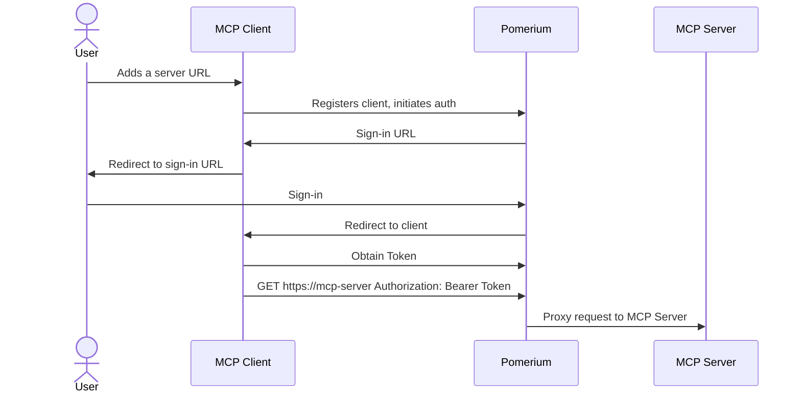
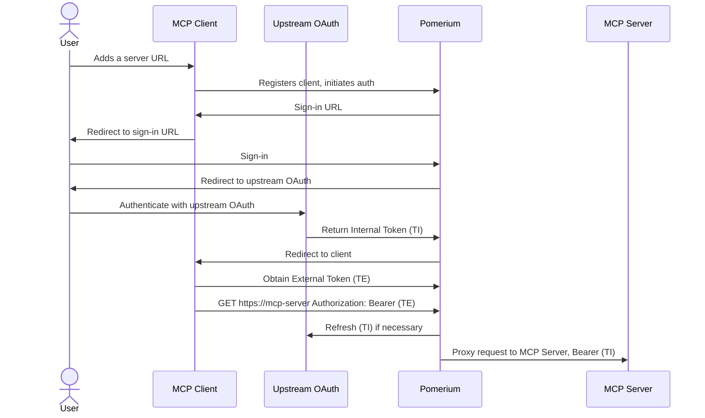
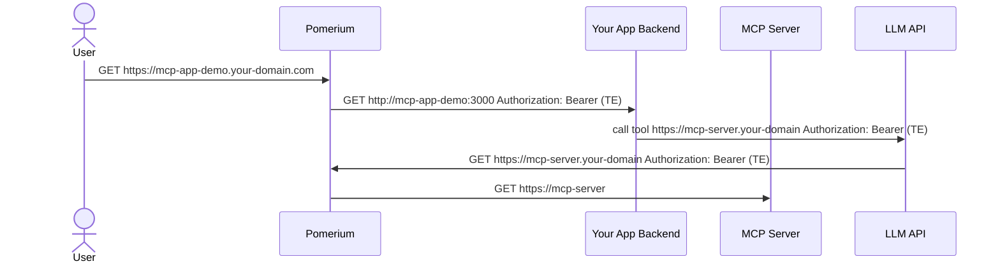

# Model Context Protocol (MCP) Support

Pomerium provides secure access to Model Context Protocol (MCP) servers, enabling AI agents and applications to safely interact with your internal resources through standardized interfaces. This capability allows you to expose local databases, APIs, and services to external AI clients while maintaining strict authentication and authorization controls.

## Overview

Model Context Protocol (MCP) is an open standard that allows AI agents to securely connect to external data sources and tools. Pomerium's MCP integration acts as a secure gateway between MCP clients (like Claude.ai, OpenAI APIs, or custom applications) and your internal MCP servers.

### Key Benefits

- **Secure Remote Access**: Expose internal MCP servers to external AI clients without compromising security
- **OAuth Integration**: Seamlessly handle upstream OAuth flows for services requiring authentication
- **Centralized Authorization**: Apply consistent access policies across all MCP endpoints
- **Token Management**: Automatic token refresh and secure credential handling
- **Observability**: Complete visibility into AI agent interactions with your resources

## Architecture

Pomerium supports three primary MCP integration patterns:

### 1. Exposing Internal MCP Servers

This pattern allows external MCP clients to access your internal MCP servers through Pomerium's secure gateway.



**Route Configuration:**

```yaml
routes:
  - from: https://my-mcp-server.your-domain.com
    to: http://my-mcp-server.int:8080/mcp
    name: My MCP Server
    mcp:
      server: {}
```

### 2. MCP Servers with Upstream OAuth

When your MCP server needs to access upstream services requiring OAuth authentication (GitHub, Google Drive, Notion, etc.), Pomerium handles the OAuth flow and token management.



**Route Configuration:**

```yaml
routes:
  - from: https://github.your-domain
    to: http://github-mcp.int:8080/mcp
    name: GitHub
    mcp:
      server:
        upstream_oauth2:
          client_id: xxxxxxxxxxxx
          client_secret: yyyyyyyyy
          scopes: ['read:user', 'user:email']
          endpoint:
            auth_url: 'https://github.com/login/oauth/authorize'
            token_url: 'https://github.com/login/oauth/access_token'
```

### 3. Building MCP-Enabled Applications

For internal applications that need to call MCP servers through AI APIs, Pomerium provides external tokens that can be passed to LLM services.



**Route Configuration:**

```yaml
routes:
  - from: https://mcp-app-demo.your-domain.com
    to: http://mcp-app-demo:3000
    mcp:
      client: {}
    policy: {}
  - from: https://mcp-server.your-domain.com
    to: http://mcp-server.int:8080/mcp
    name: My MCP Server
    mcp:
      server: {}
    policy: {}
```

## Token Types

Understanding Pomerium's token system is crucial for MCP integration:

### External Token (TE)

An externally-facing token issued by Pomerium representing the user's session. External clients use this token to authenticate requests to Pomerium-protected MCP servers.

**Use cases:**

- Providing to LLM APIs for MCP server access
- Authentication between external MCP clients and Pomerium
- Internal applications calling external AI services

### Internal Token (TI)

An internal authentication token that Pomerium obtains from upstream OAuth providers on behalf of the user. This token is never exposed to external clients and is used by Pomerium to authenticate with upstream services.

**Characteristics:**

- Automatically refreshed by Pomerium
- Securely stored and managed
- Used for upstream API authentication
- Invisible to external clients

## Configuration Options

### MCP Server Configuration

For routes hosting MCP servers:

```yaml
mcp:
  server:
    # Optional: Configure upstream OAuth2 for services requiring authentication
    upstream_oauth2:
      client_id: 'your-oauth-client-id'
      client_secret: 'your-oauth-client-secret'
      endpoint:
        auth_url: 'https://provider.com/oauth/authorize'
        token_url: 'https://provider.com/oauth/token'
        auth_style: 'header' # or "params"
      scopes: ['scope1', 'scope2']

    # Optional: Maximum request body size (default: 1MB)
    max_request_bytes: 1048576
```

### MCP Client Configuration

For applications that consume MCP servers:

```yaml
mcp:
  # Provides the application with external tokens for MCP server access
  client: {}
```

### OAuth2 Endpoint Authentication Styles

- `header`: Client credentials sent in Authorization header
- `params`: Client credentials sent as form parameters
- `""` (auto): Let the OAuth2 library choose automatically

## API Endpoints

### Listing Available MCP Servers

Applications can discover available MCP servers by making a request to the `/.pomerium/mcp/routes` endpoint:

```http
GET https://your-app.domain.com/.pomerium/mcp/routes
Authorization: Bearer <external-token>
Accept: application/json
```

**Response:**

```json
{
  "servers": [
    {
      "name": "Database Server",
      "url": "https://db-mcp.your-domain.com",
      "connected": true
    },
    {
      "name": "GitHub Server",
      "url": "https://github-mcp.your-domain.com",
      "connected": false
    }
  ]
}
```

The `connected` field indicates whether the user has completed all required upstream OAuth flows.

### Initiating Upstream OAuth

If a server shows `connected: false`, redirect users to complete upstream authentication:

```
https://mcp-server.your-domain.com/.pomerium/mcp/connect?redirect_url=https://your-app.domain.com/callback
```

**Requirements:**

- The `redirect_url` must match a configured MCP client route host
- Users will be redirected back to the specified URL after authentication

## User Identity and Claims

Both MCP client applications and servers can access authenticated user information through the `X-Pomerium-Assertion` HTTP header. This header contains a signed JWT with user details including email, name, and other claims.

**Example JWT payload:**

```json
{
  "sub": "user@example.com",
  "email": "user@example.com",
  "name": "John Doe",
  "groups": ["engineering", "admin"],
  "iss": "your-domain.com",
  "aud": "your-app.domain.com"
}
```

## Security Considerations

### Access Control

Apply appropriate policies to MCP routes:

```yaml
routes:
  - from: https://sensitive-mcp-server.domain.com
    to: http://internal-server:8080/mcp
    mcp:
      server: {}
    policy:
      allow:
        and:
          - domain:
              is: trusted-domain.com
          - groups:
              has: mcp-users
```

### Token Security

- External tokens (TE) have limited scope and lifetime
- Internal tokens (TI) are never exposed to external clients
- All tokens are automatically refreshed by Pomerium
- Failed authentication attempts are logged for audit

### Network Security

- MCP servers should run on internal networks
- Use TLS for all external communications
- Implement proper firewall rules
- Consider IP allowlisting for sensitive servers

## Common Integration Patterns

### Database Access

```yaml
routes:
  - from: https://db-mcp.domain.com
    to: http://postgres-mcp-server:8080/mcp
    name: Company Database
    mcp:
      server:
        max_request_bytes: 2097152 # 2MB for larger queries
    policy:
      allow:
        and:
          - domain:
              is: company.com
          - groups:
              has: data-analysts
```

### GitHub Integration

```yaml
routes:
  - from: https://github-mcp.domain.com
    to: http://github-mcp-server:8080/mcp
    name: GitHub Repository Access
    mcp:
      server:
        upstream_oauth2:
          client_id: 'github-oauth-client-id'
          client_secret: 'github-oauth-client-secret'
          endpoint:
            auth_url: 'https://github.com/login/oauth/authorize'
            token_url: 'https://github.com/login/oauth/access_token'
          scopes: ['read:user', 'repo', 'user:email']
```

### Notion Integration

```yaml
routes:
  - from: https://notion-mcp.domain.com
    to: http://notion-mcp-server:8080/mcp
    name: Notion Workspace
    mcp:
      server:
        upstream_oauth2:
          client_id: 'notion-oauth-client-id'
          client_secret: 'notion-oauth-client-secret'
          endpoint:
            auth_url: 'https://api.notion.com/v1/oauth/authorize'
            token_url: 'https://api.notion.com/v1/oauth/token'
          scopes: ['read_content', 'read_user_with_email']
```

## Troubleshooting

### Common Issues

**Server shows as disconnected:**

- Check if upstream OAuth is configured correctly
- Verify OAuth client credentials
- Ensure user has completed authentication flow
- Check Pomerium logs for OAuth errors

**Authentication failures:**

- Verify route policies allow the user
- Check token expiration and refresh logic
- Ensure external tokens are properly formatted
- Review access logs for policy violations

**Request size errors:**

- Increase `max_request_bytes` in server configuration
- Check for oversized request payloads
- Consider request compression if supported

### Logging and Monitoring

Enable detailed logging for MCP operations:

```yaml
log_level: info
# Additional logging options in global config
```

Monitor key metrics:

- Authentication success/failure rates
- Token refresh operations
- Request latency and error rates
- Upstream OAuth flow completion

### Testing Setup

Use the provided demo application to test your MCP configuration:

```bash
# Clone the demo app
git clone https://github.com/pomerium/mcp-app-demo.git

# Configure environment
echo "OPENAI_API_KEY=your_api_key_here" > .env

# Update pomerium-config.yaml with your domain
# Start the demo
docker compose up -d
```

Navigate to `https://mcp-app-demo.YOUR-DOMAIN/` to test the integration.

### Example MCP Servers

Pomerium provides a collection of reference MCP server implementations to help you get started:

**Repository**: [https://github.com/pomerium/mcp-servers](https://github.com/pomerium/mcp-servers)

## Best Practices

1. **Use specific scopes**: Only request OAuth scopes your MCP server actually needs
2. **Implement proper error handling**: Handle authentication failures gracefully
3. **Monitor token usage**: Track token refresh rates and failures
4. **Apply least privilege**: Use restrictive policies for sensitive MCP servers
5. **Regular auditing**: Review access logs and user permissions periodically
6. **Test thoroughly**: Validate all OAuth flows and edge cases
7. **Document integrations**: Maintain clear documentation for custom MCP servers

## Future Roadmap

Pomerium's MCP support is actively evolving. Planned enhancements include:

- Enhanced monitoring and analytics for MCP usage
- Additional OAuth provider templates
- Improved error handling and diagnostics
- Support for custom authentication flows
- Integration with more AI platforms and frameworks

### Demo and Examples

For complete end-to-end examples and reference implementations:

- **[MCP App Demo](https://github.com/pomerium/mcp-app-demo)**: Full demonstration showing custom UI frontend, MCP server integration, and remote LLM API calling through Pomerium
- **[MCP Servers](https://github.com/pomerium/mcp-servers)**: Collection of example MCP server implementations with Docker and Pomerium configurations

These repositories provide practical examples of all integration patterns described in this documentation.

## Observability

Pomerium provides specialized logging capabilities to monitor and audit MCP tool calling activities. By configuring `authorize_log_fields`, you can gain detailed insights into AI agent interactions with your MCP servers.

### MCP-Specific Authorization Log Fields

Pomerium includes three specialized log fields for MCP monitoring:

| Field | Description | Example Value |
| --- | --- | --- |
| `mcp-method` | The MCP JSON-RPC method being called | `"tools/call"`, `"tools/list"` |
| `mcp-tool` | The specific tool name being invoked (for `tools/call` requests) | `"database_query"`, `"list_files"` |
| `mcp-tool-parameters` | The parameters passed to the tool | `{"query": "SELECT * FROM users", "limit": 100}` |

### Configuration

To enable MCP-specific logging, add the desired fields to your `authorize_log_fields` configuration:

```yaml
authorize_log_fields:
  - request-id
  - user
  - email
  - mcp-method
  - mcp-tool
  - mcp-tool-parameters
```

### Example Log Output

When an AI agent calls an MCP tool, Pomerium generates detailed authorization logs:

```json
{
  "level": "info",
  "service": "authorize",
  "request-id": "c9afae5a-ec5a-4242-864f-df4189f20e99",
  "user": "google-oauth2|115420664726183323237",
  "email": "analyst@company.com",
  "mcp-method": "tools/call",
  "mcp-tool": "database_query",
  "mcp-tool-parameters": {
    "query": "SELECT * FROM sales WHERE year = 2024",
    "limit": 100,
    "format": "json"
  },
  "allow": true,
  "allow-why-true": ["domain-ok", "mcp-tool-ok"],
  "deny": false,
  "deny-why-false": [],
  "time": "2024-06-24T10:26:33-04:00",
  "message": "authorize check"
}
```

### Understanding MCP Authorization Logs

#### Tool Call Authorization

When using [Pomerium Policy Language (PPL)](/docs/internals/ppl) with MCP routes, you can control access to specific tools:

```yaml
policy:
  allow:
    and:
      - email:
          is: analyst@company.com
      - mcp_tool:
          is: database_query
```

The authorization log will show:

- `allow: true` and `mcp-tool-ok` when the tool is permitted
- `allow: false` and `mcp-tool-unauthorized` when the tool is blocked

#### Method-Level Monitoring

Different MCP methods appear in logs:

**Tool Listing Request:**

```json
{
  "mcp-method": "tools/list",
  "allow": true,
  "allow-why-true": ["authenticated-user"]
}
```

**Tool Execution Request:**

```json
{
  "mcp-method": "tools/call",
  "mcp-tool": "search_knowledge_base",
  "mcp-tool-parameters": {
    "query": "company policies",
    "max_results": 10
  }
}
```

**Resource Request:**

```json
{
  "mcp-method": "resources/list",
  "allow": true
}
```

## Policy-Based Tool Access Control

Pomerium provides fine-grained access control for MCP tools through a specialized `mcp_tool` policy criterion in Pomerium Policy Language (PPL). This allows you to control which users can access specific MCP tools, providing granular security for AI agent interactions.

### The `mcp_tool` Criterion

The `mcp_tool` criterion is designed specifically for MCP routes and allows policy enforcement at the individual tool level. It uses the [String Matcher](/docs/internals/ppl#string-matcher) format and supports all standard string matching operators.

#### Supported Operators

| Operator | Description | Example |
| --- | --- | --- |
| `is` | Exact match of the tool name | `mcp_tool: { is: "database_query" }` |
| `starts_with` | Tool name starts with the specified prefix | `mcp_tool: { starts_with: "db_" }` |
| `ends_with` | Tool name ends with the specified suffix | `mcp_tool: { ends_with: "_query" }` |
| `contains` | Tool name contains the specified substring | `mcp_tool: { contains: "read" }` |
| `in` | Tool name matches one of the provided values | `mcp_tool: { in: ["list_tables", "describe_table"] }` |

### Policy Examples

#### Allow Specific Tools to Specific Users

Grant access to database query tools only to data analysts:

```yaml
policy:
  allow:
    and:
      - email:
          ends_with: '@company.com'
      - mcp_tool:
          in: ['database_query', 'list_tables', 'describe_table']
      - groups:
          has: 'data-analysts'
```

#### Restrict Administrative Tools

Allow read-only operations for most users, but restrict administrative tools to administrators:

```yaml
policy:
  - allow:
      and:
        - domain:
            is: company.com
        - mcp_tool:
            starts_with: 'read_'
  - allow:
      and:
        - groups:
            has: 'database-admins'
        - mcp_tool:
            in: ['create_table', 'drop_table', 'alter_table']
  - deny:
      and:
        - mcp_tool:
            contains: 'delete'
        - not:
            - groups:
                has: 'senior-admins'
```

#### Time-Based Tool Access

Restrict sensitive operations to business hours:

```yaml
policy:
  - allow:
      and:
        - domain:
            is: company.com
        - mcp_tool:
            starts_with: 'read_'
  - allow:
      and:
        - groups:
            has: 'data-analysts'
        - mcp_tool:
            is: 'run_report'
        - time_of_day:
            after: '09:00'
            before: '17:00'
        - day_of_week:
            in: ['monday', 'tuesday', 'wednesday', 'thursday', 'friday']
```

#### Project-Based Tool Access

Control access to tools based on project context using claims:

```yaml
policy:
  allow:
    and:
      - email:
          ends_with: '@company.com'
      - or:
          - and:
              - claim/project:
                  is: 'finance'
              - mcp_tool:
                  in: ['financial_query', 'budget_analysis']
          - and:
              - claim/project:
                  is: 'marketing'
              - mcp_tool:
                  in: ['campaign_metrics', 'user_analytics']
```

### Authorization Flow for MCP Tools

When an AI agent attempts to call an MCP tool, Pomerium evaluates the policy in the following order:

1. **Route-level authentication**: User must be authenticated and authorized to access the MCP route
2. **Tool-level authorization**: If `mcp_tool` criteria are present, the specific tool name is evaluated
3. **Logging**: Authorization decision is logged with `mcp-tool-ok` or `mcp-tool-unauthorized` reasons

#### Understanding Authorization Results

The authorization logs show different reason codes based on the evaluation:

**Successful Tool Access:**

```json
{
  "allow": true,
  "allow-why-true": ["domain-ok", "mcp-tool-ok"],
  "mcp-tool": "database_query"
}
```

**Blocked Tool Access:**

```json
{
  "allow": false,
  "allow-why-false": ["mcp-tool-unauthorized"],
  "deny": false,
  "mcp-tool": "admin_function"
}
```

**Route Access Denied (before tool evaluation):**

```json
{
  "allow": false,
  "allow-why-false": ["domain-unauthorized"],
  "deny": false
}
```
