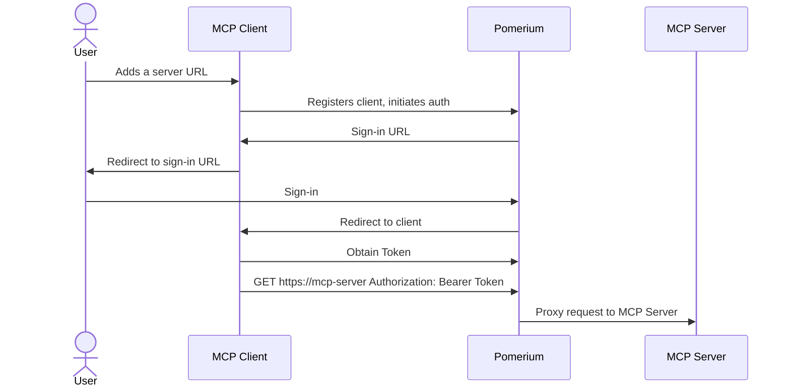
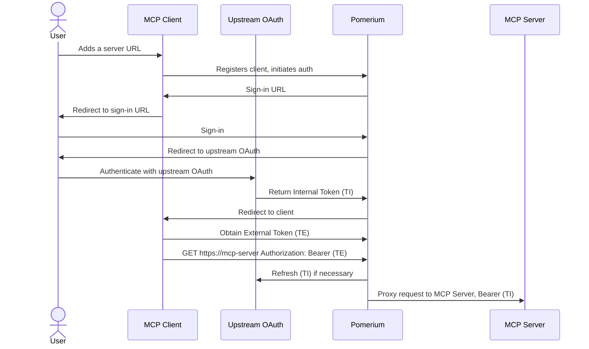
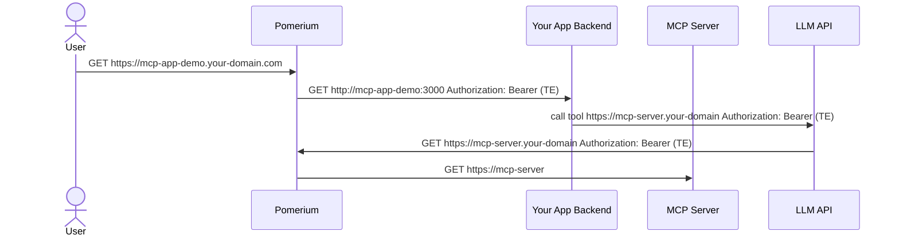

# Model Context Protocol (MCP) Support

Pomerium provides secure access to Model Context Protocol (MCP) servers, enabling AI agents and applications to safely interact with your internal resources through standardized interfaces. This capability allows you to expose local databases, APIs, and services to external AI clients while maintaining strict authentication and authorization controls.

## On This Page

- [Overview](#overview)
- [Architecture](#architecture) - Three integration patterns
  - [Exposing Internal MCP Servers](#1-exposing-internal-mcp-servers)
  - [MCP Servers with Upstream OAuth](#2-mcp-servers-with-upstream-oauth)
  - [Building MCP-Enabled Applications](#3-building-mcp-enabled-applications)
- [Bearer Token Types](#bearer-token-types) - External and Internal tokens
- [Configuration Options](#configuration-options) - Server and client configuration
- [User Identity and Claims](#user-identity-and-claims) - JWT headers and verification
- [Security Considerations](#security-considerations) - Access control and token security
- [Observability](#observability) - Logging and monitoring MCP activities
- [Policy-Based Tool Access Control](#policy-based-tool-access-control) - Fine-grained tool permissions
- [Best Practices](#best-practices)
- [Demo and Examples](#demo-and-examples)

## Overview

Model Context Protocol (MCP) is an open standard that allows AI agents to securely connect to external data sources and tools. Pomerium's MCP integration acts as a secure gateway between MCP clients (like Claude.ai, OpenAI APIs, or custom applications) and your internal MCP servers.

For an understanding of Pomerium's core capabilities, see [Authentication](/docs/capabilities/authentication) and [Authorization](/docs/capabilities/authorization).

:::warning Experimental Feature

MCP support is currently an experimental feature only available in the `main` branch or Docker images built from `main`. To enable MCP functionality, you must set the following feature flag in your [Pomerium configuration](/docs/internals/configuration):

```yaml
runtime_flags:
  mcp: true
```

:::

### Key Benefits

- **Secure Remote Access**: Expose internal MCP servers to external AI clients without compromising security
- **OAuth Integration**: Seamlessly handle [upstream OAuth flows](#2-mcp-servers-with-upstream-oauth) for services requiring authentication
- **Centralized Authorization**: Apply consistent [access policies](#policy-based-tool-access-control) across all MCP endpoints
- **Token Management**: Automatic token refresh and secure [credential handling](#bearer-token-types)
- **Observability**: Complete visibility into AI agent interactions with your resources through [specialized logging](#observability)

## Try It Out

Explore the [MCP App Demo](https://github.com/pomerium/mcp-app-demo) for a hands-on example of integrating MCP with Pomerium. The demo shows a full workflow including UI, MCP server, and LLM API integration—perfect for testing and learning.

If you're new to Pomerium, start with the [Quickstart Guide](/docs/get-started/quickstart) to set up your first Pomerium deployment.

## Architecture

Pomerium supports three primary MCP integration patterns. For detailed route configuration information, see the [Routes reference documentation](/docs/reference/routes).

### 1. Exposing Internal MCP Servers

This pattern allows external MCP clients to access your internal MCP servers through Pomerium's secure gateway.

- Your MCP server does not need to implement any specific authentication or authorization logic. Works best with internal services that provide access to shared resource like databases, APIs taking API keys, or other internal tools.
- MCP clients users must authenticate, and Pomerium enforces access policies for every request.



**Route Configuration:**

```yaml
routes:
  - from: https://my-mcp-server.your-domain.com
    to: http://my-mcp-server.int:8080/mcp
    name: My MCP Server
    mcp:
      server: {} # the brackets are significant, they indicate that this is an MCP server route
    policy:
      and:
        - domain:
            is: company.com
        - mcp_tool:
            starts_with: 'read_'
```

### 2. MCP Servers with Upstream OAuth

When your MCP server needs to access upstream services requiring OAuth authentication (GitHub, Google Drive, Notion, etc.).

- Pomerium handles the OAuth flow and token management with the remote upstream service.
- Your MCP server does not need to implement any of the OAuth logic, as Pomerium will manage the authentication and token refresh.
- MCP clients only observe the [External Token (TE)](#external-token-te) issued by Pomerium, which is used to access the MCP server. The [Internal Token (TI)](#internal-token-ti) used for upstream OAuth is managed by Pomerium and is never exposed to external clients.

For more details on OAuth configuration options, see [Identity Provider Settings](/docs/reference/identity-provider-settings).



**Route Configuration:**

```yaml
routes:
  - from: https://github.your-domain
    to: http://github-mcp.int:8080/mcp
    name: GitHub
    mcp:
      server:
        upstream_oauth2:
          client_id: xxxxxxxxxxxx
          client_secret: yyyyyyyyy
          scopes: ['read:user', 'user:email']
          endpoint:
            auth_url: 'https://github.com/login/oauth/authorize'
            token_url: 'https://github.com/login/oauth/access_token'
    policy:
      and:
        - domain:
            is: company.com
        - mcp_tool:
            starts_with: 'read_'
```

### 3. Building MCP-Enabled Applications

For internal applications that need to call MCP servers through AI APIs such as OpenAI or Anthropic, Pomerium provides:

- When a route is designated as `mcp: client`, an External Bearer Tokens would be passed to your application backend in the `Authorization: Bearer` header.
- Your application backend can [list MCP servers that are available](#listing-available-mcp-servers) on the Pomerium backend and initiate [upstream OAuth flows](#initiating-upstream-oauth) if necessary.
- An [External Token (TE)](#external-token-te) can be passed to LLM APIs to allow them to call MCP servers on behalf of the user.

For a complete working example, see the [MCP App Demo](#demo-and-examples) section.



**Route Configuration:**

```yaml
routes:
  - from: https://mcp-app-demo.your-domain.com
    to: http://mcp-app-demo:3000
    mcp:
      client: {}
    policy: {}
  - from: https://mcp-server.your-domain.com
    to: http://mcp-server.int:8080/mcp
    name: My MCP Server
    mcp:
      server: {}
    policy: {}
```

## Bearer Token Types

Understanding Pomerium's token system is crucial for MCP integration:

### External Token (TE)

An externally-facing token issued by Pomerium representing the user's session. External clients use this token to authenticate requests to Pomerium-protected MCP servers.

**Use cases:**

- Providing to LLM APIs for MCP server access
- Authentication between external MCP clients and Pomerium
- Internal applications calling external AI services

### Internal Token (TI)

An internal authentication token that Pomerium obtains from upstream OAuth providers on behalf of the user. This token is never exposed to external clients and is used by Pomerium to authenticate with upstream services.

**Characteristics:**

- Automatically refreshed by Pomerium
- Securely stored and managed
- Used for upstream API authentication
- Invisible to external clients

## Configuration Options

MCP integration can be configured through route-level settings. For general route configuration guidance, see the [Routes configuration reference](/docs/reference/routes).

### MCP Server Configuration

For routes hosting MCP servers:

```yaml
mcp:
  server:
    # Optional: Configure upstream OAuth2 for services requiring authentication
    upstream_oauth2:
      client_id: 'your-oauth-client-id'
      client_secret: 'your-oauth-client-secret'
      endpoint:
        auth_url: 'https://provider.com/oauth/authorize'
        token_url: 'https://provider.com/oauth/token'
        auth_style: 'header' # or "params"
      scopes: ['scope1', 'scope2']

    # Optional: Maximum request body size (default: 4KiB)
    max_request_bytes: 1048576
```

** Tool Call Authorization **

When using [Pomerium Policy Language (PPL)](/docs/internals/ppl) with MCP routes, you can control access to specific tools, in addition to the standard route policies. For example, to allow only certain users to call a specific MCP tool:

```yaml
policy:
  allow:
    and:
      - email:
          is: analyst@company.com
      - mcp_tool:
          is: database_query
```

For more information on route-level policies, see [Route Policy Configuration](/docs/reference/routes/policy). For advanced policy examples, see [Policy-Based Tool Access Control](#policy-based-tool-access-control).

### MCP Client Configuration

For applications that consume MCP servers:

```yaml
mcp:
  # Provides the application with external tokens for MCP server access.
  # the brackets are significant, they indicate that this is an MCP client route
  client: {}
```

For Client routes, Pomerium exposes additional endpoints to manage MCP server discovery and upstream OAuth flows. See [Building MCP-Enabled Applications](#3-building-mcp-enabled-applications) for architectural details.

#### Listing Available MCP Servers

Applications can discover available MCP servers by making a request to the `/.pomerium/mcp/routes` endpoint:

```http
GET https://your-app.domain.com/.pomerium/mcp/routes
Authorization: Bearer <external-token>
Accept: application/json
```

**Response:**

```json
{
  "servers": [
    {
      "name": "Database Server",
      "url": "https://db-mcp.your-domain.com",
      "connected": true
    },
    {
      "name": "GitHub Server",
      "url": "https://github-mcp.your-domain.com",
      "connected": false
    }
  ]
}
```

The `connected` field indicates whether the user has completed all required upstream OAuth flows.

#### Initiating Upstream OAuth

If a server shows `connected: false`, redirect users to complete upstream authentication:

```
https://mcp-server.your-domain.com/.pomerium/mcp/connect?redirect_url=https://your-app.domain.com/callback
```

**Requirements:**

- The `redirect_url` must match a configured MCP client route host
- Users will be redirected back to the specified URL after authentication

## User Identity and Claims

Both MCP client applications and servers can access authenticated user information through the [`X-Pomerium-Assertion`](https://www.pomerium.com/docs/get-started/fundamentals/core/jwt-verification#get-the-x-pomerium-jwt-assertion-header) HTTP header. This header contains a signed JWT with user details including email, name, and other claims.

**Example JWT payload:**

```json
{
  "sub": "user@example.com",
  "email": "user@example.com",
  "name": "John Doe",
  "groups": ["engineering", "admin"],
  "iss": "your-domain.com",
  "aud": "your-app.domain.com"
}
```

JWT may be verified using standard [JWT libraries](https://jwt.io/) or Pomerium's SDKs for [Go](https://github.com/pomerium/sdk-go) or [Python](https://github.com/pomerium/js-sdk).

For detailed information about JWT verification in Pomerium, see [Identity Verification with JWTs](/docs/get-started/fundamentals/core/jwt-verification).

## Security Considerations

For general security best practices with Pomerium, see the [Security documentation](/docs/internals/security).

### Access Control

Apply appropriate policies to MCP routes:

```yaml
routes:
  - from: https://sensitive-mcp-server.domain.com
    to: http://internal-server:8080/mcp
    mcp:
      server: {}
    policy:
      allow:
        and:
          - domain:
              is: trusted-domain.com
```

### Token Security

- [External tokens (TE)](#external-token-te) have limited scope and lifetime
- [Internal tokens (TI)](#internal-token-ti) are never exposed to external clients
- All tokens are automatically refreshed by Pomerium
- All authorization decisions are logged for audit (see [Observability](#observability))

For more information on Pomerium's bearer token format, see [Bearer Token Format](/docs/reference/bearer-token-format).

### Testing Setup

Use the provided demo application to test your MCP configuration:

```bash
# Clone the demo app
git clone https://github.com/pomerium/mcp-app-demo.git

# Configure environment
echo "OPENAI_API_KEY=your_api_key_here" > .env

# Update pomerium-config.yaml with your domain
# Start the demo
docker compose up -d
```

Navigate to `https://mcp-app-demo.YOUR-DOMAIN/` to test the integration.

### Example MCP Servers

Pomerium provides a collection of reference MCP server implementations to help you get started:

**Repository**: [https://github.com/pomerium/mcp-servers](https://github.com/pomerium/mcp-servers)

## Best Practices

1. **Use specific scopes**: Only request OAuth scopes your MCP server actually needs
2. **Implement proper error handling**: Handle authentication failures gracefully
3. **Monitor token usage**: Track token refresh rates and failures (see [Observability](#observability))
4. **Apply least privilege**: Use restrictive [policies](#policy-based-tool-access-control) for sensitive MCP servers
5. **Regular auditing**: Review [access logs](#observability) and user permissions periodically
6. **Test thoroughly**: Validate all OAuth flows and edge cases
7. **Document integrations**: Maintain clear documentation for custom MCP servers

For additional security guidance, see [Security Considerations](#security-considerations) and the [Security documentation](/docs/internals/security).

## Future Roadmap

Pomerium's MCP support is actively evolving. Planned enhancements include:

- Enhanced monitoring and analytics for MCP usage
- Additional OAuth provider templates
- Improved error handling and diagnostics
- Support for custom authentication flows
- Integration with more AI platforms and frameworks

## Related Documentation

### Core Pomerium Concepts

- [Authentication](/docs/capabilities/authentication) - User authentication methods
- [Authorization](/docs/capabilities/authorization) - Access control and policies
- [Pomerium Policy Language (PPL)](/docs/internals/ppl) - Policy syntax and examples
- [Routes Configuration](/docs/reference/routes) - Route setup and options
- [Identity Verification with JWTs](/docs/get-started/fundamentals/core/jwt-verification) - JWT headers and verification

### Configuration References

- [Route Policy Configuration](/docs/reference/routes/policy) - Policy configuration for routes
- [Bearer Token Format](/docs/reference/bearer-token-format) - Token structure and validation
- [Authorize Log Fields](/docs/reference/authorize-log-fields) - Logging configuration
- [Identity Provider Settings](/docs/reference/identity-provider-settings) - OAuth provider setup

### Observability and Security

- [Metrics](/docs/reference/metrics) - Performance and usage metrics
- [Tracing](/docs/reference/tracing) - Request tracing and debugging
- [Security](/docs/internals/security) - Security best practices

### Related Guides

- [Self-Hosted LLM Behind Pomerium](/docs/guides/llm) - Securing LLM interfaces with Pomerium

### Demo and Examples

For complete end-to-end examples and reference implementations:

- **[MCP App Demo](https://github.com/pomerium/mcp-app-demo)**: Full demonstration showing custom UI frontend, MCP server integration, and remote LLM API calling through Pomerium
- **[MCP Servers](https://github.com/pomerium/mcp-servers)**: Collection of example MCP server implementations with Docker and Pomerium configurations

These repositories provide practical examples of all integration patterns described in this documentation.

## Observability

Pomerium provides specialized logging capabilities to monitor and audit MCP tool calling activities. By configuring [`authorize_log_fields`](/docs/reference/authorize-log-fields), you can gain detailed insights into AI agent interactions with your MCP servers.

For general observability features, see [Metrics](/docs/reference/metrics) and [Tracing](/docs/reference/tracing).

### MCP-Specific Authorization Log Fields

Pomerium includes three specialized log fields for MCP monitoring:

| Field | Description | Example Value |
| --- | --- | --- |
| `mcp-method` | The MCP JSON-RPC method being called | `"tools/call"`, `"tools/list"` |
| `mcp-tool` | The specific tool name being invoked (for `tools/call` requests) | `"database_query"`, `"list_files"` |
| `mcp-tool-parameters` | The parameters passed to the tool | `{"query": "SELECT * FROM users", "limit": 100}` |

### Configuration

To enable MCP-specific logging, add the desired fields to your [`authorize_log_fields`](/docs/reference/authorize-log-fields) configuration:

```yaml
authorize_log_fields:
  - request-id
  - user
  - email
  - mcp-method
  - mcp-tool
  - mcp-tool-parameters
```

### Example Log Output

When an AI agent calls an MCP tool, Pomerium generates detailed authorization logs:

```json
{
  "level": "info",
  "service": "authorize",
  "request-id": "c9afae5a-ec5a-4242-864f-df4189f20e99",
  "user": "google-oauth2|115420664726183323237",
  "email": "analyst@company.com",
  "mcp-method": "tools/call",
  "mcp-tool": "database_query",
  "mcp-tool-parameters": {
    "query": "SELECT * FROM sales WHERE year = 2024",
    "limit": 100,
    "format": "json"
  },
  "allow": true,
  "allow-why-true": ["domain-ok", "mcp-tool-ok"],
  "deny": false,
  "deny-why-false": [],
  "time": "2024-06-24T10:26:33-04:00",
  "message": "authorize check"
}
```

### Understanding MCP Authorization Logs

For general information about authorization logs, see [Authorize Log Fields](/docs/reference/authorize-log-fields).

#### Tool Call Authorization

When using [Pomerium Policy Language (PPL)](/docs/internals/ppl) with MCP routes, you can control access to specific tools:

```yaml
policy:
  allow:
    and:
      - email:
          is: analyst@company.com
      - mcp_tool:
          is: database_query
```

The authorization log will show:

- `allow: true` and `mcp-tool-ok` when the tool is permitted
- `allow: false` and `mcp-tool-unauthorized` when the tool is blocked

#### Method-Level Monitoring

Different MCP methods appear in logs:

**Tool Listing Request:**

```json
{
  "mcp-method": "tools/list",
  "allow": true,
  "allow-why-true": ["authenticated-user"]
}
```

**Tool Execution Request:**

```json
{
  "mcp-method": "tools/call",
  "mcp-tool": "search_knowledge_base",
  "mcp-tool-parameters": {
    "query": "company policies",
    "max_results": 10
  }
}
```

**Resource Request:**

```json
{
  "mcp-method": "resources/list",
  "allow": true
}
```

## Policy-Based Tool Access Control

Pomerium provides fine-grained access control for MCP tools through a specialized `mcp_tool` policy criterion in [Pomerium Policy Language (PPL)](/docs/internals/ppl). This allows you to control which users can access specific MCP tools, providing granular security for AI agent interactions.

For broader policy examples, see the [Authorization documentation](/docs/capabilities/authorization).

### The `mcp_tool` Criterion

The `mcp_tool` criterion is designed specifically for MCP routes and allows policy enforcement at the individual tool level. It uses the [String Matcher](/docs/internals/ppl#string-matcher) format and supports all standard string matching operators.

| Operator | Description | Example |
| --- | --- | --- |
| `is` | Exact match of the tool name | `mcp_tool: { is: "database_query" }` |
| `starts_with` | Tool name starts with the specified prefix | `mcp_tool: { starts_with: "db_" }` |
| `ends_with` | Tool name ends with the specified suffix | `mcp_tool: { ends_with: "_query" }` |
| `contains` | Tool name contains the specified substring | `mcp_tool: { contains: "read" }` |
| `in` | Tool name matches one of the provided values | `mcp_tool: { in: ["list_tables", "describe_table"] }` |

### Example

Grant access to database query tools only to data analysts:

```yaml
policy:
  allow:
    and:
      - email:
          ends_with: '@company.com'
      - mcp_tool:
          in: ['database_query', 'list_tables', 'describe_table']
      - groups:
          has: 'data-analysts'
```

For more advanced policy patterns, see the [PPL documentation](/docs/internals/ppl#examples).

### Understanding Authorization Results

The authorization logs show different reason codes based on the evaluation:

**Successful Tool Access:**

```json
{
  "allow": true,
  "allow-why-true": ["domain-ok", "mcp-tool-ok"],
  "mcp-tool": "database_query"
}
```

**Blocked Tool Access:**

```json
{
  "allow": false,
  "allow-why-false": ["mcp-tool-unauthorized"],
  "deny": false,
  "mcp-tool": "admin_function"
}
```
