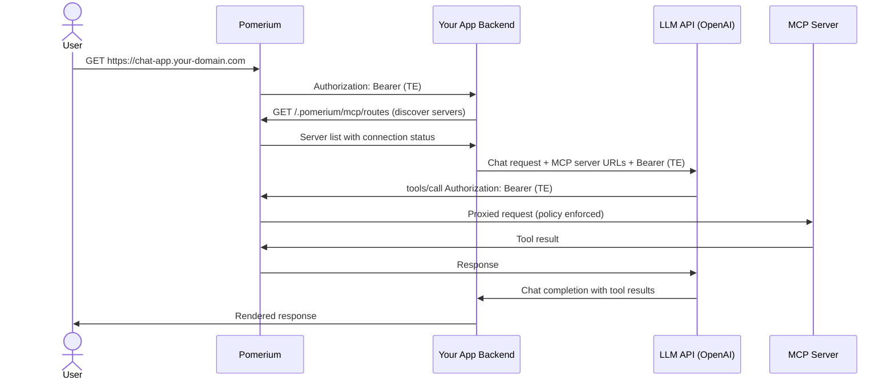

# Delegate MCP Access to an LLM

Build a web application where the authenticated user's Pomerium token is captured and passed to an LLM API (such as OpenAI). The LLM then uses that token to call MCP servers behind Pomerium on behalf of the user — with full authentication, authorization, and audit logging.

<iframe
  width="100%"
  height="415"
  src="https://www.youtube.com/embed/JGecAuJoXEI"
  frameBorder="0"
  webkitallowfullscreen="true"
  mozallowfullscreen="true"
  allowFullScreen={true}></iframe>

**What you get:**

- Your app receives an External Token (TE) for the authenticated user via the `mcp: client` route
- Your app passes that token to an LLM API, which uses it to call MCP servers on the user's behalf
- Pomerium enforces policies on every MCP tool call — the LLM has exactly the same access as the user
- Server discovery API to list available MCP servers and their connection status

## Architecture



The key insight: your app never calls MCP servers directly. It hands the user's token to the LLM, and the LLM makes the MCP calls through Pomerium. Pomerium enforces the same policies it would for any other client.

## Configuration

Your deployment needs two types of routes: a **client** route for your chat app and one or more **server** routes for MCP servers.

```yaml
runtime_flags:
  mcp: true

routes:
  # Your chat app (MCP client)
  - from: https://chat-app.your-domain.com
    to: http://chat-app:3000
    mcp:
      client: {}
    policy: {}

  # MCP servers the LLM can call
  - from: https://db-mcp.your-domain.com
    to: http://db-mcp-server:8080/mcp
    name: Database Server
    mcp:
      server: {}
    policy:
      allow:
        and:
          - domain:
              is: company.com

  # MCP server with upstream OAuth (e.g., GitHub)
  - from: https://github-mcp.your-domain.com
    to: http://github-mcp-server:8080/mcp
    name: GitHub
    mcp:
      server:
        upstream_oauth2:
          client_id: xxxxxxxxxxxx
          client_secret: yyyyyyyyy
          scopes: ['read:user', 'repo']
          endpoint:
            auth_url: 'https://github.com/login/oauth/authorize'
            token_url: 'https://github.com/login/oauth/access_token'
    policy:
      allow:
        and:
          - domain:
              is: company.com
```

:::warning Experimental Feature

MCP support is currently an experimental feature only available in the `main` branch or Docker images built from `main`. To enable MCP functionality, you must set `runtime_flags.mcp: true` in your [Pomerium configuration](/docs/internals/configuration).

:::

## Step-by-step

### 1. Set up MCP server routes

Configure one or more MCP server routes for the tools you want to expose. See [Protect an MCP Server](/docs/capabilities/mcp/protect-mcp-server) or [MCP + Upstream OAuth](/docs/capabilities/mcp/mcp-upstream-oauth).

### 2. Configure the client route

Add a route with `mcp.client: {}`. Pomerium passes an External Token (TE) to your app backend in the `Authorization: Bearer` header on every request.

### 3. Discover available MCP servers

Your app calls the `/.pomerium/mcp/routes` endpoint to list servers and their connection status:

```http
GET https://chat-app.your-domain.com/.pomerium/mcp/routes
Authorization: Bearer <external-token>
Accept: application/json
```

**Response:**

```json
{
  "servers": [
    {
      "name": "Database Server",
      "url": "https://db-mcp.your-domain.com",
      "connected": true
    },
    {
      "name": "GitHub",
      "url": "https://github-mcp.your-domain.com",
      "connected": false
    }
  ]
}
```

### 4. Handle upstream OAuth (if needed)

If a server shows `connected: false`, redirect the user to complete upstream authentication:

```
https://github-mcp.your-domain.com/.pomerium/mcp/connect?redirect_url=https://chat-app.your-domain.com/callback
```

The `redirect_url` must match a configured MCP client route host. After authentication, the user is redirected back to your app.

### 5. Pass the token to the LLM

Your app backend extracts the External Token (TE) from the request and provides it to the LLM API along with the MCP server URLs. The LLM uses the token to call MCP tools on behalf of the user:

```
Your App → LLM API: "Here are the MCP servers and the user's token"
LLM API → Pomerium: tools/call with Authorization: Bearer (TE)
Pomerium → MCP Server: Authenticated, authorized request
```

Pomerium validates the token, applies policies (including [tool-level restrictions](/docs/capabilities/mcp/limit-mcp-tools)), and proxies the request.

### 6. Audit tool calls

Every MCP tool call is logged by Pomerium with full details. Enable MCP-specific logging to monitor what the LLM does on behalf of your users:

```yaml
authorize_log_fields:
  - request-id
  - email
  - mcp-method
  - mcp-tool
  - mcp-tool-parameters
```

<iframe
  width="100%"
  height="415"
  src="https://www.youtube.com/embed/nc9rKaUlETg"
  frameBorder="0"
  webkitallowfullscreen="true"
  mozallowfullscreen="true"
  allowFullScreen={true}></iframe>

See [Observability](/docs/capabilities/mcp/reference#observability) for the full logging reference.

## Sample repos and next steps

- **[pomerium/mcp-app-demo](https://github.com/pomerium/mcp-app-demo)** — Full working Pomerium Chat app with MCP server integration, LLM API calling, and audit logging
- [MCP + Upstream OAuth](/docs/capabilities/mcp/mcp-upstream-oauth) — Configure upstream OAuth for services like GitHub
- [Limit MCP Tool Calling](/docs/capabilities/mcp/limit-mcp-tools) — Control which tools the LLM can call
- [MCP Full Reference](/docs/capabilities/mcp/reference) — Token types, session lifecycle, configuration details
