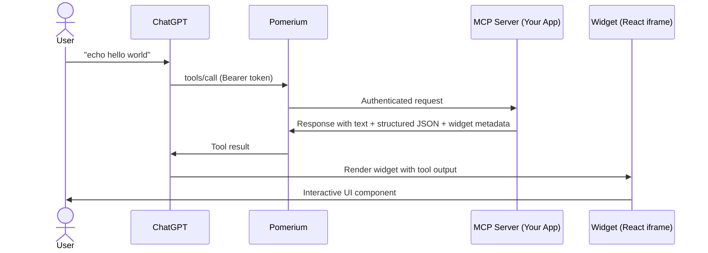

# Develop an MCP App

Build interactive apps using the [MCP Apps extension](https://modelcontextprotocol.io/docs/extensions/apps) — the open standard for rendering interactive UI components inside MCP hosts. The Pomerium template currently targets **ChatGPT Apps** (OpenAI's implementation of the standard), with broader MCP Apps support coming soon.

Your MCP server handles tool execution and returns structured data that the host renders as interactive UI components in a sandboxed iframe.

**What you get:**

- An MCP server that registers tools and returns widget-ready structured data
- React-based widgets rendered inside ChatGPT as interactive iframes
- Secure authentication via Pomerium — use `pom.run` for local development or deploy permanently

## Architecture



## How it works

Your MCP server registers tools that return three things in each response:

1. **Text content** — human-readable text for ChatGPT's conversation
2. **Structured JSON data** — passed to the widget via `window.openai.toolOutput`
3. **Widget metadata** — a `_meta.outputTemplate` pointing to a widget resource (e.g., `ui://echo`)

ChatGPT renders your widget in an iframe. The widget receives tool output data and can call back into the MCP server via `window.openai.callTool()`.

## Prerequisites

- **Node.js 22+** — verify with `node -v`
- **npm 10+** — ships with Node 22, verify with `npm -v`
- An MCP client (e.g., a ChatGPT Plus subscription)

## Step-by-step

### 1. Scaffold from the template

```bash
git clone https://github.com/pomerium/chatgpt-app-typescript-template my-chatgpt-app
cd my-chatgpt-app
npm install
npm run dev
```

This starts both the MCP server (`http://localhost:8080`) and widget dev server (`http://localhost:4444`).

### 2. Expose your app with pom.run

In a new terminal (keep `npm run dev` running):

```bash
ssh -R 0 pom.run
```

Sign in and you'll get a public route URL like `https://mcp.your-route-1234.pomerium.app/`. For full tunneling details, see [Tunnel to ChatGPT During Development](/docs/capabilities/mcp/tunnel-to-chatgpt).

### 3. Connect to ChatGPT

1. In ChatGPT, go to **Settings → Apps → Advanced settings** and enable **Developer mode**
2. Click **Create app**
3. Set **MCP Server URL** to `https://mcp.your-route-1234.pomerium.app/mcp`
4. Set **Authentication** to **OAuth**
5. Test with: `@echo today is a great day`

### 4. Build your own tools and widgets

The template's echo tool shows the full pattern. The key pieces when adding your own tool:

**Tool response** — return `structuredContent` and a `_meta.outputTemplate` pointing to your widget:

```typescript
return {
  content: [{type: 'text', text: 'Result'}],
  structuredContent: {result: args.input},
  _meta: {
    outputTemplate: {
      type: 'resource',
      resource: {uri: 'ui://my-widget'},
    },
  },
};
```

**Widget resource registration** — the `text/html+skybridge` MIME type is required for ChatGPT to render the widget:

```typescript
return {
  contents: [{uri, mimeType: 'text/html+skybridge', text: html}],
};
```

**Widget entry point** — React component in `widgets/src/widgets/my-widget.tsx`, with mounting code at the bottom. The build auto-discovers all files matching `widgets/src/widgets/*.{tsx,jsx}`.

See the [template README](https://github.com/pomerium/chatgpt-app-typescript-template) for the complete guide: project structure, `window.openai` API, Storybook, testing, environment variables, and troubleshooting.

## For production deployment

Configure a Pomerium route to put your app behind authentication permanently:

```yaml
runtime_flags:
  mcp: true

routes:
  - from: https://my-chatgpt-app.your-domain.com
    to: http://my-chatgpt-app:8080/mcp
    name: My ChatGPT App
    mcp:
      server: {}
    policy:
      allow:
        and:
          - domain:
              is: company.com
```

See [Protect an MCP Server](/docs/capabilities/mcp/protect-mcp-server) for the full setup guide.

## Sample repos and next steps

- **[pomerium/chatgpt-app-typescript-template](https://github.com/pomerium/chatgpt-app-typescript-template)** — Starter template for ChatGPT Apps (MCP Apps support coming soon) — full README with project structure, API reference, testing, Docker, and troubleshooting
- **[MCP Apps extension spec](https://modelcontextprotocol.io/docs/extensions/apps)** — Official standard for interactive UI in MCP hosts
- [Tunnel to ChatGPT During Development](/docs/capabilities/mcp/tunnel-to-chatgpt) — pom.run tunneling setup details
- [Protect an MCP Server](/docs/capabilities/mcp/protect-mcp-server) — Deploy permanently behind Pomerium
- [MCP Full Reference](/docs/capabilities/mcp/reference) — Token types, session lifecycle, configuration details
