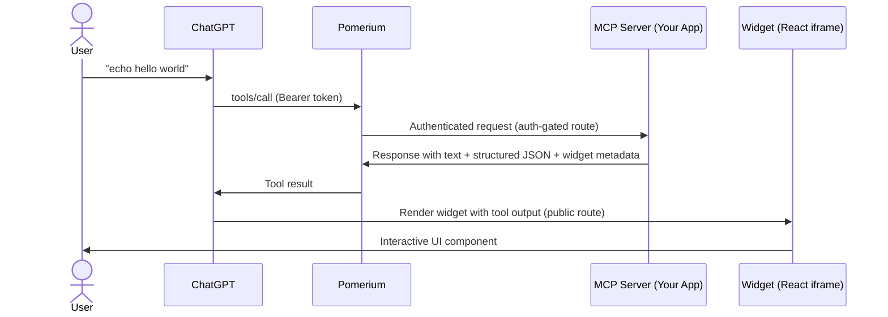
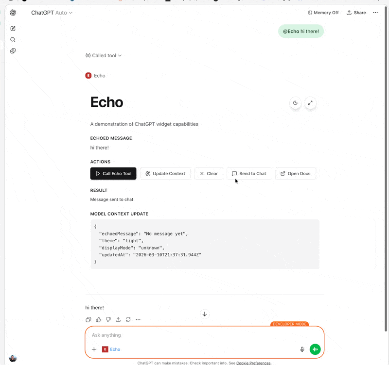

# Develop an MCP App

Build interactive apps using the [MCP Apps extension](https://modelcontextprotocol.io/docs/extensions/apps) — the open standard for rendering interactive UI components inside MCP hosts. The Pomerium template currently targets **ChatGPT Apps** (OpenAI's implementation of the standard), with broader MCP Apps support coming soon.

Your MCP server handles tool execution and returns structured data that the host renders as interactive UI components in a sandboxed iframe.

**What you get:**

- An MCP server that registers tools and returns widget-ready structured data
- React-based widgets rendered inside your MCP host as interactive iframes
- Secure authentication via Pomerium — use `pom.run` for local development or deploy permanently

## Architecture

The template builds and serves two separate properties:

| Property | Dev | Production | Access policy |
|---|---|---|---|
| **MCP server** (`/mcp`) | Public URL via `pom.run` tunnel | Public URL via Pomerium | Auth-gated — tool calls always require a Bearer token |
| **Widget assets** | `localhost:4444` (rendered in your browser) | Public URL via Pomerium | **Public** — the MCP host renders widgets in a sandboxed iframe and cannot forward credentials |

The MCP server always needs a publicly reachable URL so the MCP host can reach it. Widget assets only need a public URL in production; during development your local browser loads them directly from localhost.

Tool calls always carry a Bearer token and should be gated by a strict Pomerium policy. Widgets must be publicly accessible because the MCP host renders them in a sandboxed iframe and cannot forward authentication tokens.


```mermaid
sequenceDiagram
  actor U as User
  participant C as ChatGPT
  participant P as Pomerium
  participant S as MCP Server (Your App)
  participant W as Widget (React iframe)
  U ->> C: "echo hello world"
  C ->> P: tools/call (Bearer token)
  P ->> S: Authenticated request (auth-gated route)
  S ->> P: Response with text + structured JSON + widget metadata
  P ->> C: Tool result
  C ->> W: Render widget with tool output (public route)
  W ->> U: Interactive UI component
```

## How it works

Your MCP server registers tools that return three things in each response:

1. **Text content** — human-readable text for the MCP host's conversation
2. **Structured JSON data** — passed to the widget via `window.openai.toolOutput`
3. **Widget metadata** — a `_meta.outputTemplate` pointing to a widget resource (e.g., `ui://echo`)

ChatGPT renders your widget in an iframe. The widget receives tool output data and can call back into the MCP server via `window.openai.callTool()`.

## Prerequisites

- **Node.js 22+** — verify with `node -v`
- **npm 10+** — ships with Node 22, verify with `npm -v`
- An MCP client (e.g., a ChatGPT Plus subscription)

## Step-by-step

### 1. Scaffold from the template

```bash
git clone https://github.com/pomerium/chatgpt-app-typescript-template my-chatgpt-app
cd my-chatgpt-app
npm install
npm run dev
```

This starts both the MCP server (`http://localhost:8080`) and widget dev server (`http://localhost:4444`).

### 2. Expose your MCP server with pom.run

The MCP host needs a public URL to reach your server — `localhost` won't work. In a new terminal (keep `npm run dev` running):

```bash
ssh -R 0 pom.run
```

Sign in and you'll get a public route URL like `https://mcp.your-route-1234.pomerium.app/` that tunnels to your local MCP server. The widget dev server (`localhost:4444`) stays local — your browser loads it directly. For full tunneling details, see [Tunnel to ChatGPT During Development](/docs/capabilities/mcp/tunnel-to-chatgpt).

### 3. Connect to ChatGPT

1. In ChatGPT, go to **Settings → Apps → Advanced settings** and enable **Developer mode**
2. Click **Create app**
3. Set **MCP Server URL** to `https://mcp.your-route-1234.pomerium.app/mcp`
4. Set **Authentication** to **OAuth**
5. Test with: `@echo today is a great day`



### 4. Build your own tools and widgets

The template's echo tool shows the full pattern. The key pieces when adding your own tool:

**Tool response** — return `structuredContent` and a `_meta.outputTemplate` pointing to your widget:

```typescript
return {
  content: [{type: 'text', text: 'Result'}],
  structuredContent: {result: args.input},
  _meta: {
    outputTemplate: {
      type: 'resource',
      resource: {uri: 'ui://my-widget'},
    },
  },
};
```

**Widget resource registration** — the `text/html+skybridge` MIME type is required for ChatGPT to render the widget:

```typescript
return {
  contents: [{uri, mimeType: 'text/html+skybridge', text: html}],
};
```

**Widget entry point** — React component in `widgets/src/widgets/my-widget.tsx`, with mounting code at the bottom. The build auto-discovers all files matching `widgets/src/widgets/*.{tsx,jsx}`.

See the [template README](https://github.com/pomerium/chatgpt-app-typescript-template) for the complete guide: project structure, `window.openai` API, Storybook, testing, environment variables, and troubleshooting.

## For production deployment

You need two Pomerium routes — one for the MCP server (auth-gated) and one for the widgets (public):

```yaml
runtime_flags:
  mcp: true

routes:
  # MCP server — fine-grained authorization required for tool calls
  - from: https://my-chatgpt-app.your-domain.com
    to: http://my-chatgpt-app:8080/mcp
    name: My ChatGPT App (MCP server)
    mcp:
      server: {}
    policy:
      allow:
        and:
          - domain:
              is: company.com

  # Widget assets — must be public so the MCP host can render iframes without credentials
  - from: https://my-chatgpt-app-ui.your-domain.com
    to: http://my-chatgpt-app-widgets:4444
    name: My ChatGPT App (widgets)
    allow_public_unauthenticated_access: true
```

The MCP server URL you register in ChatGPT points to the first (auth-gated) route. Widget resources served by your MCP server reference the second (public) route. Never put the widget route behind an auth policy — MCP hosts cannot forward credentials when loading iframe content.

See [Protect an MCP Server](/docs/capabilities/mcp/protect-mcp-server) for the full setup guide.

## Sample repos and next steps

- **[pomerium/chatgpt-app-typescript-template](https://github.com/pomerium/chatgpt-app-typescript-template)** — Starter template for ChatGPT Apps (MCP Apps support coming soon) — full README with project structure, API reference, testing, Docker, and troubleshooting
- **[MCP Apps extension spec](https://modelcontextprotocol.io/docs/extensions/apps)** — Official standard for interactive UI in MCP hosts
- [Tunnel to ChatGPT During Development](/docs/capabilities/mcp/tunnel-to-chatgpt) — pom.run tunneling setup details
- [Protect an MCP Server](/docs/capabilities/mcp/protect-mcp-server) — Deploy permanently behind Pomerium
- [MCP Full Reference](/docs/capabilities/mcp/reference) — Token types, session lifecycle, configuration details
