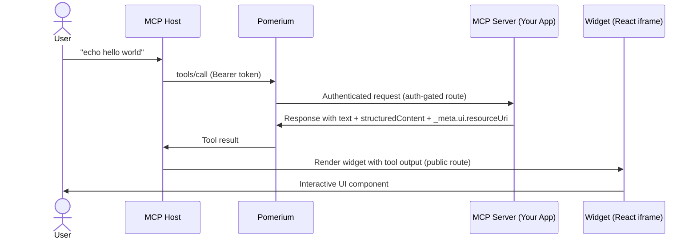

# Develop an MCP App

Build interactive apps using the [MCP Apps extension](https://modelcontextprotocol.io/docs/extensions/apps) — the open standard for rendering interactive UI components inside MCP hosts. The Pomerium template uses the official [`@modelcontextprotocol/ext-apps`](https://modelcontextprotocol.github.io/ext-apps/api/) SDK and works with any MCP Apps spec-compliant host, including ChatGPT, Claude, VS Code, and Goose.

Your MCP server handles tool execution and returns structured data that the host renders as interactive UI components in a sandboxed iframe.

**What you get:**

- An MCP server that registers tools and returns widget-ready structured data
- React-based widgets rendered inside your MCP host as interactive iframes
- UI capability negotiation — the server detects host capabilities and falls back to text-only for non-UI clients
- Secure authentication via Pomerium — use `pom.run` for local development or deploy permanently

## Architecture

The template builds and serves two separate properties:

| Property | Dev | Production | Access policy |
| --- | --- | --- | --- |
| **MCP server** (`/mcp`) | Public URL via `pom.run` tunnel | Public URL via Pomerium | Auth-gated — tool calls always require a Bearer token |
| **Widget assets** | `localhost:4444` (rendered in your browser) | Public URL via Pomerium | **Public** — the MCP host renders widgets in a sandboxed iframe and cannot forward credentials |

The MCP server always needs a publicly reachable URL so the MCP host can reach it. Widget assets only need a public URL in production; during development your local browser loads them directly from localhost.

Tool calls always carry a Bearer token and should be gated by a strict Pomerium policy. Widgets must be publicly accessible because the MCP host renders them in a sandboxed iframe and cannot forward authentication tokens.


```mermaid
sequenceDiagram
  actor U as User
  participant H as MCP Host
  participant P as Pomerium
  participant S as MCP Server (Your App)
  participant W as Widget (React iframe)
  U ->> H: "echo hello world"
  H ->> P: tools/call (Bearer token)
  P ->> S: Authenticated request (auth-gated route)
  S ->> P: Response with text + structuredContent + _meta.ui.resourceUri
  P ->> H: Tool result
  H ->> W: Render widget with tool output (public route)
  W ->> U: Interactive UI component
```

## How it works

Your MCP server registers tools using `registerAppTool` from `@modelcontextprotocol/ext-apps/server`. Each tool response includes:

1. **Text content** — human-readable text for the MCP host's conversation
2. **Structured JSON data** — passed to the widget via the `App.ontoolresult` callback
3. **Widget metadata** — a `_meta.ui.resourceUri` pointing to a widget resource (e.g., `ui://echo`)

The host renders your widget in an iframe. The widget uses the `App` class from `@modelcontextprotocol/ext-apps` to receive tool output and call back into the MCP server via `app.callServerTool()`.

## Prerequisites

- **Node.js 22+** — verify with `node -v`
- **npm 10+** — ships with Node 22, verify with `npm -v`
- An MCP Apps-compatible host (e.g., ChatGPT, Claude, VS Code, Goose)

## Step-by-step

### 1. Scaffold from the template

```bash
git clone https://github.com/pomerium/chatgpt-app-typescript-template my-mcp-app
cd my-mcp-app
npm install
npm run dev
```

This starts both the MCP server (`http://localhost:8080`) and widget dev server (`http://localhost:4444`).

### 2. Expose your MCP server with pom.run

The MCP host needs a public URL to reach your server — `localhost` won't work. In a new terminal (keep `npm run dev` running):

```bash
ssh -R 0 pom.run
```

Sign in and you'll get a public route URL like `https://mcp.your-route-1234.pomerium.app` that tunnels to your local MCP server. The widget dev server (`localhost:4444`) stays local — your browser loads it directly. For full tunneling details, see [Tunnel to ChatGPT During Development](/docs/capabilities/mcp/tunnel-to-chatgpt).

### 3. Connect to your host

Add your public URL + `/mcp` as a connector in your MCP host. For example, in ChatGPT:

1. Go to **Settings → Connectors → Add Connector**
2. Enter your public URL: `https://mcp.your-route-1234.pomerium.app/mcp`
3. Save the connector
4. Start a new chat, add your app, and test with: `echo Hi there!`


Other hosts (Claude, VS Code, Goose) follow the same pattern — add a connector pointing to your `/mcp` endpoint.

### 4. Build your own tools and widgets

The template's echo tool shows the full pattern. The key pieces when adding your own tool:

**Register a tool with UI binding** — use `registerAppTool` to declare the tool and its widget in one place:

```typescript
registerAppTool(
  server,
  'my_tool',
  {
    title: 'My Tool',
    description: 'Does something cool',
    inputSchema: {
      type: 'object',
      properties: {
        input: {type: 'string', description: 'Tool input'},
      },
      required: ['input'],
    },
    _meta: {
      ui: {resourceUri: 'ui://my-widget'},
    },
  },
  async (args) => {
    const input = MyToolInputSchema.parse(args).input;
    return {
      content: [{type: 'text', text: 'Result'}],
      structuredContent: {result: input},
    };
  },
);
```

**Register a widget resource** — the `text/html;profile=mcp-app` MIME type is required for MCP hosts to render the widget:

```typescript
registerAppResource(
  server,
  'ui://my-widget',
  'ui://my-widget',
  {mimeType: RESOURCE_MIME_TYPE},
  async () => ({
    contents: [
      {
        uri: 'ui://my-widget',
        mimeType: RESOURCE_MIME_TYPE, // 'text/html;profile=mcp-app'
        text: await readWidgetHtml('my-widget'),
      },
    ],
  }),
);
```

**Widget entry point** — React component in `widgets/src/widgets/my-widget.tsx` using the `App` class from `@modelcontextprotocol/ext-apps`:

```tsx
import {App} from '@modelcontextprotocol/ext-apps';
import {StrictMode, useEffect, useState} from 'react';
import {createRoot} from 'react-dom/client';

function MyWidget() {
  const [toolOutput, setToolOutput] = useState(null);
  const [theme, setTheme] = useState('light');

  useEffect(() => {
    const app = new App({name: 'MyWidget', version: '1.0.0'});
    app.ontoolresult = (result) =>
      setToolOutput(result.structuredContent ?? null);
    app.onhostcontextchanged = (context) => setTheme(context?.theme ?? 'light');
    app.connect();
  }, []);

  return (
    <div className={theme === 'dark' ? 'dark' : ''}>
      <h1>My Widget</h1>
      <pre>{JSON.stringify(toolOutput, null, 2)}</pre>
    </div>
  );
}

const rootElement = document.getElementById('my-widget-root');
if (rootElement) {
  createRoot(rootElement).render(
    <StrictMode>
      <MyWidget />
    </StrictMode>,
  );
}
```

The build auto-discovers all files matching `widgets/src/widgets/*.{tsx,jsx}` and bundles them with their mounting code.

See the [template README](https://github.com/pomerium/chatgpt-app-typescript-template) for the complete guide: project structure, `App` API reference, display modes, inline widget assets, Storybook, testing, environment variables, and troubleshooting.

## Inline widget assets

Some hosts (e.g., Claude) require fully self-contained HTML — external `<script>` and `<link>` tags won't load inside their sandboxed iframes. Use inline mode for these hosts or when sharing your work remotely via `pom.run`:

```bash
npm run dev:inline
```

This inlines JS/CSS as `<script>`/`<style>` blocks and converts local images to data URIs. The widget build runs in watch mode so file changes are automatically rebuilt.

Inline mode is not needed in production — once deployed to a public URL, hosts fetch widget assets directly via normal URLs.

## For production deployment

You need two Pomerium routes — one for the MCP server (auth-gated) and one for the widgets (public):

```yaml
runtime_flags:
  mcp: true

routes:
  # MCP server — fine-grained authorization required for tool calls
  - from: https://my-mcp-app.your-domain.com
    to: http://my-mcp-app:8080/mcp
    name: My MCP App (server)
    mcp:
      server: {}
    policy:
      allow:
        and:
          - domain:
              is: company.com

  # Widget assets — must be public so the MCP host can render iframes without credentials
  - from: https://my-mcp-app-ui.your-domain.com
    to: http://my-mcp-app-widgets:4444
    name: My MCP App (widgets)
    allow_public_unauthenticated_access: true
```

The MCP server URL you register in your host points to the first (auth-gated) route. Widget resources served by your MCP server reference the second (public) route. Never put the widget route behind an auth policy — MCP hosts cannot forward credentials when loading iframe content.

See [Protect an MCP Server](/docs/capabilities/mcp/protect-mcp-server) for the full setup guide.

## Sample repos and next steps

- [pomerium/chatgpt-app-typescript-template](https://github.com/pomerium/chatgpt-app-typescript-template) — Starter template for MCP Apps with the official ext-apps SDK — full README with project structure, API reference, testing, Docker, and troubleshooting
- [MCP Apps extension spec](https://modelcontextprotocol.io/docs/extensions/apps) — Official standard for interactive UI in MCP hosts
- [ext-apps SDK API reference](https://modelcontextprotocol.github.io/ext-apps/api/) — TypeScript API docs for `@modelcontextprotocol/ext-apps`
- [Tunnel to ChatGPT During Development](/docs/capabilities/mcp/tunnel-to-chatgpt) — pom.run tunneling setup details
- [Protect an MCP Server](/docs/capabilities/mcp/protect-mcp-server) — Deploy permanently behind Pomerium
- [MCP Full Reference](/docs/capabilities/mcp/reference) — Token types, session lifecycle, configuration details
