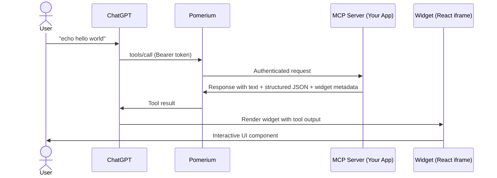

# Develop an MCP UI App

Build interactive ChatGPT Apps (formerly called MCP UI apps) that extend ChatGPT with custom widgets and tools. Your MCP server handles tool execution and returns structured data that ChatGPT renders as interactive UI components.

**What you get:**

- An MCP server that registers tools and returns widget-ready structured data
- React-based widgets rendered inside ChatGPT as interactive iframes
- Secure authentication via Pomerium — use `pom.run` for local development or deploy permanently

## Architecture



## How it works

Your MCP server registers tools that return three things in each response:

1. **Text content** — human-readable text for ChatGPT's conversation
2. **Structured JSON data** — passed to the widget via `window.openai.toolOutput`
3. **Widget metadata** — an `_meta.outputTemplate` pointing to a widget resource (e.g., `ui://echo`)

ChatGPT renders your widget in an iframe. The widget receives tool output data and can call back into the MCP server via `window.openai.callTool()`.

## Step-by-step

### 1. Scaffold from the template

```bash
git clone https://github.com/pomerium/chatgpt-app-typescript-template my-chatgpt-app
cd my-chatgpt-app
npm install
npm run dev
```

This starts an MCP server on `http://localhost:8080` and a widget assets server on `http://localhost:4444`.

### 2. Expose your app with pom.run

```bash
ssh -R 0 pom.run
```

Sign in and you'll get a route URL like `https://mcp.your-route-1234.pomerium.app/`. For details on the tunneling setup, see [Tunnel to ChatGPT During Development](/docs/capabilities/mcp/tunnel-to-chatgpt).

### 3. Connect to ChatGPT

1. In ChatGPT, go to **Settings → Apps → Advanced settings** and enable **Developer mode**
2. Click **Create app**
3. Set **MCP Server URL** to `https://mcp.your-route-1234.pomerium.app/mcp`
4. Set **Authentication** to **OAuth**
5. Test with: "echo today is a great day"

### 4. Build your own tools and widgets

The template includes an echo tool as a starting point. To add your own:

- **Register tools** in the MCP server with handlers that return structured data
- **Create widgets** as React components served as static HTML assets
- **Wire them together** using `_meta.outputTemplate` to point tool responses at widget resources

See the [template README](https://github.com/pomerium/chatgpt-app-typescript-template) for the full development guide.

## For production deployment

To deploy your MCP UI app permanently (not just local development), configure a Pomerium route:

```yaml
runtime_flags:
  mcp: true

routes:
  - from: https://my-chatgpt-app.your-domain.com
    to: http://my-chatgpt-app:8080/mcp
    name: My ChatGPT App
    mcp:
      server: {}
    policy:
      allow:
        and:
          - domain:
              is: company.com
```

See [Protect an MCP Server](/docs/capabilities/mcp/protect-mcp-server) for the full setup guide.

## Sample repos and next steps

- **[pomerium/chatgpt-app-typescript-template](https://github.com/pomerium/chatgpt-app-typescript-template)** — Starter template for ChatGPT Apps with MCP
- [Tunnel to ChatGPT During Development](/docs/capabilities/mcp/tunnel-to-chatgpt) — pom.run tunneling setup details
- [Protect an MCP Server](/docs/capabilities/mcp/protect-mcp-server) — Deploy permanently behind Pomerium
- [MCP Full Reference](/docs/capabilities/mcp/reference) — Token types, session lifecycle, configuration details
