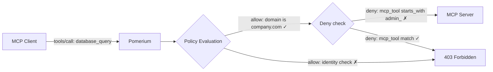

# Limit MCP Tool Calling

Use Pomerium Policy Language (PPL) to control exactly which MCP tools each user or group can call. Block destructive tools, enforce allowlists, and combine tool restrictions with identity-based access control.

**What you get:**

- The `mcp_tool` PPL criterion to match tool names by exact name, prefix, suffix, or list
- Deny-based patterns that block specific tools without affecting non-tool requests
- Allowlist patterns using `not_in` to restrict access to a known-safe set of tools

## Architecture



## The `mcp_tool` criterion

The `mcp_tool` criterion matches the tool name in MCP `tools/call` requests. It uses the [String Matcher](/docs/internals/ppl#string-matcher) format:

| Operator | Description | Example |
| --- | --- | --- |
| `is` | Exact match | `mcp_tool: { is: "database_query" }` |
| `starts_with` | Prefix match | `mcp_tool: { starts_with: "db_" }` |
| `ends_with` | Suffix match | `mcp_tool: { ends_with: "_query" }` |
| `contains` | Substring match | `mcp_tool: { contains: "read" }` |
| `in` | Matches any value in list | `mcp_tool: { in: ["list_tables", "describe_table"] }` |
| `not_in` | Does not match any value (for allowlists under `deny`) | `mcp_tool: { not_in: ["query", "list_tables"] }` |

### Evaluation semantics

- Applies **only** to MCP `tools/call` requests. For `tools/list`, `resources/list`, etc., the criterion evaluates to false.
- Using `mcp_tool` inside `deny` ensures non-tool requests are not inadvertently blocked.
- The tool name is the `name` field from the MCP `tools/call` payload.

:::tip Best practice

Put `mcp_tool` checks under `deny`, not `allow`. This keeps identity checks (domain, groups, email) in `allow` and tool restrictions in `deny`, so non-tool requests like `tools/list` pass through without issues.

:::

## Configuration examples

### Block a single tool

```yaml
routes:
  - from: https://mcp-server.your-domain.com
    to: http://mcp-server.int:8080/mcp
    mcp:
      server: {}
    policy:
      allow:
        and:
          - domain:
              is: company.com
      deny:
        and:
          - mcp_tool:
              is: drop_table
```

### Block tools by prefix

Block all tools starting with `admin_`:

```yaml
policy:
  allow:
    and:
      - groups:
          has: analysts
  deny:
    and:
      - mcp_tool:
          starts_with: 'admin_'
```

### Allowlist with `not_in`

Deny any tool that is **not** in the approved set:

```yaml
policy:
  allow:
    and:
      - domain:
          is: company.com
  deny:
    and:
      - mcp_tool:
          not_in: ['query', 'list_tables']
```

### Combined identity + tool restrictions

Grant access to database tools only for data analysts, while blocking destructive operations for everyone:

```yaml
policy:
  allow:
    and:
      - domain:
          is: company.com
      - groups:
          has: 'data-analysts'
  deny:
    or:
      - mcp_tool:
          in: ['update_data', 'drop_table', 'delete_records']
      - mcp_tool:
          starts_with: 'admin_'
```

## Step-by-step

### 1. Identify tools to restrict

List the tools your MCP server exposes. You can use the MCP Inspector or call the `tools/list` method:

```bash
npx -y @modelcontextprotocol/inspector@latest
```

### 2. Choose a pattern

| Goal                      | Pattern                                    |
| ------------------------- | ------------------------------------------ |
| Block specific tools      | `deny` with `mcp_tool.is` or `mcp_tool.in` |
| Block a category of tools | `deny` with `mcp_tool.starts_with`         |
| Allow only specific tools | `deny` with `mcp_tool.not_in`              |
| Combine with identity     | `allow` for identity + `deny` for tools    |

### 3. Add the policy to your route

Update the `policy` block on your MCP server route. See the [configuration examples](#configuration-examples) above.

### 4. Verify with authorization logs

Enable MCP-specific logging to confirm your policies work:

```yaml
authorize_log_fields:
  - request-id
  - email
  - mcp-method
  - mcp-tool
```

Successful access shows `"allow-why-true": ["domain-ok", "mcp-tool-ok"]`. Blocked access shows `"allow-why-false": ["mcp-tool-unauthorized"]`.

See [Observability](/docs/capabilities/mcp/reference#observability) for the full logging reference.

## Gotchas

**`mcp_tool` in `allow` blocks non-tool requests.** If you put `mcp_tool` exclusively under `allow`, non-`tools/call` requests (like `tools/list`) won't satisfy the condition, and access will be denied. Always use `mcp_tool` in `deny` to avoid this.

## Sample repos and next steps

- **[pomerium/mcp-servers](https://github.com/pomerium/mcp-servers)** — Example MCP servers with policy configurations
- [PPL Documentation](/docs/internals/ppl) — Full Pomerium Policy Language reference
- [MCP Full Reference](/docs/capabilities/mcp/reference) — Token types, session lifecycle, configuration details
