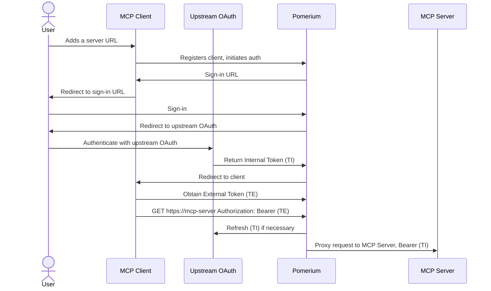

# MCP + Upstream OAuth

When your MCP server needs to call upstream APIs that require OAuth2 (GitHub, Google Drive, Notion, etc.), Pomerium manages the entire OAuth flow and token lifecycle — your server just receives a valid upstream token on every request.

**What you get:**

- Pomerium handles OAuth consent, token exchange, and automatic refresh
- Your MCP server receives the upstream token (TI) in every proxied request — no OAuth logic needed
- External clients never see the upstream token; they only hold a Pomerium-issued external token (TE)

## Architecture



## Configuration

```yaml
runtime_flags:
  mcp: true

routes:
  - from: https://github.your-domain.com
    to: http://github-mcp.int:8080/mcp
    name: GitHub
    mcp:
      server:
        upstream_oauth2:
          client_id: xxxxxxxxxxxx
          client_secret: yyyyyyyyy
          scopes: ['read:user', 'user:email']
          endpoint:
            auth_url: 'https://github.com/login/oauth/authorize'
            token_url: 'https://github.com/login/oauth/access_token'
    policy:
      allow:
        and:
          - domain:
              is: company.com
      deny:
        and:
          - mcp_tool:
              starts_with: 'admin_'
```

:::warning Experimental Feature

MCP support is currently an experimental feature only available in the `main` branch or Docker images built from `main`. To enable MCP functionality, you must set `runtime_flags.mcp: true` in your [Pomerium configuration](/docs/internals/configuration).

:::

## Step-by-step

### 1. Create an OAuth app with your upstream provider

Register an OAuth application with the upstream service. For GitHub:

1. Go to **Settings → Developer settings → OAuth Apps → New OAuth App**
2. Set the authorization callback URL to your Pomerium authenticate service URL
3. Note the **Client ID** and **Client Secret**

For other providers, refer to their OAuth documentation. You need:

- `client_id` and `client_secret`
- `auth_url` and `token_url` endpoints
- The appropriate `scopes` for your use-case

### 2. Configure the route

Add the route configuration shown above. The key addition compared to a [basic MCP server route](/docs/capabilities/mcp/protect-mcp-server) is the `upstream_oauth2` block under `mcp.server`.

See the [MCP Full Reference](/docs/capabilities/mcp/reference#mcp-server-configuration) for all available `upstream_oauth2` options including `auth_style`.

### 3. Run your MCP server

Your MCP server will receive the upstream provider's access token in the `Authorization: Bearer` header of every proxied request. Use this token to call the upstream API directly.

```bash
docker compose up -d
```

### 4. Connect a client

When an MCP client connects, the user will be prompted to:

1. Sign in to Pomerium (identity provider)
2. Authorize with the upstream OAuth provider (e.g., GitHub)

After both steps, the client receives an external token (TE) and can make tool calls normally.

## Common upstream providers

| Provider | Auth URL | Token URL | Common Scopes |
| --- | --- | --- | --- |
| GitHub | `https://github.com/login/oauth/authorize` | `https://github.com/login/oauth/access_token` | `read:user`, `repo` |
| Google | `https://accounts.google.com/o/oauth2/auth` | `https://oauth2.googleapis.com/token` | `https://www.googleapis.com/auth/drive.readonly` |
| Notion | `https://api.notion.com/v1/oauth/authorize` | `https://api.notion.com/v1/oauth/token` | — (configured in integration) |

## Sample repos and next steps

- **[pomerium/mcp-app-demo](https://github.com/pomerium/mcp-app-demo)** — Full MCP app demo with upstream OAuth integration
- [Develop an MCP App](/docs/capabilities/mcp/develop-mcp-app) — Build a UI that discovers and connects to MCP servers
- [MCP Full Reference](/docs/capabilities/mcp/reference) — Token types, session lifecycle, configuration details
