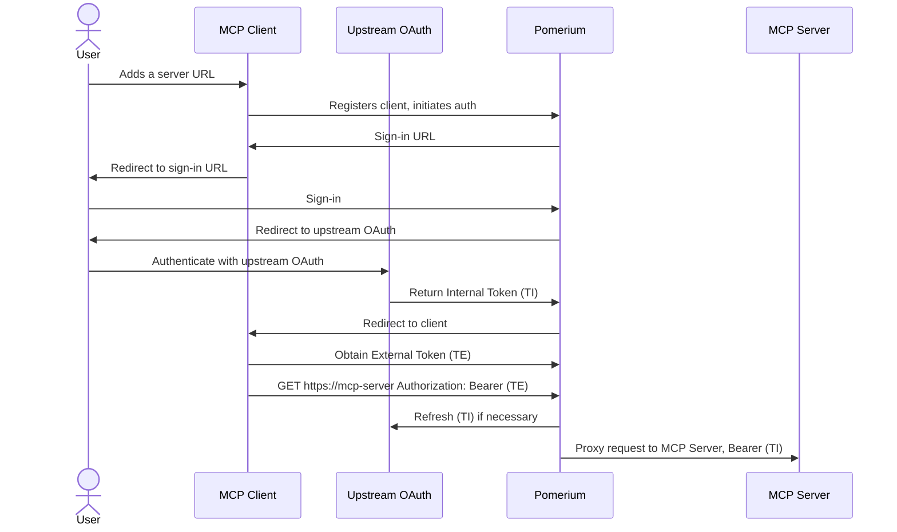

# MCP + Upstream OAuth

Many MCP servers require their own authentication — either because they front an upstream API (GitHub, Google Drive, Notion) or because the MCP server itself enforces OAuth. Pomerium manages the entire upstream OAuth flow and token lifecycle so your clients never handle upstream credentials directly.

Pomerium supports two modes:

- **Static OAuth2** — you register client credentials and endpoints in your route config. Best for upstream APIs where you control the OAuth app registration (GitHub Apps, Google Cloud, etc.).
- **Auto-discovery** — Pomerium automatically discovers the server's authorization requirements at runtime using [RFC 9728 Protected Resource Metadata](https://datatracker.ietf.org/doc/html/rfc9728). Best for third-party MCP servers that advertise their own OAuth configuration.

In both modes, your MCP server receives a valid upstream token on every proxied request — no OAuth logic needed on the server side. External clients only hold a Pomerium-issued external token (TE) and never see the upstream token.

## Architecture


```mermaid
sequenceDiagram
  actor U as User
  participant C as MCP Client
  participant O as Upstream OAuth
  participant P as Pomerium
  participant S as MCP Server
  U ->> C: Adds a server URL
  C ->> P: Registers client, initiates auth
  P ->> C: Sign-in URL
  C ->> U: Redirect to sign-in URL
  U ->> P: Sign-in
  P ->> U: Redirect to upstream OAuth
  U ->> O: Authenticate with upstream OAuth
  O ->> P: Return Internal Token (TI)
  P ->> C: Redirect to client
  C ->> P: Obtain External Token (TE)
  C ->> P: GET https://mcp-server Authorization: Bearer (TE)
  P ->> O: Refresh (TI) if necessary
  P ->> S: Proxy request to MCP Server, Bearer (TI)
```

## Static OAuth2

Use static OAuth2 when you have pre-registered OAuth credentials for the upstream service.

### Configuration

```yaml
runtime_flags:
  mcp: true

routes:
  - from: https://github.your-domain.com
    to: http://github-mcp.int:8080/mcp
    name: GitHub
    mcp:
      server:
        upstream_oauth2:
          client_id: xxxxxxxxxxxx
          client_secret: yyyyyyyyy
          scopes: ['read:user', 'user:email']
          endpoint:
            auth_url: 'https://github.com/login/oauth/authorize'
            token_url: 'https://github.com/login/oauth/access_token'
    policy:
      allow:
        and:
          - domain:
              is: company.com
      deny:
        and:
          - mcp_tool:
              starts_with: 'admin_'
```

:::warning Experimental Feature

MCP support is currently an experimental feature only available in the `main` branch or Docker images built from `main`. To enable MCP functionality, you must set `runtime_flags.mcp: true` in your [Pomerium configuration](/docs/internals/configuration).

:::

### Step-by-step

#### 1. Create an OAuth app with your upstream provider

Register an OAuth application with the upstream service. For GitHub:

1. Go to **Settings → Developer settings → OAuth Apps → New OAuth App**
2. Set the authorization callback URL to your Pomerium authenticate service URL
3. Note the **Client ID** and **Client Secret**

For other providers, refer to their OAuth documentation. You need:

- `client_id` and `client_secret`
- `auth_url` and `token_url` endpoints
- The appropriate `scopes` for your use-case

#### 2. Configure the route

Add the route configuration shown above. The key addition compared to a [basic MCP server route](/docs/capabilities/mcp/protect-mcp-server) is the `upstream_oauth2` block under `mcp.server`.

See the [MCP Full Reference](/docs/capabilities/mcp/reference#mcp-server-configuration) for all available `upstream_oauth2` options including `auth_style`.

#### 3. Run your MCP server

Your MCP server will receive the upstream provider's access token in the `Authorization: Bearer` header of every proxied request. Use this token to call the upstream API directly.

```bash
docker compose up -d
```

#### 4. Connect a client

When an MCP client connects, the user will be prompted to:

1. Sign in to Pomerium (identity provider)
2. Authorize with the upstream OAuth provider (e.g., GitHub)

After both steps, the client receives an external token (TE) and can make tool calls normally.

### Common upstream providers

| Provider | Auth URL | Token URL | Common Scopes |
| --- | --- | --- | --- |
| GitHub | `https://github.com/login/oauth/authorize` | `https://github.com/login/oauth/access_token` | `read:user`, `repo` |
| Google | `https://accounts.google.com/o/oauth2/auth` | `https://oauth2.googleapis.com/token` | `https://www.googleapis.com/auth/drive.readonly` |
| Notion | `https://api.notion.com/v1/oauth/authorize` | `https://api.notion.com/v1/oauth/token` | — (configured in integration) |

## Auto-Discovery (RFC 9728)

When the upstream MCP server advertises its own authorization requirements — rather than relying on pre-registered OAuth credentials — Pomerium can discover and negotiate the OAuth flow automatically at runtime.

This is the mode to use when connecting to third-party MCP servers where you don't register an OAuth app yourself. The upstream server tells Pomerium what authorization it needs, and Pomerium handles the rest.

### How it works

1. Pomerium forwards the client's request to the upstream MCP server
2. The upstream server responds with `401 Unauthorized` and a `WWW-Authenticate` header
3. Pomerium discovers the server's [Protected Resource Metadata (PRM)](https://datatracker.ietf.org/doc/html/rfc9728) — either from a `resource_metadata` hint in the header or from well-known endpoints
4. From the PRM, Pomerium locates the Authorization Server metadata and identifies the required scopes
5. Pomerium identifies itself to the upstream Authorization Server using a [Client ID Metadata Document (CIMD)](https://datatracker.ietf.org/doc/html/draft-ietf-oauth-client-id-metadata-document) — or falls back to [Dynamic Client Registration (DCR)](https://datatracker.ietf.org/doc/html/rfc7591) if the server doesn't support CIMD
6. The user completes the upstream OAuth consent flow
7. Pomerium caches the upstream tokens and injects them into subsequent requests

### Configuration

Auto-discovery requires no upstream OAuth credentials — just define the MCP server route without an `upstream_oauth2` block:

```yaml
runtime_flags:
  mcp: true

routes:
  - from: https://notion.your-domain.com
    to: https://mcp.notion.com
    name: Notion
    mcp:
      server:
        path: /mcp
    policy:
      allow:
        and:
          - domain:
              is: company.com
```

The `mcp.server` block without `upstream_oauth2` tells Pomerium to use auto-discovery. Pomerium will discover the server's authorization requirements, register itself as an OAuth client, and manage the full token lifecycle.

**Optional settings:**

| Setting | Description |
| --- | --- |
| `mcp.server.path` | Sub-path appended to the upstream URL for the MCP endpoint (e.g., `/mcp`) |
| `mcp.server.authorization_server_url` | Fallback Authorization Server URL if PRM discovery fails. Must be HTTPS. |

**Global settings for auto-discovery:**

Auto-discovery involves fetching metadata documents from URLs that originate in upstream server responses. To protect against SSRF, Pomerium validates these URLs against two domain allowlists:

```yaml
# Domains allowed to serve Client ID Metadata Documents (CIMD)
mcp_allowed_client_id_domains:
  - 'vscode.dev'
  - '*.trusted-provider.com'

# Domains allowed for upstream Authorization Server and Protected Resource Metadata fetches
mcp_allowed_as_metadata_domains:
  - 'auth.example.com'
  - '*.oauth-provider.com'
```

| Setting | Description |
| --- | --- |
| `mcp_allowed_client_id_domains` | Domains that may serve Client ID Metadata Documents. Required when MCP clients use URL-based client IDs. Supports wildcards (e.g. `*.example.com`). |
| `mcp_allowed_as_metadata_domains` | Domains Pomerium may contact during upstream OAuth discovery — this includes `resource_metadata` URLs from `WWW-Authenticate` headers and `authorization_servers` entries from PRM documents. Supports wildcards. |

### Step-by-step

#### 1. Add the route to Pomerium

Configure the MCP server route as shown above. The key difference from static OAuth2 is the absence of the `upstream_oauth2` block — Pomerium discovers everything it needs from the server's metadata.

If you know the Authorization Server URL but PRM discovery may not be available, you can set `mcp.server.authorization_server_url` as a fallback.

#### 2. Connect a client

When an MCP client connects, the user will be prompted to:

1. Sign in to Pomerium (identity provider)
2. Authorize with the upstream MCP server's OAuth provider

The first request to the upstream server triggers discovery. After the user completes both auth steps, Pomerium caches the upstream tokens and all subsequent requests are authenticated transparently.

## Sample repos and next steps

- **[pomerium/mcp-app-demo](https://github.com/pomerium/mcp-app-demo)** — Full MCP app demo with upstream OAuth integration
- [Develop an MCP App](/docs/capabilities/mcp/develop-mcp-app) — Build a UI that discovers and connects to MCP servers
- [MCP Full Reference](/docs/capabilities/mcp/reference) — Token types, session lifecycle, configuration details
