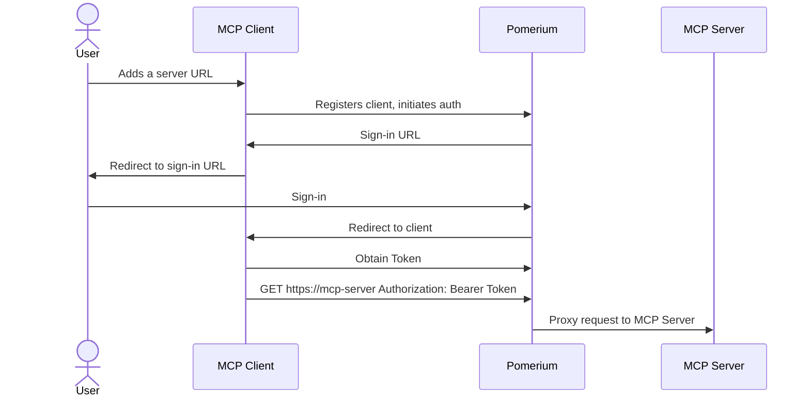

# Protect an MCP Server

Use Pomerium to expose an internal MCP server to external AI clients (Claude, ChatGPT, custom apps) without adding authentication logic to the server itself.

**What you get:**

- External MCP clients authenticate through Pomerium — your server stays auth-free
- Deny-based policies block destructive tools while allowing everything else
- Full observability of every tool call via [authorize log fields](/docs/capabilities/mcp/reference#observability)

## Architecture



## Configuration

```yaml
runtime_flags:
  mcp: true

routes:
  - from: https://my-mcp-server.your-domain.com
    to: http://my-mcp-server.int:8080/mcp
    name: My MCP Server
    mcp:
      server: {} # the brackets are significant, they indicate that this is an MCP server route
    policy:
      allow:
        and:
          - domain:
              is: company.com
      # Block destructive tools (example: any tool prefixed with admin_)
      deny:
        and:
          - mcp_tool:
              starts_with: 'admin_'
```

:::warning Experimental Feature

MCP support is currently an experimental feature only available in the `main` branch or Docker images built from `main`. To enable MCP functionality, you must set `runtime_flags.mcp: true` in your [Pomerium configuration](/docs/internals/configuration).

:::

## Step-by-step

### 1. Run your MCP server

Start any MCP server that speaks the HTTP Streamable transport. It does **not** need to handle authentication — Pomerium takes care of that.

```bash
# Example: start one of the sample servers from the pomerium/mcp-servers repo
docker compose up -d
```

### 2. Add the route to Pomerium

Add the route configuration shown above to your Pomerium config. Key points:

- `mcp.server: {}` tells Pomerium this route fronts an MCP server
- The `policy` block controls who can access the server and which tools are allowed
- See [Limit MCP Tool Calling](/docs/capabilities/mcp/limit-mcp-tools) for advanced policy patterns

### 3. Connect an MCP client

Point any MCP-compatible client at the Pomerium route URL. The client will go through Pomerium's OAuth flow, receive a bearer token, and use it for all subsequent requests.

```
Server URL: https://my-mcp-server.your-domain.com
```

### 4. Verify with the MCP Inspector

Use the MCP Inspector to confirm connectivity:

```bash
npx -y @modelcontextprotocol/inspector@latest
```

- Transport type: Streamable HTTP
- URL: `https://my-mcp-server.your-domain.com`
- Enable OAuth (Quick OAuth Flow)
- Click **Connect**, then **Tools → List Tools**

## Sample repos and next steps

- **[pomerium/mcp-servers](https://github.com/pomerium/mcp-servers)** — Example MCP server implementations with Docker and Pomerium configs
- [Limit MCP Tool Calling](/docs/capabilities/mcp/limit-mcp-tools) — Fine-grained PPL policies for tool access
- [MCP Full Reference](/docs/capabilities/mcp/reference) — Token types, session lifecycle, observability
