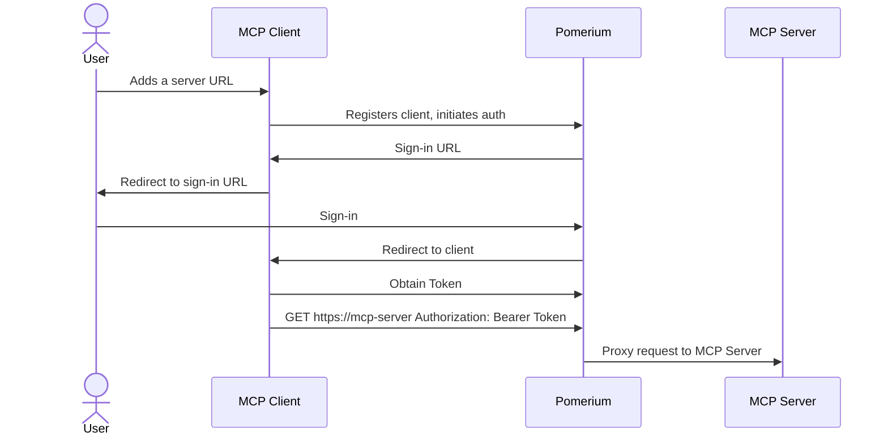
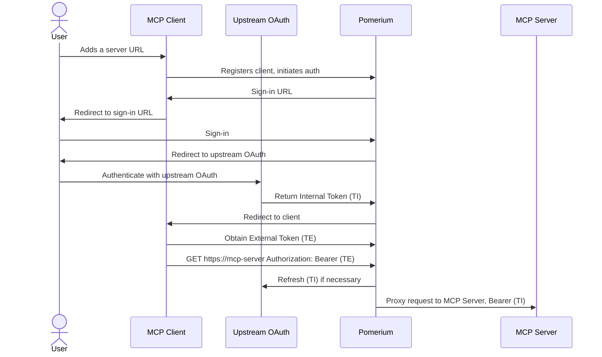
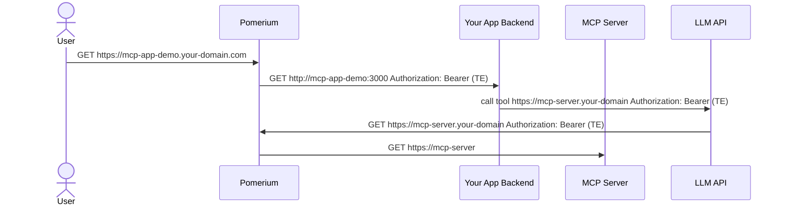

# MCP Full Reference

:::tip Looking for a specific use-case?

Visit the [MCP landing page](/docs/capabilities/mcp) to find the blueprint that matches your goal — from proxying internal servers to limiting tool calls with PPL.

:::

This page is the exhaustive reference for Pomerium's Model Context Protocol (MCP) support. It covers every configuration option, token type, security consideration, and observability feature.

:::warning Experimental Feature

MCP support is currently an experimental feature only available in the `main` branch or Docker images built from `main`. To enable MCP functionality, you must set the following feature flag in your [Pomerium configuration](/docs/internals/configuration):

```yaml
runtime_flags:
  mcp: true
```

:::

## Architecture Overview

Pomerium supports three primary MCP integration patterns. Each pattern has its own dedicated blueprint with step-by-step instructions:

### 1. Exposing Internal MCP Servers

This pattern allows external MCP clients to access your internal MCP servers through Pomerium's secure gateway.

- Your MCP server does not need to implement any specific authentication or authorization logic. Works best with internal services that provide access to shared resource like databases, APIs taking API keys, or other internal tools.
- MCP clients users must authenticate, and Pomerium enforces access policies for every request.



**[Go to Blueprint: Protect an MCP Server →](/docs/capabilities/mcp/protect-mcp-server)**

### 2. MCP Servers with Upstream OAuth

When your MCP server needs to access upstream services requiring OAuth authentication (GitHub, Google Drive, Notion, etc.).

- Pomerium handles the OAuth flow and token management with the remote upstream service.
- Your MCP server does not need to implement any of the OAuth logic, as Pomerium will manage the authentication and token refresh.
- MCP clients only observe the [External Token (TE)](#external-token-te) issued by Pomerium, which is used to access the MCP server. The [Internal Token (TI)](#internal-token-ti) used for upstream OAuth is managed by Pomerium and is never exposed to external clients.

For more details on OAuth configuration options, see [Identity Provider Settings](/docs/reference/identity-provider-settings).



**[Go to Blueprint: MCP + Upstream OAuth →](/docs/capabilities/mcp/mcp-upstream-oauth)**

### 3. Building MCP-Enabled Applications

For internal applications that need to call MCP servers through AI APIs such as OpenAI or Anthropic, Pomerium provides:

- When a route is designated as `mcp: client`, an External Bearer Token would be passed to your application backend in the `Authorization: Bearer` header.
- Your application backend can [list MCP servers that are available](#listing-available-mcp-servers) on the Pomerium backend and initiate [upstream OAuth flows](#initiating-upstream-oauth) if necessary.
- An [External Token (TE)](#external-token-te) can be passed to LLM APIs to allow them to call MCP servers on behalf of the user.

For a complete working example, see the [Demo and Examples](#demo-and-examples) section.



**[Go to Blueprint: Delegate MCP Access to an LLM →](/docs/capabilities/mcp/delegate-mcp-to-llm)**

For detailed route configuration information, see the [Routes reference documentation](/docs/reference/routes).

## Bearer Token Types

Understanding Pomerium's token system is crucial for MCP integration:

### External Token (TE)

An externally-facing token issued by Pomerium representing the user's session. External clients use this token to authenticate requests to Pomerium-protected MCP servers.

**Use cases:**

- Providing to LLM APIs for MCP server access
- Authentication between external MCP clients and Pomerium
- Internal applications calling external AI services

### Internal Token (TI)

An internal authentication token that Pomerium obtains from upstream OAuth providers on behalf of the user. This token is never exposed to external clients and is used by Pomerium to authenticate with upstream services.

**Characteristics:**

- Automatically refreshed by Pomerium
- Securely stored and managed
- Used for upstream API authentication
- Invisible to external clients

## Configuration Options

MCP integration can be configured through global settings and route-level settings. For general route configuration guidance, see the [Routes configuration reference](/docs/reference/routes).

### Global MCP Settings

#### Allowed Client ID Domains

When MCP clients use URL-based client IDs (per the [OAuth 2.0 Client ID Metadata Document](https://datatracker.ietf.org/doc/html/draft-ietf-oauth-client-id-metadata-document) specification), Pomerium validates that the client ID URL's domain is in an allowed list before fetching the metadata document.

```yaml
mcp_allowed_client_id_domains:
  - 'example.com'
  - '*.trusted-provider.com'
```

| Setting | Description |
| --- | --- |
| `mcp_allowed_client_id_domains` | List of allowed domain patterns for MCP client ID metadata URLs. Supports wildcard patterns (e.g., `*.example.com`). Required when using URL-based client IDs. |

**Behavior:**

- Only domains matching the configured patterns can be used as client ID metadata URLs
- Wildcard patterns like `*.example.com` match subdomains (e.g., `app.example.com`) but not the bare domain
- If a client attempts to use a client ID from a domain not in the allowed list, Pomerium displays a user-friendly error page explaining the restriction, along with the request ID and the attempted client ID for troubleshooting

**Example error scenario:**

If a user tries to authorize with a client ID like `https://untrusted-app.com/oauth/client` and `untrusted-app.com` is not in `mcp_allowed_client_id_domains`, they will see an error page stating:

> "The administrator of this Pomerium Proxy restricted the list of MCP client ID document domains that may be used."

The error page includes the request ID and the attempted client ID to help administrators diagnose configuration issues.

### MCP Server Configuration

For routes hosting MCP servers:

```yaml
mcp:
  server:
    # Optional: Configure upstream OAuth2 for services requiring authentication
    upstream_oauth2:
      client_id: 'your-oauth-client-id'
      client_secret: 'your-oauth-client-secret'
      endpoint:
        auth_url: 'https://provider.com/oauth/authorize'
        token_url: 'https://provider.com/oauth/token'
        auth_style: 'header' # or "params"
      scopes: ['scope1', 'scope2']

    # Optional: Maximum request body size (default: 4KiB)
    max_request_bytes: 1048576
```

** Tool Call Authorization **

When using [Pomerium Policy Language (PPL)](/docs/internals/ppl) with MCP routes, you can control access to specific tools, in addition to the standard route policies. For detailed examples and patterns, see the [Limit MCP Tool Calling](/docs/capabilities/mcp/limit-mcp-tools) blueprint.

```yaml
policy:
  allow:
    and:
      - email:
          is: analyst@company.com
      - mcp_tool:
          is: database_query
```

For more information on route-level policies, see [Route Policy Configuration](/docs/reference/routes/policy).

### MCP Client Configuration

For applications that consume MCP servers:

```yaml
mcp:
  # Provides the application with external tokens for MCP server access.
  # the brackets are significant, they indicate that this is an MCP client route
  client: {}
```

For Client routes, Pomerium exposes additional endpoints to manage MCP server discovery and upstream OAuth flows. See [Develop an MCP App](/docs/capabilities/mcp/develop-mcp-app) for a walkthrough.

#### Listing Available MCP Servers

Applications can discover available MCP servers by making a request to the `/.pomerium/mcp/routes` endpoint:

```http
GET https://your-app.domain.com/.pomerium/mcp/routes
Authorization: Bearer <external-token>
Accept: application/json
```

**Response:**

```json
{
  "servers": [
    {
      "name": "Database Server",
      "url": "https://db-mcp.your-domain.com",
      "connected": true
    },
    {
      "name": "GitHub Server",
      "url": "https://github-mcp.your-domain.com",
      "connected": false
    }
  ]
}
```

The `connected` field indicates whether the user has completed all required upstream OAuth flows.

#### Initiating Upstream OAuth

If a server shows `connected: false`, redirect users to complete upstream authentication:

```
https://mcp-server.your-domain.com/.pomerium/mcp/connect?redirect_url=https://your-app.domain.com/callback
```

**Requirements:**

- The `redirect_url` must match a configured MCP client route host
- Users will be redirected back to the specified URL after authentication

## User Identity and Claims

Both MCP client applications and servers can access authenticated user information through the [`X-Pomerium-Assertion`](https://www.pomerium.com/docs/get-started/fundamentals/core/jwt-verification#get-the-x-pomerium-jwt-assertion-header) HTTP header. This header contains a signed JWT with user details including email, name, and other claims.

**Example JWT payload:**

```json
{
  "sub": "user@example.com",
  "email": "user@example.com",
  "name": "John Doe",
  "groups": ["engineering", "admin"],
  "iss": "your-domain.com",
  "aud": "your-app.domain.com"
}
```

JWT may be verified using standard [JWT libraries](https://jwt.io/) or Pomerium's SDKs for [Go](https://github.com/pomerium/sdk-go) or [Python](https://github.com/pomerium/js-sdk).

For detailed information about JWT verification in Pomerium, see [Identity Verification with JWTs](/docs/get-started/fundamentals/core/jwt-verification).

## Security Considerations

For general security best practices with Pomerium, see the [Security documentation](/docs/internals/security).

### Access Control

Apply appropriate policies to MCP routes:

```yaml
routes:
  - from: https://sensitive-mcp-server.domain.com
    to: http://internal-server:8080/mcp
    mcp:
      server: {}
    policy:
      allow:
        and:
          - domain:
              is: trusted-domain.com
```

### Token Security

- [External tokens (TE)](#external-token-te) have limited scope and lifetime
- [Internal tokens (TI)](#internal-token-ti) are never exposed to external clients
- All tokens are automatically refreshed by Pomerium
- All authorization decisions are logged for audit (see [Observability](#observability))

### MCP Session Lifecycle

Pomerium's MCP authorization server implements OAuth 2.1 refresh token support as required by the [MCP Authorization specification](https://modelcontextprotocol.io/specification/2025-11-25/basic/authorization). This enables MCP clients to maintain long-running sessions without requiring repeated user authentication.

**Standard OAuth 2.1 Behavior:**

- Access tokens are short-lived
- Refresh tokens are long-lived
- MCP clients use `grant_type=refresh_token` to obtain new access tokens
- Refresh tokens are rotated on each use for public clients (per OAuth 2.1 security requirements)

**Session Recreation**

Pomerium's internal session management uses [`cookie_expiration`](/docs/reference/cookies#cookie-expiration) to control session lifetime. To support standard OAuth 2.1 refresh token behavior, Pomerium automatically recreates sessions when an MCP client presents a valid refresh token but the underlying Pomerium session has expired. This is done by using the stored upstream identity provider refresh token to obtain fresh credentials.

**How Session Recreation Works:**

1. MCP client sends a refresh token request
2. Pomerium detects the original session has expired
3. Pomerium uses the stored upstream IdP refresh token to obtain new identity tokens
4. A new Pomerium session is created with the refreshed identity
5. New MCP access and refresh tokens are issued

**Security Implications:**

- **Extended session lifetime**: MCP sessions can outlive the configured `cookie_expiration`. The effective session lifetime is bounded by the MCP refresh token lifetime and the upstream IdP's refresh token validity.
- **Identity re-validation**: Session recreation requires successful refresh with the upstream IdP, ensuring the user's identity is still valid and not revoked.
- **Policy enforcement**: The recreated session is subject to current authorization policies, so policy changes take effect on recreation.
- **Failure modes**: Session recreation fails if the upstream IdP refresh token has expired, been revoked, or the IdP account has been disabled. In these cases, the MCP client receives an `invalid_grant` error and must re-authenticate.

**Considerations for Operators:**

- If strict session lifetime enforcement is required, configure your upstream IdP's refresh token lifetime or session policies accordingly, as MCP session recreation depends on successful upstream token refresh
- Upstream IdP session policies (e.g., forced re-authentication, account disablement) are enforced during session recreation—if the IdP denies the refresh, the MCP client receives an `invalid_grant` error

## Observability

Pomerium provides specialized logging capabilities to monitor and audit MCP tool calling activities. By configuring [`authorize_log_fields`](/docs/reference/authorize-log-fields), you can gain detailed insights into AI agent interactions with your MCP servers.

For general observability features, see [Metrics](/docs/reference/metrics) and [Tracing](/docs/reference/tracing).

### MCP-Specific Authorization Log Fields

Pomerium includes three specialized log fields for MCP monitoring:

| Field | Description | Example Value |
| --- | --- | --- |
| `mcp-method` | The MCP JSON-RPC method being called | `"tools/call"`, `"tools/list"` |
| `mcp-tool` | The specific tool name being invoked (for `tools/call` requests) | `"database_query"`, `"list_files"` |
| `mcp-tool-parameters` | The parameters passed to the tool | `{"query": "SELECT * FROM users", "limit": 100}` |

### Configuration

To enable MCP-specific logging, add the desired fields to your [`authorize_log_fields`](/docs/reference/authorize-log-fields) configuration:

```yaml
authorize_log_fields:
  - request-id
  - user
  - email
  - mcp-method
  - mcp-tool
  - mcp-tool-parameters
```

### Example Log Output

When an AI agent calls an MCP tool, Pomerium generates detailed authorization logs:

```json
{
  "level": "info",
  "service": "authorize",
  "request-id": "c9afae5a-ec5a-4242-864f-df4189f20e99",
  "user": "google-oauth2|115420664726183323237",
  "email": "analyst@company.com",
  "mcp-method": "tools/call",
  "mcp-tool": "database_query",
  "mcp-tool-parameters": {
    "query": "SELECT * FROM sales WHERE year = 2024",
    "limit": 100,
    "format": "json"
  },
  "allow": true,
  "allow-why-true": ["domain-ok", "mcp-tool-ok"],
  "deny": false,
  "deny-why-false": [],
  "time": "2024-06-24T10:26:33-04:00",
  "message": "authorize check"
}
```

### Understanding MCP Authorization Logs

For general information about authorization logs, see [Authorize Log Fields](/docs/reference/authorize-log-fields).

#### Tool Call Authorization

When using [Pomerium Policy Language (PPL)](/docs/internals/ppl) with MCP routes, you can control access to specific tools:

```yaml
policy:
  allow:
    and:
      - email:
          is: analyst@company.com
      - mcp_tool:
          is: database_query
```

The authorization log will show:

- `allow: true` and `mcp-tool-ok` when the tool is permitted
- `allow: false` and `mcp-tool-unauthorized` when the tool is blocked

#### Method-Level Monitoring

Different MCP methods appear in logs:

**Tool Listing Request:**

```json
{
  "mcp-method": "tools/list",
  "allow": true,
  "allow-why-true": ["authenticated-user"]
}
```

**Tool Execution Request:**

```json
{
  "mcp-method": "tools/call",
  "mcp-tool": "search_knowledge_base",
  "mcp-tool-parameters": {
    "query": "company policies",
    "max_results": 10
  }
}
```

**Resource Request:**

```json
{
  "mcp-method": "resources/list",
  "allow": true
}
```

## Policy-Based Tool Access Control

Pomerium provides fine-grained access control for MCP tools through a specialized `mcp_tool` policy criterion in [Pomerium Policy Language (PPL)](/docs/internals/ppl). This allows you to control which users can access specific MCP tools, providing granular security for AI agent interactions.

For a step-by-step walkthrough with examples, see the [Limit MCP Tool Calling](/docs/capabilities/mcp/limit-mcp-tools) blueprint.

For broader policy examples, see the [Authorization documentation](/docs/capabilities/authorization).

### The `mcp_tool` Criterion

The `mcp_tool` criterion is designed specifically for MCP routes and allows policy enforcement at the individual tool level. It uses the [String Matcher](/docs/internals/ppl#string-matcher) format and supports all standard string matching operators.

| Operator | Description | Example |
| --- | --- | --- |
| `is` | Exact match of the tool name | `mcp_tool: { is: "database_query" }` |
| `starts_with` | Tool name starts with the specified prefix | `mcp_tool: { starts_with: "db_" }` |
| `ends_with` | Tool name ends with the specified suffix | `mcp_tool: { ends_with: "_query" }` |
| `contains` | Tool name contains the specified substring | `mcp_tool: { contains: "read" }` |
| `in` | Tool name matches one of the provided values | `mcp_tool: { in: ["list_tables", "describe_table"] }` |
| `not_in` | Tool name does not match any of the provided values (useful to enforce allowlists under `deny`) | `mcp_tool: { not_in: ["query", "list_tables"] }` |

#### Evaluation semantics

- Applies only to MCP JSON-RPC method `tools/call`. For any other MCP method (for example, `tools/list`, `resources/list`), the criterion evaluates to false and won't match.
- When the request is not a tool call, you may see a corresponding reason in logs indicating the request was not a tool call; using `mcp_tool` inside a `deny` block ensures those non-tool requests are not inadvertently denied.
- The tool name used for matching is the `name` sent in the MCP `tools/call` payload (surfaced as `mcp-tool` in [authorize logs](#mcp-specific-authorization-log-fields)).

#### Recommended usage: put `mcp_tool` checks under `deny`

In most deployments, you should keep your positive authorization (identity, groups, domains) in `allow`, and use `mcp_tool` primarily under `deny` to block specific tools or entire classes of tools. This provides two benefits:

- Non-`tools/call` requests (like `tools/list`, `initialize`) are not accidentally blocked just because they don't match `mcp_tool`.
- You can layer a clear, explicit blocklist or whitelist around tool names without intertwining it with identity checks.

### Deny‑focused patterns

Block a single tool:

```yaml
policy:
  allow:
    and:
      - domain:
          is: company.com
  deny:
    and:
      - mcp_tool:
          is: drop_table
```

Block a class of tools by prefix (for example, any destructive admin tools):

```yaml
policy:
  allow:
    and:
      - groups:
          has: analysts
  deny:
    and:
      - mcp_tool:
          starts_with: 'admin_'
```

Note:

- `mcp_tool` currently works best for deny-based block lists (exact names, prefixes, etc.).

To flip this around and implement an allowlist, you can deny any tool name not in the approved set using the `not_in` operator:

```yaml
policy:
  allow:
    and:
      - domain:
          is: company.com
  deny:
    and:
      - mcp_tool:
          not_in: ['query', 'list_tables']
```

### Example

Grant access to database query tools only to data analysts:

```yaml
policy:
  allow:
    and:
      - domain:
          is: company.com
      - groups:
          has: 'data-analysts'
  deny:
    or:
      - mcp_tool:
          in: ['update_data', 'drop_table', 'delete_records']
      - mcp_tool:
          starts_with: 'admin_'
```

For more advanced policy patterns, see the [PPL documentation](/docs/internals/ppl).

### Understanding Authorization Results

The authorization logs show different reason codes based on the evaluation:

**Successful Tool Access:**

```json
{
  "allow": true,
  "allow-why-true": ["domain-ok", "mcp-tool-ok"],
  "mcp-tool": "database_query"
}
```

**Blocked Tool Access:**

```json
{
  "allow": false,
  "allow-why-false": ["mcp-tool-unauthorized"],
  "deny": false,
  "mcp-tool": "admin_function"
}
```

### Gotchas when using `mcp_tool` in `allow`

Putting `mcp_tool` exclusively under `allow` means non-`tools/call` requests (like `tools/list`) won't satisfy the `allow` condition and could cause the overall decision to be denied unless you add separate `allow` clauses for those operations. Prefer using `mcp_tool` in `deny` to block specific tools while keeping general access (identity, domain, groups) in `allow`.

## Related Documentation

### Core Pomerium Concepts

- [Authentication](/docs/capabilities/authentication) - User authentication methods
- [Authorization](/docs/capabilities/authorization) - Access control and policies
- [Pomerium Policy Language (PPL)](/docs/internals/ppl) - Policy syntax and examples
- [Routes Configuration](/docs/reference/routes) - Route setup and options
- [Identity Verification with JWTs](/docs/get-started/fundamentals/core/jwt-verification) - JWT headers and verification

### MCP Blueprints

- [Protect an MCP Server](/docs/capabilities/mcp/protect-mcp-server) - Proxy internal MCP servers securely
- [MCP + Upstream OAuth](/docs/capabilities/mcp/mcp-upstream-oauth) - OAuth2 for GitHub, Google, Notion, etc.
- [Tunnel to ChatGPT](/docs/capabilities/mcp/tunnel-to-chatgpt) - Dev tunneling with pom.run
- [Limit MCP Tool Calling](/docs/capabilities/mcp/limit-mcp-tools) - Fine-grained PPL tool policies
- [Develop an MCP App](/docs/capabilities/mcp/develop-mcp-app) - Build ChatGPT Apps with widgets
- [Delegate MCP Access to an LLM](/docs/capabilities/mcp/delegate-mcp-to-llm) - Token delegation to LLM APIs

### Configuration References

- [Route Policy Configuration](/docs/reference/routes/policy) - Policy configuration for routes
- [Authorize Log Fields](/docs/reference/authorize-log-fields) - Logging configuration
- [Identity Provider Settings](/docs/reference/identity-provider-settings) - OAuth provider setup

### Observability and Security

- [Metrics](/docs/reference/metrics) - Performance and usage metrics
- [Tracing](/docs/reference/tracing) - Request tracing and debugging
- [Security](/docs/internals/security) - Security best practices

### Related Guides

- [Self-Hosted LLM Behind Pomerium](/docs/guides/llm) - Securing LLM interfaces with Pomerium

### Demo and Examples

For complete end-to-end examples and reference implementations:

- **[MCP App Demo](https://github.com/pomerium/mcp-app-demo)**: Full demonstration showing custom UI frontend, MCP server integration, and remote LLM API calling through Pomerium
- **[MCP Servers](https://github.com/pomerium/mcp-servers)**: Collection of example MCP server implementations with Docker and Pomerium configurations
- **[ChatGPT App Template](https://github.com/pomerium/chatgpt-app-typescript-template)**: Example ChatGPT app with MCP server for use with pom.run tunneling

These repositories provide practical examples of all integration patterns described in this documentation.
