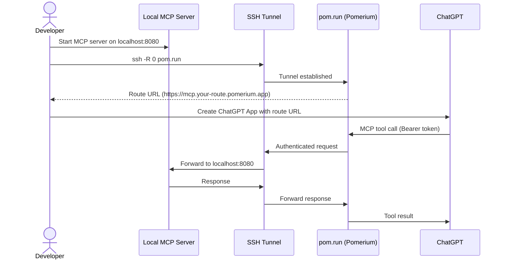
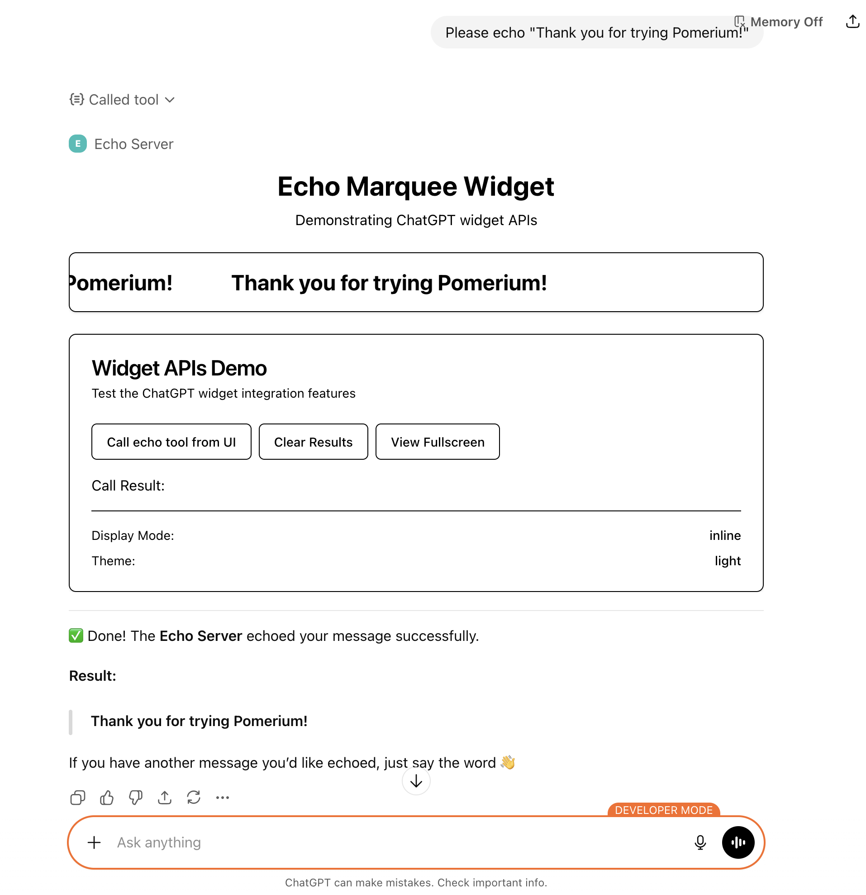
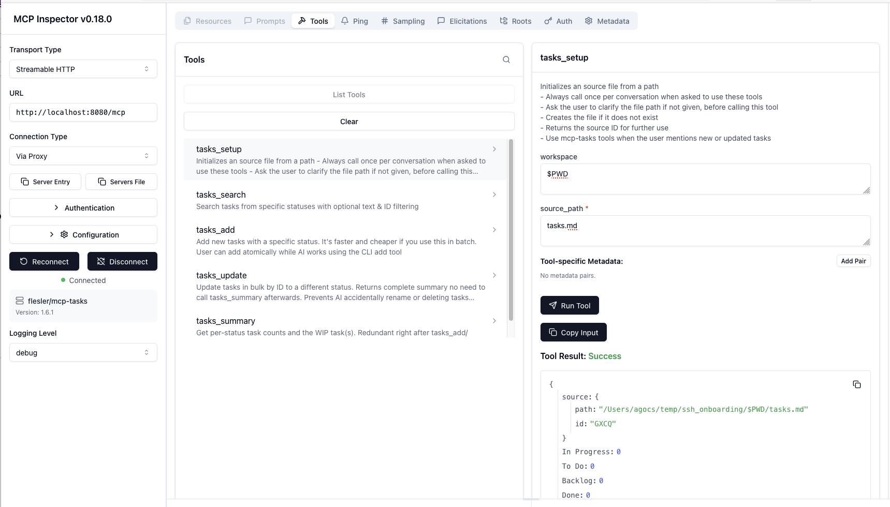

# Tunnel to ChatGPT During Development

Use `pom.run` to create an SSH tunnel from your local machine to a Pomerium-hosted proxy, giving ChatGPT (or any external MCP client) a secure, authenticated URL to reach your local MCP server.

**What you get:**

- One command (`ssh -R 0 pom.run`) to expose a local MCP server over HTTPS
- Pomerium authenticates and authorizes every request — no ngrok, no Cloudflare Tunnel
- Works with ChatGPT Apps, Claude, and any MCP client that supports OAuth

## Architecture



## Prerequisites

- A local MCP server that implements the HTTP Streamable protocol on port 8080
- An MCP client (e.g., a ChatGPT Plus subscription)
- SSH client (already installed on macOS/Linux)

### A note on OAuth

Pomerium uses OAuth to authenticate requests. An MCP client will use OAuth to assume the identity of the user (i.e. you). It is easiest to use one common account (e.g. your Google account) when signing in to ChatGPT and Pomerium.

## Step-by-step

### 1. Start a local MCP server

Clone the example ChatGPT app template and start it:

```bash
git clone https://github.com/pomerium/chatgpt-app-typescript-template my-mcp-app
cd my-mcp-app
npm install
npm run dev
```

This starts an MCP server on `http://localhost:8080` and an assets server on `http://localhost:4444`.

### 2. Open the SSH tunnel

```bash
ssh -R 0 pom.run
```

This creates an SSH reverse port forwarding tunnel from [pom.run](https://pom.run) to your computer. Traffic sent to the Pomerium-hosted proxy is forwarded to port 8080 on your machine.

You will see a sign-in prompt:

```
Please sign in with hosted to continue
http://data-plane-us-centrial1-1.dataplane.pomerium.com/.pomerium/sign_in?user_code=xxxxxxxx
```

Click the link and sign in (or sign up if this is your first time).

### 3. Use the Pomerium Terminal UI (TUI)

After signing in, the Pomerium TUI appears in your terminal with a route URL like `https://mcp.your-route-1234.pomerium.app/`.


The TUI panes show:

- **Active Connections** — unique connections from remote machines to your local server
- **Client Requests** — unique port forwarding requests
- **Port Forward Status** — status of tunnels into your local machine
- **Logs** — events from the Pomerium proxy server

### 4. Create a ChatGPT App

Sign in to your ChatGPT Plus account. Go to **Settings → Apps → Advanced settings**, enable **Developer mode**, then click **Create app**.

Fill in:

- **Name**: Echo Server (or your app name)
- **MCP Server URL**: `https://mcp.your-route-1234.pomerium.app/mcp`
- **Authentication**: OAuth
- **I understand and want to continue**: check

### 5. Test it

Ask ChatGPT to call your app. For example: "Use the Echo Server app to echo 'Hello from Pomerium!'"



## How it all works

You have a local MCP server implementing a ChatGPT Apps widget. The SSH reverse port forwarding tunnel creates a secure, encrypted connection from Pomerium's hosted proxy to your computer. That provides a URL, and Pomerium authenticates and authorizes every request it proxies to your computer.

ChatGPT uses OAuth to authenticate itself as you. When ChatGPT makes MCP tool calls, they go to the Pomerium hosted proxy, which checks authentication and authorization, then proxies the request through the SSH tunnel to your local MCP server.


## Troubleshooting

Use the MCP Inspector to verify your MCP server is running correctly:

```bash
npx -y @modelcontextprotocol/inspector@latest
```

### Connecting to the local port

- Transport type: Streamable HTTP
- URL: `http://localhost:8080/mcp`
- Connection Type: Via Proxy
- Click **Connect**

You should be able to click **Tools → List Tools** and see the tools exposed by your MCP server.



### Connecting via the Pomerium proxy

Click **Disconnect**, then click **OAuth Settings → Quick OAuth Flow**. You should see "Authentication completed successfully".

Change the URL to your hosted route URL and click **Connect**. You should be able to call tools on your MCP server as before.

## Sample repos and next steps

- **[pomerium/chatgpt-app-typescript-template](https://github.com/pomerium/chatgpt-app-typescript-template)** — Starter template for ChatGPT apps with MCP
- [Protect an MCP Server](/docs/capabilities/mcp/protect-mcp-server) — Deploy a permanent MCP server behind Pomerium
- [MCP Full Reference](/docs/capabilities/mcp/reference) — Token types, session lifecycle, configuration details
