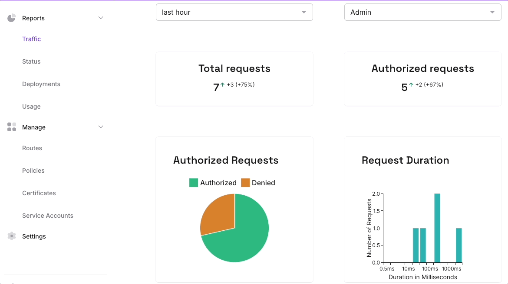
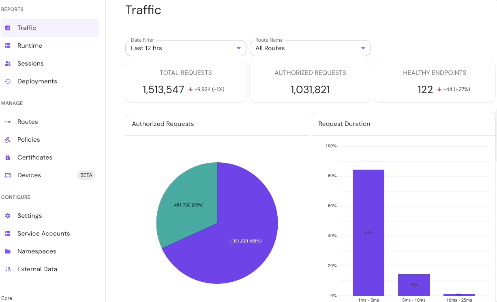
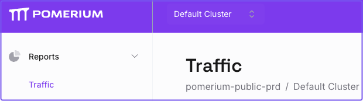
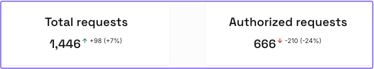
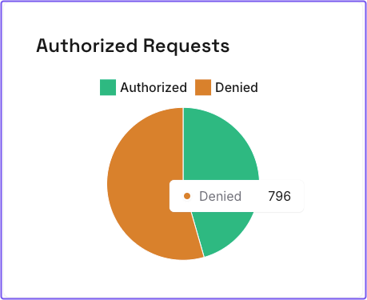
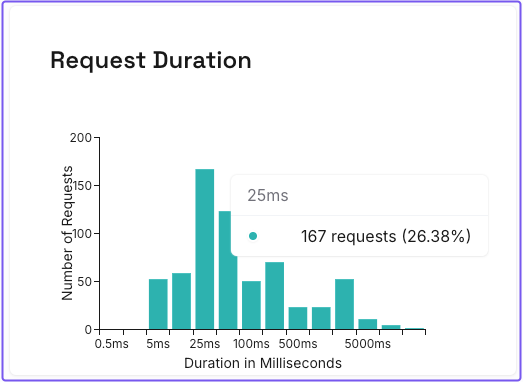
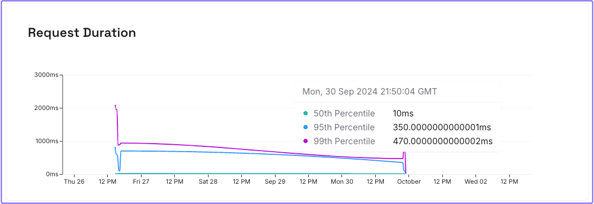
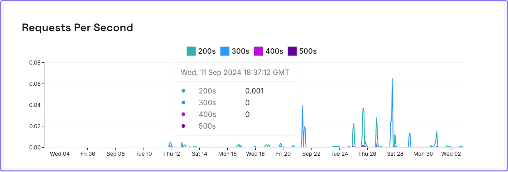
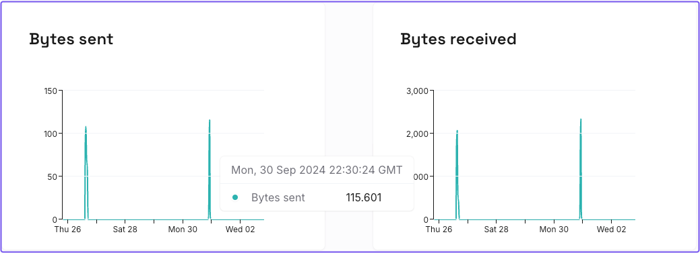

---
# cSpell:ignore XPOST tsdb

title: Metrics in Pomerium
sidebar_label: Metrics
description: Learn how Pomerium collects and displays metrics in Pomerium Zero and Pomerium Enterprise.
lang: en-US
keywords: [pomerium, pomerium enterprise, telemetry, metrics, prometheus, pomerium zero]
---

import Tabs from '@theme/Tabs';
import TabItem from '@theme/TabItem';

Metrics in Pomerium provide observability and monitoring data from your Pomerium deployment. You can use metrics to review traffic and monitor the status of a directory sync in Pomerium Enterprise.

Metrics are available only in Pomerium Zero and Pomerium Enterprise deployments. 

## Metrics definitions

- **Traffic**: requests proxied by Pomerium to routes defined in a Pomerium deployment.
- **Route**: the location of an upstream service protected behind Pomerium. At a minimum, a route consists of a [From](/docs/reference/routes/from) URL and a [To](/docs/reference/routes/to) URL.

## How metrics work

Pomerium collects and aggregates traffic data from your Pomerium deployment. This data includes the:

- request size, duration, and rate
- number of authorized and denied requests
- response code distribution

You can view and filter this data in your traffic dashboard to gauge how much demand is placed on your server.

### Filter metrics

#### Time range and routes

Pomerium stores traffic metrics up to the last 30 days of usage. You can filter traffic by time range and routes.

<Tabs>
<TabItem label="Zero" value="zero">

</TabItem>
<TabItem label="Enterprise" value="enterprise">

</TabItem>
</Tabs>

## Metrics in Pomerium Zero

Pomerium Zero collects metrics at the [cluster](/docs/concepts/clusters) level, which includes active replicas. To review the traffic dashboard in Pomerium Zero:

1. In the left-hand sidebar, select **Reports**.
1. Select **Traffic**.

    

### Total and Authorized requests

The **Total requests** chart shows the total number of proxied requests. The **Authorized requests** chart shows the total number of requests that Pomerium authorized and forwarded to an upstream service. Both charts display the number of requests for the selected time range compared to the previous time range.   
    

The **Authorized Requests** pie chart displays the total number of authorized and denied requests.
    

### Request durations

Request duration measures the amount of time it takes Pomerium to proxy a request in milliseconds. Pomerium Zero provides two request duration charts. 

The first chart sums requests with similar durations and calculates the amount as a percentage value. 

The second chart organizes requests by percentile ranges, date, and time.

### Requests per second

The **Requests per second** chart calculates the average amount of proxied requests per second over the time span of an hour. Requests are organized by date and time, and categorized by the following response status codes:

- **200s** (200-299): successful responses  
- **300s** (300-399): redirection messages
- **400s** (400-499): client error responses
- **500s** (500-599): server error responses

### Bytes sent and received

The **Bytes sent** and **Bytes received** charts display the total amount of bytes sent and received over the time spand of an hour.

