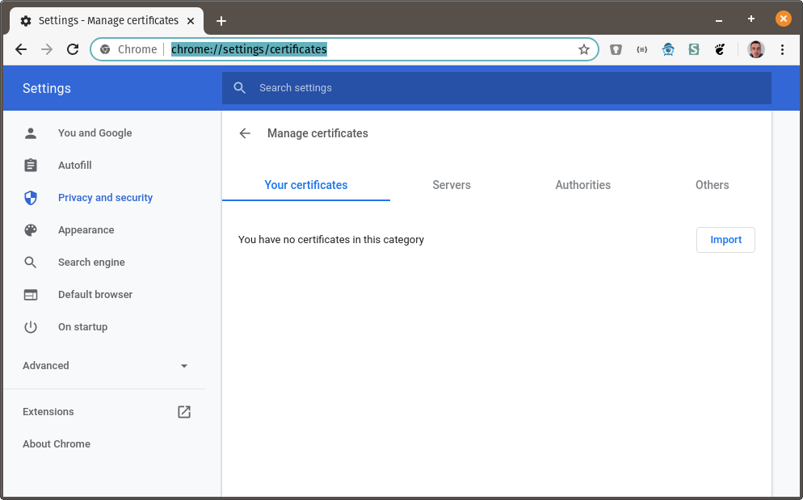
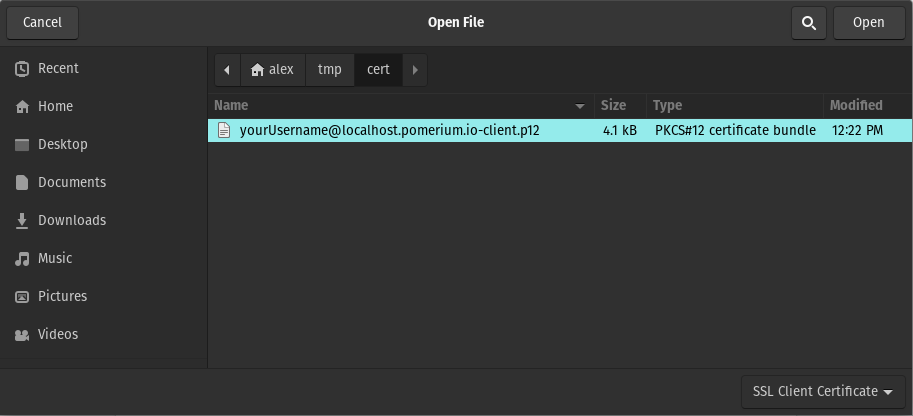
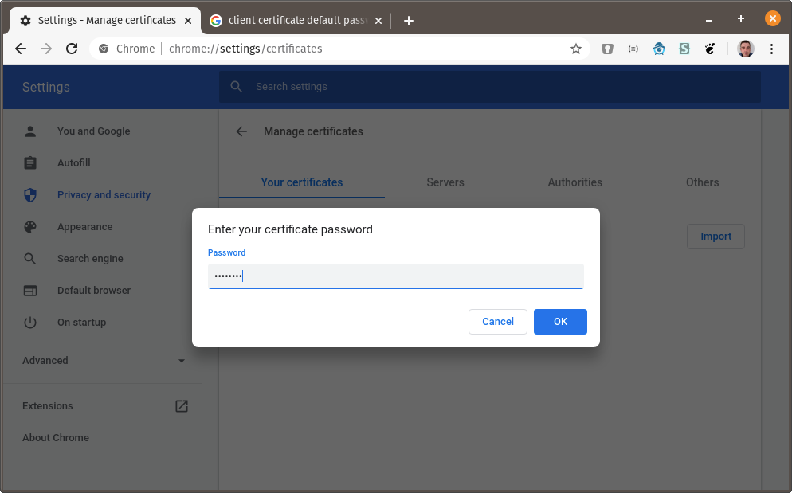
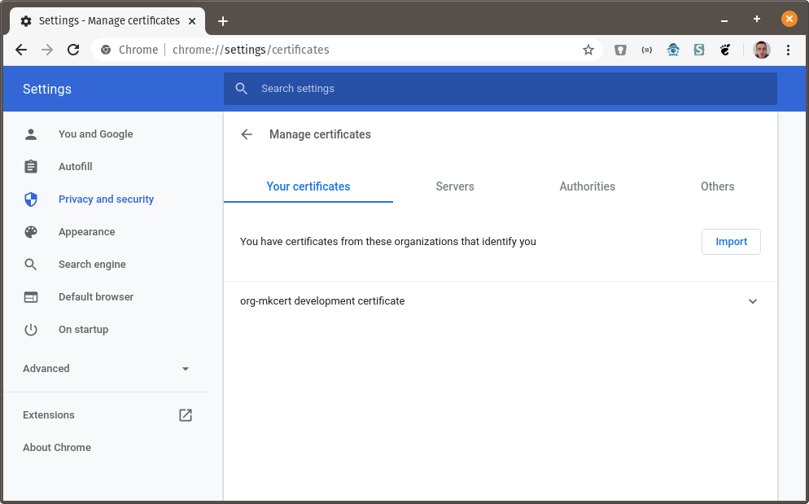
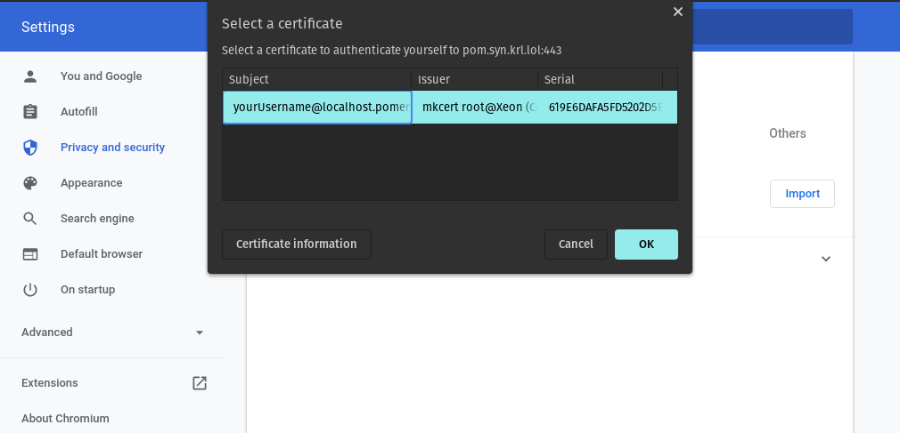

---
# cSpell:ignore caroot changeit

title: Client-Side mutual TLS (mTLS) With Pomerium
sidebar_label: mTLS - Clients
lang: en-US
keywords:
  [
    pomerium,
    identity access proxy,
    mtls,
    client certificate,
    mutual authentication,
    server certificate
  ]
description: This guide covers how to use Pomerium to implement mutual authentication (mTLS) for end-users, using client certificates with a custom certificate authority.
---

import Tabs from '@theme/Tabs';
import TabItem from '@theme/TabItem';

Client-side transport layer security (TLS) is an authentication scheme that uses the TLS protocol to authenticate a client (user) to a server. Secure communication on the web typically refers to using signed server certificates with the TLS protocol, which authenticates the server to the client.

This ensures that TLS connections between the client and server are both private and authenticated, preventing eavesdropping and impersonation of the server, but it doesn't authenticate the client to the server.

Requiring client-side TLS means the client must also authenticate itself by providing a signed client certificate to the server so the server can verify the client’s identity. Only after the server can successfully verify the identity of the client will the server secure communication with TLS.

This authentication scheme is known as mutual authentication, or in the context of this guide, **client-side mTLS**. Pomerium supports requiring signed client certificates with the `client_ca` and `client_ca_file` configuration settings.

This guide shows you how to configure Pomerium to implement mutual authentication using client certificates with a custom certificate authority.


## Before You Begin

Pomerium Core and Enterprise both support client-side mTLS.

To complete this guide, you need:
- A working Pomerium instance. Complete the [Pomerium Core quickstart](/docs/quickstart) with Docker for a quick proof of concept to test with this guide.
- An [identity provider](/docs/identity-providers)
- `mkcert` to create self-signed certificates and a locally trusted root Certificate Authority (CA)

:::caution

The `mkcert` tool is designed for testing: It creates a locally-trusted root certificate for development purposes. This guide uses `mkcert` for a proof-of-concept example, but consider using a different certificate solution for production environments.

:::

## Create certificates

This guide uses the `localhost.pomerium.io` domain as the root domain (all subdomains on `localhost.pomerium.io` point to localhost).

### Create a root CA

If you haven’t, install `mkcert` following these [GitHub instructions](https://github.com/FiloSottile/mkcert#installation).

Create a trusted **root CA**:

```bash
mkcert -install
```

### Create a wildcard TLS certificate

:::tip **Note**

Note If you already have a certificate solution for route ingress, you can skip this step. Client certificates can be validated from a CA independent of the route CA.

:::

The wildcard certificate is your signed server certificate; it authenticates the `localhost.pomerium.io` domain and its subdomains to the upstream application.

To create a wildcard certificate for `*.localhost.pomerium.io`, run the following command:

```bash
mkcert '*.localhost.pomerium.io'
```

This creates two files in the current working directory:
- `_wildcard.localhost.pomerium.io.pem`
- `_wildcard.localhost.pomerium.io-key.pem`

`_wildcard.localhost.pomerium.io.pem` is the certificate, which contains pertinent information about the client, including the public key.

`_wildcard.localhost.pomerium.io-key.pem` is the corresponding private key.

### Create a client-side TLS certificate

To create a client TLS certificate, run the following command:

```bash
mkcert -client -pkcs12 'yourUsername@localhost.pomerium.io'
```

This creates a new file in the current working directory:
- `yourUsername@localhost.pomerium.io-client.p12`

## Configure Pomerium

You can configure Pomerium to require a client certificate for all routes signed by a single CA, or on a per-route basis with the CA set individually.

### Require client-side mTLS on all routes

Update the `config.yaml` file or environment variables with your wildcard and client TLS certificates:

<Tabs>
<TabItem value="config.yaml" label="config.yaml">

```yaml
# If you're using a separate certificate for server-side TLS, leave these keys unchanged.
certificate_file: '_wildcard.localhost.pomerium.io.pem'
certificate_key_file: '_wildcard.localhost.pomerium.io-key.pem'

# "$(mkcert -CAROOT)/rootCA.pem"
client_ca_file: '/YOUR/MKCERT/CAROOT/rootCA.pem'
```

You can encode the client certificate authority as a base64-encoded string with the following command:

```bash
cat $(mkcert -CAROOT)/rootCA.pem | base64 -w 0
```

Provide the value to `client_ca`.


</TabItem>
<TabItem value="Environment Variables" label="Environment Variables">

```bash
# If you're using a separate certificate for server-side TLS, leave these variables unchanged.
CERTIFICATE_FILE="_wildcard.localhost.pomerium.io.pem"
CERTIFICATE_KEY_FILE="_wildcard.localhost.pomerium.io-key.pem"

# "$(mkcert -CAROOT)/rootCA.pem"
CLIENT_CA_FILE="/YOUR/MKCERT/CAROOT/rootCA.pem"
```

You can encode the client certificate authority as a base64-encoded string with the following command:

```bash
cat $(mkcert -CAROOT)/rootCA.pem | base64 -w 0
```

Provide the value to `CLIENT_CA`.

</TabItem>
</Tabs>

Start Pomerium.

### Apply client-side mTLS to a route

You can define a client CA for an individual route. Use this option to only require mTLS for specific routes, or to require certificates signed by a different CA than the one required by default with `client_ca` or `client_ca_file`:

```yaml
- from: https://verify.localhost.pomerium.io
  to: https://verify.pomerium.com
  # "$(mkcert -CAROOT)/rootCA.pem"
  tls_downstream_client_ca_file: '/YOUR/MKCERT/CAROOT/rootCA.pem'
  pass_identity_headers: true
  policy:
    - allow:
        or:
          - domain:
              is: example.com
```

You can encode the client certificate authority as a base64-encoded string with the following command:

```bash
cat $(mkcert -CAROOT)/rootCA.pem | base64 -w 0
```

Provide the value to `tls_downstream_client_ca`.

## Install client certificate

Because your routes now require a client certificate to be accessed, you must install that client certificate in the browser. The following instructions are for Chrome, but client certificates are supported in all major browsers.

1. Go to `chrome://settings/certificates`:

   

1. Click on **Import** and browse to the directory where you created the certificates above. Choose `_wildcard.localhost.pomerium.io-client.p12`:

   

1. You will be prompted for the certificate password. The default password is **`changeit`**:

   

1. The **org-mkcert development certificate** should now be in your list of certificates:

   

## Using the client certificate

Visit https://verify.localhost.pomerium.io (or another route you've defined). You should be prompted to choose a client certificate:



[quick-start]: /docs/quickstart
[identity provider]: /docs/identity-providers
