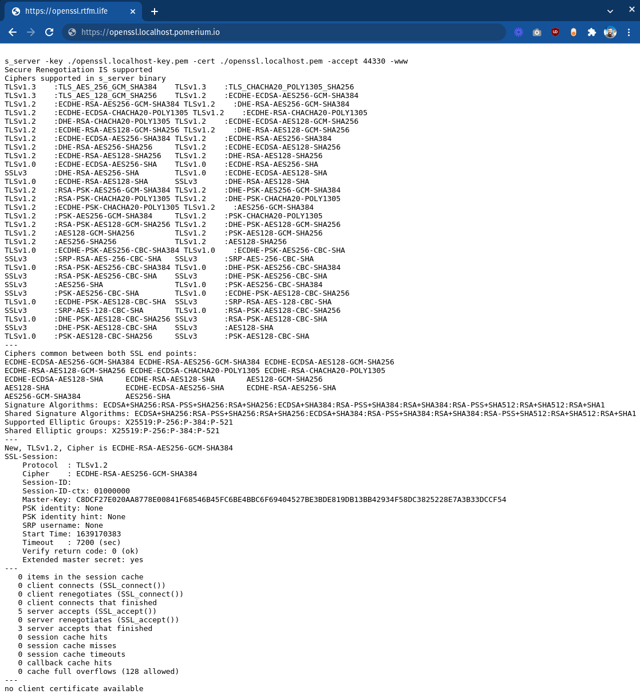

import InstallMkcert from '@site/content/_install-mkcert.md';

<iframe
  width="100%"
  height="450"
  src="https://www.youtube.com/embed/ndYMzRRgLiA"
  title="YouTube video player"
  frameborder="0"
  allow="accelerometer; autoplay; clipboard-write; encrypted-media; gyroscope; picture-in-picture; web-share"
  allowfullscreen></iframe>

As a reverse proxy, Pomerium is designed to manage access to your applications and services. At a minimum, Pomerium authenticates and authorizes each request to access these upstream resources.

While this will keep unauthorized users from accessing your upstream applications, it does not authenticate the upstream service itself. Part of creating a zero-trust security model means securing communication between your identity-aware access proxy (Pomerium) and the upstream service it provides access to.

This means Pomerium and the upstream service should authenticate each other.

## How Pomerium authenticates upstream services

Pomerium confirms the identity of an upstream service by verifying the service’s TLS certificate. (See [tls_custom_ca_file](/docs/reference/routes/tls#tls-custom-certificate-authority) and [tls_upstream_server_name](/docs/reference/routes/tls#tls-upstream-server-name) for more information on configuring Pomerium to accept an upstream's TLS certificate.)

Generally, every organization has a preferred method of managing internal certificates. How an upstream service is configured to validate and accept client certificates is entirely up to that specific service and how it's configured.

To provide a general explanation, in this guide you will use [mkcert](https://github.com/FiloSottile/mkcert) to provide the client certificate to Pomerium, and [OpenSSL](https://www.openssl.org/) as the upstream service.

## Before you begin

To complete this proof-of-concept guide:

- Run Pomerium in [all-in-one mode](/docs/internals/configuration#all-in-one-vs-split-service-mode) as a system service with a configuration file in the [standard location](/docs/deploy/core/from-source#configure)
- Configure an [identity provider](/docs/identity-providers) (IdP) to communicate with your Pomerium instance
- Run all commands on the same host (You may have to move files or adjust paths and commands to match a different configuration)
- Install [`mkcert`](https://github.com/FiloSottile/mkcert) to generate self-signed certificates and a root Certificate Authority (CA) (`mkcert` will take the place of your trusted certificate tooling solution)
- Use `*.localhost.pomerium.io` as the placeholder for the Pomerium domain space

## Create certificates

This guide uses the `localhost.pomerium.io` domain as the root domain (all subdomains on `localhost.pomerium.io` point to localhost).

### Create a root CA

<InstallMkcert />

### Create OpenSSL certificate and key

1. Create a certificate and key for your example upstream service, OpenSSL:

   ```bash {1}
   mkcert openssl.localhost

   Created a new certificate valid for the following names 📜
   - "openssl.localhost"

   The certificate is at "./openssl.localhost.pem" and the key at "./openssl.localhost-key.pem" ✅

   It will expire on 10 March 2024 🗓
   ```

1. Create a client certificate and key for Pomerium to use:

   ```bash {1}
   mkcert -client 'pomerium@localhost'

   Created a new certificate valid for the following names 📜
   - "pomerium@localhost"

   The certificate is at "./pomerium@localhost-client.pem" and the key at "./pomerium@localhost-client-key.pem" ✅

   It will expire on 10 March 2024 🗓
   ```

1. Change ownership of the client certificate files and move them to Pomerium's configuration directory:

   ```bash
   sudo chown pomerium:pomerium pomerium@localhost-client*pem /etc/pomerium
   sudo mv pomerium@localhost-client*pem /etc/pomerium/
   ```

## Configure OpenSSL server

OpenSSL is installed or easily available for most 'nix-based operating systems like macOS and Linux. In this demo, it will take the place of an upstream service with mTLS support.

1. In a terminal environment and the same directory where you created the certificate files, start an OpenSSL server process. Note that it will run in the foreground until stopped, so you will need another terminal environment to run additional commands:

   ```bash
   openssl s_server -key ./openssl.localhost-key.pem -cert ./openssl.localhost.pem -accept 44330 -www
   ```

   You can confirm that the server is responding using `curl`:

   ```bash {1}
   curl -k https://localhost:44330
   <HTML><BODY BGCOLOR="#ffffff">
   <pre>

   s_server -key ./openssl.localhost-key.pem -cert ./openssl.localhost.pem -accept 44330 -www
   Secure Renegotiation IS supported
   Ciphers supported in s_server binary
   ...
   ```

   :::tip

   Even though OpenSSL is providing a certificate signed by a CA in your trust store, you need the `-k` flag because the domain name `localhost` doesn't match `openssl.localhost` defined in your certificate.

   :::

## Configure Pomerium

1. Update the `config.yaml` file in `/etc/pomerium` with a new route for this upstream service:

   ```yaml title="config.yaml"
   - from: https://openssl.localhost.pomerium.io
     to: https://localhost:44330
     tls_upstream_server_name: openssl.localhost
     policy:
       - allow:
           or:
             - email:
                 is: user@example.com
   ```

   Pomerium should automatically process changes when the configuration file is updated.

1. Visit [https://openssl.localhost.pomerium.io](https://openssl.localhost.pomerium.io) in your browser to confirm the route:

   

   Note the last line:

   > no client certificate available

   In the next section, you'll adjust the OpenSSL server to require a client certificate and edit your Pomerium configuration to provide one.

## Install Pomerium client certificate

1. Stop the OpenSSL server process (**Ctrl+C**) and start a new one with the additional flag `-Verify 1`:

   ```bash
   openssl s_server -Verify 1 -key ./openssl.localhost-key.pem -cert ./openssl.localhost.pem -accept 44330 -www
   ```

1. When you refresh [https://openssl.localhost.pomium.io](https://openssl.localhost.pomium.i) in your browser, the connection will fail. Back in the terminal, the OpenSSL server should output errors containing:

   ```log
   SSL routines:tls_process_client_certificate:peer did not return a certificate
   ```

   This confirms that the upstream service is now requiring a trusted client certificate to allow connections.

1. Update the Pomerium route block to provide the client certificate:

   ```yaml title="config.yaml"
   - from: https://openssl.pomerium.localhost.io
     to: https://localhost:44330
     tls_upstream_server_name: openssl.localhost
     tls_client_cert_file: /etc/pomerium/pomerium@localhost-client.pem
     tls_client_key_file: /etc/pomerium/pomerium@localhost-client-key.pem
     policy:
       - allow:
           or:
             - email:
                 is: user@example.com
   ```

Now when you visit [https://openssl.localhost.pomium.io](https://openssl.localhost.pomium.io) you should see additional output under **Client certificate**, confirming that the upstream service has read and validated Pomerium's client certificate. Your upstream service is now using mTLS for mutual authentication!

Obviously, the OpenSSL server is a trivial upstream service, and is purpose-built to work with encryption and not much else. Practical mutual authenticate can be a much more complex setup depending on the service, and may require a sidecar or service mesh. This exercise merely serves to demonstrate how easy it is to configure Pomerium to provide client certificates to the upstream service.

## More Resources

- [Mutual Authentication: A Component of Zero Trust](/docs/concepts/mutual-auth)
- [Client-Side mTLS With Pomerium](/docs/concepts/mutual-auth.md)
- [JWT Verification](/docs/guides/jwt-verification)

[mkcert]: https://github.com/FiloSottile/mkcert
[openssl]: https://www.openssl.org/
[`tls_custom_ca_file`]: /docs/reference/routes/tls#tls-custom-certificate-authority
[`tls_upstream_server_name`]: /docs/reference/routes/tls#tls-upstream-server-name
