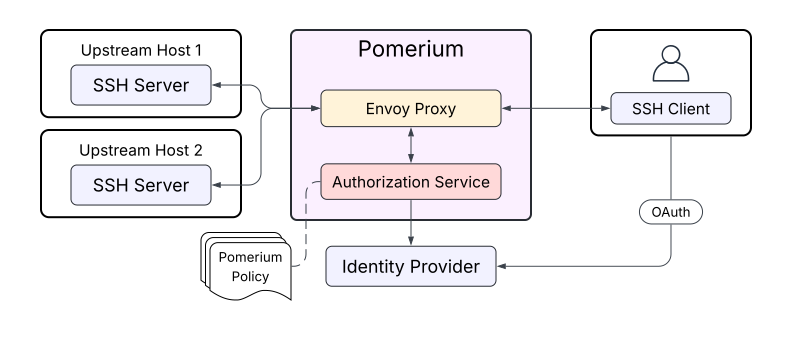
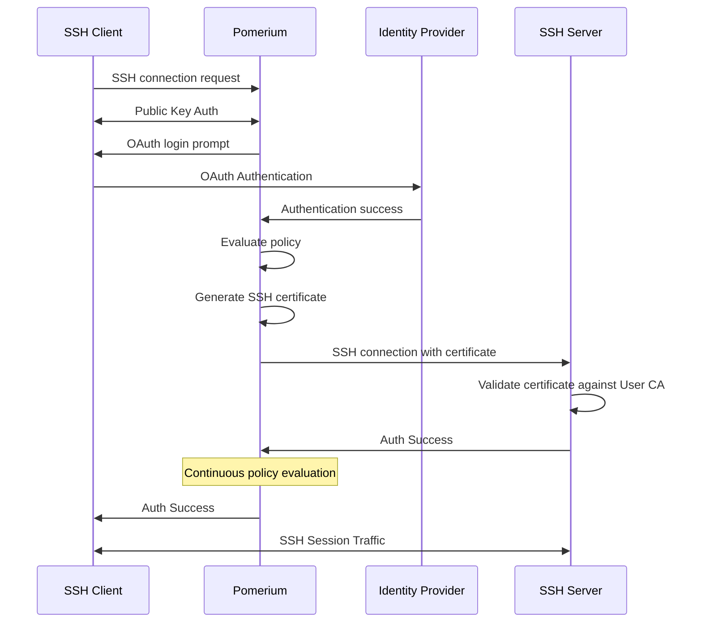
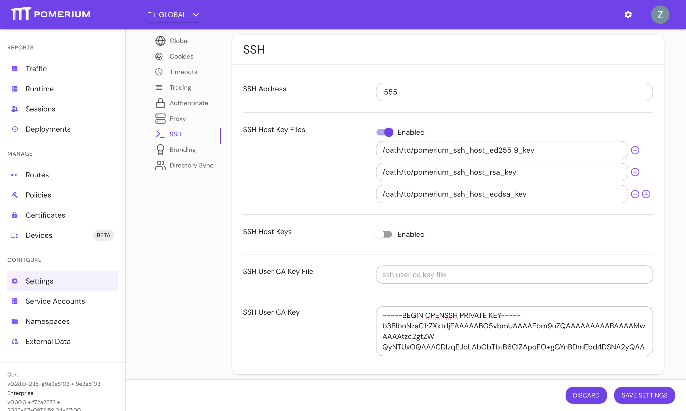
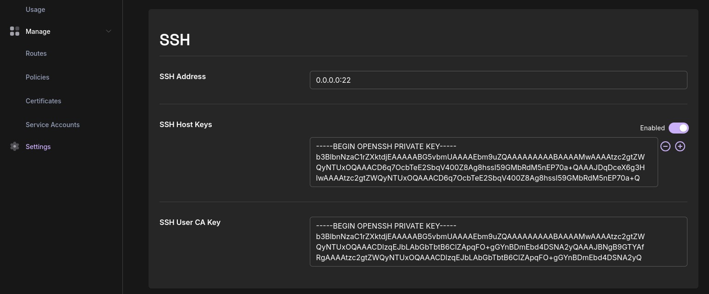
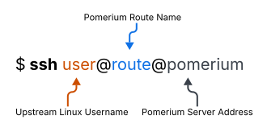
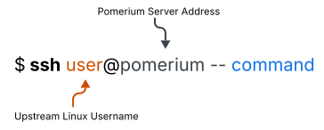
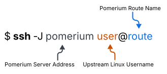

import Tabs from '@theme/Tabs';
import TabItem from '@theme/TabItem';

# Native SSH Access

Pomerium can be used as a native SSH reverse proxy, adding OAuth authentication and flexible Pomerium policy enforcement to standard SSH connections, without the need for tunnels, or custom clients or servers.

## Overview



SSH traffic flows through the Pomerium data plane alongside HTTP traffic, using a separate port (configurable).

Upstream SSH servers are added as standard Pomerium routes using the `ssh://` prefix. For example:

```yaml
routes:
  - from: 'ssh://route1'
    to: 'ssh://upstream-host-1:22'
    policy:
      # ...
  - from: 'ssh://route2'
    to: 'ssh://upstream-host-2:22'
    policy:
      # ...
```

Most Pomerium policy criteria are supported with SSH routes, and there are several SSH-specific criteria that can be used to enforce usernames, public keys, and more.

Just like with HTTP connections, downstream clients connect to Pomerium itself, which then connects to upstream servers (if authentication succeeds) and forwards traffic along. Pomerium is fully protocol-aware, allowing it to offer a native SSH experience without requiring a custom client.



## Setup

### Prerequisites

- Pomerium v0.30.0 or later
- Identity provider with Device Code OAuth grant type enabled
- Network connectivity between Pomerium and SSH servers

### 1. Generate User CA Key Pair

Generate a key pair that Pomerium will use to sign SSH certificates:

```bash
ssh-keygen -N "" -f pomerium_user_ca_key -C "Pomerium User CA"
```

:::note ssh-keygen flags

- `-N ""` = empty password (required)
- `-f` = output filename
- `-C` = comment (optional)

:::

This creates:

- `pomerium_user_ca_key` (private key - to be used in Pomerium)
- `pomerium_user_ca_key.pub` (public key - distribute to servers)

:::note

The User CA key is a standard SSH keypair, not a certificate or certificate-key.

:::

### 2. Generate SSH Host Keys

Generate new SSH host keys for your Pomerium instance.

```bash
ssh-keygen -N "" -t ed25519 -f pomerium_ssh_host_ed25519_key
ssh-keygen -N "" -t rsa -f pomerium_ssh_host_rsa_key
ssh-keygen -N "" -t ecdsa -f pomerium_ssh_host_ecdsa_key
```

This creates three host keys which support different algorithms for compatibility:

- `pomerium_ssh_host_ed25519_key`
- `pomerium_ssh_host_rsa_key` (default 3072 bits)
- `pomerium_ssh_host_ecdsa_key` (default 256 bits)

### 3. Configure Pomerium

Add SSH configuration to your `config.yaml`:

<Tabs>
<TabItem value="core" label="Core">

```yaml title="config.yaml"
ssh_address: 0.0.0.0:22 # if port 22 is already in use by sshd, choose a different port
ssh_user_ca_key_file:
  - '/path/to/pomerium_user_ca_key'
ssh_host_key_files:
  - '/path/to/pomerium_ssh_host_ed25519_key'
  - '/path/to/pomerium_ssh_host_rsa_key'
  - '/path/to/pomerium_ssh_host_ecdsa_key'
```

</TabItem>
<TabItem value="enterprise" label="Enterprise">

Configure SSH in the Enterprise Console under **Settings** > **SSH**:



</TabItem>
<TabItem value="zero" label="Zero">

Configure SSH in the Zero Console under **Settings** > **SSH**:



</TabItem>
</Tabs>

### 4. Add SSH routes

Add SSH routes for each upstream server, for example:

```yaml
routes:
  - from: ssh://route1
    to: ssh://upstream-server-1:22
    policy:
      - allow:
          and:
            - email:
                is: your.email@example.com
  - from: ssh://route2
    to: ssh://upstream-server-2:22
    policy:
      # ...
```

Note the use of the `ssh://` scheme for both `from` and `to`.

### 5. Configure Upstream Servers

1. Copy the User CA public key (`pomerium_user_ca_key.pub`) to your upstream servers. It can be placed in any (root-owned) location - for example, `/etc/pomerium/` or `/var/lib/pomerium/`. You may also place it in `/etc/ssh/` if desired.

2. Update sshd config by creating a new config file in `/etc/ssh/sshd_config.d/` (or editing `/etc/ssh/sshd_config` directly)

```bash title="/etc/ssh/sshd_config.d/50-pomerium.conf"
# Trust Pomerium's User CA for certificate authentication
TrustedUserCAKeys /path/to/pomerium_user_ca_key.pub
```

:::danger File Permissions

OpenSSH does not enforce file ownership or permissions on the TrustedUserCAKeys file. Be sure that the file is owned by root and is read-only.

:::

Restart SSH daemon:

```bash
sudo systemctl restart sshd
```

## Connecting to SSH Routes



Pomerium SSH routes use the syntax `user@route@pomerium`, where:

- `user` is the Linux username to log in as on the upstream SSH server
- `route` is the Pomerium route name (the name given after `ssh://` - for example, `from: ssh://route1` is "route1")
- `pomerium` is the address of the Pomerium server. This can be a DNS name or an IP address.

On first connection, you will be prompted to log in with OAuth in your browser. Subsequent connections within the session timeout will use cached credentials.

:::info

In version 0.30.0, SSH access only supports the Device Code OAuth flow. This restriction will be relaxed in a future release, allowing use of the Authorization Code flow instead.

:::

## Using the Internal CLI



Omit the route name when connecting to Pomerium to access its internal CLI. Several commands are available (try `--help`):

- `whoami` displays information about the current session.
- `logout` logs out of Pomerium; subsequent connections will require authenticating with the IDP again.
- `portal` drops you into an interactive route picker. Selecting a route will automatically connect to it using the username originally provided in the `ssh` command. This feature is disabled by default ([see below](/docs/capabilities/native-ssh-access#routes-portal))

Any authenticated user can access the internal CLI (similar to the `/.pomerium` HTTP endpoint). When using the routes portal, route-specific policies are evaluated after one is selected.

## Using Jump-Host Mode



In this mode, Pomerium acts as a virtual jump-host, allowing the client to connect directly to the upstream server, after authenticating with Pomerium. Instead of Pomerium authenticating to the upstream on behalf of the user, the user authenticates to the upstream directly.

Pomerium policy still applies when connecting to routes in this way, with the exception of the `ssh_username` criteria.

This feature is disabled by default ([see below](/docs/capabilities/native-ssh-access#enable-proxyjump-support)).

## Configuration Reference

| Setting | Description |
| --- | --- |
| `ssh_address` | Address and port to listen for SSH connections on (e.g. `0.0.0.0:22`) |
| `ssh_user_ca_key` | Private key for signing SSH certificates (if no ssh_user_ca_key_file is provided) |
| `ssh_user_ca_key_file` | Path to the User CA private key file (if no ssh_user_ca_key is provided) |
| `ssh_host_keys` | List of SSH private key files to use as Pomerium's host keys |
| `ssh_host_key_files` | List of SSH private keys to use as Pomerium's host keys |

### SSH Route Configuration

SSH routes use the `ssh://` scheme in the `from` field and `ssh://` in the `to` field:

```yaml
# SSH route configuration
routes:
  - from: ssh://route1
    to: ssh://ssh-server.internal:22
    policy:
      - allow:
          or:
            - groups:
                has: developers
            - ssh_publickey:
                - 'ssh-ed25519 AAAAC3NzaC1lZDI1NTE5AAAAIIeAQ7VbiYJdPaxsMYTW/q5QpqtyHMtHHRBUJOcQMaLE key-1'
                - 'ssh-ed25519 AAAAC3NzaC1lZDI1NTE5AAAAIPzK2WQZ0NU52W8Bk/8po+4V4oUEdCklf3GtQmiYQB/9 key-2'
```

### SSH Policy Criteria

The following SSH-specific PPL criteria are available:

| Criterion Name | Data Format | Description |
| --- | --- | --- |
| `ssh_publickey` | [String Matcher] | Matches an SSH public key (authorized_keys format)<br/>(ex: `"ssh-ed25519 AAAA..."`) |
| `ssh_username` | [String Matcher] | Matches the username requested by the client <br/> (ex: `"ubuntu"` or `["user1", "user2"]`) |
| `ssh_username_matches_claim` | String | Enforces that the username requested by the client is present within a list of allowed names, obtained from this OAuth token claim <br/>(ex: "allowed_usernames") |
| `ssh_username_matches_email` | Anything. Typically `true`. | Enforces that the username requested by the client exactly matches the user's email with the '@' and domain omitted <br/>(ex: the email `"bobby@gmail.com"` matches the username `"bobby"`) |

## Advanced Configuration

### Runtime Flags

There are two SSH specific runtime flags. See [Runtime Flags](/docs/reference/runtime-flags) for more information.

#### Routes Portal

- **`ssh_routes_portal`**: Enables the SSH routes portal, allowing users to select their SSH destination from an interactive menu when SSHing to Pomerium without specifying a route.

#### Enable `ProxyJump` Support

- **`ssh_allow_direct_tcpip`**: Enables support for Pomerium to act as a jump host if `ProxyJump` (`-J` flag) is used by a client. In this mode, the downstream client will authenticate directly to the upstream, and traffic will be proxied through Pomerium on a `direct-tcpip` channel.

## Policy Examples

### Role-Based Access

```yaml
routes:
  - from: ssh://prod-server
    to: ssh://prod-server.corp.example.com:22
    policy:
      - allow:
          and:
            - groups:
                has: sre-team
            - day_of_week:
                is: monday,tuesday,wednesday,thursday,friday

  - from: ssh://dev-server
    to: ssh://dev-server.corp.example.com:22
    policy:
      - allow:
          or:
            - groups:
                has: developers
            - groups:
                has: qa-team
```

### Public Key List

```yaml
routes:
  - from: ssh://prod-server
    to: ssh://prod-server.corp.example.com:22
    policy:
      - allow:
          and:
            - ssh_publickey:
                - ssh-ed25519 AAAAC...We/tx admin1@example.com
                - ssh-ed25519 AAAAC...MVMSj admin2@example.com

  - from: ssh://dev-server
    to: ssh://dev-server.corp.example.com:22
    policy:
      - allow:
          and:
            - ssh_publickey:
                - ssh-ed25519 AAAAC...lhCh5 dev1@example.com
                - ssh-ed25519 AAAAC...WwAsc dev2@example.com
```

### OAuth claim matcher

```yaml
routes:
  - from: ssh://prod-server
    to: ssh://prod-server.corp.example.com:22
    policy:
      - allow:
          and:
            - ssh_username_matches_claim: allowed_usernames
```

[string matcher]: /docs/internals/ppl#string-matcher
