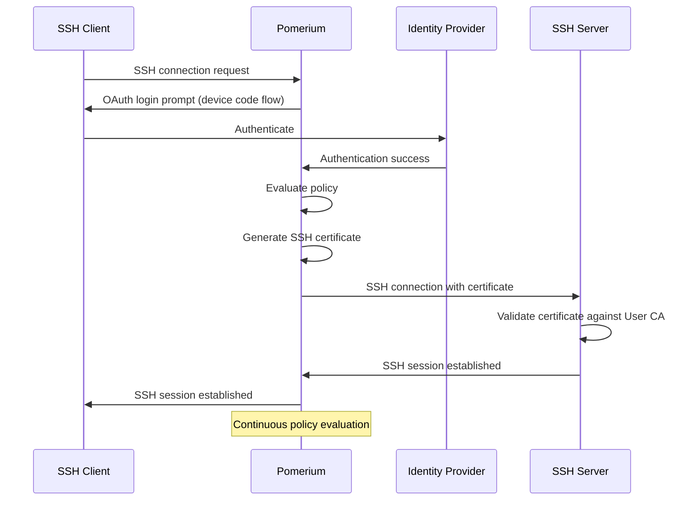

import Tabs from '@theme/Tabs';
import TabItem from '@theme/TabItem';

# Native SSH Access

Pomerium's Native SSH Access provides secure SSH connectivity with OAuth-integrated authentication and ephemeral certificates. Unlike traditional SSH key management or tunneled connections, Native SSH Access leverages Pomerium as an SSH Certificate Authority (CA) to issue short-lived certificates based on successful OAuth authentication and Pomerium policy evaluation.

## How Native SSH Access Works

Native SSH Access eliminates the need for static SSH keys or tunneling while maintaining compatibility with standard SSH clients:

1. **User initiates SSH connection** to a Pomerium-protected server
2. **Pomerium prompts OAuth login** via keyboard-interactive + device code flow
3. **Authentication and authorization** occurs through your identity provider and Pomerium policies
4. **Certificate generation** - Pomerium issues a short-lived SSH certificate signed by the User CA
5. **SSH connection established** using the ephemeral certificate
6. **Continuous Authorization** - Pomerium continues to evaluate policies in real-time, ending SSH connections if access is revoked
7. **Automatic cleanup** - certificates expire automatically, no manual revocation needed



## Benefits

### Zero Trust Security
- **Identity-aware access** tied to your identity provider
- **Policy-driven authorization** with real-time evaluation
- **Ephemeral credentials** that automatically expire
- **Centralized access control** without distributed key management

### Operational Simplicity
- **No client changes** - works with standard SSH clients
- **No static keys** to manage, rotate, or revoke
- **Fast revocation** by disabling users or changing policies
- **Audit-friendly** with comprehensive access and authorization logs

### Developer Experience
- **Seamless workflow** - no tunneling or special clients required
- **Session caching** - Multiple connections within session timeout use cached credentials
- **Standard SSH features** - port forwarding, SCP, SFTP all work normally

## Setup

### Prerequisites

- Use Pomerium v0.30.0 or later
- Identity provider configured in Pomerium
- Network connectivity between Pomerium and SSH servers
- SSH servers configured to trust Pomerium's User CA

## Step-by-Step Configuration


### 1. Generate User CA Key Pair

Generate a key pair that Pomerium will use to sign SSH certificates:

```bash
ssh-keygen -t ed25519 -f pomerium_user_ca -C "Pomerium User CA"
```

This creates:
- `pomerium_user_ca` (private key - to be used in Pomerium)
- `pomerium_user_ca.pub` (public key - distribute to servers)

### 2. Generate SSH Host Keys

Generate SSH host keys for your Pomerium instance to use with incoming connections:

```bash
ssh-keygen -t ed25519 -f /etc/ssh/pomerium_ssh_host_ed25519_key -C "Pomerium SSH Host Key"
ssh-keygen -t rsa -f /etc/ssh/pomerium_ssh_host_rsa_key -C "Pomerium SSH Host Key"
```

This creates two host keys which support different algorithms for compatibility:
- `/etc/ssh/pomerium_ssh_host_ed25519_key`
- `/etc/ssh/pomerium_ssh_host_rsa_key`

### 2. Configure Pomerium

Add SSH configuration to your `config.yaml`:

<Tabs>
<TabItem value="core" label="Core">

```yaml title="config.yaml"
ssh_address: 0.0.0.0:22
ssh_user_ca_key_file:
  - /etc/ssh/pomerium_user_ca
ssh_host_key_files:
  - "/etc/ssh/pomerium_ssh_host_ed25519_key"
  - "/etc/ssh/pomerium_ssh_host_rsa_key"
```

</TabItem>
<TabItem value="enterprise" label="Enterprise">

Configure SSH in the Console under **Settings**:

TODO: Check where the SSH settings are located in the Pomerium Console.

Then create SSH routes in **Routes** with the `ssh://` scheme.

</TabItem>
</Tabs>

### 3. Configure SSH Servers

Copy the User CA public key to your servers:

```bash
# Copy public key to server
scp pomerium_user_ca.pub user@ssh-server:/tmp/
ssh user@ssh-server 'sudo mv /tmp/pomerium_user_ca.pub /etc/ssh/'
```

Update `/etc/ssh/sshd_config` on your SSH servers:

```bash title="/etc/ssh/sshd_config"
# Trust Pomerium's User CA for certificate authentication
TrustedUserCAKeys /etc/ssh/pomerium_user_ca.pub

# Optional: Disable password authentication
PasswordAuthentication no
```

Restart SSH daemon:

```bash
sudo systemctl restart sshd
```

### 4. Test Connection

Connect using standard SSH client:

```bash
ssh user@ssh.corp.example.com
```

On first connection, your browser will open for OAuth authentication. Subsequent connections within the session timeout will use cached credentials.

## Configuration Reference

### SSH User CA Settings

| Setting | Description | Required |
|---------|-------------|----------|
| `ssh_address` | Address and port for Pomerium's SSH service (e.g. `0.0.0.0:22`) | Yes |
| `ssh_user_ca_key` | Private key for signing SSH certificates (if no ssh_user_ca_key_file is provided) | No |
| `ssh_user_ca_key_file` | Path to the User CA private key file (if no ssh_user_ca_key is provided) | No |
| `ssh_host_keys` | List of SSH host keys to use for incoming SSH connections | No |
| `ssh_host_key_files` | List of SSH host key files to use for incoming SSH connections | No |

### SSH Route Configuration

SSH routes use the `ssh://` scheme in the `from` field and `ssh://` in the `to` field:

```yaml
# SSH route configuration
routes:
  - from: ssh://ssh.corp.example.com:22
    to: ssh://ssh-server.internal:22
    policy:
      - allow:
          or:
            - groups:
                has: developers
            - ssh_publickey:
              - 'ssh-ed25519 AAAAC3NzaC1lZDI1NTE5AAAAIIeAQ7VbiYJdPaxsMYTW/q5QpqtyHMtHHRBUJOcQMaLE key-1'
              - 'ssh-ed25519 AAAAC3NzaC1lZDI1NTE5AAAAIPzK2WQZ0NU52W8Bk/8po+4V4oUEdCklf3GtQmiYQB/9 key-2'
```

### SSH Policy Rules
Policies can include SSH specific rules such as:
- `ssh_publickey`: Match specific SSH public keys
-
TODO fill in

## Advanced Configuration

### Runtime Flags

There are two SSH specific runtime flags. See [Runtime Flags](/docs/reference/runtime-flags) for more information.

#### Enable an SSH Routes Portal

- **`ssh_routes_portal`**: Enables the SSH routes portal, allowing users to select their SSH destination from a keyboard-interactive menu when SSHing to Pomerium without specifying a route.

#### Enable `ProxyJump` Support

- **`ssh_allow_direct_tcpip`**: Enables support for Pomerium to act as a jump host when `ProxyJump` is used by a client. In this mode, Pomerium does not connect to the upstream server with a short lived certificate. The upstream SSH server must authenticate the SSH connection directly.

## Policy Examples

### Role-Based Access

```yaml
routes:
  - from: ssh://prod-servers.corp.example.com:22
    to: ssh://prod-server:22
    policy:
      - allow:
          and:
            - groups:
                has: sre-team
            - day_of_week:
                is: monday,tuesday,wednesday,thursday,friday

  - from: ssh://dev-servers.corp.example.com:22
    to: ssh://dev-server:22
    policy:
      - allow:
          or:
            - groups:
                has: developers
            - groups:
                has: qa-team
```
