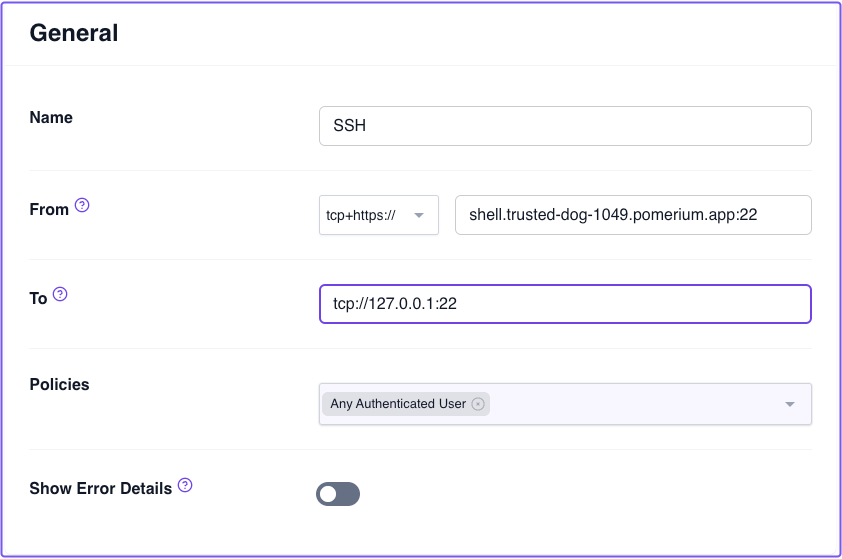
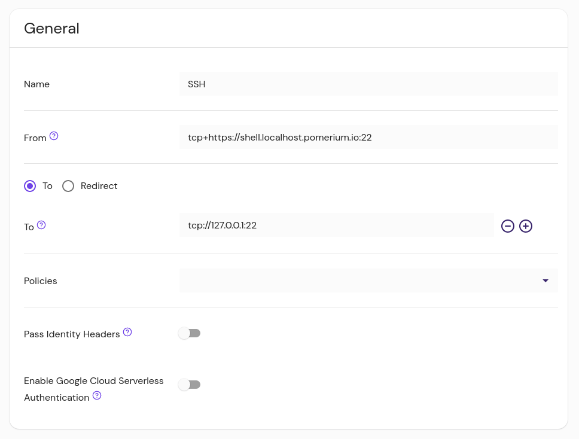
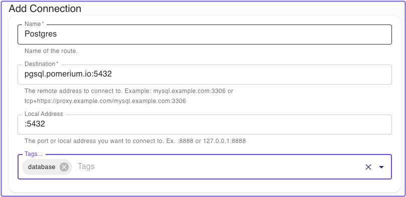
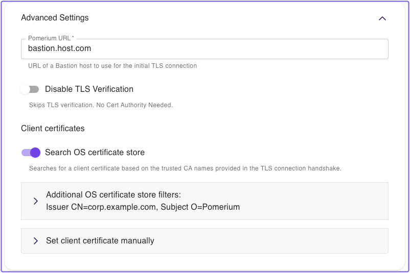

---
# cSpell:ignore windowscentral

title: Pomerium TCP Clients
sidebar_label: Desktop & CLI Clients
lang: en-US
keywords:
  [
    pomerium,
    identity access proxy,
    pomerium desktop,
    pomerium cli,
    pomerium tcp over http,
  ]
description: Learn how to create secured TCP connections to services behind Pomerium.
sidebar_position: 0
---

import Tabs from '@theme/Tabs';
import TabItem from '@theme/TabItem';

# Pomerium Desktop and CLI Clients

This document describes how to use Pomerium's Desktop and CLI clients to connect to TCP routes in Pomerium.

:::info What's a TCP route?

A TCP route is for use with upstream services that don't speak HTTP — for example SSH, Redis, or MySQL. With a TCP route, the entire connection is proxied to the upstream service, rather than each individual request separately.

In Pomerium, TCP routes are denoted with a `tcp+` prefix in the route's **From** URL.

:::

## Create a TCP route

1. Specify this new Route as a TCP Route by prefixing `tcp+` in the **From** field, along with a port number
1. Set the **To** field using `tcp://` as the scheme, along with the address and port that the upstream service is listening on

The example below demonstrates a route to an SSH service on the host running Pomerium:

<Tabs>
<TabItem value="pomerium-zero" label="Pomerium Zero">



</TabItem>
<TabItem value="pomerium-enterprise" label="Pomerium Enterprise">



</TabItem>
<TabItem value="pomerium-core" label="Pomerium Core">

```yaml
- from: tcp+https://ssh.localhost.pomerium.io:22
  to: tcp://127.0.0.1:22
  policy:
    - allow:
        or:
          - email:
              is: user@companydomain.com
```

</TabItem>
</Tabs>

:::tip

The port number in the route **From** URL is not used in the initial connection to Pomerium itself. This connection will still use port 443, unless you use a bastion host (see [**Advanced configuration**](#advanced-configuration) below).

Rather, the port defined in **From** is part of the mapping to the individual route. In this way, you can create multiple routes that share a DNS entry, differentiated by the port to determine which route they use.

For example, suppose we have a server called `augur` running behind Pomerium that has a MySQL server and also listens for SSH connections. We can create routes for `tcp+https://augur.example.com:22` and `tcp+https://augur.example.com:3306`.

:::

:::info

To learn about building TCP routes, see:

- [**Configure TCP Routes**](/docs/capabilities/tcp#configure-tcp-routes)
- [**Advanced TCP usage**](/docs/capabilities/tcp#advanced-capabilities)

:::

## Access TCP routes with a client

You can connect to this route with either the Pomerium CLI or Pomerium Desktop client.

### Desktop client steps

If you haven't, install [Pomerium Desktop](/docs/clients/pomerium-desktop).

Then, add a connection by filling in the fields defined below:

- **Name**: A local name for the route
- **Destination**: Matches the [From](/docs/reference/routes/from) value of the route, without the protocol. Always include the port specified in the route, and do not include the `https://` protocol.
- **Local Address**: The local address and port number from which to access the service locally. If left blank, the client will choose a random port to listen to on the loopback address.
- **Tags**: Customizable tags to sort and organize TCP routes



#### Advanced Settings

- **Pomerium URL**: The Pomerium Proxy service address. This is required if the **Destination URL** can't be resolved from DNS or a local `hosts` entry, or if the Proxy service uses a non-standard port.
- **Disable TLS Verification**: Allows untrusted certificates from the Pomerium gateway
- **Client Certificates**: For routes that enforce [mTLS](/docs/concepts/mutual-auth), you can **set a client certificate manually** or automatically [**search the OS certificate store**](/docs/capabilities/tcp#client-certificates) for a trusted certificate (note: macOS and Windows only).



### Pomerium CLI steps

If you haven't, install [Pomerium CLI](/docs/clients/pomerium-cli).

Then, connect to a TCP route:

1. Invoke `pomerium-cli` with the `tcp` option, and provide the route to your service (as defined in [`from`](/docs/reference/routes/from) in your Route specification).

   ```shell-session
   $ pomerium-cli tcp ssh.localhost.pomerium.io:22
   2023/10/02 11:29:22 listening on 127.0.0.1:53656
   ```

   You can optionally supply an address and/or port to the `listen` flag:

   ```shell-session
   $ pomerium-cli tcp ssh.localhost.pomerium.io:22 --listen :2222
   2023/10/02 11:30:03 listening on [::]:2222
   ```

1. Connect to your service using the local address and port specified in the output of `pomerium-cli`:

   ```bash
   ssh 127.0.0.1 -p 2222
   ```

1. When the connection starts, the CLI will open your browser and direct you to your Identity Provider to authenticate your session. Once authenticated, the connection will continue and you can close the browser window.

1. In this example, since we are using SSH we can consolidate the TCP and SSH connections into a single command:

   ```bash
   ssh -o ProxyCommand='pomerium-cli tcp --listen - %h:%p' ssh.localhost.pomerium.io
   ```

:::info

For more examples and detailed usage information, see the following docs:

- [**TCP Reference**](/docs/capabilities/tcp/reference)
- [**Securing TCP-based Services**](/docs/capabilities/tcp)

:::

## Advanced configuration

If Pomerium is listening on a port other than `443` (set with the [`address` key](/docs/reference/address)), the full TCP URL can be specified with a bastion host:

```bash
pomerium-cli tcp tcp+https://ssh.localhost:pomerium.io:8443/ssh.localhost.pomerium.io:2222 --listen :2222
```

## TCP reference for pomerium-cli

This TCP reference covers `pomerium-cli` commands you can use to manage TCP connections in Pomerium.

### Usage

```shell
pomerium-cli tcp [destination] [flags]
```

### Flags

| Flags | Description | Type |
| :-- | :-- | --- |
| <a className="entRef-anchor" id="--alternate-ca-path">#</a><a href='#--alternate-ca-path'>--alternate-ca-path</a> | Path to CA certificate to use for HTTP requests. | string |
| <a className="entRef-anchor" id="--browser-cmd">#</a><a href='#--browser-cmd'>--browser-cmd</a> | Custom browser command to run when opening a URL. | string |
| <a className="entRef-anchor" id="--ca-cert">#</a><a href='#--ca-cert'>--ca-cert</a> | Path to CA certificate to use for HTTP requests. | string |
| <a className="entRef-anchor" id="--client-cert">#</a><a href='#--client-cert'>--client-cert</a> | (optional) PEM-encoded client certificate. | string |
| <a className="entRef-anchor" id=" --client-key">#</a><a href='# --client-key'> --client-key</a> | (optional) PEM-encoded client certificate key. | string |
| <a className="entRef-anchor" id="--client-cert-from-store">#</a><a href='#--client-cert-from-store'> --client-cert-from-store</a> | (optional) If provided, pomerium-cli will attempt to use a client certificate from the system trust store (macOS and Windows only), searching for a certificate based on the trusted CA names advertised by Pomerium in the TLS handshake. | none |
| <a className="entRef-anchor" id="--client-cert-issuer">#</a><a href='#--client-cert-issuer'> --client-cert-issuer</a> | (optional) When used in combination with --client-cert-from-store, restricts the client certificate search based on a particular attribute of the certificate's [Issuer name](#certificate-name-filters). | string |
| <a className="entRef-anchor" id="--client-cert-subject">#</a><a href='#--client-cert-subject'> --client-cert-subject</a> | (optional) When used in combination with --client-cert-from-store, restricts the client certificate search based on a particular attribute of the certificate's [Subject name](#certificate-name-filters). | string |
| <a className="entRef-anchor" id=" --disable-tls-verification">#</a><a href='# --disable-tls-verification'>--disable-tls-verification</a> | Disables TLS verification. | none |
| <a className="entRef-anchor" id="--help">#</a><a href='#--help'>-h, --help</a> | Help for tcp. | none |
| <a className="entRef-anchor" id="--listen">#</a><a href='#--listen'>--listen</a> | Local address to start a listener on (default "127.0.0.1:0"). | string |
| <a className="entRef-anchor" id="--pomerium-url">#</a><a href='#--pomerium-url'>--pomerium-url</a> | The URL of the Pomerium server to connect to. | string |
| <a className="entRef-anchor" id="--version">#</a><a href='#--version'>-v, --version</a> | Version for pomerium-cli. | none |

#### Certificate name filters

The certificate name filter syntax is `attribute=value`. A name filter can accept only one name attribute. The value must be an exact match (not a substring match). Make sure to quote name filters as appropriate for your shell.

For example, `--client-cert-issuer "CN=My Trusted CA"` would filter for a certificate directly issued by a CA with the Common Name "My Trusted CA".

Or, `--client-cert-subject "OU=My Department"` would filter for a certificate whose Subject name contains the Organizational Unit Name "My Department".

The supported name attributes are:

- commonName (CN)
- countryName (C)
- localityName (L)
- organizationName (O)
- organizationalUnitName (OU)
- postalCode
- serialNumber
- stateOrProvinceName (ST)
- streetAddress (STREET)

Either the long or abbreviated attribute name may be used (for example, `localityName=New York` or `L=New York`).

Values are case sensitive: `L=new york` will not match the Locality Name "New York".
