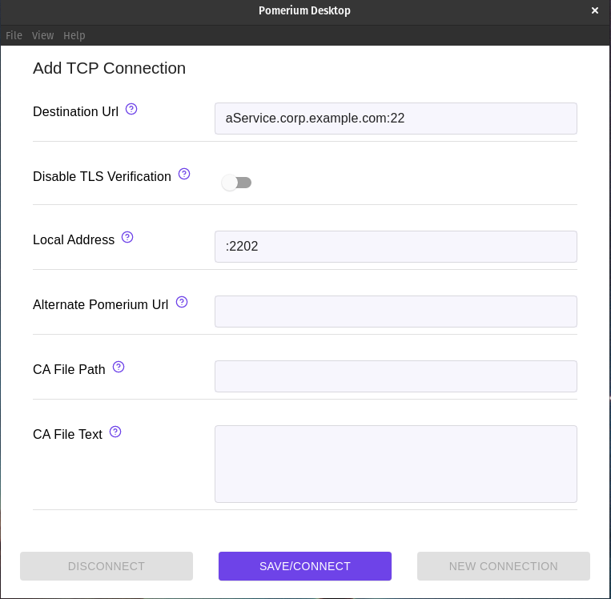

import Tabs from '@theme/Tabs';
import TabItem from '@theme/TabItem';
import LongLivedConnections from '@site/content/docs/admonitions/_long-lived-connections.mdx';

# Tunneled SSH Connections

:::info Native SSH Access Available
Pomerium now supports [**Native SSH Access**](/docs/capabilities/native-ssh-access) with OAuth authentication and ephemeral certificates. This provides a more streamlined SSH experience without requiring tunneling or special clients. See the [comparison table](#native-vs-tunneled-ssh) below to choose the best approach for your use case.
:::

Bad actors are constantly scanning the internet for exposed SSH services. Changing the default port obfuscates, but doesn't protect the service, and implementing and updating advanced SSH authentication can be cumbersome.

By tunneling SSH connections through your Pomerium service:

 - All traffic is encrypted twice (once by the Pomerium TCP connection, once by SSH itself),
 - The SSH service can remain closed to the internet, or even restricted to only accept connections from the Pomerium Proxy service
 - Authentication and authorization is managed by Pomerium, using your IdP for identity, and can be easily managed at scale.

:::note Long-lived connections behavior

<LongLivedConnections />

:::

:::tip
This example assumes you've already [created a TCP route](/docs/capabilities/non-http#configure-tcp-routes) for this service.
:::

 ## Basic Connection

 1. Create a TCP tunnel, using either [`pomerium-cli`](/docs/deploy/clients) or the Pomerium Desktop client:

    <Tabs>
    <TabItem value="pomerium-cli" label="pomerium-cli">

    ```bash
    pomerium-cli tcp aService.corp.example.com:22 --listen :2202
    ```

    :::tip --listen
    The `--listen` flag is optional. It lets you define what port the tunnel listens on locally. If not specified, the client will choose a random available port.
    :::

    </TabItem>
    <TabItem value="Pomerium Desktop" label="Pomerium Desktop">

    

    :::tip Local Address
    The **Local Address** field is optional. Using it defines what port the tunnel listens on locally. If not specified, Pomerium Desktop will choose a random available port.
    :::

    </TabItem>
    </Tabs>

1. Initiate your SSH connection, pointing to `localhost`:

    ```bash
    ssh user@localhost -p 2202
    ```

## Tunnel and Connect Simultaneously

The process outlined above requires multiple steps and terminal environments (when using the CLI) or programs (when using the Desktop Client). By invoking `pomerium-cli` when the connection is made, you can streamline the process into a single connection:

```bash
ssh -o ProxyCommand='pomerium-cli tcp --listen - %h:%p' ssh.localhost.pomerium.io
```

## Always Tunnel through Pomerium

Once your SSH service is configured and tested through Pomerium, you can edit your local SSH configuration file to always create a tunnel when connecting to that service:

```bash
Host aService.corp.example.com
    ProxyCommand /usr/bin/pomerium-cli tcp --listen - %h:%p
```

You can even configure all SSH connections to your domain space to use the tunnel:

```bash
Host *.corp.example.com
    ProxyCommand /usr/bin/pomerium-cli tcp --listen - %h:%p
```

## More Resources

### Native vs Tunneled SSH

| Feature | Native SSH Access | Tunneled SSH (this guide) |
|---------|------------------|---------------------------|
| **Client setup** | None required | Requires pomerium-cli |
| **Network architecture** | Direct SSH connection | HTTP tunnel over CONNECT |
| **SSH features** | Full SSH functionality | Full SSH functionality |
| **Performance** | Native SSH performance | Slight tunnel overhead |
| **Firewall requirements** | Standard SSH (port 22 or custom) | HTTP/HTTPS (ports 80/443) |
| **Authentication** | OAuth | OAuth |
| **Authorization** | Pomerium Policy with SSH rules | Pomerium Policy with HTTP rules |
| **Key management** | Ephemeral certificates | Traditional SSH keys |
| **Audit logging** | SSH protocol logging | Pomerium HTTP tunnel logs |
| **Server configuration** | Requires User CA trust | Standard SSH configuration |

**When to use Native SSH Access:**
- You want the simplest user experience
- You want centralized SSH access management and audit logging
- You prefer ephemeral credentials over static keys

**When to use Tunneled SSH:**
- You cannot modify SSH server configuration
- You're migrating gradually from existing SSH setups

### ProxyCommand Resources

For more information on SSH ProxyCommand, see:

- [ProxyCommand (SSH man page)](https://man.openbsd.org/ssh_config.5#ProxyCommand)
- [SSH to remote hosts though a proxy or bastion with ProxyJump (RedHat blog)](https://www.redhat.com/sysadmin/ssh-proxy-bastion-proxyjump)
