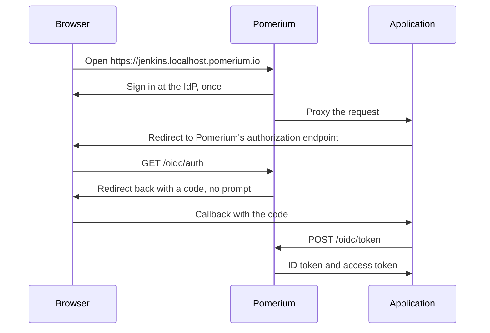

# OIDC Bridge

Many applications behind Pomerium keep their own login page. If an application cannot read the Pomerium JWT, users sign in twice: once at your organization's identity provider (IdP) through Pomerium, and again at the application. The **OIDC bridge** removes the second prompt. Pomerium acts as an OpenID Connect (OIDC) provider for the application: the application runs its normal OIDC login against Pomerium, and Pomerium answers from the session the user already has.

Use the bridge when an application supports OIDC login but not JWT header authentication. If the application can verify a JWT from a request header, prefer [continuous identity verification](/docs/capabilities/getting-users-identity): the Pomerium JWT proves not only who the user is but also that Pomerium authorized each request, which an OIDC ID token does not.

## Security considerations

- The bridge authenticates; it does not authorize. Keep a route policy on every bridged route. Pomerium still evaluates policy on each request, independent of any ID token the application holds.
- The application never receives tokens from your IdP. Pomerium mints the ID token and the access token itself.
- No refresh tokens. The access token is tied to the user's Pomerium session and returns claims only while that session lasts. Don't treat it as proof that the user is still signed in; Pomerium checks policy on every request to the route.

## How it works

1. The user opens the route and signs in through Pomerium, as with any other route. Pomerium checks the route policy.
2. The application starts its usual OIDC login and sends the browser to Pomerium's authorization endpoint.
3. The browser already has a Pomerium session, so Pomerium issues an authorization code and sends the browser straight back to the application. There is no second login prompt. If the session is missing or expired, Pomerium signs the user in first and then completes the request.
4. The application exchanges the code for an ID token and an access token. It can also call the userinfo endpoint for the same claims.



:::note Claims

The claims in the ID token come straight from your IdP: `sub`, `email`, `name`, and whatever else it returned. Pomerium rewrites `iss` to the authenticate service URL and `aud` to the client ID. Every value is a string, so a list like `groups` becomes `"admins,developers"` and `email_verified` becomes `"true"` rather than `true`. The userinfo endpoint returns the same claims.

:::

:::info The ID token is not the Pomerium JWT

The ID token proves who the user is. It does not prove that Pomerium authorized a given request, so it is not a substitute for the Pomerium JWT in [application-based mutual authentication](/docs/internals/mutual-auth#jwt-verification-application-based-mutual-authentication). Pomerium policy remains the enforcement point for every request.

:::

## Prerequisites

- Pomerium Core running its own authenticate service, with [`authenticate_service_url`](/docs/reference/service-urls#authenticate-service-url) set. The [hosted authenticate service](/docs/capabilities/authentication#hosted-authenticate-service) works too, as long as you set `authenticate_service_url` and `idp_provider: hosted` explicitly. The default hosted setup without `authenticate_service_url` does not expose the bridge.
- A `shared_secret` in the config.
- An application that supports OIDC login with the authorization code flow.

## Configuration

Set `oidc_bridge` globally to cover every route, or on a route to cover only that one. A route-level block replaces the global one. With no block at all, the bridge is off.

```yaml
# Global: enable the bridge for all routes
oidc_bridge:
  enabled: true

routes:
  # Jenkins requires a client secret, so this route carries one
  - from: https://jenkins.localhost.pomerium.io
    to: http://localhost:8080
    oidc_bridge:
      client_secret: <secret>

  # Opt this route out
  - from: https://wiki.localhost.pomerium.io
    to: http://localhost:9090
    oidc_bridge:
      enabled: false
```

| Key | Type | Default | Description |
| :-- | :-- | :-- | :-- |
| `enabled` | boolean | `true` | Turns the bridge on or off. The default applies whenever an `oidc_bridge` block is present, so `oidc_bridge: {}` is enough to enable it. |
| `client_secret` | string | none | Only for applications that cannot use Proof Key for Code Exchange (PKCE). Applications with PKCE are public clients and need no secret. Treated as a sensitive value. |

## Example

\<To do\>

## Verify

The bridge is working when a user opens the route, signs in once at the IdP, and lands in the application already logged in, with no second login prompt and no errors.

## Troubleshooting

| Symptom | Cause and fix |
| :-- | :-- |
| `404 Not Found` from the discovery URL or any `/oidc/` path | The application is talking to the wrong host, usually the route URL instead of the authenticate service URL, or this Pomerium has no `idp_provider` set. Check the issuer in the application settings, then `authenticate_service_url` and `idp_provider` in the Pomerium config. |
| Discovery works, but the issuer is `https://authenticate.pomerium.app` and sign-in fails | There is no `authenticate_service_url` in the Pomerium config, so the application found the hosted authenticate service, which is a different OIDC provider. Set `authenticate_service_url` and `idp_provider`, and point the application at that URL. |
| HTTP 400 at `/oidc/auth`: `redirect_uri "..." does not match client_id "..."` | The redirect URI is on a different host than the client ID, its path is not under the client ID path, or the client ID ends with a slash. Use the route's `from` URL as the client ID, exactly as written, and a redirect URI on that host. |
| Token request fails with `unsupported_grant_type` | The application asked for something other than `authorization_code`, usually a refresh token. The bridge does not issue refresh tokens, so turn off token refresh in the application. |
| Token request fails with `invalid_client` | The application authenticates with HTTP Basic (`client_secret_basic`) and leaves `client_id` out of the request body. Switch it to `client_secret_post`. |
| Token request fails with `invalid_request` | The code expired (codes last five minutes), the `redirect_uri` is not the one used in the authorization request, or the PKCE verifier does not match. The Pomerium log line `oidc: token request invalid` says which. Sign in again. |
| Userinfo returns 401 `invalid_token` | The access token is not one this Pomerium issued, or Pomerium restarted without a fixed `shared_secret` and can no longer decrypt it. Set `shared_secret` and sign in again. |
| Users still see two login prompts | The application shows its own login page and waits for the user to pick SSO. Turn on automatic redirect to the OIDC provider and disable local login, if the application offers those options. |
