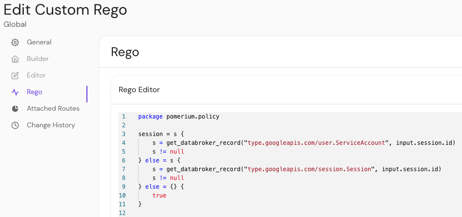

---
# cSpell:ignore unvalidated
id: rego
title: Custom Rego Policies
description: Learn how Pomerium Enterprise supports custom Rego policies.
---

# Custom Rego Policies

Pomerium supports policies expressed in [Rego](https://www.openpolicyagent.org/docs/latest/#rego) for organizations that prefer to use [OPA](https://www.openpolicyagent.org/).

See the [Outputs](#outputs), [Inputs](#inputs), and [Functions](#functions) reference sections below to learn how Rego policies apply to policy evaluation.

:::enterprise

Custom Rego policies is a [Pomerium Enterprise](/docs/enterprise) feature.

:::

## Outputs

Authorization policy written in Rego is expected to return results in `allow` and/or `deny` rules:

```rego
# a policy that always allows access
allow := true
```

```rego
# a policy that always denies access
deny := true
```

Pomerium grants access according to the same rules as [PPL](/docs/capabilities/ppl#actions):

> Only two actions are supported: allow and deny. deny takes precedence over allow. More precisely: a user will have access to a route if at least one allow rule matches and no deny rules match.

`allow` and `deny` rules support four forms:

1. A simple boolean:

```rego
allow := true
```

2. An array with a single boolean value:

```rego
deny := [true]
```

3. An array with two values: a boolean and a **reason**:

```rego
allow := [false, "user-unauthorized"]
```

4. An array with three values: a boolean, a reason, and additional data:

```rego
allow := [false, "user-unauthorized", { "key": "value" }]
```

The **reason** value is useful for debugging, since it appears in [authorization logs](/docs/reference/authorize-log-fields#find-authorize-logs). There are two special reasons that trigger functionality in Pomerium:

- `user-unauthenticated` indicates that the user needs to sign in, and results in a redirect to the Authenticate service
- `device-unauthenticated` indicates that the user needs to register a new device

## Inputs

Rego scripts are evaluated with inputs available on the `input` object:

```rego
allow if input.http.method == "POST"
```

Rego defines the following inputs:

| **Input name** | **Type** | **Description** |
| :-- | :-- | :-- |
| `http` | Object | Represents the HTTP request |
| `http.method` | String | The method used in the HTTP request |
| `http.hostname` | String | The hostname in the HTTP request |
| `http.path` | String | The path in the HTTP request |
| `http.url` | String | The full URL in the HTTP request |
| `http.headers` | Object | The headers in the HTTP request |
| `http.client_certificate` | Object | The client certificate details |
| `http.client_certificate.presented` | Boolean | `true` if the client presented a certificate |
| `http.client_certificate.leaf` | String | The leaf certificated provided by the client (unvalidated) |
| `http.client_certificate.intermediates` | String | The remainder of the client certificate chain |
| `http.ip` | String | The user's IP address |
| `http.session` | Object | Represents the user's session |
| `http.session.id` | String | The session ID |
| `http.is_valid_client_certificate` | Boolean | `true` if the presented client certificate is valid |

## Functions

The function below is available in Rego scripts:

- `get_databroker_record(record_type, record_id)`: Returns data from the Databroker service.

For example:

```rego
session := get_databroker_record("type.googleapis.com/session.Session", input.session.id)
```

### Example Rego policy

This example policy compares the `given_name` claim from a user's session against a list of popular first names, and only allows the 100 most popular first names.

```rego
package pomerium.policy
session = s {
  s = gset_databroker_record("type.googleapis.com/user.ServiceAccount", input.session.id)
  s != null
} else = s {
  s = get_databroker_record("type.googleapis.com/session.Session", input.session.id)
  s != null
} else = {} {
  true
}
user = u {
  u = get_databroker_record("type.googleapis.com/user.User", session.user_id)
} else = {} {
  true
}
allow = [true, {"custom-rego-authorized"}] {
  # grab all the claims from the user and session objects
  session_claims := object.get(session, "claims", {})
  user_claims := object.get(user, "claims", {})
  all_claims := object.union(session_claims, user_claims)
  # get the given_name claim. claim values are always an array of strings
  given_names := object.get(all_claims, "given_name", [])
  # query a JSON dump of the most popular baby names from 2020
  response := http.send({
    "method": "GET",
    "url": "https://raw.githubusercontent.com/aruljohn/popular-baby-names/master/2020/boy_names_2020.json",
    "force_json_decode": true,
  })
  # only include the top 100 names
  all_names := response.body.names
  popular_names := array.slice(all_names, 0, 99)
  # check that there's a given name in the popular names
  some i
  some j
  popular_names[i] == given_names[j]
} else = [false, {"custom-rego-unauthorized"}] {
  session.id != ""
} else = [false, {"user-unauthenticated"}] {
  true
}
```

This example pulls session data from the Databroker service using `type.googleapis.com/session.Session` for users and `type.googleapis.com/user.ServiceAccount` for service accounts.

::::enterprise

In the [**Enterprise Console**](/docs/enterprise), you can write custom Rego policies in the Rego Editor:



:::note

A policy can only support PPL or Rego. Once one is set, the other tab is disabled.

:::

::::
