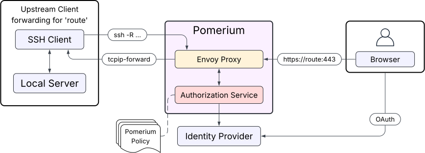
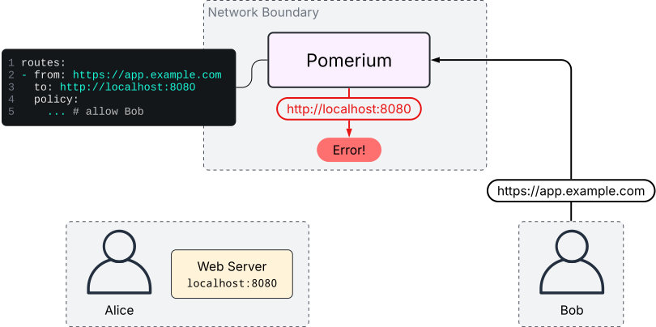
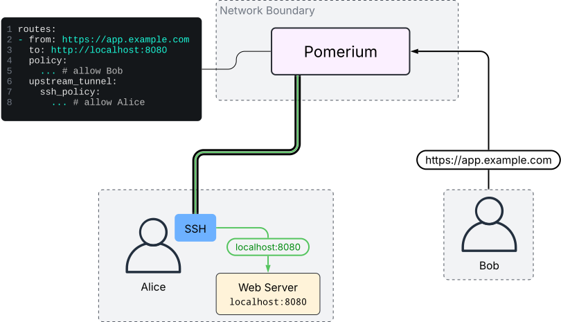
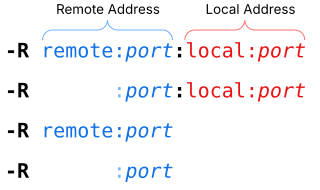
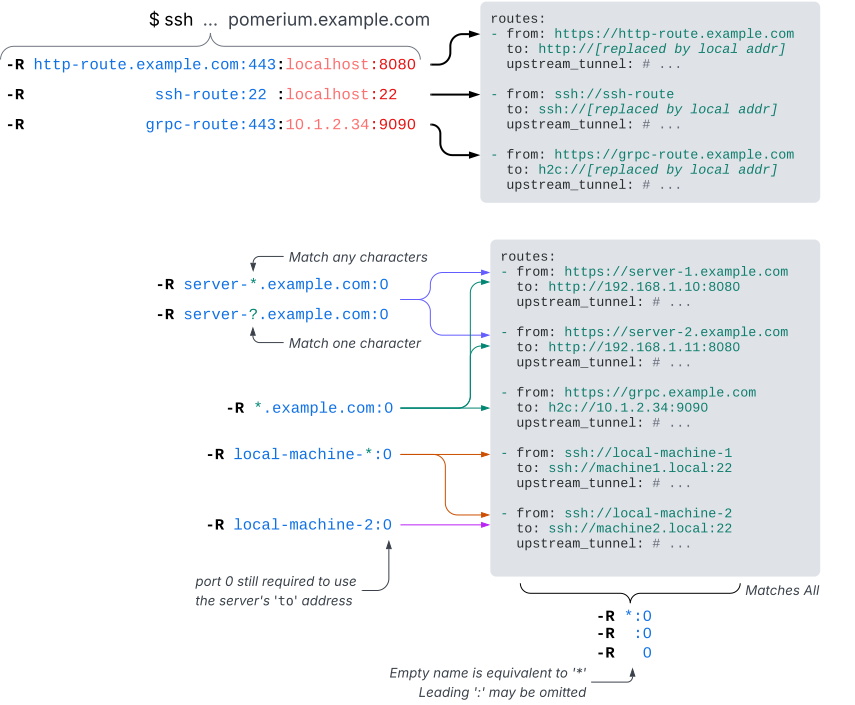
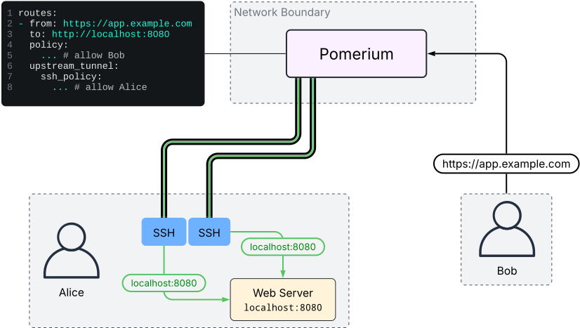
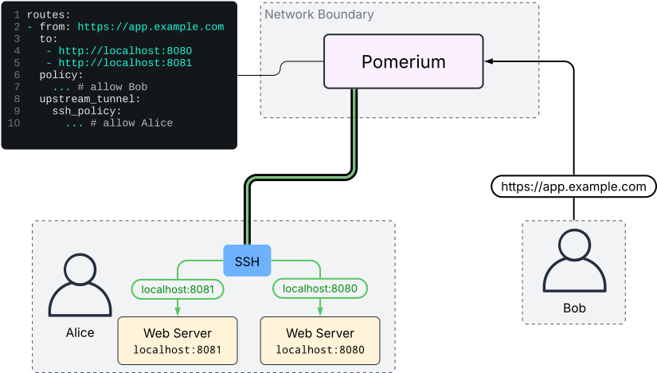
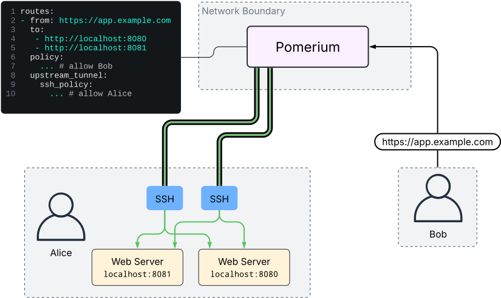

# Reverse Tunneling



Any HTTP or SSH route can be configured to route upstream traffic through
authenticated SSH clients using reverse port-forwarding.

When a route is in this mode, Pomerium will not route traffic for that route
directly to upstream servers. Instead, SSH clients can connect to Pomerium and
register themselves as upstream endpoints for the route (for as long as they
remain connected and authenticated). Then, when a downstream client connects to
the route, Pomerium will tell a connected SSH client to open a connection to the
"real" upstream server via reverse port-forward.

## Example Scenario

Suppose Alice is running a web server locally, and wants to allow Bob to connect
to it. Both Alice and Bob can reach a Pomerium server, but the Pomerium server
cannot reach Alice's local web server. If Alice tries to configure a route's
`to` address to `http://localhost:8080`, the Pomerium server will attempt to
connect to `localhost:8080` from wherever it is running.

&nbsp; &nbsp; &nbsp; 

Instead, Alice can configure the Pomerium route with the `upstream_tunnel`
option. Here, a second Pomerium policy must be configured, `ssh_policy`. This
second policy controls who can connect as an upstream for this route. Standard
SSH policy rules can be used here; see
[SSH Policy Criteria](/docs/capabilities/native-ssh-access#ssh-policy-criteria)
for details.

Once the route is configured, Alice connects to the Pomerium server via SSH and
enables reverse port-forwarding with the `-R` flag (e.g.
`ssh -R 0 pomerium.example.com`, assuming standard OpenSSH) and authenticates
successfully. Then, Bob connects to the route. Pomerium will request that
Alice's SSH client open a connection on `localhost:8080`. The SSH client can
reach the local web server, so the connection can be established.

&nbsp; &nbsp; &nbsp; 

## Detailed Usage

### OpenSSH Client Syntax

Reverse port-forwarding in OpenSSH is controlled with the `-R` flag. The syntax
of this flag can take several forms, following a similar structure:<b>[^1]</b>



The argument to `-R` consists of either one or two `name:port` addresses,
separated by a `:`. The remote address (first) describes the client's request to
the server. The local address (second), if present, is used only by the client
to control the destination of an incoming request; it is not sent to the server.

If the local address is present, the server has no control over the destination
address. The SSH client forwards the request to the hostname and port given on
the command line. If the local address is omitted, however, the server requests
the destination address for each new connection. This is referred to as "dynamic
port forwarding".

:::note

When the local address is omitted, the remote port should always be set to 0.
The opposite is also true; when providing a local address, the port should not
be 0. This is Pomerium-specific and is covered in more detail further below.

:::

:::note

OpenSSH also supports unix socket forwarding, which is not supported by Pomerium
at this time.

:::

### How Pomerium Interprets the Remote Address

Each instance of `-R` on the command line makes a separate request<b>[^2]</b> to
the server, containing the remote `name:port` address. The server is free to
interpret this in an application-specific way. In Pomerium's case:

- The `name` represents a route hostname. This is the host part of the `from`
  URL in a route, not including the scheme.

- The `port` functions as a protocol selector. If the port is `443`, it will
  match HTTP routes. If the port is `22`, it will match SSH routes. These are
  fixed values and do not change based on the ports Pomerium is listening
  on<b>[^3]</b>.

### Dynamic Port Forwarding

Dynamic port forwarding is enabled **only when the client requests port `0` in
the remote address[^4]**.

This mode allows a single SSH client to port-forward multiple routes at the same
time, and not require manual updates when the Pomerium configuration changes.

When dynamic port-forwarding is used, the `name` section of the remote address
will accept a glob pattern to match route hostnames. All matching routes for
which the current user is authenticated will be handled by the client.

:::tip

If multiple `to` URLs are configured in a route, Pomerium will load-balance
between them by alternating which destination host:port is requested in a
round-robin strategy. This only applies when dynamic port-forwarding is used.

:::

:::warning

Exercise reasonable caution when using dynamic port-forwarding. Treat this as
you would any other network tunneling tool. Always verify the SSH host key
fingerprints of the server you connect to!

:::

### Static Port Forwarding

When a local address is present, new connections will always be routed to that
address and port. In this way, the local address and port can differ from the
address and port configured in the route's `to` URL. The `to` URL is not
completely ignored, however: it is used to configure the expected upstream
protocol for the route, and
[Host Header Settings](/docs/reference/routes/headers#host-rewrite) still apply.

### Syntax Examples



## Operating the TUI

TODO

### Non-interactive clients

The TUI will be automatically disabled for non-interactive clients. To disable
it while running an interactive client, pass the `-N` flag to `ssh`.

## Compatibility

This feature can be used with any HTTP route, as well as SSH routes. The
tunneling mechanism is transparent to any protocols running on top of TCP, so no
special considerations are needed to make use of TLS, GRPC, etc.

UDP is not supported.

## Advanced Usage

### Health Checks

If routes have
[health checks](/docs/reference/routes/load-balancing#health-checks) defined,
the health check requests originating internally within Envoy are also routed
through the tunnel. Downstream requests will then be able to fail-fast when
Envoy knows the real upstream is unhealthy. If multiple SSH upstream endpoints
are connected, Envoy can prioritize routing traffic to healthy endpoints
(subject to
[Panic Threshold](https://www.envoyproxy.io/docs/envoy/latest/intro/arch_overview/upstream/load_balancing/panic_threshold.html)
configuration; see also
[Supported Health Checks Parameters](http://localhost:3001/docs/reference/routes/load-balancing#supported-health-checks-parameters)).

### High Availability

Multiple SSH client instances can connect to Pomerium and register as upstream
endpoints for the same route. Envoy will load-balance between all connected SSH
clients. The following diagram illustrates this:

&nbsp; &nbsp; &nbsp; 

In addition, multiple `to` addresses in a Pomerium route can be used to
load-balance to the real upstream servers, through any connected SSH clients:

(Note: this works only in conjunction with dynamic port forwarding)

&nbsp; &nbsp; &nbsp; 

These strategies can be combined, resulting in Pomerium load balancing between
SSH clients, then each SSH client load balancing between upstream servers:

(Note: this works only in conjunction with dynamic port forwarding)

&nbsp; &nbsp; &nbsp; 

### Deploying as a Service

The OpenSSH client can be run as a headless service to manage port-forwards in
the background.

The following example systemd user service will connect to a Pomerium server and
request to port-forward all authorized routes. It will restart upon connection
loss.

```ini title="~/.config/systemd/user/reverse-tunnel-client.service"
[Unit]
Description=Pomerium SSH Reverse Tunnel Client

[Service]
Type=forking

# -v = verbose (debug1); new connections on forwarded ports will be logged
# -y = send logs directly to syslog
# -f = fork after authentication; this is used in conjunction with Type=forking
#      to signal to systemd that the service is ready.
# -N = do not run any commands, only forward ports.
ExecStart=/usr/bin/ssh -vyfN -R 0 pomerium.example.com
Restart=on-failure
TimeoutSec=60s
```

:::info OAuth Login

If you do not have an active Pomerium session associated with your ssh key, or
the session is expired, the service will remain in startup and wait for the
session to be renewed. You can either check the journal logs for the service to
obtain the sign-in URL, or run another ssh command separately (e.g.
`ssh pomerium.example.com -- whoami`) and sign in, after which the service will
automatically be authenticated and continue on its own.

:::

:::note

If your routes use health checks, the health check connections will show up in
the debug logs too. This could be noisy depending on how many routes/health
checks you have configured.

In the above example, failed health check errors will be logged with `-v`.
Without `-v`, they will not show up unless `-y` is also used.

:::

### OpenSSH Escape Commands

The OpenSSH client has a built-in system for running basic commands during an
active session. This can be used to, among other things, modify port-forwarding
requests without needing to restart the ssh client. Details on how to use this
can be found in the "Escape Characters" section of `man 1 ssh`.
([online docs here](https://www.man7.org/linux/man-pages/man1/ssh.1.html#ESCAPE_CHARACTERS))

---

<br />

[^1]:
    This is not an exhaustive list; it is only meant to illustrate the basic
    syntax structure as interpreted by OpenSSH. There are Pomerium-specific
    rules (e.g. for port numbers) not depicted here which are discussed in more
    detail later.

[^2]:
    These requests (instances of -R, and also -L/-D for local forwarding), are
    called "permissions" internally in OpenSSH. Pomerium also uses this term in
    some places.

[^3]:
    This was done to avoid confusion related to port remapping when running
    Pomerium in a container, as by default the Pomerium container runs as
    non-root and doesn't bind directly to ports 443/22. If additional non-http
    protocols become supported, they will also be assigned unique "port"
    numbers.

[^4]:
    This is Pomerium-specific logic. OpenSSH itself enables dynamic
    port-forwarding when the local address is omitted. This changes the protocol
    slightly, but OpenSSH does not inform the server of this (only the remote
    address is ever sent to the server, regardless of mode). Pomerium will
    detect a protocol mismatch and display a warning to the client in this case,
    but there is no way to detect it until a connection is attempted. <br/>
    Furthermore, OpenSSH also treats port 0 differently in its own way: it
    expects the server to reply with a dynamically allocated port in response to
    the client's port-forward request. This is a separate mechanism however, and
    exists to model real port-binding behavior. Pomerium is, of course, not
    actually binding real ports to facilitate this; instead, unique random "port
    numbers" are generated to identify individual port-forward requests made by
    the client. These numbers show up in the TUI, and can be used in the OpenSSH
    escape console to revoke a port-forwarding rule at runtime.
