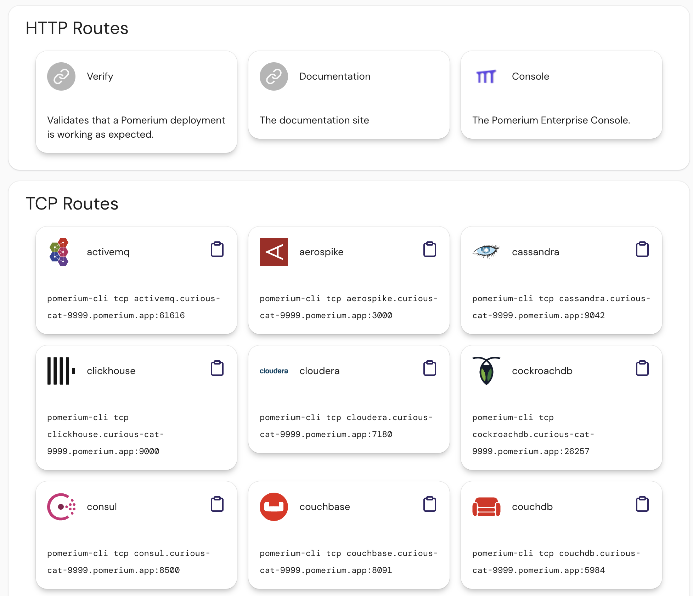
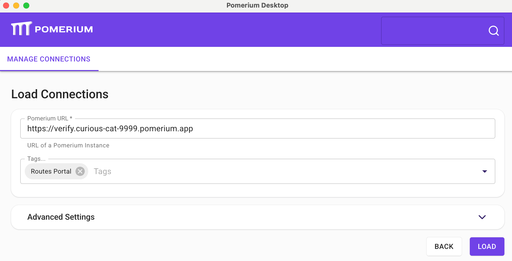

The Pomerium Routes Portal allows a user to see all the routes they have access to. It is available on any domain frontend by Pomerium at the special `/.pomerium/routes` endpoint.



This data is also available as JSON at `/.pomerium/api/v1/routes`.

```json
{
  "routes": [
    {
      "id": "c7cc6f3995e8c6e4",
      "name": "postgres",
      "type": "tcp",
      "from": "tcp+https://postgres.curious-cat-9999.pomerium.app:5432",
      "description": "",
      "connect_command": "pomerium-cli tcp postgres.curious-cat-9999.pomerium.app:5432"
    },
    {
      "id": "2116ef165e888f1a",
      "name": "verify",
      "type": "http",
      "from": "https://verify.curious-cat-9999.pomerium.app",
      "description": ""
    }
  ]
}
```

### CLI

The Pomerium CLI can list routes via the `routes list` subcommand:

```bash
pomerium-cli routes list https://curious-cat-9999.pomerium.app
```

### Desktop Client

The Pomerium Desktop Client can automatically create connections using the Routes Portal.


