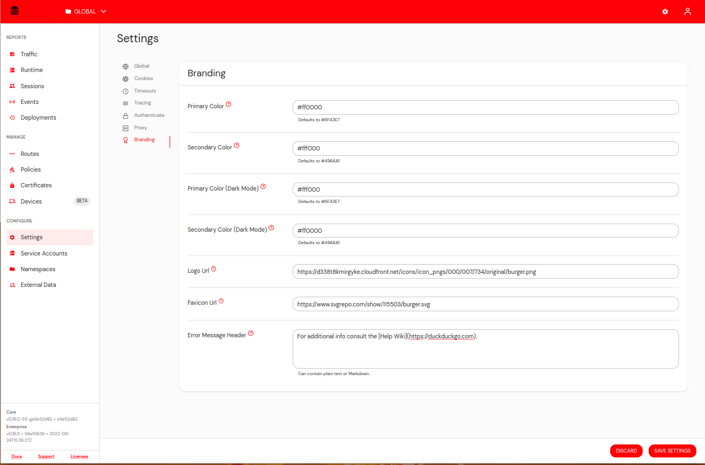

# Self-Remediation & Custom Error Pages

:::enterprise

This article describes a use case available to [Pomerium Enterprise](/docs/deploy/enterprise/install) customers.

:::

## Overview

Pomerium can transform a typical “Access Denied” screen into an actionable self-help workflow. Rather than simply blocking users with a generic error, you can provide a direct explanation of **why** a request was denied and specific **remediation** steps they can follow to fix the issue. This approach not only streamlines user support but also dramatically speeds up your response to new security vulnerabilities or non-compliant devices.

Consider a scenario where a user’s OS is missing an important patch. Instead of seeing a cryptic error, they encounter a branded page that says:

> “You need patch KB12345. Click here to download.”

Once updated, they can immediately retry access—no waiting on IT, and no protracted back-and-forth with help desk tickets.

## Error Details Setting

To enable these expanded messages, toggle **Error Details** for a particular route. Go to the **General** tab of that route and activate “Error Details”:

If you leave it off, users only see a generic 403 error without any additional instructions.

## Explanation & Remediation Fields

Each policy can include:

- **Explanation**: A quick, human-readable note on why the policy denied access (e.g. “Your browser version is outdated.”).
- **Remediation**: Concrete steps to resolve it (e.g. “Download the latest Chrome update.”).

Pomerium displays these fields on denial pages. If a field is left blank, Pomerium shows the **Policy ID** to aid in troubleshooting.

## Custom Header & Markdown

You can define a global Header in the Branding settings, which appears at the top of every denial page. This header supports basic Markdown, allowing you to include help desk links, disclaimers, or even images.

Use this to highlight urgent security notices, direct employees to an internal status page, or provide a quick path to open a help desk ticket.

## Example Workflow

1. **New Zero-Day Vulnerability**: A critical exploit is discovered in an outdated browser version.
2. **Policy Update**: Security updates the Pomerium policy to deny access unless users are on the patched browser.
3. **Explanation & Remediation**:
   - Explanation: “Your browser is missing patch version 105.3.”
   - Remediation: “Download the latest update from our software portal.”
4. **Real-Time Enforcement**: Any user on an unpatched browser sees a custom denial page. A single click takes them to the correct download.
5. **Instant Self-Fix**: The user installs the update, refreshes the page, and is granted access—no waiting on support.

## Benefits of Self-Remediation

- **Speedy Fixes**: Users solve common issues themselves without opening tickets or waiting on email responses.
- **Reduced Risk**: Admins can quickly enforce mandatory patching. Users have no workaround except to comply.
- **Lower IT Load**: Repetitive issues (outdated antivirus, missing OS patches) no longer flood the help desk queue.
- **Improved User Experience**: A direct, helpful message fosters trust, demonstrating that security policies exist to protect them—not block them arbitrarily.

Coupled with [White Labeling](/docs/capabilities/branding), you can present these remediation messages in a fully branded interface, strengthening user confidence in your zero-trust security posture. By offering immediate guidance at the point of denial, you’ll see fewer escalations, faster compliance, and a safer network overall.
