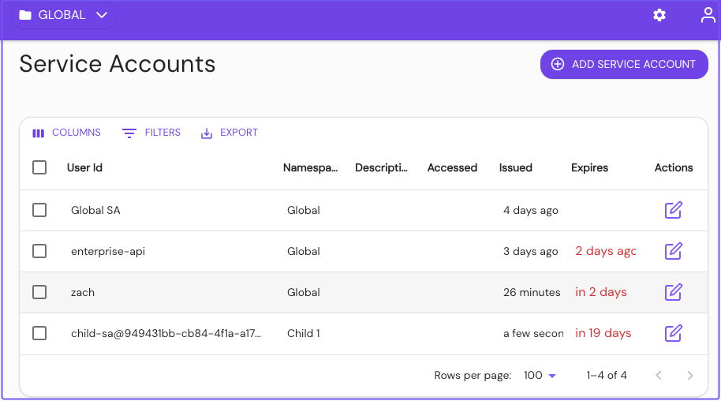

---
#cSpell:ignore etag
title: Service Accounts
lang: en-US
keywords:
  [
    pomerium,
    service-accounts,
    service accounts,
    pomerium enterprise,
    machine to machine,
    m2m,
  ]
---

# Service Accounts

Service accounts offer a protected and standardized method of authenticating machine-to-machine communication between services protected by Pomerium.

:::enterprise

Service Accounts are a Pomerium Enterprise feature. The steps below show you how to create and use a Service Account in the Enterprise Console. See our [Pomerium Enterprise](/docs/deploy/enterprise) page for more information.

:::

## Add a Service Account in the Enterprise Console

Before you begin, confirm you are in the correct Namespace. You can only use a service account in the Namespace it was created in, including its children Namespaces.

### Add a service account

1. In the **Service Accounts** dashboard, select **+ ADD SERVICE ACCOUNT**:

   

1. Give the service account a unique **User ID**, or select an existing user to impersonate. Consider referencing the Namespace you're creating it under, for easier reference later. Optionally, set an expiration date.

   

   The user ID set here corresponds to the `User` criteria when editing a policy.

   :::info

   Service accounts can be unique and exist only for Pomerium, or impersonate directory users from your identity provider.

   See the following pages for more information:

   - [**Directory Sync**](/docs/integrations/user-standing/directory-sync)
   - [**User Impersonation**](/docs/capabilities/impersonation)

   :::

### Save the service account JWT

1. After you select **Submit**, the modal presents the JSON web token (**JWT**) to authenticate the service account. Save it somewhere secure, as you won't be able to view it again:

   

1. Edit or create policies to give the service account access to the internal service:

   

   

### Authenticate with the Service Account JWT

Pomerium provides three methods to authenticate with a Service Account JWT:

- `Authorization: Bearer Pomerium-${pomerium_jwt}`
- `X-Pomerium-Authorization: ${pomerium_jwt}`
- `Authorization: Pomerium ${pomerium_jwt}`

For example, the curl command below demonstrates how to send an authenticated request using the bearer token method:

```bash
curl -i -H "Accept: application/json" -H "Authorization: Bearer Pomerium-${pomerium_jwt}"
https://verify.localhost.pomerium.io
```

If the request is valid, the response would look similar to the example below:

```bash
HTTP/2 200
accept-ranges: bytes
cache-control: no-cache
content-type: text/html; charset=utf-8
etag: "75df42fffe5e9fdf2c13f64963d04e8115fb06f8e9c4a97db3c9d7394ab6be38"
x-cloud-trace-context: 97f79dda2b32e0618d7e53cee2c85bcb;o=1
date: Mon, 04 Mar 2024 21:56:24 GMT
server: envoy
content-length: 1191
x-envoy-upstream-service-time: 206
x-frame-options: SAMEORIGIN
x-xss-protection: 1; mode=block
x-request-id: bcd0bb52-25fb-4858-8da0-a552fc9b2859
```
