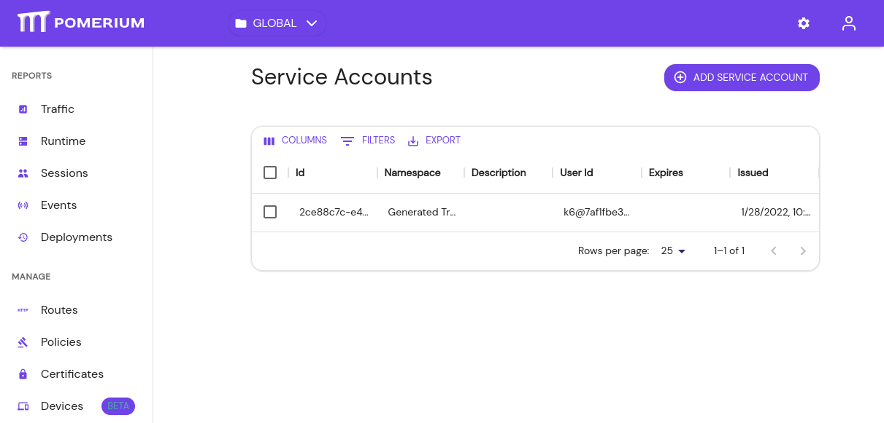
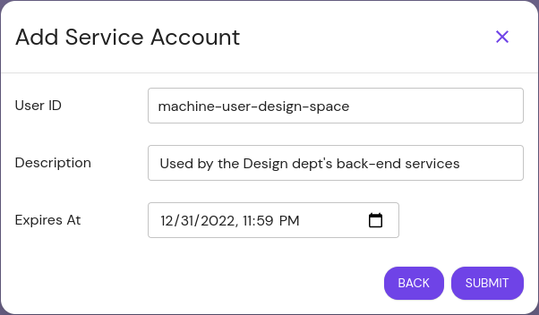
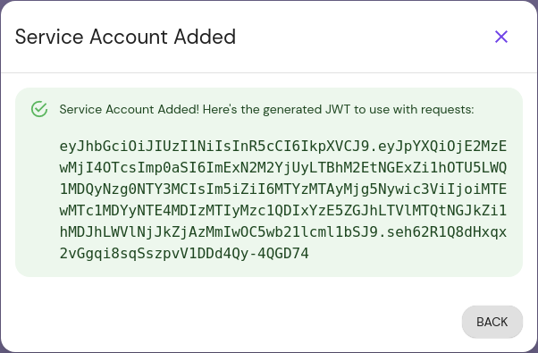
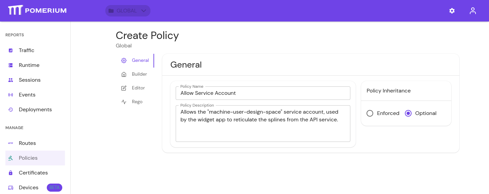
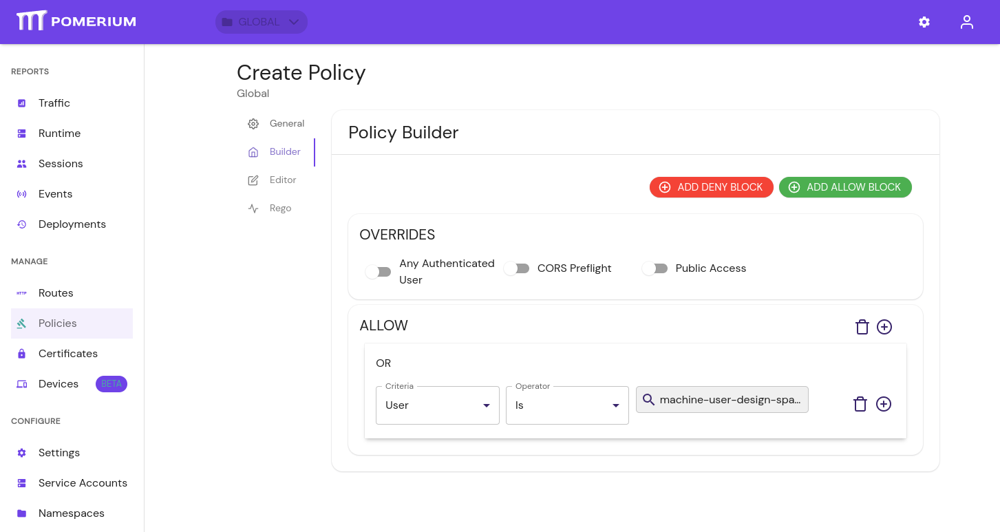

# Service Accounts

Service accounts offer a protected and standardized method of authenticating machine-to-machine communication between services protected by Pomerium.

:::enterprise

Service Accounts are a Pomerium Enterprise feature. The steps below show you how to create and use a Service Account in the Enterprise Console. See our [Pomerium Enterprise](/docs/deploy/enterprise) page for more information. 

:::

## Service Accounts in the Enterprise Console

Before you begin, confirm you are in the correct Namespace. You can only use a service account in the Namespace it was created in, including its children Namespaces.

### Add a service account

1. Under **CONFIGURE**, select **Service Accounts**, then **+ ADD SERVICE ACCOUNT**:

   

1. Give the service account a unique **User ID**, or select an existing user to impersonate. Consider referencing the Namespace you're creating it under, for easier reference later. Optionally, set an expiration date.

   

   The user ID set here corresponds to the `User` criteria when editing a policy.

   :::note

   Service accounts can be unique and exist only for Pomerium, or impersonate directory users from your identity provider. 

   See the following pages for more information:

   - [**Directory Sync**](/docs/capabilities/directory-sync)
   - [**User Impersonation**](/docs/capabilities/impersonation) 

   :::

### Handle the service account JWT 

1. After you click **Submit**, the modal presents the JSON web token (**JWT**) for the service account. Temporarily save it somewhere secure, as you will not be able to view it again:

   

1. Edit or create policies to give the service account access to the internal service:

   

   

Pomerium provides three ways to authenticate with a Service Account JWT:

- `Authorization: Bearer Pomerium-${pomerium_jwt}`
- `X-Pomerium-Authorization: ${pomerium_jwt}`
- `Authorization: Pomerium ${pomerium_jwt}`

