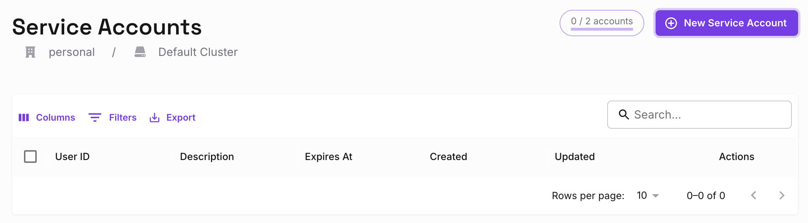
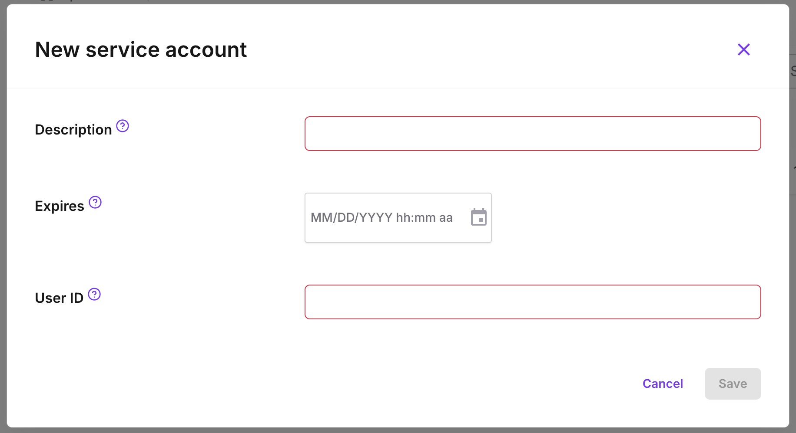
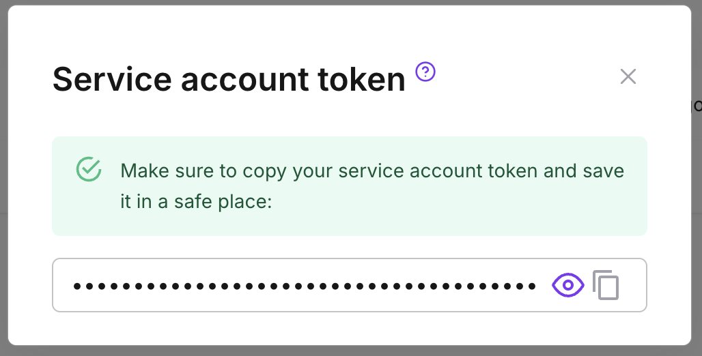
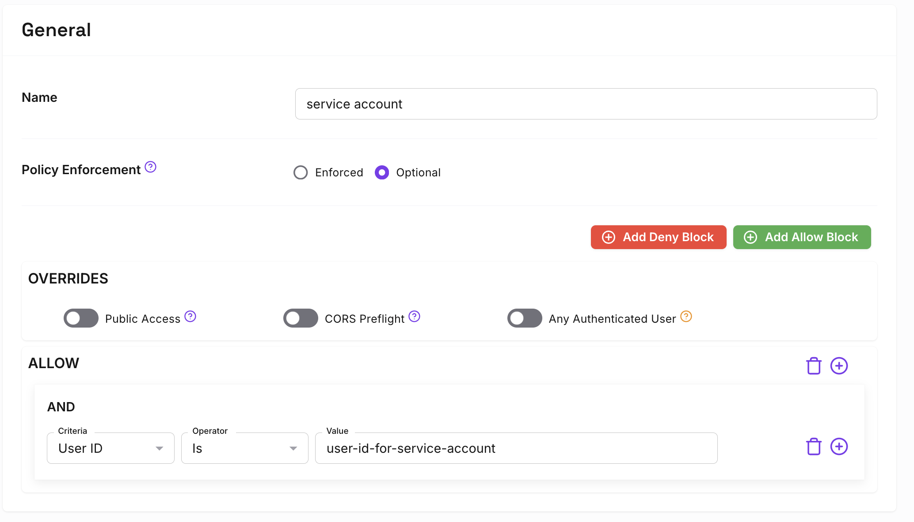

---
#cSpell:ignore etag
title: Service Accounts
lang: en-US
keywords:
  [
    pomerium,
    service-accounts,
    service accounts,
    pomerium enterprise,
    machine to machine,
    m2m,
  ]
---

# Service Accounts

Service accounts offer a protected and standardized method of authenticating machine-to-machine communication between services protected by Pomerium.

:::enterprise

Service Accounts are a Pomerium Enterprise and Pomerium Zero feature. The steps below show you how to create and use a Service Account in the Enterprise Console or in Pomerium Zero.

:::

## Add a Service Account in the Enterprise Console

Before you begin, confirm you are in the correct Namespace. You can only use a service account in the Namespace it was created in, including its children Namespaces.

### Add a service account

1. In the **Service Accounts** dashboard, select **+ ADD SERVICE ACCOUNT**:

   

1. Give the service account a unique **User ID**, or select an existing user to impersonate. Consider referencing the Namespace you're creating it under, for easier reference later. Optionally, set an expiration date.

   

   The user ID set here corresponds to the `User` criteria when editing a policy.

   :::info

   Service accounts can be unique and exist only for Pomerium, or impersonate directory users from your identity provider.

   See the following pages for more information:

   - [**Directory Sync**](/docs/integrations/user-standing/directory-sync)
   - [**User Impersonation**](/docs/capabilities/impersonation)

   :::

### Save the service account JWT

1. After you select **Submit**, the modal presents the JSON web token (**JWT**) to authenticate the service account. Save it somewhere secure, as you won't be able to view it again:

   

1. Edit or create policies to give the service account access to the internal service:

   

   

## Add a Service Account in Pomerium Zero

### Add a Service Account

1. In the **Service Accounts** dashboard, select **+ New Service Account**:

   

1. Give the service account a unique **User ID**, or use the ID of an existing user. Optionally, set an expiration date. The user ID set here corresponds to the `User` criteria when editing a policy.

   

### Save the Service Account JWT

1. After you click **Save**, the modal presents the JSON web token (**JWT**) to authenticate the service account. Save it somewhere secure, as you won't be able to view it again:

   

1. Edit or create policies to give the service account access to the internal service:

   

## Authenticate with the Service Account JWT

Pomerium provides three methods to authenticate with a Service Account JWT:

- `Authorization: Bearer Pomerium-${pomerium_jwt}`
- `X-Pomerium-Authorization: ${pomerium_jwt}`
- `Authorization: Pomerium ${pomerium_jwt}`

For example, the curl command below demonstrates how to send an authenticated request using the bearer token method:

```bash
curl -i -H "Accept: application/json" -H "Authorization: Bearer Pomerium-${pomerium_jwt}"
https://verify.localhost.pomerium.io
```

If the request is valid, the response would look similar to the example below:

```bash
HTTP/2 200
accept-ranges: bytes
cache-control: no-cache
content-type: text/html; charset=utf-8
etag: "75df42fffe5e9fdf2c13f64963d04e8115fb06f8e9c4a97db3c9d7394ab6be38"
x-cloud-trace-context: 97f79dda2b32e0618d7e53cee2c85bcb;o=1
date: Mon, 04 Mar 2024 21:56:24 GMT
server: envoy
content-length: 1191
x-envoy-upstream-service-time: 206
x-frame-options: SAMEORIGIN
x-xss-protection: 1; mode=block
x-request-id: bcd0bb52-25fb-4858-8da0-a552fc9b2859
```

## Programmatic Access

This section describes how to obtain Pomerium access credentials programmatically via a web-based oauth2 style authorization flow. If you have ever used Google's [`gcloud`](https://cloud.google.com/sdk/gcloud) commandline app, the mechanism is very similar.

### Components

#### Login API

The API returns a cryptographically signed sign-in URL that can be used to complete a user-driven login process with Pomerium and your identity provider. The login API endpoint takes a `pomerium_redirect_uri` query parameter as an argument, which points to the location of the callback server to be called following a successful login.

Here's a full example:

```bash
# we'll call the hidden pomerium path below against a proxied-by-pomerium
# service, like our verify app below
ANY_POMERIUM_PROXIED_SERVICE=verify.example.com

# the service we're developing locally, this needs to be localhost to work with
# `pomerium_redirect_uri`, see **NOTE** below, to override this default
MY_LOCAL_DEV_SERVICE=http://localhost:8000

# create a request to the pomerium-proxied service
# `/.pomerium/...` is available for any proxied service
curl "https://$ANY_POMERIUM_PROXIED_SERVICE/.pomerium/api/v1/login?pomerium_redirect_uri=$MY_LOCAL_DEV_SERVICE"

# will output a URL like:
# https://authenticate.example.com/.pomerium/sign_in?pomerium_redirect_uri=http%3A%2F%2Flocalhost%3Fpomerium_callback_uri%3Dhttps%253A%252F%verify.example.com%252F.pomerium%252Fapi%252Fv1%252Flogin%253Fpomerium_redirect_uri%253Dhttp%253A%252F%252Flocalhost&sig=hsLuzJctmgsN4kbMeQL16fe_FahjDBEcX0_kPYfg8bs%3D&ts=1573262981

# open url above in a browser and you'll get redirected in the browser to
# > http://$MY_LOCAL_DEV_SERVICE/?pomerium_jwt=a.real.jwt or expanded as
# http://localhost:8000/?pomerium_jwt=programmatic.pomerium.jwt

# you can now use the value from `pomerium_jwt` to authorize to our proxied endpoint (which you could use to proxy `localhost`)

curl -H 'Authorization: Pomerium a.real.jwt' https://verify.example.com
```

:::tip **Note**

The value of `pomerium_jwt` is an opaque token, meaning the token does not carry identifying information about the user. Unlike encrypted JWTs used for user verification, Pomerium's opaque token functions as an identifier to authenticate against the API, so you should not inspect or rely on the token's values.

To learn more about JWTs and identity verification, see the following docs:

- [Identity Verification](/docs/capabilities/getting-users-identity)
- [JWT Verification](/docs/capabilities/getting-users-identity.mdx)

:::

- `service.example.com` is our endpoint fronted by pomerium-proxy
- `localhost:8000` is our service we're developing locally, it'll need to accept the programmatic token directly as a query param `?pomerium_jwt=programmatic.pomerium.jwt` (_see [callback handler](#callback-handler)_)
- `authenticate.example.com` is the pomerium-authenticate service, we'll open that in the browser to authenticate

**Note**: By default only `localhost` URLs are allowed as the `pomerium_redirect_uri`. This can be customized with the [`programmatic_redirect_domain_whitelist`](/docs/reference/programmatic-redirect-domain-whitelist) option.

#### Alternative to Login API for `localhost` development

Alternatively you can create a new policy to route an endpoint to a [bastion host](https://en.wikipedia.org/wiki/Bastion_host). You should include a HTTP proxy on this bastion host for HTTPS traffic. Here's one way to do it with nginx: [https://jerrington.me/posts/2019-01-29-self-hosted-ngrok.html](https://jerrington.me/posts/2019-01-29-self-hosted-ngrok.html) An HTTP proxy on the bastion allows us to receive HTTPS traffic with a self signed cert through LetsEncrypt.

This alternative will allow you to act as if your service is deployed and fronted by Pomerium. We will then forward the remote port from the bastion host behind the pomerium-proxy to localhost.

This is useful if you're using `pass_identity_headers` in your policy.

For example:

```yaml
# a policy like
- from: https://my-dev-endpoint.example.com
  to: https://my-bastion-host.example.com:5000
  pass_identity_headers: true
```

Once this policy is applied and deployed, you can then forward the remote port of the HTTP proxy running on the bastion host that in this case proxies 5000 to 5001 internally.

We then forward the remote port from the bastion's HTTP proxy (5001) to `localhost:8000`, with an ssh tunnel like:

```sh
ssh -N -R 5001:localhost:8000 my-user@my-bastion-host.example.com
```

You can then go to `https://my-dev-endpoint.example.com` and have the pomerium-proxy route traffic securely to the bastion host and back through the ssh-tunnel, the headers and anything pomerium-proxy is setup to do to the request will be included in the forwarded request and traffic.

#### Callback handler

It is the script or application's responsibility to create a HTTP callback handler. Authenticated sessions are returned in the form of a [callback](https://developer.okta.com/docs/concepts/auth-overview/#what-kind-of-client-are-you-building) from pomerium to a HTTP server. This is the `pomerium_redirect_uri` value used to build login API's URL, and represents the URL of a (usually local) HTTP server responsible for receiving the resulting user session in the form of `pomerium_jwt` query parameters.

See the python script below for example of how to start a callback server, and store the session payload.

### Handling expiration and revocation

Your script or application should anticipate the possibility that your underlying `refresh_token` may stop working. For example, a refresh token might stop working if the underlying user changes passwords, revokes access, or if the administrator removes rotates or deletes the OAuth Client ID.

### High level workflow

The application interacting with Pomerium must manage the following workflow. Consider the following example where a script or program desires delegated, programmatic access to the domain `verify.corp.domain.example`:

1. The script or application requests a new login url from the pomerium managed endpoint (e.g. `https://verify.corp.domain.example/.pomerium/api/v1/login`) and takes a `pomerium_redirect_uri` as an argument.
1. The script or application opens a browser or redirects the user to the returned login page.
1. The user completes the identity providers login flow.
1. The identity provider makes a callback to pomerium's authenticate service (e.g. `authenticate.corp.domain.example`) .
1. Pomerium's authenticate service creates a user session and redirect token, then redirects back to the managed endpoint (e.g. `verify.corp.domain.example`)
1. Pomerium's Proxy service makes a callback request to the original `pomerium_redirect_uri` with the user session as an argument.
1. The script or application is responsible for handling that http callback request, and securely handling the callback session (`pomerium_jwt`) queryparam.
1. The script or application can now make any requests as normal to the upstream application by setting the `Authorization: Pomerium ${pomerium_jwt}` header.

:::tip

Pomerium supports :

- `Authorization: Bearer Pomerium-${pomerium_jwt}`
- `X-Pomerium-Authorization: ${pomerium_jwt}`

in addition to the `Authorization: Pomerium ${pomerium_jwt}` header format.

:::

### Example Code

Please see the following minimal but complete python example.

```bash
python3 scripts/programmatic_access.py \
	--dst https://verify.example.com/headers
```

import ProgrammaticAccess from '@site/content/examples/sh/programmatic_access.py.md';

<ProgrammaticAccess />

[authorization bearer token]: https://developers.google.com/gmail/markup/actions/verifying-bearer-tokens
[identity provider]: /docs/integrations/user-identity/identity-providers
[proof key for code exchange]: https://tools.ietf.org/html/rfc7636
