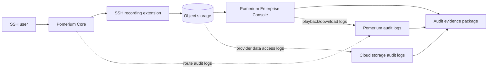
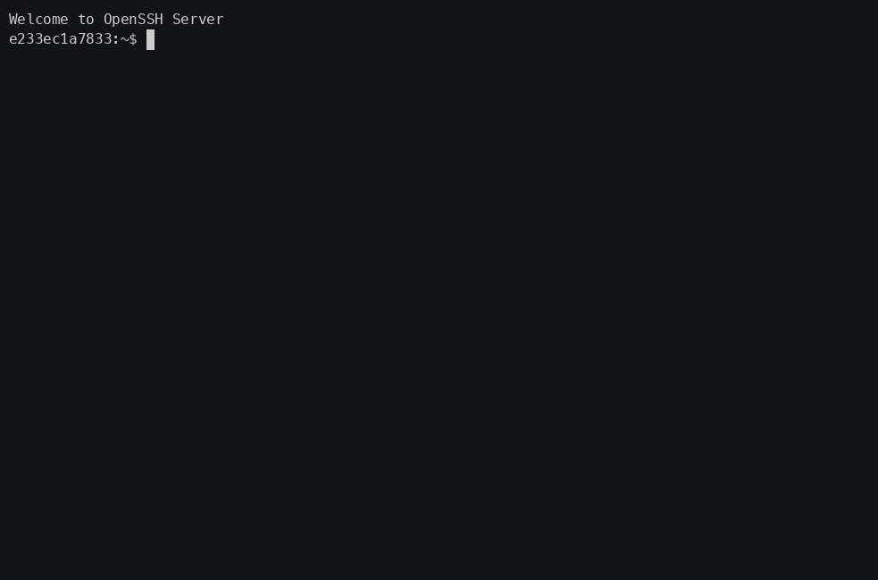
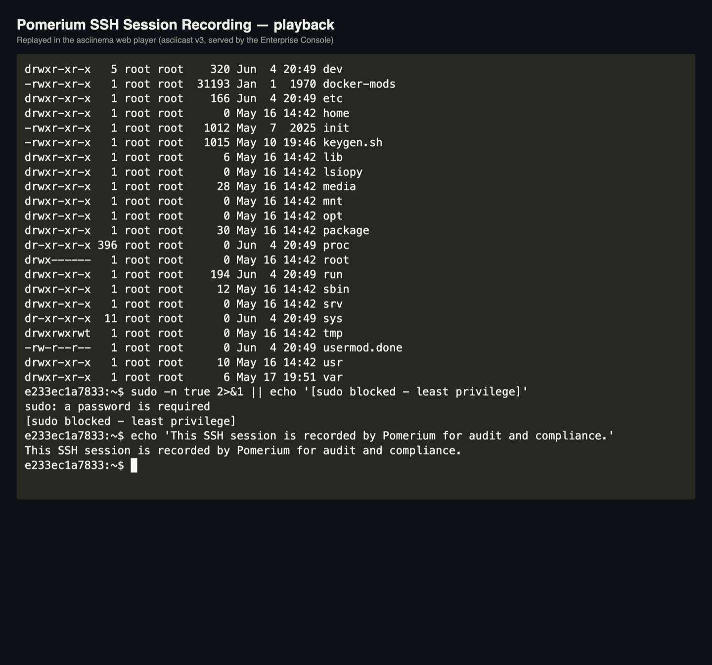
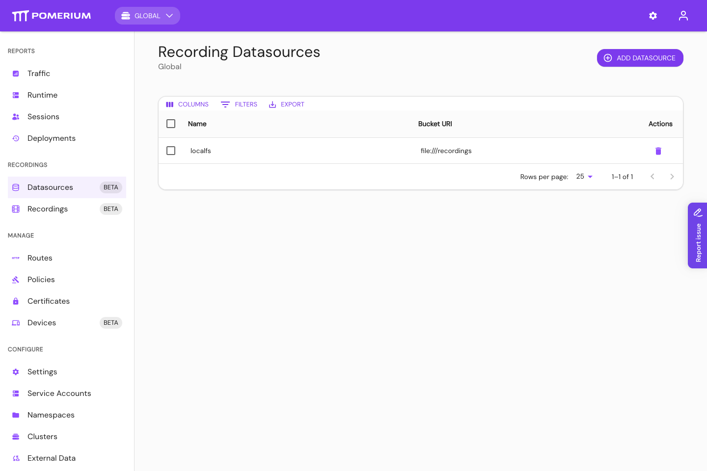
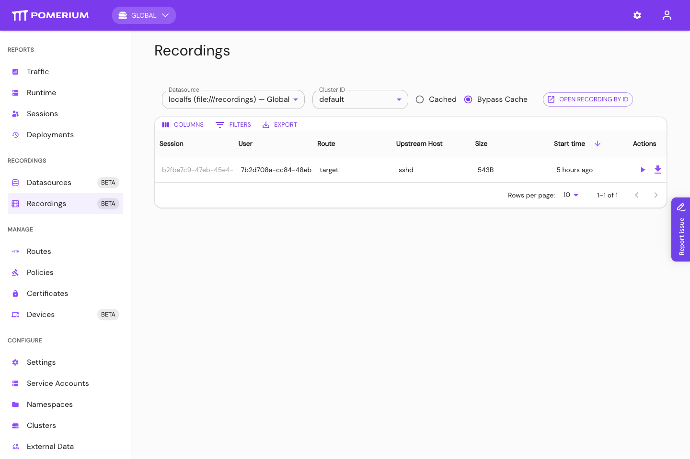
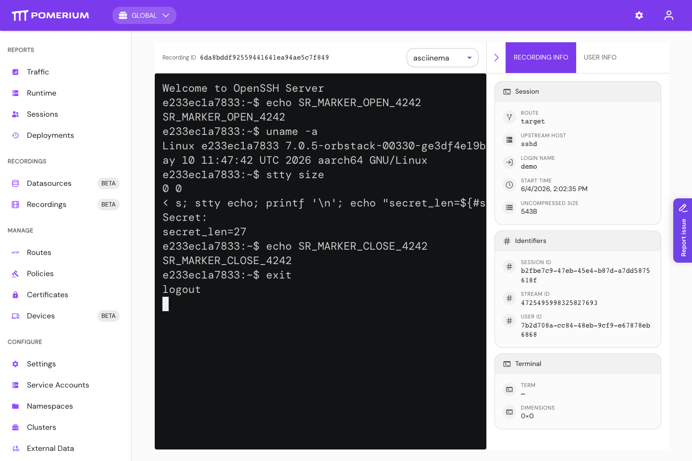

---
# cSpell:ignore replayable
title: SSH Session Recording for Audit and Compliance
description: Record and replay privileged SSH sessions with Pomerium and build auditor-ready evidence with WORM storage, identity-correlated audit logs, retention, and encryption for SOC 2, PCI DSS, HIPAA, and FedRAMP.
lang: en-US
sidebar_label: 'Session Recording for Compliance'
keywords:
  [
    pomerium,
    ssh,
    session recording,
    ssh session recording,
    session replay,
    privileged session recording,
    ssh audit trail,
    audit,
    compliance,
    soc 2,
    pci dss,
    hipaa,
    fedramp,
    worm,
    object lock,
    retention,
  ]
sidebar_class_name: enterprise
---

import TabItem from '@theme/TabItem';
import Tabs from '@theme/Tabs';

:::enterprise

This article describes a use case available to [Pomerium Enterprise](/docs/deploy/enterprise/install) customers.

:::

# SSH Session Recording for Audit and Compliance

Use Pomerium SSH session recording to produce auditor-ready evidence for privileged SSH access: replayable terminal sessions stored in your own object storage, every playback and download correlated with Pomerium Enterprise and cloud-provider audit logs, and retention, encryption, and immutability enforced at the storage layer. It builds on [Native SSH](/docs/capabilities/native-ssh-access), which works with standard SSH clients without VPNs, server agents, or client installs. This guide is the operating companion to the [Session Recording](/docs/capabilities/session-recording) reference page, which covers how to turn recording on; read that first.

With Pomerium SSH session recording you can:

- Record interactive SSH terminal output for selected routes.
- Replay and download recordings from Pomerium Enterprise.
- Store recordings in your own S3, GCS, Azure Blob, or S3-compatible object store.
- Enforce retention and immutability with bucket-level WORM / object-lock controls.
- Correlate playback and download activity across Pomerium Enterprise and cloud-provider storage logs.
- Package recordings, metadata, access logs, retention, and encryption settings as auditor evidence.

## When to use this guide

Use this guide when you need defensible evidence for privileged, interactive SSH access:

- SOC 2 access monitoring and incident investigation.
- PCI DSS logging and retention for administrative access.
- HIPAA audit controls for systems that contain or use ePHI.
- FedRAMP / NIST 800-53 audit and session-audit evidence.
- Internal investigations of who accessed which host and what appeared in the terminal.

Do not rely on SSH session recording alone when you need raw client keystrokes, complete command provenance (scripts, encoded commands, or commands hidden by terminal controls), recording of direct SSH commands / SCP / SFTP transfers, or host-level process telemetry. For command-level attribution, pair recordings with host-side controls such as `sudo` I/O logging, `auditd`, or EDR. This is a strength, not a gap: recording captures what the operator saw, and host controls capture what actually executed.

## How this approach fits

Session recording is one of several ways to get SSH evidence; they are complementary, not mutually exclusive:

| Approach | Strength | Trade-off |
| --- | --- | --- |
| Pomerium SSH recording | Records selected SSH routes with standard clients; evidence lives in your own object storage; access is correlated across Pomerium and provider logs | Captures PTY output for interactive sessions; pair with host controls for command-level provenance |
| Host-agent / eBPF recording | Observes deeper host activity and actual command execution | Requires a host agent and kernel-level integration on every target |
| Bastion-only recording | Simple, centralized SSH choke point | Often shared accounts, scaling limits, and weaker chain of custody |
| Mesh / VPN recorder | Works when all SSH already traverses the mesh | Tied to that network and client model |
| Legacy PAM session manager | Broad governance workflows | Heavier operational footprint; storage often not customer-owned |

## Evidence flow



The evidence package should include the recording objects, Pomerium Enterprise access logs, storage provider audit logs, and proof of storage retention and encryption settings.

## What Pomerium provides, and what you must configure

Pomerium produces a tamper-evident record of privileged SSH access and a correlatable audit trail. It does not, by itself, satisfy any compliance standard. The guarantees you can attest to depend on how you configure the storage layer and your identity provider. This is a shared-responsibility model:

| Layer | Owner | Responsibility |
| --- | --- | --- |
| SSH proxying, recording, audit-log emission, integrity digests | Pomerium | Capture who did what, emit audit logs, verify digests on every transfer |
| Immutability, encryption, retention, storage audit logs | Cloud storage provider + you | Object lock / retention, encryption keys, provider audit logging |
| Identity, access reviews, evidence collection | You | Least-privilege IAM, playback approvals, periodic evidence export |

Treat everything below as "Pomerium supports this control when the surrounding controls are configured," not "Pomerium is compliant out of the box."

## Recorded data is sensitive

:::danger

A recording captures everything the user sees in their terminal, unredacted. This can include secrets printed to the screen, file contents, and command output.

:::

Operationalize that warning:

- Scope recording to the routes that actually need it; do not record by default everywhere.
- Decide, in policy, who may enable recording on a route and who may play recordings back.
- Know the gap: Pomerium records the PTY output stream (what the server echoes back), not raw client keystrokes. Input that the server does not echo, such as a password at a `sudo` prompt, is not captured. If you need command-level attribution, pair recording with host-side controls such as `sudo` I/O logging or shell audit (`auditd`).



## Immutability: WORM, object lock, and retention

Pomerium writes each recording object once and never deletes or overwrites it, and the Enterprise Console only ever reads. To make that durable against a compromised credential or an insider, enable object lock and a retention policy on the bucket itself.

<Tabs>
<TabItem value="s3" label="AWS S3">

Enable S3 Object Lock with a default retention period, on a versioned bucket. Compliance mode is appropriate for regulated evidence because retention cannot be shortened or removed by any principal during the retention window; use governance mode for reversible rollout testing. See [S3 Object Lock](https://docs.aws.amazon.com/AmazonS3/latest/userguide/object-lock.html).

How to verify: using a principal that _has_ delete permission (not the least-privilege producer below), attempt to delete a recording object within the retention window and confirm Object Lock rejects it. Deleting as a principal with no delete permission only proves IAM, not immutability.

```bash
# 1. Confirm Object Lock is enabled on the bucket
aws s3api get-object-lock-configuration --bucket <recording-bucket>

# 2. Get the object's version ID and confirm it carries retention
aws s3api head-object --bucket <recording-bucket> \
  --key <cluster-id>/ssh/v1/<recording-id>/manifest
# note the "VersionId" in the output

# 3. Try to delete that protected version with a delete-capable principal -- Object Lock must refuse
aws s3api delete-object --bucket <recording-bucket> \
  --key <cluster-id>/ssh/v1/<recording-id>/manifest \
  --version-id <version-id>
# Expected: AccessDenied from object lock / retention. A delete WITHOUT --version-id only
# adds a delete marker on a versioned bucket and does not test immutability.
```

</TabItem>
<TabItem value="gcs" label="GCS">

Apply a retention policy and lock it with Bucket Lock. See [Bucket Lock](https://docs.cloud.google.com/storage/docs/bucket-lock).

How to verify: with a delete-capable principal, run `gcloud storage rm` on a recording object before the retention period elapses and confirm the retention policy (not IAM) denies it.

```bash
gcloud storage buckets describe gs://<recording-bucket> --format="default(retentionPolicy)"
gcloud storage rm gs://<recording-bucket>/<cluster-id>/ssh/v1/<recording-id>/manifest
# Expected: deletion denied by the retention policy until the retention period elapses.
```

</TabItem>
<TabItem value="azure" label="Azure">

Configure a time-based immutability policy (optionally with legal hold) on the container. See [Immutable blob storage](https://learn.microsoft.com/en-us/azure/storage/blobs/immutable-storage-overview).

How to verify: with a delete-capable principal, attempt to delete a recording blob within the retention window and confirm the immutability policy blocks it.

```bash
az storage blob delete --account-name <account> --container-name <container> \
  --name <cluster-id>/ssh/v1/<recording-id>/manifest
# Expected: delete blocked by the time-based immutability policy until it expires.
```

</TabItem>
</Tabs>

## Encryption at rest

Pomerium delegates encryption to the storage layer. The durable control is a bucket default that applies regardless of how the object is written:

- S3: set a bucket default of SSE-KMS with a customer-managed key.
- GCS: set a default customer-managed encryption key (CMEK) on the bucket.
- Azure: configure customer-managed keys in Key Vault for the storage account.

Pomerium can also specify encryption per request through the bucket URI (for example S3 `ssetype=aws:kms&kmskeyid=...`), but rely on the bucket default so nothing can write unencrypted.

How to verify: inspect a recording object's encryption status and confirm it reports your key.

## Least-privilege storage access

The producer and the reader should use separate principals. Start from the provider permissions in the [storage reference](/docs/capabilities/session-recording#storage-configuration), then reduce them with tested custom roles where your provider supports it:

| Component | Typical access | Notes |
| --- | --- | --- |
| Pomerium Core (producer) | Create/upload plus the read/list access needed to resume and verify writes | It should not need routine object deletion, but provider managed roles may include broader permissions. Test reduced custom roles before production. |
| Pomerium Enterprise (reader) | Read-only access to configured recording buckets | It does not write or delete recordings. |

For AWS S3, treat `s3:AbortMultipartUpload` separately from `s3:DeleteObject`; it may be needed for safe cleanup of incomplete multipart uploads even when object deletion is denied.

How to verify: run an upload, resume, playback, and download drill with the reduced roles before production. Confirm object retention denies deletion even if a break-glass or test principal has delete permission.

## Audit-log correlation

This is the core of the chain of custody: prove who accessed which recording, and that nothing was accessed outside Pomerium. Pomerium Enterprise emits an audit log on every access, and annotates its requests to the storage provider so the two logs can be matched.

1. Enable provider audit logging on the recording bucket.

<Tabs>
<TabItem value="gcs" label="GCS">

Enable Cloud Audit Logs Data Access (`ADMIN_READ`, `DATA_READ`, `DATA_WRITE`) for `storage.googleapis.com` on the bucket. Pomerium requests carry the `x-goog-custom-audit-pomerium-access-id` and `x-goog-custom-audit-pomerium-user` annotations.

</TabItem>
<TabItem value="s3" label="S3">

Enable CloudTrail data events and/or S3 server access logging. Pomerium requests carry a `pomerium_access_id` query parameter and an AWS SDK-sanitized user-agent app token in the rough form `app/PomeriumEnterprise-<version>--u-<hmac>--`; confirm the exact form against your CloudTrail records.

</TabItem>
<TabItem value="azure" label="Azure">

Enable `StorageBlobLogs`. Pomerium requests carry a `ClientRequestId` and a `PomeriumEnterprise/... (u=<hmac>)` user agent.

</TabItem>
</Tabs>

2. Correlate. Enterprise audit entries (message `authorize blob read`) carry a `user_hmac_id`, and recording/download/metadata accesses also carry an `access_id`; the provider log carries the same values. Match on `access_id` where present (some operations, and `HEAD` requests, carry only `user_hmac_id`) to tie a storage access back to a specific user action and identity.

3. Preserve correlation across rotation. The `user_hmac_id` is derived from the Enterprise shared secret. If you rotate the shared secret, keep the previous secrets so older provider logs remain correlatable.

How to verify, end to end:

1. In the Enterprise audit log, find the `authorize blob read` event for the recording and copy its `access_id`.
2. Query the cloud-provider storage access log for the same value -- the `pomerium_access_id` query parameter (S3), the `x-goog-custom-audit-pomerium-access-id` annotation (GCS), or the `ClientRequestId` (Azure).
3. Confirm the same `user_hmac_id` appears on both sides.
4. Confirm there are no reads of the recording object that lack Pomerium's annotation. A storage read with no matching Pomerium `access_id`/HMAC is access outside the chain of custody and should be investigated.



## Integrity verification

Pomerium verifies a content digest at every hop (recording extension to control plane to object store); an upload fails if any digest disagrees. To detect tampering after the fact, treat any of these as an exception:

- more than one object revision for a recording object (recordings are write-once);
- storage access-log entries that lack Pomerium's `access_id` / HMAC annotation;
- a Pomerium `access_id` or HMAC in the storage log that has no matching Enterprise audit entry.

## Access governance for playback

Recordings are scoped per Enterprise namespace and cluster, and only the namespace administrator can view them. Define an approval step for granting playback access, and note that downloads are themselves audited (`access_type: download`), so playback access is self-documenting.

The Enterprise Console shows the configured recording datasource, the recordings available from that datasource, and the in-browser playback view with session metadata.







## Auditor evidence bundle

For each session you sample during an audit, collect the following. Most items come straight from the recording's stored objects and the two audit-log sources; together they establish identity, content, and chain of custody.

| Evidence | What it proves | Where to get it |
| --- | --- | --- |
| Recording ID | Stable identifier for the reviewed session | Enterprise Console; object path `<cluster-id>/ssh/v1/<recording-id>/` |
| Recording metadata | Start time, SSH login name, route, upstream, Pomerium user and session IDs | `metadata.json`; Console session details |
| Replayable recording | What appeared in the terminal during the session | Console playback or downloaded `<recording-id>.asciicast.json` |
| Route policy | Recording was enabled for that SSH route | Pomerium route config (`session_recording.enabled`) |
| Identity evidence | The session is tied to an authenticated IdP user | Pomerium audit log; IdP |
| Playback / download audit log | Who accessed the recording after capture | Enterprise audit log (`authorize blob read`, `access_type`) |
| Cloud storage data-access log | The object was read through the expected Pomerium path | S3 CloudTrail; GCS Data Access logs; Azure StorageBlobLogs |
| Retention / object-lock config | Recordings cannot be deleted or shortened in the retention window | Storage provider configuration |
| Encryption evidence | Bucket/container encryption and key ownership | Storage provider configuration |
| Deletion-denial test | Immutability is enforced, not just IAM | Storage provider CLI output (see the verification steps above) |

## Operational runbooks

- Quarterly evidence: export the Enterprise audit log and the provider storage audit log for the recording buckets, plus the object-lock/retention configuration, as your access-monitoring evidence.
- Incident response: on suspected unauthorized access, correlate the Enterprise and provider logs by `access_id`, run the integrity checks above, and export the relevant recordings and log slices.
- Scale: rotate buckets periodically and avoid reusing a bucket across clusters under high load.

## Failure modes and operational controls

Compliance reviews care about the failure path as much as the happy path. Watch for these and put controls in place:

| Failure | Risk | Control |
| --- | --- | --- |
| Recording extension not loaded | A route is configured for recording but has no recording capability, so nothing is captured | Pin the extension version to the deployment; check the startup log for the loaded extension; alert if a recording route runs without it |
| Object storage unavailable or slow | Recording data buffers in memory; under sustained pressure the session is paused and can be closed | Monitor upload failures and buffer-pressure events; test behavior during a storage outage |
| Bucket lacks object lock or retention | A privileged storage principal could delete evidence | Enforce bucket-level retention/object lock and prove it with the deletion-denial test |
| Enterprise shared secret rotated | `user_hmac_id` changes, so older provider logs stop correlating | Retain previous shared secrets for the log-retention period |
| Provider data-access logging disabled | You cannot prove the access path for a recording | Enable and periodically verify storage data-access logs |
| Direct commands, SCP, or SFTP used | No interactive recording artifact is produced | Restrict non-interactive access on recorded routes, or add host-side logging |

## Control mapping

Pomerium session recording, configured as above, supports these controls. Each cell assumes the shared-responsibility model: Pomerium provides the capability; you configure and operate the surrounding storage and identity controls. Treat the mappings as starting points and confirm scope with your assessor, QSA, or compliance owner.

| Capability | SOC 2 (TSC) | PCI DSS v4.0.1 | HIPAA | NIST 800-53 / FedRAMP |
| --- | --- | --- | --- | --- |
| Recording of privileged SSH access | CC6.1, CC7.2 | 10.2.1 | 164.312(b) | AU-2, AU-3, AU-14 |
| WORM / object lock + retention | CC7.3, A1.2 | 10.5.1, 10.7 | 164.312(c)(1) | AU-9, AU-11 |
| Enterprise + storage audit-log correlation | CC7.2, CC7.3 | 10.3 | 164.312(b) | AU-3, AU-6, AU-12 |
| Least-privilege storage access | CC6.1, CC6.3 | 7.2 | 164.312(a)(1) | AC-6, AU-9(4) |
| Integrity verification | CC7.1 | 10.5 | 164.312(c)(1) | AU-9, SI-7 |
| Playback RBAC + download auditing | CC6.1 | 7, 10.2 | 164.308(a)(4) | AC-3, AU-2 |

### SOC 2

Use recordings as supporting evidence for access monitoring, incident investigation, and review of privileged infrastructure access. The recording, route policy, Enterprise audit log, and provider data-access log together show who accessed which system, when, and how the evidence was protected.

### PCI DSS

Use recordings and the correlated audit logs as evidence that administrative access to in-scope systems is logged, attributable to an individual, retained per policy, and protected from unauthorized modification or deletion.

### HIPAA

Use recordings as a technical audit-control mechanism for SSH access to systems that contain or use ePHI, paired with least-privilege access, encryption, and retention. The rule is risk-based; scope what you record accordingly.

### FedRAMP / NIST 800-53

Use recordings for audit-record generation and content, audit review, protection and retention of audit information, and session audit (AU-14). Pair with host-level controls where command-level capture is required, and develop session-audit scope with legal counsel.

## Limitations and compensating controls

| Limitation | Compensating control |
| --- | --- |
| Client keystrokes are not recorded unless echoed by the server | Host-side `sudo` I/O logging or shell audit for command-level attribution |
| Only interactive shell sessions are recorded (not direct commands or file transfers) | Separate logging or policy for non-interactive access; restrict it where recording is required |
| Pomerium does not encrypt recordings itself | Storage-layer encryption with customer-managed keys (above) |
| Recordings are unredacted | Scope recorded routes; train operators not to print secrets; pair with secrets management |
