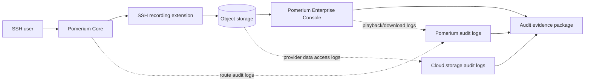

import TabItem from '@theme/TabItem';
import Tabs from '@theme/Tabs';

:::enterprise

This article describes a use case available to [Pomerium Enterprise](/docs/deploy/enterprise/install) customers.

:::

# SSH Session Recording for Audit and Compliance

The [Session Recording](/docs/capabilities/session-recording) reference page explains how to turn recording on. This guide explains how to operate it so recordings are useful audit evidence under common compliance regimes. It is a companion to the reference page; read that first.

## Evidence flow

The evidence package should include the recording objects, Pomerium Enterprise access logs, storage provider audit logs, and proof of storage retention and encryption settings.

## What Pomerium provides, and what you must configure

Pomerium produces a tamper-evident record of privileged SSH access and a correlatable audit trail. It does not, by itself, satisfy any compliance standard. The guarantees you can attest to depend on how you configure the storage layer and your identity provider. This is a shared-responsibility model:

| Layer | Owner | Responsibility |
| --- | --- | --- |
| SSH proxying, recording, audit-log emission, integrity digests | Pomerium | Capture who did what, emit audit logs, verify digests on every transfer |
| Immutability, encryption, retention, storage audit logs | Cloud storage provider + you | Object lock / retention, encryption keys, provider audit logging |
| Identity, access reviews, evidence collection | You | Least-privilege IAM, playback approvals, periodic evidence export |

Treat everything below as "Pomerium supports this control when the surrounding controls are configured," not "Pomerium is compliant out of the box."

## Recorded data is sensitive

:::danger

A recording captures everything the user sees in their terminal, unredacted. This can include secrets printed to the screen, file contents, and command output.

:::

Operationalize that warning:

- Scope recording to the routes that actually need it; do not record by default everywhere.
- Decide, in policy, who may enable recording on a route and who may play recordings back.
- Know the gap: Pomerium records the PTY output stream (what the server echoes back), not raw client keystrokes. Input that the server does not echo, such as a password at a `sudo` prompt, is not captured. If you need command-level attribution, pair recording with host-side controls such as `sudo` I/O logging or shell audit (`auditd`).

## Immutability: WORM, object lock, and retention

Pomerium writes each recording object once and never deletes or overwrites it, and the Enterprise Console only ever reads. To make that durable against a compromised credential or an insider, enable object lock and a retention policy on the bucket itself.

<Tabs>
<TabItem value="s3" label="AWS S3">

Enable S3 Object Lock with a default retention period, on a versioned bucket. Compliance mode is appropriate for regulated evidence because retention cannot be shortened or removed by any principal during the retention window; use governance mode for reversible rollout testing. See [S3 Object Lock](https://docs.aws.amazon.com/AmazonS3/latest/userguide/object-lock.html).

How to verify: using a principal that _has_ delete permission (not the least-privilege producer below), attempt to delete a recording object within the retention window and confirm Object Lock rejects it. Deleting as a principal with no delete permission only proves IAM, not immutability.

</TabItem>
<TabItem value="gcs" label="GCS">

Apply a retention policy and lock it with Bucket Lock. See [Bucket Lock](https://docs.cloud.google.com/storage/docs/bucket-lock).

How to verify: with a delete-capable principal, run `gcloud storage rm` on a recording object before the retention period elapses and confirm the retention policy (not IAM) denies it.

</TabItem>
<TabItem value="azure" label="Azure">

Configure a time-based immutability policy (optionally with legal hold) on the container. See [Immutable blob storage](https://learn.microsoft.com/en-us/azure/storage/blobs/immutable-storage-overview).

How to verify: with a delete-capable principal, attempt to delete a recording blob within the retention window and confirm the immutability policy blocks it.

</TabItem>
</Tabs>

## Encryption at rest

Pomerium delegates encryption to the storage layer. The durable control is a bucket default that applies regardless of how the object is written:

- S3: set a bucket default of SSE-KMS with a customer-managed key.
- GCS: set a default customer-managed encryption key (CMEK) on the bucket.
- Azure: configure customer-managed keys in Key Vault for the storage account.

Pomerium can also specify encryption per request through the bucket URI (for example S3 `ssetype=aws:kms&kmskeyid=...`), but rely on the bucket default so nothing can write unencrypted.

How to verify: inspect a recording object's encryption status and confirm it reports your key.

## Least-privilege storage access

The producer and the reader should use separate principals. Start from the provider permissions in the [storage reference](/docs/capabilities/session-recording#storage-configuration), then reduce them with tested custom roles where your provider supports it:

| Component | Typical access | Notes |
| --- | --- | --- |
| Pomerium Core (producer) | Create/upload plus the read/list access needed to resume and verify writes | It should not need routine object deletion, but provider managed roles may include broader permissions. Test reduced custom roles before production. |
| Pomerium Enterprise (reader) | Read-only access to configured recording buckets | It does not write or delete recordings. |

For AWS S3, treat `s3:AbortMultipartUpload` separately from `s3:DeleteObject`; it may be needed for safe cleanup of incomplete multipart uploads even when object deletion is denied.

How to verify: run an upload, resume, playback, and download drill with the reduced roles before production. Confirm object retention denies deletion even if a break-glass or test principal has delete permission.

## Audit-log correlation

This is the core of the chain of custody: prove who accessed which recording, and that nothing was accessed outside Pomerium. Pomerium Enterprise emits an audit log on every access, and annotates its requests to the storage provider so the two logs can be matched.

1. Enable provider audit logging on the recording bucket.

<Tabs>
<TabItem value="gcs" label="GCS">

Enable Cloud Audit Logs Data Access (`ADMIN_READ`, `DATA_READ`, `DATA_WRITE`) for `storage.googleapis.com` on the bucket. Pomerium requests carry the `x-goog-custom-audit-pomerium-access-id` and `x-goog-custom-audit-pomerium-user` annotations.

</TabItem>
<TabItem value="s3" label="S3">

Enable CloudTrail data events and/or S3 server access logging. Pomerium requests carry a `pomerium_access_id` query parameter and an AWS SDK-sanitized user-agent app token in the rough form `app/PomeriumEnterprise-<version>--u-<hmac>--`; confirm the exact form against your CloudTrail records.

</TabItem>
<TabItem value="azure" label="Azure">

Enable `StorageBlobLogs`. Pomerium requests carry a `ClientRequestId` and a `PomeriumEnterprise/... (u=<hmac>)` user agent.

</TabItem>
</Tabs>

2. Correlate. Enterprise audit entries (message `authorize blob read`) carry a `user_hmac_id`, and recording/download/metadata accesses also carry an `access_id`; the provider log carries the same values. Match on `access_id` where present (some operations, and `HEAD` requests, carry only `user_hmac_id`) to tie a storage access back to a specific user action and identity.

3. Preserve correlation across rotation. The `user_hmac_id` is derived from the Enterprise shared secret. If you rotate the shared secret, keep the previous secrets so older provider logs remain correlatable.

How to verify: download a recording, then find the matching `access_id` in both the Enterprise audit log and the provider's storage audit log.

## Integrity verification

Pomerium verifies a content digest at every hop (recording extension to control plane to object store); an upload fails if any digest disagrees. To detect tampering after the fact, treat any of these as an exception:

- more than one object revision for a recording object (recordings are write-once);
- storage access-log entries that lack Pomerium's `access_id` / HMAC annotation;
- a Pomerium `access_id` or HMAC in the storage log that has no matching Enterprise audit entry.

## Access governance for playback

Recordings are scoped per Enterprise namespace and cluster, and only the namespace administrator can view them. Define an approval step for granting playback access, and note that downloads are themselves audited (`access_type: download`), so playback access is self-documenting.

The Enterprise Console shows the configured recording datasource, the recordings available from that datasource, and the in-browser playback view with session metadata.

## Operational runbooks

- Quarterly evidence: export the Enterprise audit log and the provider storage audit log for the recording buckets, plus the object-lock/retention configuration, as your access-monitoring evidence.
- Incident response: on suspected unauthorized access, correlate the Enterprise and provider logs by `access_id`, run the integrity checks above, and export the relevant recordings and log slices.
- Scale: rotate buckets periodically and avoid reusing a bucket across clusters under high load.

## Control mapping

Pomerium session recording, configured as above, supports these controls. Each cell assumes the shared-responsibility model: Pomerium provides the capability; you configure and operate the surrounding storage and identity controls. Treat the mappings as starting points and confirm scope with your assessor, QSA, or compliance owner.

| Capability | SOC 2 (TSC) | PCI DSS v4 | HIPAA | NIST 800-53 / FedRAMP |
| --- | --- | --- | --- | --- |
| Recording of privileged SSH access | CC6.1, CC7.2 | 10.2.1 | 164.312(b) | AU-2, AU-3, AU-14 |
| WORM / object lock + retention | CC7.3, A1.2 | 10.5.1, 10.7 | 164.312(c)(1) | AU-9, AU-11 |
| Enterprise + storage audit-log correlation | CC7.2, CC7.3 | 10.3 | 164.312(b) | AU-3, AU-6, AU-12 |
| Least-privilege storage access | CC6.1, CC6.3 | 7.2 | 164.312(a)(1) | AC-6, AU-9(4) |
| Integrity verification | CC7.1 | 10.5 | 164.312(c)(1) | AU-9, SI-7 |
| Playback RBAC + download auditing | CC6.1 | 7, 10.2 | 164.308(a)(4) | AC-3, AU-2 |

## Limitations and compensating controls

| Limitation | Compensating control |
| --- | --- |
| Client keystrokes are not recorded unless echoed by the server | Host-side `sudo` I/O logging or shell audit for command-level attribution |
| Only interactive shell sessions are recorded (not direct commands or file transfers) | Separate logging or policy for non-interactive access; restrict it where recording is required |
| Pomerium does not encrypt recordings itself | Storage-layer encryption with customer-managed keys (above) |
| Recordings are unredacted | Scope recorded routes; train operators not to print secrets; pair with secrets management |
