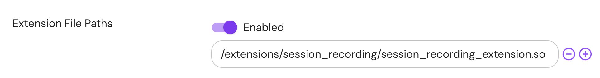
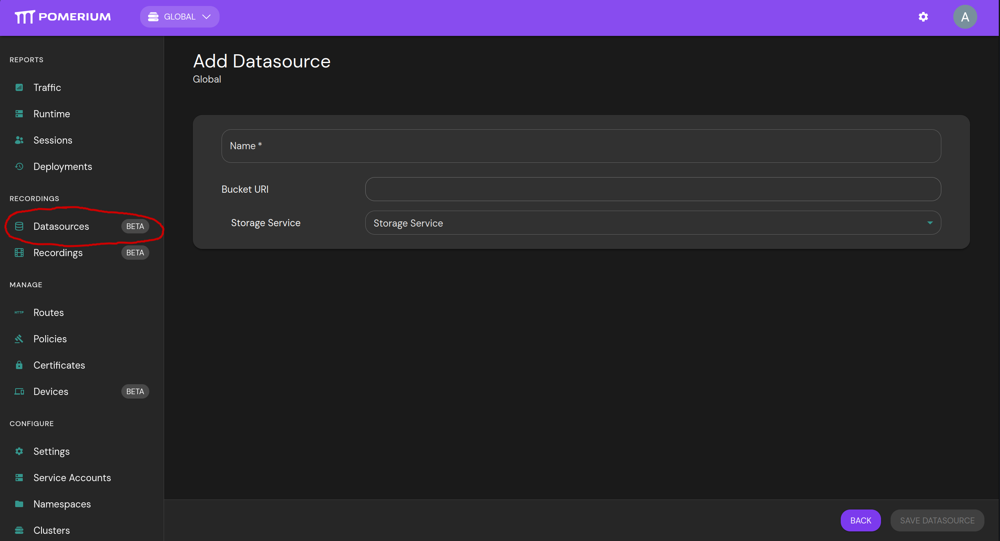
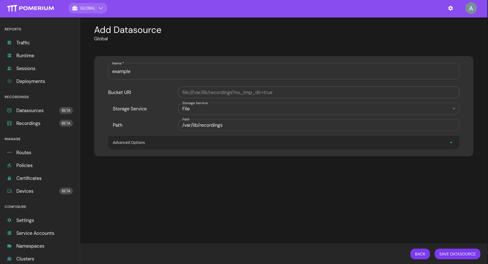
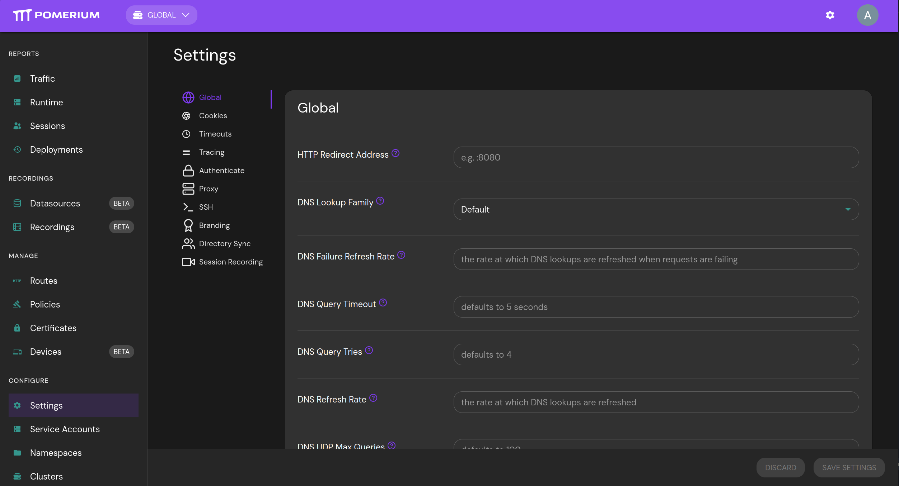
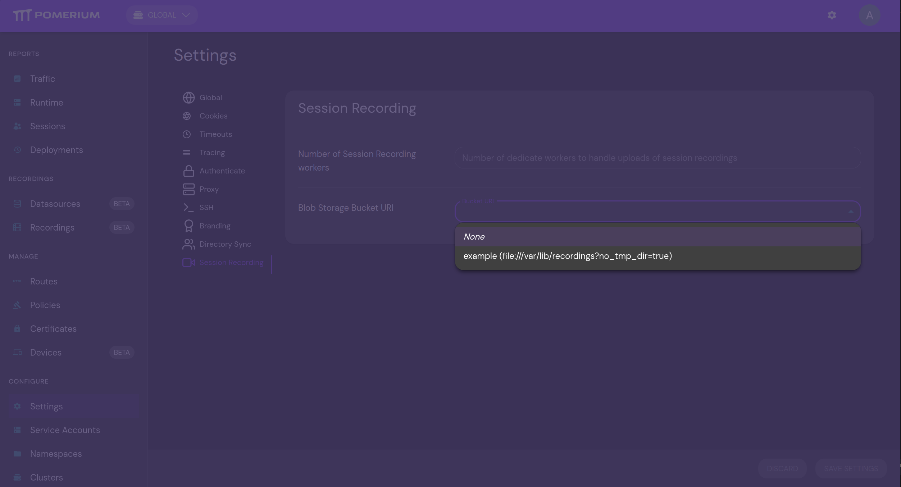
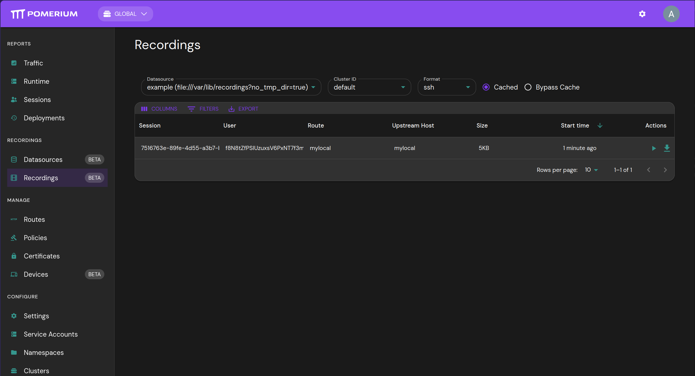
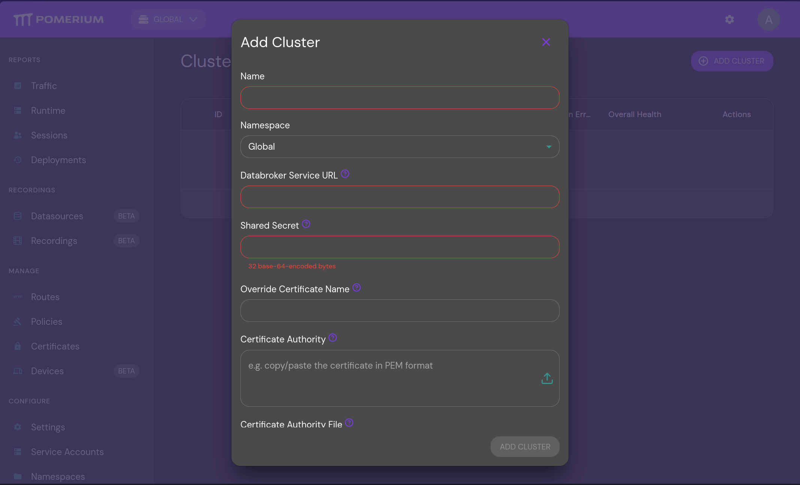
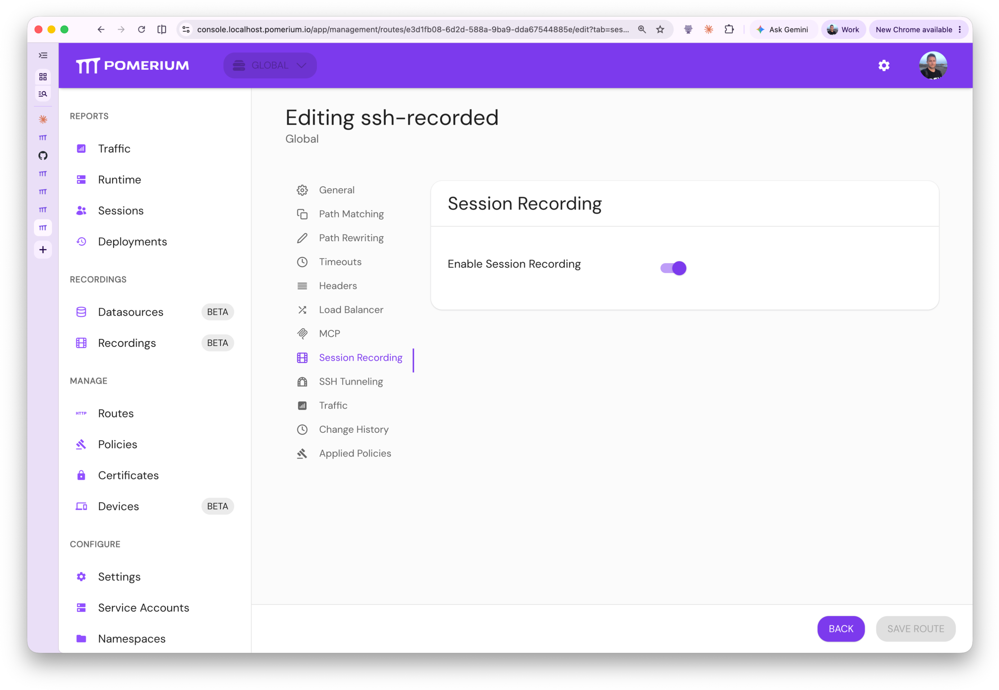
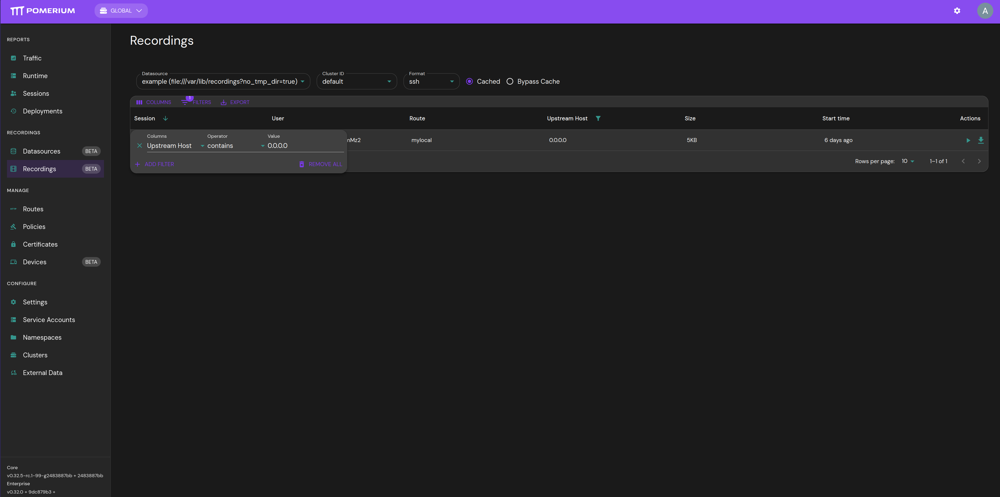
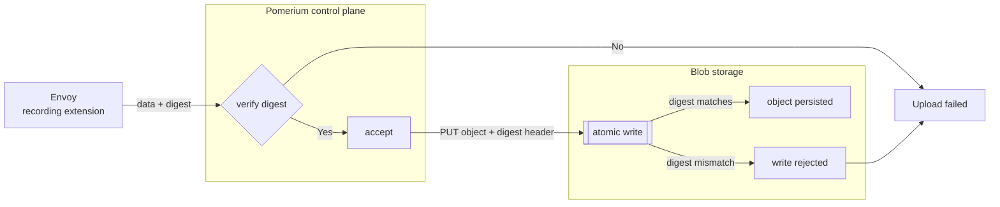

import TabItem from '@theme/TabItem';
import Tabs from '@theme/Tabs';

:::enterprise

This article describes a use case available to [Pomerium Enterprise](/docs/deploy/enterprise/install) customers.

:::

## Overview

Pomerium supports recording, storage, and playback (via Enterprise Console) of interactive SSH sessions for auditing and compliance needs. To enable session recording in Pomerium, you will be required to set up the session recording extension, a cloud or self-hosted blob storage provider, make the relevant policy changes to routes and connect the Pomerium instance to the Enterprise Console.

:::danger

Recording SSH sessions carries inherent risk. Anything the user sees in their terminal is recorded as-is without modification or redaction. This can include sensitive information such as private keys, passwords, logs, etc.

:::

:::important

The session recording capability is _not_ present in Pomerium binary distributions. This feature is provided by a separate extension which Pomerium must load from disk on startup. If the extension is not loaded, Pomerium does not have the ability to record SSH sessions, even if configured to do so.

:::

## Setup

### 1. Obtain the session recording extension

The session recording extension is distributed as a container image:

`docker.cloudsmith.io/pomerium/enterprise/session-recording-extension`

For official release versions of Pomerium, extension images will be tagged with that version (in the form `vX.Y.Z`). If you are using an unreleased version of Pomerium, or building it yourself, see below for instructions on finding the correct extension version.

<details>
<summary>
Finding extension image tags
</summary>
The extension image tag must match the _Envoy version_ for the version of Pomerium
Core you are using. There are several ways to find this version:

1. It is logged immediately upon startup:

   ```json
   {"level":"info","envoy-version":"20260519214603-7724aff26b06","version":"v0.32.5-rc.1.0.20260521140818-2483887bbf28-2026-05-22T18:07:36Z","time":"2026-05-22T20:05:30Z","message":"cmd/pomerium"}
                                    ^^^^^^^^^^^^^^^^^^^^^^^^^^^
   ```

2. It will be displayed when running `pomerium --version`:

   ```
   pomerium: v0.32.5-rc.1-99-g2483887bb+2483887bb
   envoy: 20260519214603-7724aff26b06
          ^^^^^^^^^^^^^^^^^^^^^^^^^^^
   ```

3. It can be found in the Pomerium `go.mod` in the version string of `github.com/pomerium/envoy-custom` (only the part highlighted below)

   ```
   require (
     ...
     github.com/pomerium/envoy-custom vX.X.X-XXX.X.20260519214603-7724aff26b06
                                                   ^^^^^^^^^^^^^^^^^^^^^^^^^^^
     ...
   )
   ```

</details>

This image contains a single file, `/session_recording_extension.so`. See below for how to modify existing deployments to make this file available to Pomerium:

<Tabs>
<TabItem value="Kubernetes" label="Kubernetes">

For Kubernetes deployments, it is recommended to use [image volumes](https://kubernetes.io/docs/tasks/configure-pod-container/image-volumes/) to mount the extension into the Pomerium Core container.

```yaml
apiVersion: apps/v1
kind: Deployment
spec:
  template:
    spec:
      containers:
        - name: pomerium
          image: pomerium/ingress-controller:vX.Y.Z
          volumeMounts:
            - name: session-recording-extension
              mountPath: /extensions/session_recording/
              readOnly: true
      volumes:
        - name: session-recording-extension
          image:
            reference: docker.cloudsmith.io/pomerium/enterprise/session-recording-extension:vX.Y.Z
      imagePullSecrets:
        # This should be the same image pull secret used for enterprise console
        - name: pomerium-enterprise-docker
```

</TabItem>
<TabItem value="DockerCompose" label="Docker Compose">

For Docker Compose deployments, you can mount the extension image directly into the container with an [image volume](https://docs.docker.com/reference/compose-file/services/#volumes):

```yaml
services:
  pomerium:
    image: pomerium/pomerium:vX.Y.Z
    volumes:
      - type: image
        source: docker.cloudsmith.io/pomerium/enterprise/session-recording-extension:vX.Y.Z
        target: /extensions/session_recording/
        read_only: true
```

</TabItem>
<TabItem value="Manual" label="Manual">

To manually extract the extension (`session_recording_extension.so`) from the container image:

```bash
$ ID=$(docker create docker.cloudsmith.io/pomerium/enterprise/session-recording-extension:vX.Y.Z) && \
    docker export $ID | tar -xf - session_recording_extension.so && docker rm $ID
```

</TabItem>
</Tabs>

:::note

These extensions are loaded into Envoy, not the Pomerium control plane. If you build Envoy yourself instead of using the pre-built binaries, or are an Enterprise customer and would like a copy of the session recording extension source code to build and/or audit yourself, please reach out to us at [support@pomerium.com](mailto:support@pomerium.com).

:::

### 2. Configure the extension

Once the extension is accessible on the filesystem, Pomerium must be configured to load the extension by file path.

If you used the paths from the examples in the previous section, the absolute path to the session recording extension will be <br /> `/extensions/session_recording/session_recording_extension.so`

<Tabs>
<TabItem value="EnterpriseConsole" label="Enterprise Console">

In Enterprise Console, navigate to Settings > Global and add the path to the Extension File Paths list.



</TabItem>
<TabItem value="ConfigYaml" label="Config File">

Extension file paths can be configured in the Pomerium config.yaml as follows:

| **Config file key**        | **Type**           |
| :------------------------- | :----------------- |
| `envoy_dynamic_extensions` | `array of strings` |

```yaml title="config.yaml"
envoy_dynamic_extensions:
  - /extensions/session_recording/session_recording_extension.so
```

</TabItem>
<TabItem value="Terraform" label="Terraform">

```hcl
resource "pomerium_settings" "test_session_recording_opts" {
  namespace_id    = # target namespace

  # File paths to extensions to be loaded by envoy at runtime.
  envoy_dynamic_extensions = [
    "/usr/local/config/pomerium/extensions/session_recording_extension.so"
  ]
}
```

</TabItem>
</Tabs>

### 3. Setup storage layer

Session recordings are stored in Blob (Binary Large Object) stores.

Pomerium uploads the following information to the storage layer:

- recording of the SSH session.
- metadata associated with the session, such as user information & Pomerium route information.
- metadata associated with the provenance of the recording, such as the version of Pomerium used to produce the recording.

<Tabs>
<TabItem value="Core" label="Core">

:::important

Uploading to blob stores requires a cluster ID, which is assigned by Pomerium Enterprise. A Pomerium Core instance must therefore be connected to Pomerium Enterprise at least once before it can upload recordings.

Configuring the bucket in Core alone is not sufficient — recordings will not appear in the Enterprise Console unless the same bucket is also configured in Enterprise.

For this reason, we strongly recommend configuring storage through Pomerium Enterprise or the Terraform provider.

:::

```yaml
blob_storage:
  bucket_uri: s3://example-bucket # see section below about per-provider configuration
```

</TabItem>

<TabItem value="Enterprise" label="Enterprise">

Navigate to the "Datasource" page using the side panel link (under the "Recordings" heading). Each blob datasource is scoped per-namespace.



Configure the blob storage. In this example we use file paths.



Navigate to the cluster settings for this namespace.



Set the blob storage from a list of available datasources configured for this namespace:



When users access an SSH route with `session_recording.enabled=true`, the recording will show up in the Recordings tab, where it is available for playback:



</TabItem>

<TabItem value="Terraform" label="Terraform">

Setting up recording datasources for viewing in the Enterprise Console:

```hcl
resource "pomerium_recording_data_source" "gcs_dev" {
  name       = "gcs_dev"
  namespace  = # target namespace id
  bucket_uri = "gs://alex-test-bucket-session-recording"
}
```

Remember to pass this bucket to the Core instance associated with this namespace:

```hcl
resource "pomerium_settings" "test_session_recording_opts" {
  namespace_id    = pomerium_cluster.test.namespace_id
  blob_storage    = {
    bucket_uri : pomerium_recording_data_source.gcs_dev.bucket_uri
  }
  # File paths to extensions to be loaded by envoy at runtime.
  envoy_dynamic_extensions = # make sure this is configured as well!
}

```

</TabItem>

</Tabs>

The HMAC of the user id is generated from the [**shared secret**](/docs/reference/shared-secret) Pomerium Enterprise uses. When rotating the shared secret, keep track of the previous secret in order to correlate against older audit logs.

### 4. Connect Pomerium instance to Enterprise

Connect the instance on which you want to record sessions to Enterprise. To do so, you will need the [**databroker service URL**](/docs/reference/service-urls#databroker-service-url) and [**shared secret**](/docs/reference/shared-secret) of that instance and, optionally, the certificates required to connect to it.

<Tabs>
<TabItem label="Enterprise" value="Enterprise">

Navigate to the "Clusters" page using the side panel link (under the "Configure" heading), and click "Add Cluster":



</TabItem>
<TabItem label="Terraform" value="Terraform">

```hcl
resource "pomerium_cluster" "my-cluster" {
  name                   = var.cluster_name
  parent_namespace_id    = var.parent_namespace_id
  databroker_service_url = var.databroker_service_url
  shared_secret_b64      = var.cluster_shared_secret_b64
}
```

</TabItem>
</Tabs>

## Route Configuration

Recording is enabled on a per-route basis.

<Tabs>

<TabItem value="Core" label="Core">

Configuring session recording from a config file might look like:

```yaml
routes:
  - from: ssh://example
    to: ssh://0.0.0.0:22
    allow_any_authenticated_user: true # replace with an actual policy
    session_recording:
      enabled: true # false
```

</TabItem>
<TabItem value="Enterprise" label="Enterprise">

The session recording tab is available only for routes that have a valid SSH `from` target.



</TabItem>
<TabItem value="Terraform" label="Terraform">

```hcl
resource "pomerium_route" "ssh_recorded" {
  name         = "ssh_recorded"
  namespace_id = # your namespace ID here
  from         = "ssh://terraform"
  to           = ["ssh://0.0.0.0:22"]
  policies     = # your policy here

  # Enable session recording for this route.
  session_recording = {
    enabled = true
  }
}
```

</TabItem>
</Tabs>

## Storage Configuration

:::danger important

Since session recording can contain privileged information about remote environments, it is recommended to enable strict storage security, encryption & integrity parameters.

End users may wish to consult information related to object locking and retention for their cloud provider:

- [AWS S3](https://docs.aws.amazon.com/AmazonS3/latest/userguide/object-lock.html)
- [GCS Storage](https://docs.cloud.google.com/storage/docs/bucket-lock)
- [Azure](https://learn.microsoft.com/en-us/azure/storage/blobs/immutable-storage-overview)

For specific privileged access management compliance standards, end-users will want to consult further documentation for each cloud provider's blob store.

:::

:::important

Both the instance uploading the recordings and the Enterprise instance need to be configured with credentials with valid access to the bucket(s) being configured. See below for each storage type.

:::

:::important

Pomerium writes recordings using WORM (Write Once Read Many) semantics, which means it is compatible with each blob storage integration's strictest data compliance & governance standards.

More details can be found in the [Auditing](#auditing) section.

:::

Blob storage configurations follow a URI format:

```
<scheme>://<bucket>?<param1>=<value1>&<param2>=<value2>
```

See cloud provider specific details below. You can configure them via Enterprise UI or Terraform.

<Tabs>
<TabItem value="Enterprise" label="Enterprise">

Navigate to the "Datasources" page using the side panel link (under the "Recordings" heading). The UI provides drop down options for configuring the bucket URI parameters.

Make sure the recording datasource is configured in the same namespace as the Pomerium cluster you wish to apply it to.


</TabItem>
<TabItem value="Terraform" label="Terraform">

The terraform provider configures datasources.

Make sure the recording datasource is configured in the same namespace as the Pomerium cluster you wish to apply it to.

Below is an example of a google cloud bucket configured via a terraform resource:

```hcl
resource "pomerium_recording_data_source" "gcs_dev" {
  name       = "gcs_dev"
  namespace  = # namespace id
  bucket_uri = "gs://alex-test-bucket-session-recording"
}

// this needs to be set on the cluster settings as well!
// This allows the instance uploading the recordings to use this datasource

resource "pomerium_settings" "test_session_recording_opts" {
  namespace_id    = pomerium_cluster.test.namespace_id
  // other settings ...

  // Pass in the bucket configured above
  blob_storage = {
    bucket_uri: pomerium_recording_data_source.gcs_dev.bucket_uri
  }
}
```

</TabItem>
</Tabs>

### GCS

**Credential setup**:

By default, the instances connected with this bucket URI will use [Application Default Credentials for Google Cloud](https://docs.cloud.google.com/sdk/gcloud/reference/auth/application-default/login). For alternative credential configuration for Google Cloud, see [Application Default Credentials](https://docs.cloud.google.com/docs/authentication#service-accounts).

A convenient way to pass in credentials is through the environment variable:

```bash
GOOGLE_APPLICATION_CREDENTIALS=</path/to/credentials-file>
```

At minimum, the instance uploading the recordings will require `Storage Object Creator` and `Storage Object Viewer` permissions and the Enterprise instance will require the `Storage Object Viewer` permissions.

:::note

Cloud Run instances do not need to specify service account paths. They will use the service account you configured the instance with. Make sure this service account has the correct Storage Object permissions.

:::

:::note

Make sure your access is properly scoped. Depending on your configuration the Enterprise instance will require access to multiple buckets, while the instance uploading to the buckets will require permissions for just one bucket.

:::

**Bucket URI**:

```
gs://example-bucket
```

- Scheme: `gs`
- Path: `<bucket-name>`

| Parameter | Description |
| --- | --- |
| `anonymous` | A value of `"true"` forces the use of an unauthenticated client. |
| `access_id` | Sets `GoogleAccessID`; only used in `SignedURL`, except that a value of `"-"` forces the use of an unauthenticated client. |
| `private_key_path` | Optional path to read for `PrivateKey`; only used in `SignedURL`. |
| `universe_domain` | Sets the universe domain for the client. |

For more details about how Pomerium uses the Google Cloud APIs, see [here](https://pkg.go.dev/gocloud.dev/blob/gcsblob?utm_source=godoc#URLOpener).

### S3

**Credential setup**:

For AWS S3, or any S3-compatible object store, the recommended way to pass in credentials is to use credentials file:

```
export AWS_SHARED_CREDENTIALS_FILE=/path/to/my/credentials
# or
export AWS_CONFIG_FILE=/path/to/my/config
```

:::note

The default path is `~/.aws/credentials`.

:::

The credentials file use the INI format and look like:

```ini
[profile-name]
aws_access_key_id = ...
aws_secret_access_key = ...
region = ...
```

The specific profile to load is configured via the `?profile=<profile-name>` parameter.

:::note

EC2 instances don't have to specify custom filepaths. Make sure you associate the right instance profile with the EC2 instance for access to S3. See [use instance profiles](https://docs.aws.amazon.com/IAM/latest/UserGuide/id_roles_use_switch-role-ec2_instance-profiles.html) for more information.

:::

**Bucket URI**:

- Scheme: `s3`
- Path: `<bucket-name>`

| Parameter | Description |
| --- | --- |
| `ssetype` | The type of server side encryption used (`AES256`, `aws:kms`, `aws:kms:dsse`). |
| `kmskeyid` | The KMS key ID for server side encryption. |
| `accelerate` | A value of `"true"` uses the S3 Transfer Acceleration endpoints. |
| `use_path_style` | A value of `true` sets the `UsePathStyle` option. |
| `s3ForcePathStyle` | Same as `use_path_style`, for backwards compatibility with V1. |
| `disable_https` | A value of `true` disables HTTPS |
| `profile` | Profile name in the credentials file to use for access to this Bucket |

:::note

For S3-compatible storage servers that recognize the same REST HTTP endpoints as S3, like Minio, Ceph, or SeaweedFS, you can configure the bucket URI as follows:

```
s3://mybucket?endpoint=http://my.minio.local:8080&disable_https=true&s3ForcePathStyle=true
```

Regions must still be set for credential configuration on self-hosted solutions. Using a placeholder like `us-east-1` is the recommended default.

:::

### Azure

**Credential Setup**:

Azure container storage keys can be loaded from:

```bash
AZURE_STORAGE_KEY=<base64-key>
AZURE_STORAGE_ACCOUNT=<storage-account>
```

Or via a SAS token:

```bash
export AZURE_STORAGE_ACCOUNT=<storage-account>
export AZURE_STORAGE_SAS_TOKEN="sv=...&sig=..."
```

Or via a full connection string:

```bash
export AZURE_STORAGE_CONNECTION_STRING="<full-connection-string>"
export AZURE_STORAGE_ACCOUNT=<storage account> # if not specified in the connection string
```

For more granular control:

```bash
export AZURE_CLIENT_ID=...
export AZURE_TENANT_ID=...
export AZURE_CLIENT_SECRET=...               # client secret, OR:
export AZURE_CLIENT_CERTIFICATE_PATH=/path/to/cert.pem
```

Please consult the [upstream documentation](https://learn.microsoft.com/en-us/azure/storage/blobs/) for additional details.

**Bucket URI**:

- Scheme: `azblob`
- Path: `<container-name>`

| Parameter | Description |
| --- | --- |
| `domain` | Sets custom domain name for the storage. |
| `protocol` | Protocol can be provided to specify protocol to access Azure Blob Storage. Protocols that can be specified are "http" for local emulator and "https" for general. Defaults to "https". |
| `cdn` | IsCDN can be set to true when using a CDN URL pointing to a [blob storage account](https://docs.microsoft.com/en-us/azure/cdn/cdn-create-a-storage-account-with-cdn) |
| `localemu` | IsLocalEmulator should be set to true when targeting Local Storage Emulator (Azurite). |

### File

:::danger important

File storage is not recommended for production setups. Additionally, for Enterprise to replay recordings, it must be on the same host as the instances writing to file storage.

:::

**Bucket URI**

```
file://<file-path>
```

- Scheme: `file`
- Path: filesystem path to write recordings to

| Parameter | Description |
| --- | --- |
| `create_dir` | (any non-empty value) the directory is created (using `os.MkDirAll`) if it does not already exist. |
| `dir_file_mode` | Any directories that are created (the base directory when `create_dir` is true, or subdirectories for keys) are created using this `os.FileMode`, parsed using `os.ParseUint`. Defaults to `0777`. |
| `no_tmp_dir` | (any non-empty value) temporary files are created next to the final path instead of in `os.TempDir`. |
| `base_url` | The base URL to use to construct signed URLs; see `URLSignerHMAC`. |
| `secret_key_path` | Path to read for the secret key used to construct signed URLs; see `URLSignerHMAC`. |
| `metadata` | If set to `"skip"`, won't write metadata such as `blob.Attributes` as per the package docstring. |

### Object Format

<details>
<summary>
(Advanced) Storage layer format
</summary>

Recordings are stored in blob stores using the following path structure

```
└── <pomerium-cluster-id>
    └── ssh
        └── v1
             ├──<recording-id>
                ├── manifest
                ├── metadata.json
                ├── metadata.proto
                ├── recording_0000000000
                ├── recording_0000000001
                ├── ...
                ├── recording_XXXXXXXXXX
                ├── signature
```

- `pomerium-cluster-id` is the cluster ID associated with a Pomerium cluster when it is connected to Enterprise.
- `recording-id` is a unique identifier for a recording.
- `metadata.<ext>` contains metadata about the session.
- `recording_*` contains the actual contents. Recordings are split into chunks. Chunk IDs are monotonically increasing. Stored in protobuf format.
- `signature` contains metadata about the provenance of the artifact. Currently holds the full Pomerium version.

</details>

#### Metadata

Pomerium captures the following metadata for each recording:

- `start_time`: when the session started
- `login_name`: the ssh user
- `session_id`: pomerium session id
- `user_id`: pomerium user id
- `stream_id`: internal stream id for correlation with logs
- `route_name`: pomerium route name, e.g. `from: ssh://example`, the route_name would be `example`
- `upstream`: upstream target, e.g. `to: ssh://0.0.0.0:22`, the upstream would be `0.0.0.0:22`
- `pty_info`: info about the shell where the recording came from

## Accessing recordings

### Playback

Session recordings can be replayed in Pomerium Enterprise. Navigate to the "Records" page using the side panel link (under the "Recordings" heading) to view available recordings. They are available by Pomerium Enterprise Namespace and Cluster, and can only be accessed by the appropriate namespace administrator.


The recordings are also available for download. They will be downloaded in the format `<recording-id>.asciicast.json`. These files can be replayed by any terminal player that supports the asciicast v3 format. You can use the [asciinema CLI](https://docs.asciinema.org/manual/cli/) to replay these recordings. For example:

```bash
asciinema play /path/to/<recording-id>.asciicast.json
```

### Querying

The Enterprise UI can sort the table fields in ascending & descending order. Shift-click to sort by multiple columns.

The table filters can match the columns on specific criteria:



:::warning

By default queries are run by making requests to the blob storage provider. This may become slow without caching. Please consult [Performance Tuning (Access)](#performance-tuning-access) for more information on how to speed up these queries.

:::

For end-users looking for detailed analytical querying it is recommended to ingest the `metadata.json` for each recording into a purpose-built querying & analytics tool. It is then possible to replay this recording knowing its cluster-id, the namespace it was configured in, and its recording id. See [Storage Configuration](#storage-configuration) for more details on the storage layer path structure & metadata contents.

## Auditing

The Integrity & Auditing section describes the "chain of custody" for session recording data, enabling end-users to meet strict compliance requirements for the handling and auditing of privileged information.

The "chain of custody" model Pomerium provides relies on:

- **Storage access patterns**: guarantees about how the recordings are uploaded and accessed
- **Enterprise audit logs**: records every access by end-users through Pomerium Enterprise
- **Cloud provider audit logs**: Audit logs at the storage layer include metadata that can be correlated with Pomerium Enterprise, enabling verification when data was accessed through Pomerium Enterprise.

This model provides a tamper-evident audit trail for the handling and access of session recording data.

### Storage access patterns

For remote access to the blob store, Pomerium follows WORM (Write Once Read Many) semantics. The roles each Pomerium component plays against the blob store are:

| Component                          |     Read     |      Write      | Delete |
| ---------------------------------- | :----------: | :-------------: | :----: |
| Pomerium Core (recording producer) | Occasionally | Once per object | Never  |
| Pomerium Enterprise                |     Yes      |      Never      | Never  |

:::important

Pomerium's security & integrity guarantees are only as strong as those of the underlying storage layer. Configure encryption, object locking (or equivalent), and retention on the bucket to match the compliance requirements of your environment.

:::

To verify the integrity of recordings produced and stored, Pomerium verifies the hash digest of the recording matches on every transfer up-to and including the final object stored in the storage layer.

Uploads will fail if any transfer in the below chain has inconsistent digests.



### Auditing (Enterprise)

Both Pomerium Enterprise and cloud providers for object storage produce audit logs that satisfy strict audit-of-audit compliance standards.

Logs available from both these sources can be correlated to verify integrity and data access.

In Enterprise, each time a bucket or specific recording data is accessed, Enterprise will emit audit logs. For example:

```json
{"level":"info","access_id":"777b6b59-a7e6-4310-af76-448da383f47d","access_type":"recording","deny":false,"success":true,"reason":"","recording_format":"ssh","object_key":"default/ssh/v1/3ff8e81f44b6eaecadaaaa7d541c8c51/*","source_ip":"<redacted>",user_agent":"Mozilla/5.0 (X11; Ubuntu; Linux x86_64; rv:150.0) Gecko/20100101 Firefox/150.0","user_role":"admin","user_email":"alamarre@pomerium.com","user_id":"<redacted>","user_hmac_id":"aw3iU61Z7p6wxCnNq/JVDgGHpJzhwT3eqs5Wmz8BPD8=","user_session_start":1779724385,"user_session_exp":1779724685,"datasource":"9d8dbd2c-8cce-4e66-9c1f-c490b4a07243/gcs-dev","time":"2026-05-25T11:53:05-04:00","message":"authorize blob read"}
```

Some of the fields above were redacted for the docs, but will contain the relevant information related to access.

| Field | Description | Sensitivity |
| --- | --- | --- | --- | --- | --- | --- |
| `access_id` | Unique identifier for a particular action. Note that an action here can have multiple access events - opening the bucket, reading metadata, and viewing the recording | Low |
| `access_type` | The type of access. <ul><li>`recording`: the recording contents were viewed</li><li>`metadata`: the recording metadata was viewed</li><li>`bucket`: (internal) Pomerium Enterprise made a connection to the bucket for reading</li><li>`download`: the recording was downloaded</li></ul> | Low |  | `deny` | Whether the access was denied. | Low |
| `success` | Whether the access succeeded. | Low |
| `reason` | Optional. Provides additional details about failures | Low |
| `recording_format` | Format of the recording being accessed (e.g. `ssh`). | Low |
| `object_key` | Object storage key (or key prefix) of the recording data being accessed. Contains the Pomerium `cluster ID`. `cluster ID` is assigned when connecting Pomerium instances to Enterprise via the cluster syncer | Moderate |
| `source_ip` | IP address the request originated from. | High |
| `user_agent` | User agent header of the client that made the request. Contains remote host information. | Moderate |
| `user_role` | Pomerium Enterprise role of the user performing the access. | Moderate |
| `user_email` | Email address of the user performing the access. | Moderate |
| `user_id` | IDP user id of the user performing the access. | High |
| `user_hmac_id` | HMAC of the user id, suitable for correlation with the blob storage audit logs | Low |
| `user_session_start` | Unix timestamp of when the user's session started. | Low |
| `user_session_exp` | Unix timestamp of when the user's session expires. | Low |
| `datasource` | Identifier of the configured blob datasource being read (`<namespace-id>/<datasource-name>`). `<namespace-id>` is the ID of the namespace in Pomerium Enterprise where this datasource was configured | Moderate |

:::important

The HMAC of the user id is generated from the [**shared secret**](/docs/reference/shared-secret) Pomerium Enterprise uses. When rotating the shared secret, keep track of the previous secret in order to correlate against older audit logs.

:::

### Auditing (Blob)

Each cloud provider emits its own audit logs when objects in the recording bucket are accessed. Refer to the provider-specific documentation below to enable and query these logs.

<Tabs>
<TabItem value="GCS" label="GCS">

GCS Cloud Audit Logs for `storage.googleapis.com` must be enabled. Data Access logs must be explicitly enabled on the recording bucket for:

- `ADMIN_READ`
- `DATA_READ`
- `DATA_WRITE`

See [Cloud Audit Logs with Cloud Storage](https://docs.cloud.google.com/storage/docs/audit-logging).

When properly configured, requests made by Pomerium Enterprise are annotated with:

```json
metadata: {
  audit_context: {
    app_context: "EXTERNAL"
      audit_info: {
        x-goog-custom-audit-pomerium-access-id: "b340be6f-d9d6-4569-9b8f-53d5fac8db0c"
        x-goog-custom-audit-pomerium-user: "PomeriumEnterprise/v0.32.0+0d0554ca+2026-05-25T11:06:03-04:00 (u=aw3iU61Z7p6wxCnNq/JVDgGHpJzhwT3eqs5Wmz8BPD8=)"
      }
    }
  requested_bytes: 1071492
  }
methodName: "storage.objects.get"
```

| Field | Description |
| --- | --- |
| `x-goog-custom-audit-pomerium-access-id` | Pomerium-generated access id for this action. Correlates with the `access_id` field in the Pomerium Enterprise audit log entry, allowing a GCS audit log entry to be matched back to the originating user action. |
| `x-goog-custom-audit-pomerium-user` | Identifies the Pomerium Enterprise build that issued the request, along with the HMAC of the user id (`u=...`). Correlates with the `user_hmac_id` field in the Pomerium Enterprise audit log entry. |

:::note

The example query below inspects audit logs for operations made by Pomerium. Individual setups may differ from the query below.

```logql
protoPayload.@type="type.googleapis.com/google.cloud.audit.AuditLog"
protoPayload.serviceName="storage.googleapis.com"
protoPayload.methodName:("storage.objects.get" OR "storage.objects.list")
resource.labels.bucket_name="<bucket-name>"
```

:::

</TabItem>
<TabItem value="S3" label="S3">

Audit logs with Pomerium metadata are captured when S3 server access logging and/or CloudTrail are configured for data events for the recording bucket.

See [Logging requests with server access logging](https://docs.aws.amazon.com/AmazonS3/latest/userguide/ServerLogs.html) for information about configuration.

Below is a sample entry of an access log (split up with new lines for clarity):

```
17db07a774c0aeceaa3741deb75a693c520afcabd333c4681160e703d60fd8f3 alexl-s3-example [02/Jun/2026:20:31:05 +0000] 216.113.105.210 arn:aws:iam::<redacted>:user/alexl-bucket-user <redacted>
REST.GET.OBJECT default/ssh/v1/681de6caeac458e53c787912f61fd45a/metadata.proto "GET /default/ssh/v1/681de6caeac458e53c787912f61fd45a/metadata.proto?pomerium_access_id=e0ed8f7b-a2ac-47b5-a6bb-45b5f06ea103&x-id=GetObject HTTP/1.1" 200 - 865 865 26 25 "-"
"aws-sdk-go-v2/1.41.7 ua/2.1 os/linux lang/go#1.26.3 md/GOOS#linux md/GOARCH#amd64 api/s3#1.98.0 app/PomeriumEnterprise-v0.32.0+1d188c5c+2026-06-02T09-11-40-04-00--u-aw3iU61Z7p6wxCnNq-JVDgGHpJzhwT3eqs5Wmz8BPD8-- m/E,b,n"
- iT/8x+5dTl3NkUSiqtAcB+6FZ4q6kVnRHDoLPWIFBPwHv0LQRUBP0ZLoOqK+P5V7lwaLMBU/04jepAQS4R3BiNK6WkPdXV02 SigV4 TLS_AES_128_GCM_SHA256 AuthHeader alexl-s3-example.s3.us-east-2.amazonaws.com TLSv1.3 - - -
```

| HTTP Field | Value | Description |
| --- | --- | --- |
| Request URI | `?pomerium_access_id` | Pomerium-generated access id for this action. Correlates with the `access_id` field in the Pomerium Enterprise audit log entry, allowing an S3 audit log entry to be matched back to the originating user action. |
| User Agent | `app/<Pomerium-Version>-<Timestamp>--u-<hmac_user_id>--` | Identifies the Pomerium Enterprise build that issued the request, along with the HMAC of the user id (`u-...--`). Correlates with the `user_hmac_id` field in the Pomerium Enterprise audit log entry. |

:::note

S3 server access logs transform some of the raw data. For example `/`, `=` and other special characters are collected as `-` in the `user_hmac_id`. For correlation with Enterprise logs, please be mindful of this behavior.

:::

:::important

`HEAD` requests made to the object storage layer do not encode `access_id` and `user_hmac_id`.

:::

</TabItem>
<TabItem value="Azure" label="Azure">

See [Monitoring Azure Blob Storage](https://learn.microsoft.com/en-us/azure/storage/blobs/monitor-blob-storage).

After configuring audit logs in Azure, operations made by Pomerium are recorded in the `StorageBlobLogs` table. A sample entry contains:

```json
{
  "UserAgentHeader": "PomeriumEnterprise/v0.32.0+c09e6d56+2026-06-02T14:37:31-04:00 (u=aw3iU61Z7p6wxCnNq/JVDgGHpJzhwT3eqs5Wmz8BPD8=)",
  "ClientRequestId": "396bec31-264e-4b33-9000-8ecb1776e16f"
}
```

| Field | Description |
| --- | --- |
| `ClientRequestId` | Pomerium-generated access id for this action. Correlates with the `access_id` field in the Pomerium Enterprise audit log entry, allowing an Azure audit log entry to be matched back to the originating user action. |
| `UserAgentHeader` | Identifies the Pomerium Enterprise build that issued the request, along with the HMAC of the user id (`u=...`). Correlates with the `user_hmac_id` field in the Pomerium Enterprise audit log entry. |

:::note

The example query below extracts audit logs for operations made by Pomerium. Individual setups may differ from the query below.

```kql
StorageBlobLogs
| where TimeGenerated > ago(3d)
| where ClientRequestId != ""
| where UserAgentHeader contains "PomeriumEnterprise"
| top 25 by TimeGenerated desc
| project TimeGenerated, ClientRequestId, UserAgentHeader
```

The example query below extracts the full JSON logs:

```kql
StorageBlobLogs
| where TimeGenerated > ago(3d)
| where OperationName == "ListBlobs"
| top 25 by TimeGenerated desc
| extend Full = pack_all()
| project TimeGenerated, Full
```

:::

</TabItem>
</Tabs>

### Integrity checks

The following criteria indicate that an object has been accessed or modified outside of Pomerium's chain of custody:

- there is more than one object revision for any session recording object in the remote store
- there are blob storage access logs that are not annotated with Pomerium access information
- there are blob storage access logs whose `access_id` or `hmac_user_id` do not match any Pomerium Enterprise audit logs

## Recording Contents

Session Recordings contain the raw PTY data sent from the upstream server to the downstream client, as well as terminal resize events.

## Limitations

Some use cases are not currently implemented. If any of these are important to you, please reach out to us!

- Currently, the recordings do not contain key inputs sent by the client; if the server does not echo those keystrokes (such as during password input) that information will not be recorded.

- Currently, only interactive shell sessions are recorded. Other usages, such as running direct commands or transferring files do not produce recordings.

- Compression is not yet supported.

- Pomerium does not encrypt the recordings itself. This responsibility is delegated to the object storage layer.

## Resource Usage Considerations

Recording a session incurs additional memory usage. In most cases, this usage will likely be very low, but it may be important to consider worst-case resource usage depending on your scale.

Recording data is buffered in memory only until it is written to the object store. Recordings are not buffered on disk. If there are many active recordings and the server cannot upload data to the object store faster than it is being recorded, more memory will be required to buffer the recording data.

In the worst case, each active recording will buffer at most 10-12MB of data. If this limit is exceeded for a given recording, the corresponding connection may be temporarily paused to allow the server time to catch up. If the server is unresponsive or sufficiently overloaded to where the buffer is still full after a few seconds, the corresponding session<b>[^1]</b> will be forcibly closed.

Memory usage limits are intended to combat abuse; the user would generally have to go out of their way to reach the conditions described above (assuming the server has sufficient compute and network resources available), though it is trivial to do so.

## Performance Tuning (Upload)

SSH session recording is designed for high performance and minimal overhead. Not all workloads are the same, so there are a few config options that can be adjusted to optimize for your environment:

### Worker Threads

On the Envoy side, the work of buffering, serializing, and uploading recording data is performed by a dedicated pool of worker threads. This is done to minimize latency overhead for the actual connections being recorded.

The default number of worker threads is 2. This can be adjusted depending on expected usage via the `session_recording_concurrency` config field. This value cannot exceed the number of Envoy worker threads (if it does, it will be silently lowered to match that value).

The optimal number of session recording worker threads to use depends on your environment and expected usage patterns. Unless you expect a very high volume of concurrent recordings, it should not need to be set much higher than the default.

### Kernel Pipe Buffer Size

The session recording workers in Envoy upload recording data to Pomerium, which in turn uploads the data to external object storage. The workers in Envoy communicate with Pomerium via pipes shared with the Envoy subprocess. The maximum buffer size of these pipes is controlled by the [`fs.pipe-max-size`](https://man7.org/linux/man-pages/man7/pipe.7.html#:~:text=size%2E-,%2Fproc%2Fsys%2Ffs%2Fpipe%2Dmax%2Dsize) sysctl parameter and can be increased for better throughput when processing large recordings.

The upload pipes (one per worker thread) will automatically be resized on startup to 4MiB (4194304) if allowed by the kernel, or otherwise to the value of `fs.pipe-max-size` if it is lower than 4194304. The default value of `fs.pipe-max-size` is usually 1MiB (1048576). If the process has [CAP_SYS_RESOURCE](https://man7.org/linux/man-pages/man7/capabilities.7.html#:~:text=CAP%5FSYS%5FRESOURCE), the pipe will be resized to 4MiB, ignoring `fs.pipe-max-size`.

## Performance Tuning (Access)

The table in the Enterprise UI used to display recordings queries the blob storage provider directly. In conjunction with query filters, this can have a noticeable performance overhead. It is recommended to use the runtime flags for Enterprise:

```
--enable-session-recording-querier-cache=true --cache-dir=/path/to/cache
```

:::warning

Omitting the `--cache-dir` option will persist session recording metadata in-memory.

:::

These settings enable Pomerium Enterprise to periodically sync metadata to the file path pointed to by `cache-dir`.

Alternatively, you can specify these settings in the Enterprise config file:

```yaml
enable_session_recording_querier_cache: true
cache_dir: /path/to/cache
```

:::note

This cache is shared with directory syncing for the Console.

:::

For even larger amounts of recordings, it is recommended to rotate buckets periodically and to not reuse buckets between clusters that operate under high load.

---

<br />

[^1]: Note that a single connection can have more than one concurrent interactive session, and therefore multiple active recordings. If one of those recordings reaches its buffer limit, the entire connection may be paused, which will pause all other sessions on that connection for the duration. However, if a session is forcibly closed, other sessions on that connection are unaffected.
