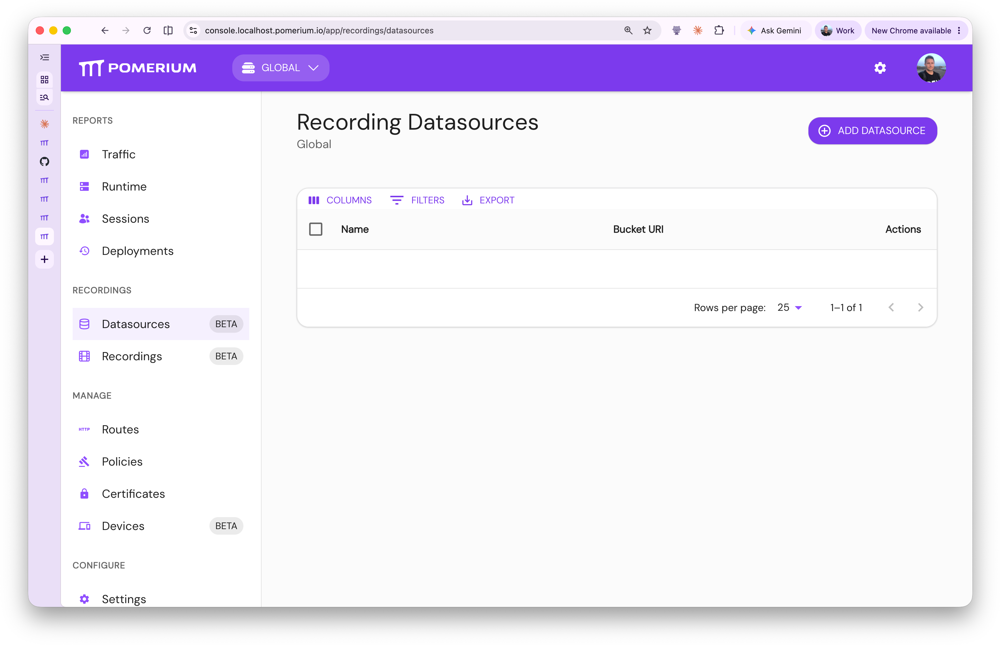

import TabItem from '@theme/TabItem';
import Tabs from '@theme/Tabs';

:::enterprise

This article describes a use case available to [Pomerium Enterprise](/docs/deploy/enterprise/install) customers.

:::

## Overview

Pomerium supports recording, storage, and playback (via Enterprise Console) of interactive SSH sessions for auditing and compliance needs. To enable session recording in Pomerium, you will be required to set up the session recording extension, a cloud or self-hosted blob storage provider, make the relevant policy changes to routes and connect the Pomerium instance to the Enterprise Console.

:::note

This guide assumes you have already configured [Native SSH Access](/docs/capabilities/native-ssh-access), which is a prerequisite for session recording.

:::

:::danger

Recording SSH sessions carries inherent risk. Anything the user sees in their terminal is recorded as-is without modification or redaction. This can include sensitive information such as private keys, passwords, logs, etc.

:::

:::important

The session recording capability is _not_ present in Pomerium binary distributions. This feature is provided by a separate extension which Pomerium must load from disk on startup. If the extension is not loaded, Pomerium does not have the ability to record SSH sessions, even if configured to do so.

:::

## Setup

### 1. Obtain the session recording extension

The session recording extension is distributed as a container image:

`docker.cloudsmith.io/pomerium/enterprise/session-recording-extension`

For official release versions of Pomerium, extension images will be tagged with that version (in the form `vX.Y.Z`). If you are using an unreleased version of Pomerium, or building it yourself, see below for instructions on finding the correct extension version.

<details>
<summary>
Finding extension image tags
</summary>
The extension image tag must match the _Envoy version_ for the version of Pomerium
Core you are using. There are several ways to find this version:

1. It is logged immediately upon startup:

   ```json
   {"level":"info","envoy-version":"20260519214603-7724aff26b06","version":"v0.32.5-rc.1.0.20260521140818-2483887bbf28-2026-05-22T18:07:36Z","time":"2026-05-22T20:05:30Z","message":"cmd/pomerium"}
                                    ^^^^^^^^^^^^^^^^^^^^^^^^^^^
   ```

2. It will be displayed when running `pomerium --version`:

   ```
   pomerium: v0.32.5-rc.1-99-g2483887bb+2483887bb
   envoy: 20260519214603-7724aff26b06
          ^^^^^^^^^^^^^^^^^^^^^^^^^^^
   ```

3. It can be found in the Pomerium `go.mod` in the version string of `github.com/pomerium/envoy-custom` (only the part highlighted below)

   ```
   require (
     ...
     github.com/pomerium/envoy-custom vX.X.X-XXX.X.20260519214603-7724aff26b06
                                                   ^^^^^^^^^^^^^^^^^^^^^^^^^^^
     ...
   )
   ```

</details>

This image contains a single file, `/session_recording_extension.so`. See below for how to modify existing deployments to make this file available to Pomerium:

<Tabs>
<TabItem value="Kubernetes" label="Kubernetes">

For Kubernetes deployments, it is recommended to use [image volumes](https://kubernetes.io/docs/tasks/configure-pod-container/image-volumes/) to mount the extension into the Pomerium Core container.

```yaml
apiVersion: apps/v1
kind: Deployment
spec:
  template:
    spec:
      containers:
        - name: pomerium
          image: pomerium/ingress-controller:vX.Y.Z
          volumeMounts:
            - name: session-recording-extension
              mountPath: /extensions/session_recording/
              readOnly: true
      volumes:
        - name: session-recording-extension
          image:
            reference: docker.cloudsmith.io/pomerium/enterprise/session-recording-extension:vX.Y.Z
      imagePullSecrets:
        # This should be the same image pull secret used for enterprise console
        - name: pomerium-enterprise-docker
```

</TabItem>
<TabItem value="DockerCompose" label="Docker Compose">

For Docker Compose deployments, you can mount the extension image directly into the container with an [image volume](https://docs.docker.com/reference/compose-file/services/#volumes):

```yaml
services:
  pomerium:
    image: pomerium/pomerium:vX.Y.Z
    volumes:
      - type: image
        source: docker.cloudsmith.io/pomerium/enterprise/session-recording-extension:vX.Y.Z
        target: /extensions/session_recording/
        read_only: true
```

</TabItem>
<TabItem value="Manual" label="Manual">

To manually extract the extension (`session_recording_extension.so`) from the container image:

```bash
$ ID=$(docker create docker.cloudsmith.io/pomerium/enterprise/session-recording-extension:vX.Y.Z) && \
    docker export $ID | tar -xf - session_recording_extension.so && docker rm $ID
```

</TabItem>
</Tabs>

:::note

These extensions are loaded into Envoy, not the Pomerium control plane. If you build Envoy yourself instead of using the pre-built binaries, or are an Enterprise customer and would like a copy of the session recording extension source code to build and/or audit yourself, please reach out to us at [support@pomerium.com](mailto:support@pomerium.com).

:::

### 2. Configure the extension

Once the extension is accessible on the filesystem, Pomerium must be configured to load the extension by file path.

If you used the paths from the examples in the previous section, the absolute path to the session recording extension will be <br /> `/extensions/session_recording/session_recording_extension.so`

<Tabs>
<TabItem value="EnterpriseConsole" label="Enterprise Console">

In Enterprise Console, navigate to Settings > Global and add the path to the Extension File Paths list.


</TabItem>
<TabItem value="ConfigYaml" label="Config File">

Extension file paths can be configured in the Pomerium config.yaml as follows:

| **Config file key**        | **Type**           |
| :------------------------- | :----------------- |
| `envoy_dynamic_extensions` | `array of strings` |

```yaml title="config.yaml"
envoy_dynamic_extensions:
  - /extensions/session_recording/session_recording_extension.so
```

</TabItem>
<TabItem value="Terraform" label="Terraform">

```hcl
resource "pomerium_settings" "test_session_recording_opts" {
  namespace_id = var.namespace_id

  # File paths to extensions to be loaded by envoy at runtime.
  envoy_dynamic_extensions = [
    "/usr/local/config/pomerium/extensions/session_recording_extension.so"
  ]
}
```

</TabItem>
</Tabs>

### 3. Setup storage layer

Session recordings are stored in Blob (Binary Large Object) stores.

Pomerium uploads the following information to the storage layer:

- recording of the SSH session.
- metadata associated with the session, such as user information & Pomerium route information.
- metadata associated with the provenance of the recording, such as the version of Pomerium used to produce the recording.

<Tabs>
<TabItem value="Core" label="Core">

:::important

Uploading to blob stores requires a cluster ID, which is assigned by Pomerium Enterprise. A Pomerium Core instance must therefore be connected to Pomerium Enterprise at least once before it can upload recordings.

Configuring the bucket in Core alone is not sufficient — recordings will not appear in the Enterprise Console unless the same bucket is also configured in Enterprise.

For this reason, **we strongly recommend configuring storage through Pomerium Enterprise or the Terraform provider**.

:::

```yaml
blob_storage:
  bucket_uri: s3://example-bucket # see provider-specific configuration below
```

See the [Session Recording Storage](/docs/reference/session-recording-storage) reference for full provider-specific URI parameters and credential setup.

</TabItem>

<TabItem value="Enterprise" label="Enterprise">

Click on the "Datasources" link in the side panel under the "Recordings" heading. Click the "Add Datasource" button to create a new datasource.

:::note

Each blob datasource is scoped per-namespace.

:::



Configure the blob storage. In this example we use file paths.


Navigate to the cluster settings for this namespace.


Set the blob storage from a list of available datasources configured for this namespace:


When users access an SSH route with `session_recording.enabled=true`, the recording will show up in the Recordings tab, where it is available for playback:


</TabItem>

<TabItem value="Terraform" label="Terraform">

Setting up recording datasources for viewing in the Enterprise Console:

```hcl
resource "pomerium_recording_data_source" "gcs_dev" {
  name       = "gcs_dev"
  namespace  = var.namespace_id
  bucket_uri = "gs://alex-test-bucket-session-recording"
}
```

Remember to pass this bucket to the Core instance associated with this namespace:

```hcl
resource "pomerium_settings" "test_session_recording_opts" {
  namespace_id = pomerium_cluster.test.namespace_id
  blob_storage = {
    bucket_uri : pomerium_recording_data_source.gcs_dev.bucket_uri
  }
  # File paths to extensions to be loaded by envoy at runtime.
  envoy_dynamic_extensions = [
    "/usr/local/config/pomerium/extensions/session_recording_extension.so"
  ]
}
```

</TabItem>

</Tabs>

The Hash-based Message Authentication Code (HMAC) of the user id is generated from the [**shared secret**](/docs/reference/shared-secret) Pomerium Enterprise uses. **When rotating the shared secret, keep track of the previous secret in order to correlate against older audit logs**.

### 4. Connect Pomerium instance to Enterprise

Connect the instance on which you want to record sessions to Enterprise. To do so, you will need the [**databroker service URL**](/docs/reference/service-urls#databroker-service-url) and [**shared secret**](/docs/reference/shared-secret) of that instance and, optionally, the certificates required to connect to it.

<Tabs>
<TabItem label="Enterprise" value="Enterprise">

Navigate to the "Clusters" page using the side panel link (under the "Configure" heading), and click "Add Cluster":


</TabItem>
<TabItem label="Terraform" value="Terraform">

```hcl
resource "pomerium_cluster" "my-cluster" {
  name                   = var.cluster_name
  parent_namespace_id    = var.parent_namespace_id
  databroker_service_url = var.databroker_service_url
  shared_secret_b64      = var.cluster_shared_secret_b64
}
```

</TabItem>
</Tabs>

## Route Configuration

Recording is enabled on a per-route basis.

<Tabs>

<TabItem value="Core" label="Core">

Configuring session recording from a config file might look like:

```yaml
routes:
  - from: ssh://example
    to: ssh://0.0.0.0:22
    allow_any_authenticated_user: true # replace with an actual policy
    session_recording:
      enabled: true # false
```

</TabItem>
<TabItem value="Enterprise" label="Enterprise">

The session recording tab is available only for routes that have a valid SSH `from` target.


</TabItem>
<TabItem value="Terraform" label="Terraform">

```hcl
resource "pomerium_route" "ssh_recorded" {
  name         = "ssh_recorded"
  namespace_id = var.namespace_id
  from         = "ssh://terraform"
  to           = ["ssh://0.0.0.0:22"]
  policies     = [pomerium_policy.ssh_access.id]

  # Enable session recording for this route.
  session_recording = {
    enabled = true
  }
}
```

</TabItem>
</Tabs>

## Verify Your Setup

After completing the steps above, confirm that session recording is working correctly:

1. **Confirm the extension is loaded.** Check the Pomerium Core logs on startup. You should see a log entry referencing the extension path and no errors related to `envoy_dynamic_extensions`.

2. **Confirm storage is reachable.** After starting Pomerium Core with recording enabled on at least one route, check the logs for successful upload messages. If the storage backend is misconfigured or unreachable, you will see upload errors at this stage.

3. **Confirm recordings appear in Enterprise Console.** Open an interactive SSH session through a route that has `session_recording.enabled=true`. Then, navigate to the **Recordings** page in Enterprise Console. A new recording should appear within seconds of the session ending.

## Accessing recordings

### Playback

Session recordings can be replayed in Pomerium Enterprise. Navigate to the "Recordings" page using the side panel link (under the **Recordings** section) to view available recordings. They are available by Pomerium Enterprise Namespace and Cluster, and can only be accessed by the appropriate namespace administrator.


The recordings are also available for download. They will be downloaded in the format `<recording-id>.asciicast.json`. These files can be replayed by any terminal player that supports the asciicast v3 format. You can use the [asciinema CLI](https://docs.asciinema.org/manual/cli/) to replay these recordings. For example:

```bash
asciinema play /path/to/<recording-id>.asciicast.json
```

### Querying

The Enterprise UI can sort the table fields in ascending & descending order. Shift-click to sort by multiple columns.

The table filters can match the columns on specific criteria:


:::warning

By default queries are run by making requests to the blob storage provider. This may become slow without caching. Please consult [Performance Tuning (Access)](#performance-tuning-access) for more information on how to speed up these queries.

:::

For end-users looking for detailed analytical querying it is recommended to ingest the `metadata.json` for each recording into a purpose-built querying & analytics tool. It is then possible to replay this recording knowing its cluster-id, the namespace it was configured in, and its recording id. See [Session Recording Storage](/docs/reference/session-recording-storage) for more details on the storage layer path structure & metadata contents.

## Recording Contents

Session Recordings contain the raw Pseudo-Terminal (PTY) data sent from the upstream server to the downstream client, as well as terminal resize events.

## Limitations

Some use cases are not currently implemented. If any of these are important to you, please reach out to us!

- Currently, the recordings do not contain key inputs sent by the client; if the server does not echo those keystrokes (such as during password input) that information will not be recorded.

- Currently, only interactive shell sessions are recorded. Other usages, such as running direct commands or transferring files do not produce recordings.

- Compression is not yet supported.

- Pomerium does not encrypt the recordings itself. This responsibility is delegated to the object storage layer.

## Resource Usage Considerations

Recording a session incurs additional memory usage. In most cases, this usage will likely be very low, but it may be important to consider worst-case resource usage depending on your scale.

Recording data is buffered in memory only until it is written to the object store. Recordings are not buffered on disk. If there are many active recordings and the server cannot upload data to the object store faster than it is being recorded, more memory will be required to buffer the recording data.

In the worst case, each active recording will buffer at most 10-12MB of data. If this limit is exceeded for a given recording, the corresponding connection may be temporarily paused to allow the server time to catch up. If the server is unresponsive or sufficiently overloaded to where the buffer is still full after a few seconds, the corresponding session<b>[^1]</b> will be forcibly closed.

Memory usage limits are intended to combat abuse; the user would generally have to go out of their way to reach the conditions described above (assuming the server has sufficient compute and network resources available), though it is trivial to do so.

## Performance Tuning (Upload)

SSH session recording is designed for high performance and minimal overhead. Not all workloads are the same, so there are a few config options that can be adjusted to optimize for your environment:

### Worker Threads

On the Envoy side, the work of buffering, serializing, and uploading recording data is performed by a dedicated pool of worker threads. This is done to minimize latency overhead for the actual connections being recorded.

The default number of worker threads is 2. This can be adjusted depending on expected usage via the `session_recording_concurrency` config field. This value cannot exceed the number of Envoy worker threads (if it does, it will be silently lowered to match that value).

The optimal number of session recording worker threads to use depends on your environment and expected usage patterns. Unless you expect a very high volume of concurrent recordings, it should not need to be set much higher than the default.

### Kernel Pipe Buffer Size

The session recording workers in Envoy upload recording data to Pomerium, which in turn uploads the data to external object storage. The workers in Envoy communicate with Pomerium via pipes shared with the Envoy subprocess. The maximum buffer size of these pipes is controlled by the [`fs.pipe-max-size`](https://man7.org/linux/man-pages/man7/pipe.7.html#:~:text=size%2E-,%2Fproc%2Fsys%2Ffs%2Fpipe%2Dmax%2Dsize) sysctl parameter and can be increased for better throughput when processing large recordings.

The upload pipes (one per worker thread) will automatically be resized on startup to 4MiB (4194304) if allowed by the kernel, or otherwise to the value of `fs.pipe-max-size` if it is lower than 4194304. The default value of `fs.pipe-max-size` is usually 1MiB (1048576). If the process has [CAP_SYS_RESOURCE](https://man7.org/linux/man-pages/man7/capabilities.7.html#:~:text=CAP%5FSYS%5FRESOURCE), the pipe will be resized to 4MiB, ignoring `fs.pipe-max-size`.

## Performance Tuning (Access)

The table in the Enterprise UI used to display recordings queries the blob storage provider directly. In conjunction with query filters, this can have a noticeable performance overhead. It is recommended to use the runtime flags for Enterprise:

```
--enable-session-recording-querier-cache=true --cache-dir=/path/to/cache
```

:::warning

Omitting the `--cache-dir` option will persist session recording metadata in-memory.

:::

These settings enable Pomerium Enterprise to periodically sync metadata to the file path pointed to by `cache-dir`.

Alternatively, you can specify these settings in the Enterprise config file:

```yaml
enable_session_recording_querier_cache: true
cache_dir: /path/to/cache
```

:::note

This cache is shared with directory syncing for the Console.

:::

For even larger amounts of recordings, it is recommended to rotate buckets periodically and to not reuse buckets between clusters that operate under high load.

## Operations

### Disabling session recording

To stop recording new sessions, set `session_recording.enabled = false` on the route (or remove the `session_recording` block entirely). Existing recordings in storage are not affected.

### Removing the extension

To remove the session recording extension from a deployment:

1. Disable recording on all routes.
2. Remove the extension volume mount from your deployment manifest (Kubernetes, Docker Compose, or manual installation).
3. Remove the extension path from `envoy_dynamic_extensions`.

Removing the extension does not delete existing recordings from blob storage.

### Bucket rotation

For environments with a high volume of recordings, rotate buckets periodically. Create a new datasource pointing to a fresh bucket, update the cluster settings to use it, and leave the old bucket in place for historical access. Do not reuse buckets between clusters that operate under high load.

### Shared secret rotation

When rotating the Pomerium Enterprise [**shared secret**](/docs/reference/shared-secret), keep track of the previous secret in order to correlate older audit logs. The Hash-based Message Authentication Code (HMAC) of the user id used in audit logs is generated from the shared secret at the time of access.

For a complete guide on audit log correlation and integrity verification, see [Session Recording Auditing](/docs/internals/session-recording-auditing).

---

<br />

[^1]: Note that a single connection can have more than one concurrent interactive session, and therefore multiple active recordings. If one of those recordings reaches its buffer limit, the entire connection may be paused, which will pause all other sessions on that connection for the duration. However, if a session is forcibly closed, other sessions on that connection are unaffected.
