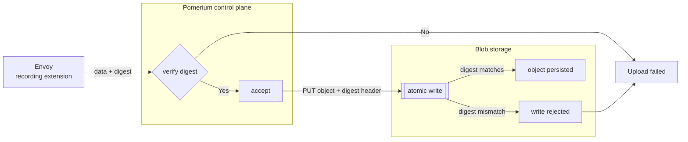

import TabItem from '@theme/TabItem';
import Tabs from '@theme/Tabs';

:::enterprise

This article describes a feature available to [Pomerium Enterprise](/docs/deploy/enterprise/install) customers.

:::

## Overview

The Integrity and Auditing documentation describes the "chain of custody" for session recording data, enabling end-users to meet strict compliance requirements for the handling and auditing of privileged information.

The "chain of custody" model Pomerium provides relies on:

- **Storage access patterns**: guarantees about how the recordings are uploaded and accessed
- **Enterprise audit logs**: records every access by end-users through Pomerium Enterprise
- **Cloud provider audit logs**: Audit logs at the storage layer include metadata that can be correlated with Pomerium Enterprise, enabling verification when data was accessed through Pomerium Enterprise.

This model provides a tamper-evident audit trail for the handling and access of session recording data.

## Storage access patterns

For remote access to the blob store, Pomerium follows WORM (Write Once Read Many) semantics. The roles each Pomerium component plays against the blob store are:

| Component                          |     Read     |      Write      | Delete |
| ---------------------------------- | :----------: | :-------------: | :----: |
| Pomerium Core (recording producer) | Occasionally | Once per object | Never  |
| Pomerium Enterprise                |     Yes      |      Never      | Never  |

:::important

Pomerium's security and integrity guarantees are only as strong as those of the underlying storage layer. Configure encryption, object locking (or equivalent), and retention on the bucket to match the compliance requirements of your environment.

:::

To verify the integrity of recordings produced and stored, Pomerium verifies the hash digest of the recording matches on every transfer up-to and including the final object stored in the storage layer.

Uploads will fail if any transfer in the below chain has inconsistent digests.



## Auditing (Enterprise)

Both Pomerium Enterprise and cloud providers for object storage produce audit logs that satisfy strict audit-of-audit compliance standards.

Logs available from both these sources can be correlated to verify integrity and data access.

In Enterprise, each time a bucket or specific recording data is accessed, Enterprise will emit audit logs. For example:

```json
{"level":"info","access_id":"777b6b59-a7e6-4310-af76-448da383f47d","access_type":"recording","deny":false,"success":true,"reason":"","recording_format":"ssh","object_key":"default/ssh/v1/3ff8e81f44b6eaecadaaaa7d541c8c51/*","source_ip":"<redacted>",user_agent":"Mozilla/5.0 (X11; Ubuntu; Linux x86_64; rv:150.0) Gecko/20100101 Firefox/150.0","user_role":"admin","user_email":"alamarre@pomerium.com","user_id":"<redacted>","user_hmac_id":"aw3iU61Z7p6wxCnNq/JVDgGHpJzhwT3eqs5Wmz8BPD8=","user_session_start":1779724385,"user_session_exp":1779724685,"datasource":"9d8dbd2c-8cce-4e66-9c1f-c490b4a07243/gcs-dev","time":"2026-05-25T11:53:05-04:00","message":"authorize blob read"}
```

Some of the fields above were redacted for the docs, but will contain the relevant information related to access.

| Field | Description | Sensitivity |
| --- | --- | --- |
| `access_id` | Unique identifier for a particular action. Note that an action here can have multiple access events - opening the bucket, reading metadata, and viewing the recording | Low |
| `access_type` | The type of access. <ul><li>`recording`: the recording contents were viewed</li><li>`metadata`: the recording metadata was viewed</li><li>`bucket`: (internal) Pomerium Enterprise made a connection to the bucket for reading</li><li>`download`: the recording was downloaded</li></ul> | Low |
| `deny` | Whether the access was denied. | Low |
| `success` | Whether the access succeeded. | Low |
| `reason` | Optional. Provides additional details about failures | Low |
| `recording_format` | Format of the recording being accessed (e.g. `ssh`). | Low |
| `object_key` | Object storage key (or key prefix) of the recording data being accessed. Contains the Pomerium `cluster ID`. `cluster ID` is assigned when connecting Pomerium instances to Enterprise via the cluster syncer | Moderate |
| `source_ip` | IP address the request originated from. | High |
| `user_agent` | User agent header of the client that made the request. Contains remote host information. | Moderate |
| `user_role` | Pomerium Enterprise role of the user performing the access. | Moderate |
| `user_email` | Email address of the user performing the access. | Moderate |
| `user_id` | Identity Provider (IdP) user id of the user performing the access. | High |
| `user_hmac_id` | Hash-based Message Authentication Code (HMAC) of the user id, suitable for correlation with the blob storage audit logs | Low |
| `user_session_start` | Unix timestamp of when the user's session started. | Low |
| `user_session_exp` | Unix timestamp of when the user's session expires. | Low |
| `datasource` | Identifier of the configured blob datasource being read (`<namespace-id>/<datasource-name>`). `<namespace-id>` is the ID of the namespace in Pomerium Enterprise where this datasource was configured | Moderate |

:::important

The HMAC of the user id is generated from the [**shared secret**](/docs/reference/shared-secret) Pomerium Enterprise uses. When rotating the shared secret, keep track of the previous secret in order to correlate against older audit logs.

:::

## Auditing (Blob)

Each cloud provider emits its own audit logs when objects in the recording bucket are accessed. Refer to the provider-specific documentation below to enable and query these logs.

<Tabs>
<TabItem value="GCS" label="GCS">

Google Cloud Storage (GCS) Cloud Audit Logs for `storage.googleapis.com` must be enabled. Data Access logs must be explicitly enabled on the recording bucket for:

- `ADMIN_READ`
- `DATA_READ`
- `DATA_WRITE`

See [Cloud Audit Logs with Cloud Storage](https://docs.cloud.google.com/storage/docs/audit-logging).

When properly configured, requests made by Pomerium Enterprise are annotated with:

```json
metadata: {
  audit_context: {
    app_context: "EXTERNAL"
      audit_info: {
        x-goog-custom-audit-pomerium-access-id: "b340be6f-d9d6-4569-9b8f-53d5fac8db0c"
        x-goog-custom-audit-pomerium-user: "PomeriumEnterprise/v0.32.0+0d0554ca+2026-05-25T11:06:03-04:00 (u=aw3iU61Z7p6wxCnNq/JVDgGHpJzhwT3eqs5Wmz8BPD8=)"
      }
    }
  requested_bytes: 1071492
  }
methodName: "storage.objects.get"
```

| Field | Description |
| --- | --- |
| `x-goog-custom-audit-pomerium-access-id` | Pomerium-generated access id for this action. Correlates with the `access_id` field in the Pomerium Enterprise audit log entry, allowing a GCS audit log entry to be matched back to the originating user action. |
| `x-goog-custom-audit-pomerium-user` | Identifies the Pomerium Enterprise build that issued the request, along with the HMAC of the user id (`u=...`). Correlates with the `user_hmac_id` field in the Pomerium Enterprise audit log entry. |

:::note

The example query below inspects audit logs for operations made by Pomerium. Individual setups may differ from the query below.

```logql
protoPayload.@type="type.googleapis.com/google.cloud.audit.AuditLog"
protoPayload.serviceName="storage.googleapis.com"
protoPayload.methodName:("storage.objects.get" OR "storage.objects.list")
resource.labels.bucket_name="<bucket-name>"
```

:::

</TabItem>
<TabItem value="S3" label="S3">

Audit logs with Pomerium metadata are captured when S3 server access logging and/or CloudTrail are configured for data events for the recording bucket.

See [Logging requests with server access logging](https://docs.aws.amazon.com/AmazonS3/latest/userguide/ServerLogs.html) for information about configuration.

Below is a sample entry of an access log (split up with new lines for clarity):

```
17db07a774c0aeceaa3741deb75a693c520afcabd333c4681160e703d60fd8f3 alexl-s3-example [02/Jun/2026:20:31:05 +0000] 216.113.105.210 arn:aws:iam::<redacted>:user/alexl-bucket-user <redacted>
REST.GET.OBJECT default/ssh/v1/681de6caeac458e53c787912f61fd45a/metadata.proto "GET /default/ssh/v1/681de6caeac458e53c787912f61fd45a/metadata.proto?pomerium_access_id=e0ed8f7b-a2ac-47b5-a6bb-45b5f06ea103&x-id=GetObject HTTP/1.1" 200 - 865 865 26 25 "-"
"aws-sdk-go-v2/1.41.7 ua/2.1 os/linux lang/go#1.26.3 md/GOOS#linux md/GOARCH#amd64 api/s3#1.98.0 app/PomeriumEnterprise-v0.32.0+1d188c5c+2026-06-02T09-11-40-04-00--u-aw3iU61Z7p6wxCnNq-JVDgGHpJzhwT3eqs5Wmz8BPD8-- m/E,b,n"
- iT/8x+5dTl3NkUSiqtAcB+6FZ4q6kVnRHDoLPWIFBPwHv0LQRUBP0ZLoOqK+P5V7lwaLMBU/04jepAQS4R3BiNK6WkPdXV02 SigV4 TLS_AES_128_GCM_SHA256 AuthHeader alexl-s3-example.s3.us-east-2.amazonaws.com TLSv1.3 - - -
```

| HTTP Field | Value | Description |
| --- | --- | --- |
| Request URI | `?pomerium_access_id` | Pomerium-generated access id for this action. Correlates with the `access_id` field in the Pomerium Enterprise audit log entry, allowing an S3 audit log entry to be matched back to the originating user action. |
| User Agent | `app/<Pomerium-Version>-<Timestamp>--u-<hmac_user_id>--` | Identifies the Pomerium Enterprise build that issued the request, along with the HMAC of the user id (`u-...--`). Correlates with the `user_hmac_id` field in the Pomerium Enterprise audit log entry. |

:::note

S3 server access logs transform some of the raw data. For example `/`, `=` and other special characters are collected as `-` in the `user_hmac_id`. For correlation with Enterprise logs, please be mindful of this behavior.

:::

:::important

`HEAD` requests made to the object storage layer do not encode `access_id` and `user_hmac_id`.

:::

</TabItem>
<TabItem value="Azure" label="Azure">

See [Monitoring Azure Blob Storage](https://learn.microsoft.com/en-us/azure/storage/blobs/monitor-blob-storage).

After configuring audit logs in Azure, operations made by Pomerium are recorded in the `StorageBlobLogs` table. A sample entry contains:

```json
{
  "UserAgentHeader": "PomeriumEnterprise/v0.32.0+c09e6d56+2026-06-02T14:37:31-04:00 (u=aw3iU61Z7p6wxCnNq/JVDgGHpJzhwT3eqs5Wmz8BPD8=)",
  "ClientRequestId": "396bec31-264e-4b33-9000-8ecb1776e16f"
}
```

| Field | Description |
| --- | --- |
| `ClientRequestId` | Pomerium-generated access id for this action. Correlates with the `access_id` field in the Pomerium Enterprise audit log entry, allowing an Azure audit log entry to be matched back to the originating user action. |
| `UserAgentHeader` | Identifies the Pomerium Enterprise build that issued the request, along with the HMAC of the user id (`u=...`). Correlates with the `user_hmac_id` field in the Pomerium Enterprise audit log entry. |

:::note

The example query below extracts audit logs for operations made by Pomerium. Individual setups may differ from the query below.

```kql
StorageBlobLogs
| where TimeGenerated > ago(3d)
| where ClientRequestId != ""
| where UserAgentHeader contains "PomeriumEnterprise"
| top 25 by TimeGenerated desc
| project TimeGenerated, ClientRequestId, UserAgentHeader
```

The example query below extracts the full JSON logs:

```kql
StorageBlobLogs
| where TimeGenerated > ago(3d)
| where OperationName == "ListBlobs"
| top 25 by TimeGenerated desc
| extend Full = pack_all()
| project TimeGenerated, Full
```

:::

</TabItem>
</Tabs>

## Integrity checks

The following criteria indicate that recording content or metadata may have been accessed or modified outside of Pomerium's chain of custody:

- there is more than one object revision for any session recording object in the remote store
- there are blob storage data-read logs for recording content or metadata that are not annotated with Pomerium access information
- there are blob storage data-read logs whose `access_id` or `user_hmac_id` do not match any Pomerium Enterprise audit logs
