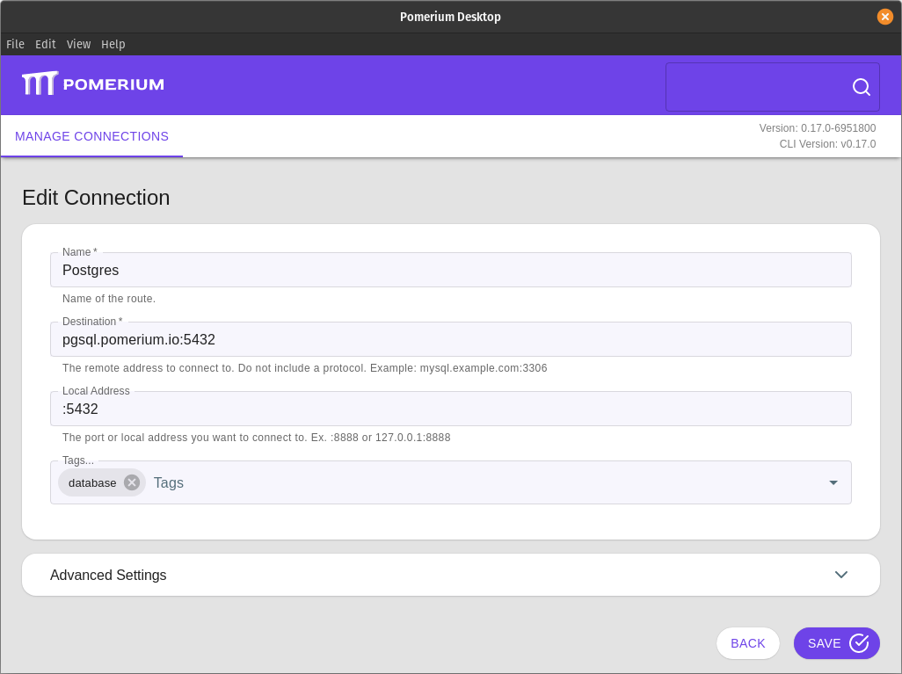

---
# cSpell:ignore windowscentral

title: Pomerium TCP Clients
sidebar_label: Clients (Desktop / CLI)
lang: en-US
keywords:
  [
    pomerium,
    identity access proxy,
    pomerium desktop,
    pomerium cli,
    pomerium tcp over http,
  ]
description: Learn how to create secured TCP connections to services behind Pomerium.
sidebar_position: 0
---

import Tabs from '@theme/Tabs';
import TabItem from '@theme/TabItem';
import LongLivedConnections from '@site/content/docs/admonitions/_long-lived-connections.mdx';

# Pomerium Desktop and CLI Clients

Pomerium is capable of creating secure connections to services like SSH, Redis, and more by creating a TCP tunnel to the service with a local client. This article describes configuring a route to accept TCP connections, and using either the CLI or GUI client to connect to it.

## Create a TCP Route

1. Specify this new Route as a TCP Route by prefixing `tcp+` in the **From** field, along with a port suffix.

   The port is not used to connect to the Pomerium Proxy service from the internet; this will always be port 443 (unless otherwise defined in `config.yaml`). Rather, the port defined in **From** is part of the mapping to the individual route. In this way, you can create multiple routes that share a DNS entry, differentiated by the port to determine which route they use.

   For example, suppose we have a server called `augur` running behind Pomerium that has a MySQL server and also listens for SSH connections. We can create routes for `tcp+https://augur.example.com:22` and `tcp+https://augur.example.com:3306`.

1. The **To** field uses `tcp://` as a protocol, and specifies the address and port the service listens on.

The example below demonstrates a route to the SSH service on the host running the Pomerium Core or Pomerium Enterprise service:

<Tabs>
<TabItem value="Pomerium Core" label="Pomerium Core">

```yaml
- from: tcp+https://ssh.localhost.pomerium.io:22
  to: tcp://127.0.0.1:22
  policy:
    - allow:
        or:
          - email:
              is: user@companydomain.com
```

</TabItem>
<TabItem value="Pomerium Enterprise" label="Pomerium Enterprise">


</TabItem>
</Tabs>

See the "Configure Routes" section of [TCP Support](/docs/capabilities/tcp#configure-routes) for more detailed information on TCP routes.

## TCP Client Software

You can connect to this route with either the Pomerium CLI or Pomerium Desktop client.

<Tabs>

<TabItem value="Pomerium Desktop" label="Pomerium Desktop">

### Install

Download the latest release from [GitHub](https://github.com/pomerium/desktop-client/releases).

- **Windows**: The installer `.exe` file will install and open the Desktop Client. Right click on the system tray icon to interact with it.
- **Linux**: We provide Linux binaries as `.AppImage` files, which can be executed in place or managed with a tool like [AppImageLauncher](https://github.com/TheAssassin/AppImageLauncher). Interact with the client from the system tray icon.
- **macOS**: Open the `dmg` and move the binary to **Applications**. Interact with the client from the system tray icon.

<details>
<summary>Autostart Pomerium Desktop</summary>

If you want Pomerium Desktop to start automatically when you log in to your computer, follow the steps below for your operating system.

<Tabs>
<TabItem value="windows" label="Windows">

#### Autostart for all users

Copy the shortcut for the Pomerium Desktop app into `C:\ProgramData\Microsoft\Windows\Start Menu\Programs\Startup`.

#### Autostart for your user

Copy the shortcut for the Pomerium Desktop app into `C:\Users\username\AppData\Roaming\Microsoft\Windows\Start Menu\Programs\Startup`, replacing `username` with your username.

---

Windows 11 also offers a GUI method, documented by [windowscentral.com](https://www.windowscentral.com/how-launch-apps-automatically-during-login-windows-11)

</TabItem>
<TabItem value="mac" label="MacOS">

1. From **System Preferences**, select **Users & Groups**.

1. Click **Login Items** near the top, then the **+** button towards the bottom of the window.

1. Select Pomerium Desktop from the Applications folder.

</TabItem>
<TabItem value="gnome" label="Linux (Gnome)">

The easiest way to autostart user applications in the Gnome Desktop Environment is by using the Tweaks application. Gnome documents this process well, so we won't replicate it here. See [Gnome's documentation](https://help.gnome.org/users/gnome-help/stable/shell-apps-auto-start.html) for more information.

</TabItem>
<TabItem value="kde" label="Linux (KDE)">

KDE's documentation covers auto-starting applications well: see [System Settings/Autostart](https://userbase.kde.org/System_Settings/Autostart) from the KDE UsersBase Wiki for more information.

</TabItem>
</Tabs>

</details>

### Add a Connection



**Name**: A local name for the route.

**Destination**: Matches the [From](/docs/reference/routes/from) value of the route, without the protocol. Always include the port specified in the route, and do not include the `https://` protocol.

**Local Address**: The local address and port number from which to access the service locally. If left blank, the client will choose a random port to listen to on the loopback address.

In most cases, you only need to specify the port (ex: `:2222`), and the client will listen on all available local addresses.

**Tags**: Use tags to sort and organize your TCP routes.

:::note Long-lived connections behavior

<LongLivedConnections />

:::

---

#### Advanced Settings

**Pomerium URL**: The Pomerium Proxy service address. This is required if the **Destination URL** can't be resolved from DNS or a local `hosts` entry, or if the Proxy service uses a non-standard port.

**Disable TLS Verification**: Allows untrusted certificates from the Pomerium gateway

**Client Certificate & Certificate Key File or Text**: For routes that require client certificates for [mTLS](/docs/concepts/mutual-auth.md), you can provide the certificate and key file to the Pomerium Desktop client.

</TabItem>
<TabItem value="Pomerium CLI" label="Pomerium CLI">

### Install

See the [Pomerium CLI](/docs/deploy/clients/pomerium-cli) page to learn how to install `pomerium-cli` in your environment.

### Connect to a TCP Route

1. Invoke `pomerium-cli` with the `tcp` option, and provide the route to your service (As defined in [`from`](/docs/reference/routes/from) in your Route specification).

   ```shell-session
    $ pomerium-cli tcp ssh.localhost.pomerium.io:22
    2023/10/02 11:29:22 listening on 127.0.0.1:53656
   ```

   You can optionally supply an address and/or port to the `listen` flag:

   ```shell-session
    $ pomerium-cli tcp ssh.localhost.pomerium.io:22 --listen :2222
    2023/10/02 11:30:03 listening on [::]:2222
   ```

1. Connect to your service using the local address and port specified in the output of `pomerium-cli`:

   ```shell-session
   ssh 127.0.0.1 -p 2222
   ```

1. When the connection starts, the cli will open your browser and direct you to your Identity Provider to authenticate your session. Once authenticated the connection will continue and you can close the browser window.

1. In this example, since we are using SSH we can consolidate the TCP and SSH connections into a single command:

   ```shell-session
   ssh -o ProxyCommand='pomerium-cli tcp --listen - %h:%p' ssh.localhost.pomerium.io
   ```

</TabItem>
</Tabs>

For more examples and detailed usage information, see [TCP Support](/docs/capabilities/tcp)

## Advanced Configuration

If Pomerium is listening on a port other than `443` (set with the [`address` key](/docs/reference/address)), the full TCP URL can be specified with a bastion host:

```shell-session
pomerium-cli tcp tcp+https://ssh.localhost:pomerium.io:8443/ssh.localhost.pomerium.io:2222 --listen :2222
```
